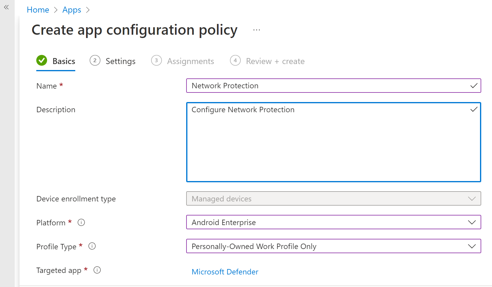
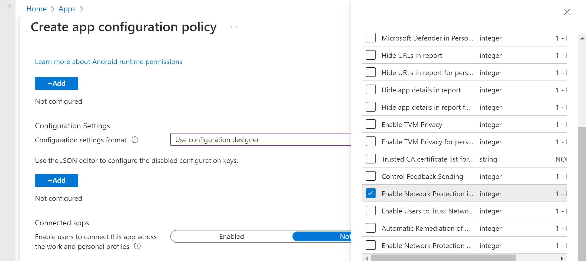
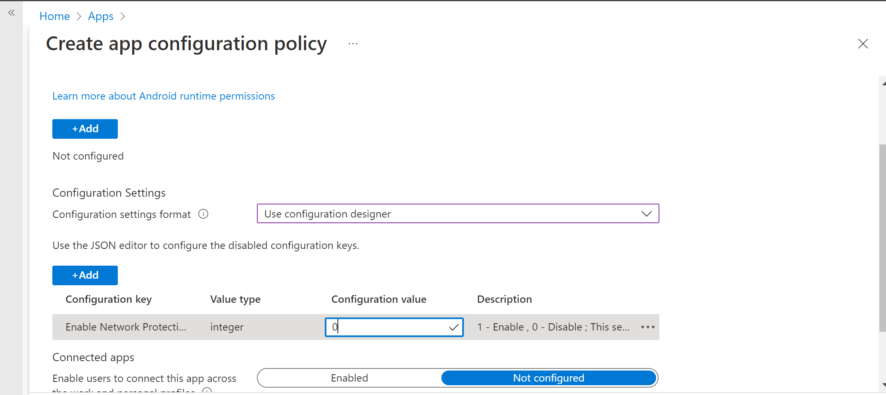
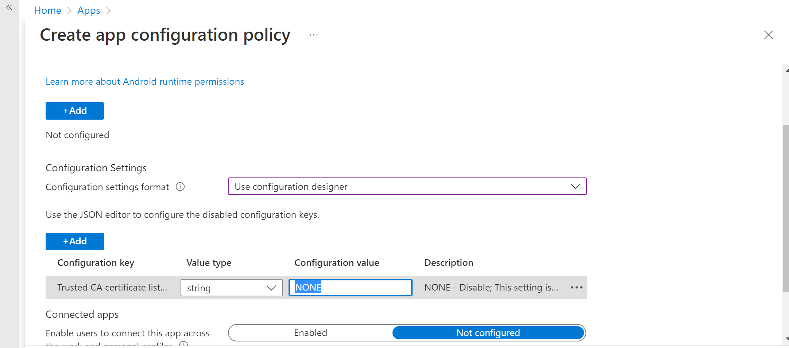

# Configure Defender for Endpoint on Android features

[!INCLUDE [Microsoft 365 Defender rebranding](../../includes/microsoft-defender.md)]

**Applies to:**
- [Microsoft Defender for Endpoint Plan 1](https://go.microsoft.com/fwlink/p/?linkid=2154037)
- [Microsoft Defender for Endpoint Plan 2](https://go.microsoft.com/fwlink/p/?linkid=2154037)
- [Microsoft 365 Defender](https://go.microsoft.com/fwlink/?linkid=2118804)

## Conditional Access with Defender for Endpoint on Android

Microsoft Defender for Endpoint on Android, along with Microsoft Intune and Azure Active Directory, enables enforcing Device compliance and Conditional Access policies based on device risk levels. Defender for Endpoint is a Mobile Threat Defense (MTD) solution that you can deploy through Intune.

For more information about how to set up Defender for Endpoint on Android and Conditional Access, see [Defender for Endpoint and Intune](/mem/intune/protect/advanced-threat-protection).

## Configure custom indicators

> [!NOTE]
> Defender for Endpoint on Android only supports creating custom indicators for IP addresses and URLs/domains.

Defender for Endpoint on Android enables admins to configure custom indicators to support Android devices as well. For more information on how to configure custom indicators, see [Manage indicators](manage-indicators.md).

## Configure web protection

Defender for Endpoint on Android allows IT Administrators the ability to configure the web protection feature. This capability is available within the Microsoft Intune admin center.

[Web protection](web-protection-overview.md) helps to secure devices against web threats and protect users from phishing attacks. Anti-phishing and custom indicators (URL and IP addresses) are supported as part of web protection. Web content filtering is currently not supported on mobile platforms.

> [!NOTE]
> Defender for Endpoint on Android would use a VPN in order to provide the Web Protection feature. This VPN is not a regular VPN. Instead, it's a local/self-looping VPN that does not take traffic outside the device.
>
> For more information, see [Configure web protection on devices that run Android](/mem/intune/protect/advanced-threat-protection-manage-android).

## Network Protection

This feature provides protection against rogue Wi-Fi related threats and rogue certificates, which are the primary attack vector for Wi-Fi networks. Admins can list the root Certificate Authority (CA) and private root CA certificates in Microsoft Intune admin center and establish trust with endpoints. It provides the user a guided experience to connect to secure networks and also notifies them if a related threat is detected.

It includes several admin controls to offer flexibility, such as the ability to configure the feature from within the Microsoft Intune admin center and add trusted certificates. Admins can enable [privacy controls](/microsoft-365/security/defender-endpoint/android-configure#privacy-controls) to configure the data sent to Defender for Endpoint from Android devices.

Network protection in Microsoft Defender for endpoint is disabled by default. Admins can use the following steps to **configure Network protection in Android devices.**

1. In the Microsoft Intune admin center, navigate to Apps > App configuration policies. Create a new App configuration policy.

    > [!div class="mx-imgBorder"]
    > 

1. Provide a name and description to uniquely identify the policy. Select **'Android Enterprise'** as the platform and **'Personally-owned work profile only'** as the profile type and **'Microsoft Defender'** as the Targeted app.

    > [!div class="mx-imgBorder"]
    > 

1. In Settings page, select **'Use configuration designer'** and add **'Enable Network Protection in Microsoft Defender'** as the key and value as **'1'** to enable Network Protection. (Network protection is disabled by default)

    > [!div class="mx-imgBorder"]
    > 

    > [!div class="mx-imgBorder"]
    > 

1. If your organization uses root CAs that are private, you must establish explicit trust between Intune (MDM solution) and user devices. Establishing trust helps prevent Defender from flagging root CAs as rogue certificates.

    To establish trust for the root CAs, use **'Trusted CA certificate list for Network Protection'** as the key. In the value, add the **'comma separated list of certificate thumbprints (SHA 1)'**.

    **Example of Thumbprint format to add**: `50 30 06 09 1d 97 d4 f5 ae 39 f7 cb e7 92 7d 7d 65 2d 34 31, 503006091d97d4f5ae39f7cbe7927d7d652d3431`

   > [!IMPORTANT]
   > Certificate SHA-1 Thumbprint characters should be with either white space separated, or non separated.
   >
   > This format is invalid: `50:30:06:09:1d:97:d4:f5:ae:39:f7:cb:e7:92:7d:7d:65:2d:34:31`

   Any other separation characters are invalid.

   > 

1. For other configurations related to Network protection, add the following keys and appropriate corresponding value.

    | Configuration Key| Description|
    |---|---|
    |Trusted CA certificate list for Network Protection|Security admins manage this setting to establish trust for root CA and self-signed certificates.|
    |Enable Network protection in Microsoft Defender|1 - Enable, 0- Disable (default). This setting is used by the IT admin to enable or disable the network protection capabilities in the Defender app.|
    |Enable Network Protection Privacy|1 - Enable (default), 0 - Disable. Security admins manage this setting to enable or disable privacy in network protection.|
    |Enable Users to Trust Networks and Certificates|1 - Enable, 0 - Disable (default). Security admins manage this setting to enable or disable the end user's in-app experience to trust and untrust unsecure and suspicious networks and malicious certificates.|
    |Automatic Remediation of Network Protection Alerts|1 - Enable (default), 0 - Disable. Security admins manage this setting to enable or disable the remediation alerts that are sent when a user performs remediation activities, such as switching to a safer Wi-Fi access point or deleting suspicious certificates detected by Defender.|
    |Manage Network Protection detection for Open Networks|0 - Disable (default), 1 - Audit Mode, 2 - Enable. Security admins manage this setting to disable, audit, or enable open network detection, respectively. In 'Audit' mode, alerts are sent only to the ATP portal with no end user experience. For user experience, set the config to 'Enable' mode.|  
    |Manage Network protection Detection for Certificates|0 - Disable, 1 - Audit mode (default), 2 - Enable. When network protection is enabled, Audit mode for certificate detection is enabled by default. In Audit mode, notification alerts are sent to SOC admins, but no end-user notifications are displayed to the user when Defender detects a bad certificate. Admins can, however, disable this detection with 0 as the value and enable full feature functionality by setting 2 as the value. When the feature is enabled with the value of 2, end-user notifications are sent to the user when Defender detects a bad certificate, and alerts are also sent to the SOC Admin.|

6. Add the required groups to which the policy will have to be applied. Review and create the policy.

    | Configuration Key| Description|
    |---|---|
    |Enable Network protection in Microsoft Defender|1: Enable   0: Disable (default)    This setting is used by the IT admin to enable or disable the network protection capabilities in the Defender app.|
    |Enable Network Protection Privacy|1: Enable (default)   0: Disable    Security admins manage this setting to enable or disable privacy in network protection.|
    |Enable Users to Trust Networks and Certificates|1   Enable   0:Disable (default)    This setting is used by IT admins to enable or disable the end user in-app experience to trust and untrust the unsecure and suspicious networks and malicious certificates.|
    |Automatic Remediation of Network Protection Alerts|1: Enable (default)   0: Disable    This setting is used by IT admins to enable or disable the remediation alerts that are sent when a user does remediation activities. For example, the user switches to a safer Wi-Fi access point or deletes suspicious certificates that were detected by Defender.|
    |Manage Network Protection detection for Open Networks|0: Disable (default)   1: Audit Mode    Security admins manage this setting to enable or disable open network detection.|
    |Manage Network protection Detection for Certificates|0: Disable   1: Audit mode (default)   2: Enable    When network protection is enabled, Audit mode for certificate detection is enabled by default. In audit mode, notification alerts are sent to SOC admins, but no end user notifications are shown when Defender detects a bad certificate. Admins can disable this detection with the value 0 or enable full feature functionality by setting the value 2. When the value is 2, end user notifications are sent to users and alerts are sent to SOC admins when Defender detects a bad certificate.|

1. Add the required groups to which the policy has to be applied. Review and create the policy.

> [!NOTE]
> Users need to enable location permission (which is an optional permission); this enables Defender for Endpoint to scan their networks and alert them when there are WIFI-related threats. If the location permission is denied by the user, Defender for Endpoint will only be able to provide limited protection against network threats and will only protect the users from rogue certificates.

## Privacy Controls

Following privacy controls are available for configuring the data that is sent by Defender for Endpoint from Android devices:

|Threat Report     |Details      |
|--------------------|-------------|
|Malware report |Admins can set up privacy control for malware report. If privacy is enabled, then Defender for Endpoint won't send the malware app name and other app details as part of the malware alert report. |
|Phish report |Admins can set up privacy control for phishing reports. If privacy is enabled, then Defender for Endpoint won't send the domain name and details of the unsafe website as part of the phishing alert report. |
|Vulnerability assessment of apps |By default only information about apps installed in the work profile is sent for vulnerability assessment. Admins can disable privacy to include personal apps|
|Network Protection (preview)| Admins can enable or disable privacy in network protection. If enabled, then Defender won't send network details.|

### Configure privacy alert report

Admins can now enable privacy control for the phishing report, malware report, and network report sent by Microsoft Defender for Endpoint on Android. This configuration ensures that the domain name, app details, and network details, respectively, aren't sent as part of the alert whenever a corresponding threat is detected.

Admin Privacy Controls (MDM) Use the following steps to enable privacy.

1. In Microsoft Intune admin center, go to **Apps > App configuration policies > Add > Managed devices**.

2. Give the policy a **name, Platform > Android enterprise, select the profile type**.

3. Select **Microsoft Defender for Endpoint** as the target app.

4. On the Settings page, select **Use configuration designer** and then select **Add**.

5. Select the required privacy setting -
    - Hide URLs in report
    - Hide URLs in report for personal profile
    - Hide app details in report
    - Hide app details in report for personal profile
    - Enable Network Protection Privacy

6. To enable privacy, enter integer value as 1 and assign this policy to users. By default, this value is set to 0 for MDE in work profile and 1 for MDE on personal profile.

7. Review and assign this profile to targeted devices/users.

### End user privacy controls

These controls help the end user to configure the information shared to their organization.

1. For **Android Enterprise work profile**, end user controls won't be visible. Admins control these settings.
2. For **Android Enterprise personal profile**, the control is displayed under **Settings> Privacy**.
3. Users see a toggle for Unsafe Site Info, malicious application, and network protection.

These toggles will only be visible if enabled by the admin. Users can decide if they want to send the information to their organization or not.

Enabling/disabling the above privacy controls won't impact the device compliance check or conditional access.

## Configure vulnerability assessment of apps for BYOD devices

From version 1.0.3425.0303 of Microsoft Defender for Endpoint on Android, you're able to run vulnerability assessments of the OS and apps installed on the onboarded mobile devices.

> [!NOTE]
> Vulnerability assessment is part of [Microsoft Defender Vulnerability Management](../defender-vulnerability-management/defender-vulnerability-management.md) in Microsoft Defender for Endpoint.

**Notes about privacy related to apps from personal devices (BYOD):**

- For Android Enterprise with a work profile, only apps installed on the work profile will be supported.
- For other BYOD modes, by default, vulnerability assessment of apps will **not** be enabled. However, when the device is on administrator mode, admins can explicitly enable this feature through Microsoft Intune to get the list of apps installed on the device. For more information, see details below.

### Configure privacy for device administrator mode

Use the following steps to **enable vulnerability assessment of apps** from devices in **device administrator** mode for targeted users.

> [!NOTE]
> By default, this is turned off for devices enrolled with device admin mode.

1. In [Microsoft Intune admin center](https://go.microsoft.com/fwlink/?linkid=2109431) , go to **Devices** > **Configuration profiles** > **Create profile** and enter the following settings:

   - **Platform**: Select Android device administrator
   - **Profile**: Select "Custom" and select Create.

2. In the **Basics** section, specify a name and description of the profile.

3. In the **Configuration settings**, select Add **OMA-URI** setting:

   - **Name**: Enter a unique name and description for this OMA-URI setting so you can find it easily later.
   - OMA-URI: **./Vendor/MSFT/DefenderATP/DefenderTVMPrivacyMode**
   - Data type: Select Integer in the drop-down list.
   - Value: Enter 0 to disable privacy setting (By default, the value is 1)

4. Select **Next** and assign this profile to targeted devices/users.

### Configure privacy for Android Enterprise work profile

Defender for Endpoint supports vulnerability assessment of apps in the work profile. However, in case you want to turn off this feature for targeted users, you can use the following steps:

1. In [Microsoft Intune admin center](https://go.microsoft.com/fwlink/?linkid=2109431), go to **Apps** \> **App configuration policies** \\> **Add** > **Managed devices**.
2. Give the policy a name; **Platform \> Android Enterprise**; select the profile type.
3. Select **Microsoft Defender for Endpoint** as the target app.
4. In Settings page, select **Use configuration designer** and add **DefenderTVMPrivacyMode** as the key and value type as **Integer**
   - To disable vulnerability of apps in the work profile, enter value as `1` and assign this policy to users. By default, this value is set to `0`.
   - For users with key set as `0`, Defender for Endpoint sends the list of apps from the work profile to the backend service for vulnerability assessment.
5. Select **Next** and assign this profile to targeted devices/users.

Turning the above privacy controls on or off won't impact the device compliance check or conditional access.

## Configure privacy for phishing alert report

Privacy control for phish report can be used to disable the collection of domain name or website information in the phish threat report. This setting gives organizations the flexibility to choose whether they want to collect the domain name when a malicious or phish website is detected and blocked by Defender for Endpoint.

### Configure privacy for phishing alert report on Android Device Administrator enrolled devices:

Use the following steps to turn it on for targeted users:

1. In [Microsoft Intune admin center](https://go.microsoft.com/fwlink/?linkid=2109431) , go to **Devices** > **Configuration profiles** > **Create profile** and enter the following settings:

   - **Platform**: Select Android device administrator.
   - **Profile**: Select "Custom" and select **Create**.

2. In the **Basics** section, specify a name and description of the profile.

3. In the **Configuration settings**, select Add **OMA-URI** setting:

   - **Name**: Enter a unique name and description for this OMA-URI setting so you can find it easily later.
   - OMA-URI: **./Vendor/MSFT/DefenderATP/DefenderExcludeURLInReport**
   - Data type: Select Integer in the drop-down list.
   - Value: Enter 1 to enable privacy setting. The default value is 0.

4. Select **Next** and assign this profile to targeted devices/users.

Using this privacy control won't impact the device compliance check or conditional access.

### Configure privacy for phishing alert report on Android Enterprise work profile

Use the following steps to turn on privacy for targeted users in the work profile:

1. In [Microsoft Intune admin center](https://go.microsoft.com/fwlink/?linkid=2109431) and go to **Apps** > **App configuration policies** > **Add** > **Managed devices**.
2. Give the policy a name, **Platform > Android Enterprise**, select the profile type.
3. Select **Microsoft Defender for Endpoint** as the target app.
4. In Settings page, select **Use configuration designer** and add **DefenderExcludeURLInReport** as the key and value type as **Integer**.
   - Enter **1 to enable privacy**. The default value is 0.
5. Select **Next** and assign this profile to targeted devices/users.

Turning the above privacy controls on or off won't impact the device compliance check or conditional access.

## Configure privacy for malware threat report

Privacy control for malware threat report can be used to disable the collection of app details (name and package information) from the malware threat report. This setting gives organizations the flexibility to choose whether they want to collect the app name when a malicious app is detected.

### Configure privacy for malware alert report on Android Device Administrator enrolled devices:

Use the following steps to turn it on for targeted users:

1. In [Microsoft Intune admin center](https://go.microsoft.com/fwlink/?linkid=2109431) , go to **Devices** > **Configuration profiles** > **Create profile** and enter the following settings:

   - **Platform**: Select Android device administrator.
   - **Profile**: Select "Custom" and select **Create**.

2. In the **Basics** section, specify a name and description of the profile.

3. In the **Configuration settings**, select Add **OMA-URI** setting:

   - **Name**: Enter a unique name and description for this OMA-URI setting so you can find it easily later.
   - OMA-URI: **./Vendor/MSFT/DefenderATP/DefenderExcludeAppInReport**
   - Data type: Select Integer in the drop-down list.
   - Value: Enter 1 to enable privacy setting. The default value is 0.

4. Select **Next** and assign this profile to targeted devices/users.

Using this privacy control won't impact the device compliance check or conditional access. For example, devices with a malicious app will always have a risk level of "Medium".

### Configure privacy for malware alert report on Android Enterprise work profile

Use the following steps to turn on privacy for targeted users in the work profile:

1. In [Microsoft Intune admin center](https://go.microsoft.com/fwlink/?linkid=2109431) and go to **Apps** > **App configuration policies** > **Add** > **Managed devices**.
2. Give the policy a name, **Platform > Android Enterprise**, select the profile type.
3. Select **Microsoft Defender for Endpoint** as the target app.
4. In Settings page, select **Use configuration designer** and add **DefenderExcludeAppInReport** as the key and value type as **Integer**
   - Enter **1 to enable privacy**. The default value is 0.
5. Select **Next** and assign this profile to targeted devices/users.

Using this privacy control won't impact the device compliance check or conditional access. For example, devices with a malicious app will always have a risk level of "Medium".

## Disable sign-out

Defender for Endpoint supports deployment without the sign-out button in the app to prevent users from signing out of the Defender app. This is important to prevent users from tampering with the device.
Use the following steps to configure Disable sign-out:

1. In [Microsoft Intune admin center](https://go.microsoft.com/fwlink/?linkid=2109431), go to **Apps** > **App configuration policies** > **Add** > **Managed devices**.
2. Give the policy a name, select **Platform > Android Enterprise**, and select the profile type.
3. Select **Microsoft Defender for Endpoint** as the target app.
4. In the Settings page, select **Use configuration designer** and add **Disable Sign Out** as the key and **Integer** as the value type.
   - By default, Disable Sign Out = 1 for Android Enterprise personally owned work profiles, fully managed, company owned personally enabled profiles and 0 for device administrator mode.
   - Admins need to make Disable Sign Out = 0 to enable the sign-out button in the app. Users will be able to see the sign-out button once the policy is pushed.
5. Select **Next** and assign this profile to targeted devices and users.

> [!IMPORTANT]
> This feature is in Public Preview. The following information relates to prereleased product which may be substantially modified before it's commercially released. Microsoft makes no warranties, express or implied, with respect to the information provided here.

## Device Tagging

Defender for Endpoint on Android enables bulk tagging the mobile devices during onboarding by allowing the admins to set up tags via Intune. Admin can configure the device tags through Intune via configuration policies and push them to user’s devices. Once the User installs and activates Defender, the client app passes the device tags to the Security Portal. The Device tags appear against the devices in the Device Inventory. 

Use the following steps to configure the Device tags:

1. In [Microsoft Intune admin center](https://go.microsoft.com/fwlink/?linkid=2109431), go to **Apps** > **App configuration policies** > **Add** > **Managed devices**.
2. Give the policy a name, select **Platform > Android Enterprise**, and select the profile type.
3. Select **Microsoft Defender for Endpoint** as the target app.
4. In Settings page, select Use configuration designer and add **DefenderDeviceTag** as the key and value type as **String**.
   - Admin can assign a new tag by adding the key **DefenderDeviceTag** and setting a value for device tag.
   - Admin can edit an existing tag by modifying the value of the key **DefenderDeviceTag**.
   - Admin can delete an existing tag by removing the key **DefenderDeviceTag**.

5. Click Next and assign this policy to targeted devices and users.

> [!NOTE] 
> The Defender app needs to be opened for tags to be synced with Intune and passed to Security Portal. It may take upto 18 hours for tags to reflect in the portal.

## Related articles

- [Overview of Microsoft Defender for Endpoint on Android](microsoft-defender-endpoint-android.md)
- [Deploy Microsoft Defender for Endpoint on Android with Microsoft Intune](android-intune.md)
[!INCLUDE [Microsoft Defender for Endpoint Tech Community](../../includes/defender-mde-techcommunity.md)]

