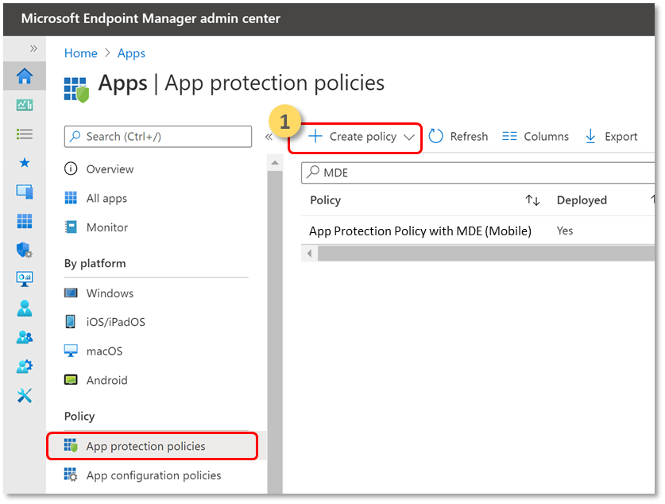

# Configure Defender for Endpoint on Android features

[!INCLUDE [Microsoft 365 Defender rebranding](../../includes/microsoft-defender.md)]

**Applies to:**
- [Microsoft Defender for Endpoint Plan 1](https://go.microsoft.com/fwlink/p/?linkid=2154037)
- [Microsoft Defender for Endpoint Plan 2](https://go.microsoft.com/fwlink/p/?linkid=2154037)
- [Microsoft 365 Defender](https://go.microsoft.com/fwlink/?linkid=2118804)

## Conditional Access with Defender for Endpoint on Android

Microsoft Defender for Endpoint on Android along with Microsoft Intune and Azure Active Directory enables enforcing Device compliance and Conditional Access policies based on device risk levels. Defender for Endpoint is a Mobile Threat Defense (MTD) solution that you can deploy to leverage this capability through Intune.

For more information about how to set up Defender for Endpoint on Android and Conditional Access, see [Defender for Endpoint and Intune](/mem/intune/protect/advanced-threat-protection).

## Configure custom indicators

> [!NOTE]
> Defender for Endpoint on Android only supports creating custom indicators for IP addresses and URLs/domains.

Defender for Endpoint on Android enables admins to configure custom indicators to support Android devices as well. For more information on how to configure custom indicators, see [Manage indicators](manage-indicators.md).

## Configure web protection
Defender for Endpoint on Android allows IT Administrators the ability to configure the web protection feature. This capability is available within the Microsoft Endpoint Manager Admin center.

> [!NOTE]
> Defender for Endpoint on Android would use a VPN in order to provide the Web Protection feature. This is not a regular VPN and is a local/self-looping VPN that does not take traffic outside the device.
> For more information, see [Configure web protection on devices that run Android](/mem/intune/protect/advanced-threat-protection-manage-android).

## Network Protection
>[!NOTE]
>Network Protection on Microsoft Defender for endpoint is now in public preview. The following information relates to prereleased product which may be substantially modified before it's commercially released. Microsoft makes no warranties, express or implied, with respect to the information provided here.

This feature provides protection against rogue Wi-Fi related threats and rogue certificates which are the primary attack vector for WIFI networks. Admins also have the ability to list the root CA and private root CA certificates in Microsoft Endpoint Manager Admin center and establish trust with endpoints. It provides the user a guided experience to connect to secure networks and also notifies them if a related threat is detected. 

It includes several admin controls to offer flexibility like the ability to configure the feature from within the Microsoft Endpoint Manager Admin center as well as add trusted certificates. Admins can also enable [privacy controls](https://docs.microsoft.com/en-us/microsoft-365/security/defender-endpoint/android-configure?view=o365-worldwide#privacy-controls) to configure the data that is sent by Defender for Endpoint from Android devices.
Network protection in Microsoft Defender for endpoint is enabled by default. Admins can use the following steps to **configure Network protection in Android devices.**

1. In Microsoft Endpoint Manager Admin, navigate to Apps > App configuration policies. Create a new App configuration policy.
    > [!div class="mx-imgBorder"]
    > 
1. Provide a name and description to uniquely identify the policy. Select **'Android Enterprise'** as the platform and **'Personally-owned work profile only'** as the profile type and **'Microsoft Defender'** as the Targeted app.
    > [!div class="mx-imgBorder"]
    > 
1. In Settings page, select **'Use configuration designer'** and add **'Enable Network Protection in Microsoft Defender'** as the key and value as **'0'** to diable Network Protection. (Network protection is enabled by default)
    > [!div class="mx-imgBorder"]
    > 
    
    > [!div class="mx-imgBorder"]
    > 
1. If your organization uses root CA’s which could be private in nature, explicit trust needs to be established between Intune (MDM solution) and user’s devices so that defender doesn’t detect flag them as rogue certificates.  

    To establish trust for the root CA's use **'Trusted CA certificate list for Network Protection (Preview)'** as the key and in value add the **'comma separated list of certificate thumbprints'**.
    > [!div class="mx-imgBorder"]
    > 

1. For other configurations related to Network protection, add the following keys and appropriate corresponding value.
 

    | Configuration Key| Description|
    |---|---|
    |Enable Network Protection Privacy|1 - Enable , 0 - Disable ; This setting is managed by IT admin to enable or disable privacy in network protection.|
    |Enable Users to Trust Networks and Certificates|1 - Enable , 0 - Disable ; This setting is used by the IT admin to enable or disable the end user in app experience to trust and untrust the unsecure and suspicious networks and malicious certificates.|
    |Automatic Remediation of Network Protection Alerts|1 - Enable , 0 - Disable ; This setting is used by the IT admin to enable or disable the remediation alerts that is sent when a user performs remediation activities like switching to a safer WIFI access points or deleting suspicious certificates detected by Defender|
1. Add the required groups on which the policy will have to be applied. Review and create the policy.

## Privacy Controls

> [!IMPORTANT]
> Privacy Controls for Microsoft Defender for Endpoint on Android is in preview. The following information relates to prereleased product which may be substantially modified before it's commercially released. Microsoft makes no warranties, express or implied, with respect to the information provided here.

Following privacy controls are available for configuring the data that is sent by Defender for Endpoint from Android devices:

|Threat Report     |Details      |
|--------------------|-------------|
|Malware report |Admins can set up privacy control for malware report - If privacy is enabled, then Defender for Endpoint will not send the malware app name and other app details as part of the malware alert report |
|Phish report |Admins can set up privacy control for phish report - If privacy is enabled, then Defender for Endpoint will not send the domain name and details of the unsafe website as part of the phish alert report |
|Vulnerability assessment of apps (Android-only) |By default only information about apps installed in the work profile are sent for vulnerability assessment. Admins can disable privacy to include personal apps|

## Configure vulnerability assessment of apps for BYOD devices

From version 1.0.3425.0303 of Microsoft Defender for Endpoint on Android, you'll be able to run vulnerability assessments of OS and apps installed on the onboarded mobile devices.

> [!NOTE]
> Vulnerability assessment is part of [Threat and Vulnerability management](next-gen-threat-and-vuln-mgt.md) in Microsoft Defender for Endpoint. 

**Notes about privacy related to apps from personal devices (BYOD):**

- For Android Enterprise with a work profile, only apps installed on the work profile will be supported.
- For other BYOD modes, by default, vulnerability assessment of apps will **not** be enabled. However, when the device is on administrator mode, admins can explicitly enable this feature through Microsoft Endpoint Manager to get the list of apps installed on the device. For more information, see details below.

### Configure privacy for device administrator mode

Use the following steps to **enable vulnerability assessment of apps** from devices in **device administrator** mode for targeted users. 

> [!NOTE]
> By default, this is turned off for devices enrolled with device admin mode.

1. In [Microsoft Endpoint Manager admin center](https://go.microsoft.com/fwlink/?linkid=2109431) , go to **Devices** > **Configuration profiles** > **Create profile** and enter the following settings:

   - **Platform**: Select Android device administrator
   - **Profile**: Select “Custom” and click Create

2. In the **Basics** section, specify a name and description of the profile.

3. In the **Configuration settings**, select Add **OMA-URI** setting:

   - **Name**: Enter a unique name and description for this OMA-URI setting so you can find it easily later.
   - OMA-URI: **./Vendor/MSFT/DefenderATP/DefenderTVMPrivacyMode**
   - Data type: Select Integer in the drop-down list.
   - Value: Enter 0 to disable privacy setting (By default, the value is 1)

4. Click **Next** and assign this profile to targeted devices/users.

### Configure privacy for Android Enterprise work profile

Defender for Endpoint supports vulnerability assessment of apps in the work profile. However, in case you want to turn this feature off for targeted users, you can use the following steps:

1. In [Microsoft Endpoint Manager admin center](https://go.microsoft.com/fwlink/?linkid=2109431) and go to **Apps** > **App configuration policies** > **Add** > **Managed devices**.
2. Give the policy a name; **Platform > Android Enterprise**; select the profile type.
3. Select **Microsoft Defender for Endpoint** as the target app.
4. In Settings page, select **Use configuration designer** and add **DefenderTVMPrivacyMode** as the key and value type as **Integer**
   - To disable vulnerability of apps in the work profile, enter value as `1` and assign this policy to users. By default, this value is set to `0`.
   - For users with key set as `0`, Defender for Endpoint will send the list of apps from the work profile to the backend service for vulnerability assessment.
5. Click **Next** and assign this profile to targeted devices/users.

Turning the above privacy controls on or off will not impact the device compliance check or conditional access.

## Configure privacy for phishing alert report

Privacy control for phish report can be used to disable the collection of domain name or website information in the phish threat report. This gives organizations the flexibility to choose whether they want to collect the domain name when a malicious or phish website is detected and blocked by Defender for Endpoint.

### Configure privacy for phishing alert report on Android Device Administrator enrolled devices:

Use the following steps to turn it on for targeted users:

1. In [Microsoft Endpoint Manager admin center](https://go.microsoft.com/fwlink/?linkid=2109431) , go to **Devices** > **Configuration profiles** > **Create profile** and enter the following settings:

   - **Platform**: Select Android device administrator.
   - **Profile**: Select "Custom" and click **Create**.

2. In the **Basics** section, specify a name and description of the profile.

3. In the **Configuration settings**, select Add **OMA-URI** setting:

   - **Name**: Enter a unique name and description for this OMA-URI setting so you can find it easily later.
   - OMA-URI: **./Vendor/MSFT/DefenderATP/DefenderExcludeURLInReport**
   - Data type: Select Integer in the drop-down list.
   - Value: Enter 1 to enable privacy setting. The default value is 0.

4. Click **Next** and assign this profile to targeted devices/users.

Using this privacy control will not impact the device compliance check or conditional access.

### Configure privacy for phishing alert report on Android Enterprise work profile

Use the following steps to turn on privacy for targeted users in the work profile:

1. In [Microsoft Endpoint Manager admin center](https://go.microsoft.com/fwlink/?linkid=2109431) and go to **Apps** > **App configuration policies** > **Add** > **Managed devices**.
2. Give the policy a name, **Platform > Android Enterprise**, select the profile type.
3. Select **Microsoft Defender for Endpoint** as the target app.
4. In Settings page, select **Use configuration designer** and add **DefenderExcludeURLInReport** as the key and value type as **Integer**.
   - Enter **1 to enable privacy**. The default value is 0.
5. Click **Next** and assign this profile to targeted devices/users.

Turning the above privacy controls on or off will not impact the device compliance check or conditional access.

## Configure privacy for malware threat report

Privacy control for malware threat report can be used to disable the collection of app details (name and package information) from the malware threat report. This gives organizations the flexibility to choose whether they want to collect the app name when a malicious app is detected.

### Configure privacy for malware alert report on Android Device Administrator enrolled devices:

Use the following steps to turn it on for targeted users:

1. In [Microsoft Endpoint Manager admin center](https://go.microsoft.com/fwlink/?linkid=2109431) , go to **Devices** > **Configuration profiles** > **Create profile** and enter the following settings:

   - **Platform**: Select Android device administrator.
   - **Profile**: Select "Custom" and click **Create**.

2. In the **Basics** section, specify a name and description of the profile.

3. In the **Configuration settings**, select Add **OMA-URI** setting:

   - **Name**: Enter a unique name and description for this OMA-URI setting so you can find it easily later.
   - OMA-URI: **./Vendor/MSFT/DefenderATP/DefenderExcludeAppInReport**
   - Data type: Select Integer in the drop-down list.
   - Value: Enter 1 to enable privacy setting. The default value is 0.

4. Click **Next** and assign this profile to targeted devices/users.

Using this privacy control will not impact the device compliance check or conditional access. For example, devices with a malicious app will always have a risk level of "Medium".

### Configure privacy for malware alert report on Android Enterprise work profile

Use the following steps to turn on privacy for targeted users in the work profile:

1. In [Microsoft Endpoint Manager admin center](https://go.microsoft.com/fwlink/?linkid=2109431) and go to **Apps** > **App configuration policies** > **Add** > **Managed devices**.
2. Give the policy a name, **Platform > Android Enterprise**, select the profile type.
3. Select **Microsoft Defender for Endpoint** as the target app.
4. In Settings page, select **Use configuration designer** and add **DefenderExcludeAppInReport** as the key and value type as **Integer**
   - Enter **1 to enable privacy**. The default value is 0.
5. Click **Next** and assign this profile to targeted devices/users.

Using this privacy control will not impact the device compliance check or conditional access. For example, devices with a malicious app will always have a risk level of "Medium".

## Related topics

- [Overview of Microsoft Defender for Endpoint on Android](microsoft-defender-endpoint-android.md)
- [Deploy Microsoft Defender for Endpoint on Android with Microsoft Intune](android-intune.md)
