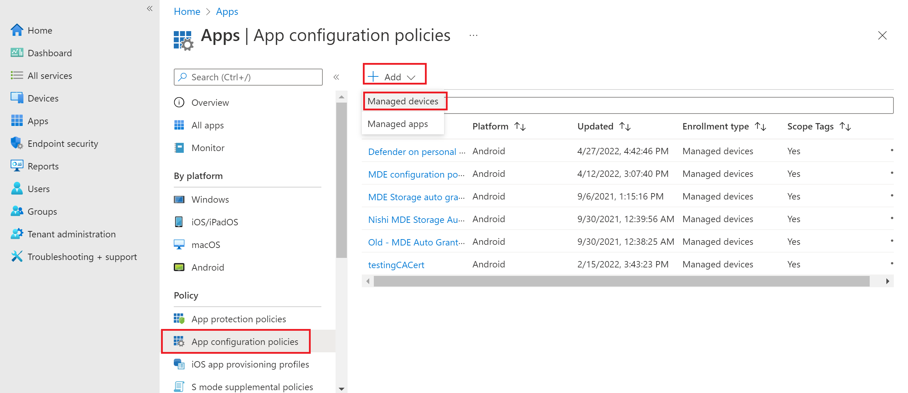
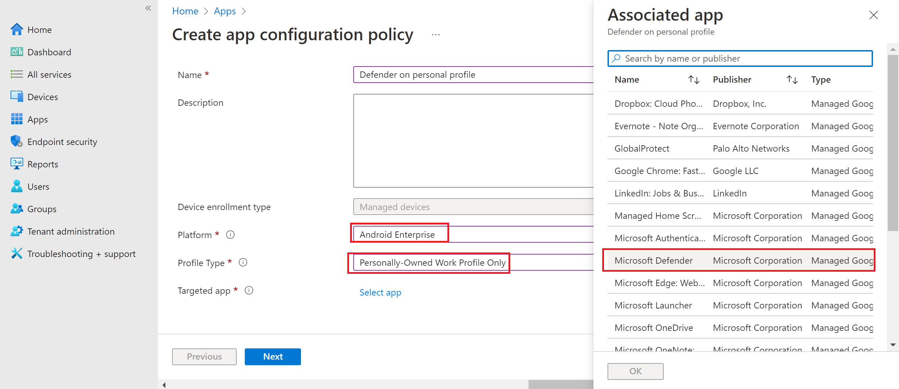
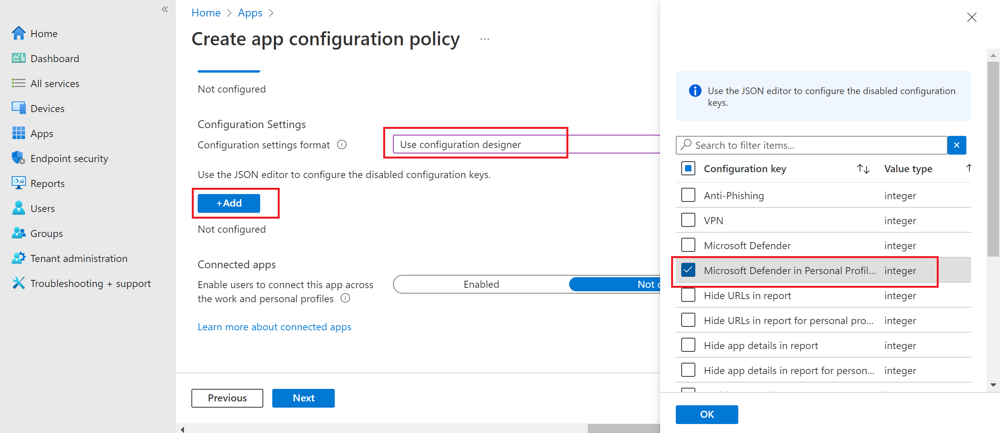
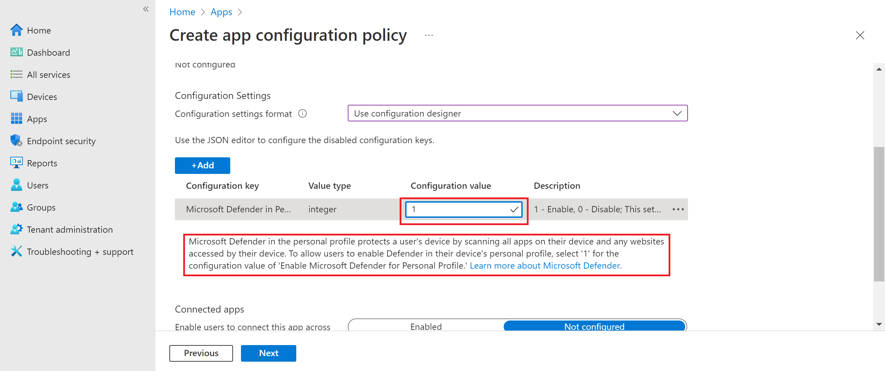
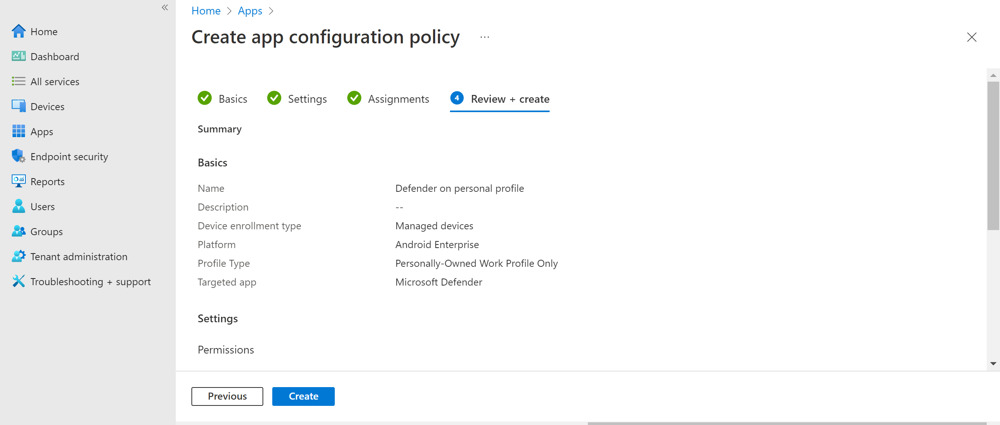

# Deploy Microsoft Defender for Endpoint on Android with Microsoft Intune

[!INCLUDE [Microsoft 365 Defender rebranding](../../includes/microsoft-defender.md)]

**Applies to:**
- [Microsoft Defender for Endpoint Plan 1](https://go.microsoft.com/fwlink/p/?linkid=2154037)
- [Microsoft Defender for Endpoint Plan 2](https://go.microsoft.com/fwlink/p/?linkid=2154037)
- [Microsoft 365 Defender](https://go.microsoft.com/fwlink/?linkid=2118804)

> Want to experience Microsoft Defender for Endpoint? [Sign up for a free trial.](https://signup.microsoft.com/create-account/signup?products=7f379fee-c4f9-4278-b0a1-e4c8c2fcdf7e&ru=https://aka.ms/MDEp2OpenTrial?ocid=docs-wdatp-exposedapis-abovefoldlink)

Learn how to deploy Defender for Endpoint on Android on Microsoft Intune Company Portal enrolled devices. For more information about Microsoft Intune device enrollment, see [Enroll your device](/mem/intune/user-help/enroll-device-android-company-portal).

> [!NOTE]
> **Defender for Endpoint on Android is now available on [Google Play](https://play.google.com/store/apps/details?id=com.microsoft.scmx)**
>
> You can connect to Google Play from Microsoft Intune to deploy Defender for Endpoint app across Device Administrator and Android Enterprise enrollment modes.
>
> Updates to the app are automatic via Google Play.

## Deploy on Device Administrator enrolled devices

Learn how to deploy Defender for Endpoint on Android with Microsoft Intune Company Portal - Device Administrator enrolled devices.

### Add as Android store app

1. In [Microsoft Intune admin center](https://go.microsoft.com/fwlink/?linkid=2109431) , go to **Apps** \>
**Android Apps** \> **Add** \> **Android store app** and choose **Select**.

   :::image type="content" source="images/mda-addandroidstoreapp.png" alt-text="The Add Android store application pane in the Microsoft Intune admin center portal"  lightbox="images/mda-addandroidstoreapp.png":::

2. On the **Add app** page and in the *App Information* section enter:

   - **Name**
   - **Description**
   - **Publisher** as Microsoft.
   - **App store URL** as https://play.google.com/store/apps/details?id=com.microsoft.scmx (Defender for Endpoint app Google Play Store URL)

   Other fields are optional. Select **Next**.

   :::image type="content" source="images/mda-addappinfo.png" alt-text=" The Add App page displaying the application's publisher and URL information in the Microsoft Intune admin center portal" lightbox="images/mda-addappinfo.png":::

3. In the *Assignments* section, go to the **Required** section and select **Add group.** You can then choose the user group(s) that you would like to target Defender for Endpoint on Android app. Choose **Select** and then **Next**.

    > [!NOTE]
    > The selected user group should consist of Intune enrolled users.
    >
    > :::image type="content" source="images/363bf30f7d69a94db578e8af0ddd044b.png" alt-text="The Add group pane in the Add App page in the Microsoft Intune admin center portal" lightbox="images/363bf30f7d69a94db578e8af0ddd044b.png":::

4. In the **Review+Create** section, verify that all the information entered is correct and then select **Create**.

    In a few moments, the Defender for Endpoint app would be created successfully, and a notification would show up at the top-right corner of the page.

    :::image type="content" source="images/86cbe56f88bb6e93e9c63303397fc24f.png" alt-text="The application status pane in the Microsoft Intune admin center portal" lightbox="images/86cbe56f88bb6e93e9c63303397fc24f.png":::

5. In the app information page that is displayed, in the **Monitor** section, select **Device install status** to verify that the device installation has completed successfully.

    :::image type="content" source="images/513cf5d59eaaef5d2b5bc122715b5844.png" alt-text="The Device install status page in the Microsoft Defender 365 portal" lightbox="images/513cf5d59eaaef5d2b5bc122715b5844.png":::

### Complete onboarding and check status

1. Once Defender for Endpoint on Android has been installed on the device, you'll see the app icon.

   :::image type="content" source="images/7cf9311ad676ec5142002a4d0c2323ca.jpg" alt-text="The Microsoft Defender ATP icon listed in the Search pane" lightbox="images/7cf9311ad676ec5142002a4d0c2323ca.jpg":::

2. Tap the Microsoft Defender for Endpoint app icon and follow the on-screen instructions to complete onboarding the app. The details include end-user acceptance of Android permissions required by Defender for Endpoint on Android.

3. Upon successful onboarding, the device will start showing up on the Devices list in the Microsoft 365 Defender portal.

    :::image type="content" source="images/9fe378a1dce0f143005c3aa53d8c4f51.png" alt-text="A device in the Microsoft Defender for Endpoint portal"  lightbox="images/9fe378a1dce0f143005c3aa53d8c4f51.png":::

## Deploy on Android Enterprise enrolled devices

Defender for Endpoint on Android supports Android Enterprise enrolled devices.

For more information on the enrollment options supported by Microsoft Intune, see [Enrollment Options](/mem/intune/enrollment/android-enroll).

**Currently, Personally owned devices with work profile and Corporate-owned fully managed user device enrollments are supported for deployment.**

## Add Microsoft Defender for Endpoint on Android as a Managed Google Play app

Follow the steps below to add Microsoft Defender for Endpoint app into your managed Google Play.

1. In [Microsoft Intune admin center](https://go.microsoft.com/fwlink/?linkid=2109431) , go to **Apps** \> **Android Apps** \> **Add** and select **Managed Google Play app**.

    :::image type="content" source="images/579ff59f31f599414cedf63051628b2e.png" alt-text="The application-adding pane in the Microsoft Intune admin center portal" lightbox="images/579ff59f31f599414cedf63051628b2e.png":::

2. On your managed Google Play page that loads subsequently, go to the search box and enter `Microsoft Defender`. Your search should display the Microsoft Defender for Endpoint app in your Managed Google Play. Click on the Microsoft Defender for Endpoint app from the Apps search result.

    :::image type="content" source="images/0f79cb37900b57c3e2bb0effad1c19cb.png" alt-text="The Managed Google Play page in the Microsoft Intune admin center portal" lightbox="images/0f79cb37900b57c3e2bb0effad1c19cb.png":::

3. In the App description page that comes up next, you should be able to see app details on Defender for Endpoint. Review the information on the page and then select **Approve**.

    > [!div class="mx-imgBorder"]
    > :::image type="content" source="images/07e6d4119f265037e3b80a20a73b856f.png" alt-text="The page of Managed Google Play in the Microsoft Intune admin center portal" lightbox="images/07e6d4119f265037e3b80a20a73b856f.png":::

4. You'll be presented with the permissions that Defender for Endpoint obtains for it to work. Review them and then select **Approve**.

    :::image type="content" source="images/206b3d954f06cc58b3466fb7a0bd9f74.png" alt-text="The permissions approval page in the Microsoft Defender 365 portal" lightbox="images/206b3d954f06cc58b3466fb7a0bd9f74.png":::

5. You'll be presented with the Approval settings page. The page confirms your preference to handle new app permissions that Defender for Endpoint on Android might ask. Review the choices and select your preferred option. Select **Done**.

    By default, managed Google Play selects **Keep approved when app requests new permissions**.

    > [!div class="mx-imgBorder"]
    > :::image type="content" source="images/ffecfdda1c4df14148f1526c22cc0236.png" alt-text=" The approval settings configuration completion page in the in the Microsoft Defender 365 portal" lightbox="images/ffecfdda1c4df14148f1526c22cc0236.png":::

6. After the permissions handling selection is made, select **Sync** to sync Microsoft Defender for Endpoint to your apps list.

    > [!div class="mx-imgBorder"]
    > :::image type="content" source="images/34e6b9a0dae125d085c84593140180ed.png" alt-text="The Sync pane in the Microsoft Defender 365 portal" lightbox="images/34e6b9a0dae125d085c84593140180ed.png":::

7. The sync will complete in a few minutes.

    :::image type="content" source="images/9fc07ffc150171f169dc6e57fe6f1c74.png" alt-text="The application sync status pane in the Android apps page in the Microsoft Defender 365 portal"  lightbox="images/9fc07ffc150171f169dc6e57fe6f1c74.png":::

8. Select the **Refresh** button in the Android apps screen and Microsoft Defender for Endpoint should be visible in the apps list.

    :::image type="content" source="images/fa4ac18a6333335db3775630b8e6b353.png" alt-text="The page displaying the synced application" lightbox="images/fa4ac18a6333335db3775630b8e6b353.png":::

9. Defender for Endpoint supports App configuration policies for managed devices via Microsoft Intune. This capability can be leveraged to select different configurations for Defender.

    1. In the **Apps** page, go to **Policy > App configuration policies > Add > Managed devices**.

       :::image type="content" source="images/android-mem.png" alt-text="The App configuration policies pane in the Microsoft Intune admin center portal" lightbox="images/android-mem.png":::

    1. In the **Create app configuration policy** page, enter the following details:

        - Name: Microsoft Defender for Endpoint.
        - Choose **Android Enterprise** as platform.
        - Choose **Personally-owned Work Profile only** or **Fully Managed, Dedicated, and Corporate-owned work profile only** as Profile Type.
        - Click **Select App**, choose **Microsoft Defender**, select **OK** and then **Next**.

        :::image type="content" source="images/android-create-app.png" alt-text=" Screenshot of the Associated app details pane." lightbox="images/android-create-app.png":::

    1. Select **Permissions** \> **Add**. From the list, select the available app permissions \> **OK**.
    1. Select an option for each permission to grant with this policy:

       - **Prompt** - Prompts the user to accept or deny.
       - **Auto grant** - Automatically approves without notifying the user.
       - **Auto deny** - Automatically denies without notifying the user.

    1. Go to the **Configuration settings** section and choose **'Use configuration designer'** in Configuration settings format.

       :::image type="content" alt-text="Image of android create app configuration policy." source="images/configurationformat.png" lightbox="images/configurationformat.png":::

    1. Click on **Add** to view a list of supported configurations. Select the required configuration and click on **Ok**.

       :::image type="content" alt-text="Image of selecting configuration policies for android." source="images/selectconfigurations.png" lightbox="images/selectconfigurations.png":::

    1. You should see all the selected configurations listed. You can change the configuration value as required and then select **Next**.

       :::image type="content" alt-text="Image of selected configuration policies." source="images/listedconfigurations.png" lightbox="images/listedconfigurations.png":::

    1. In the **Assignments** page, select the user group to which this app config policy would be assigned. Click **Select groups to include** and selecting the applicable group and then selecting **Next**. The group selected here is usually the same group to which you would assign Microsoft Defender for Endpoint Android app.

       :::image type="content" source="images/android-select-group.png" alt-text="The Selected groups pane" lightbox="images/android-select-group.png":::

    1. In the **Review + Create** page that comes up next, review all the information and then select **Create**.

        The app configuration policy for Defender for Endpoint is now assigned to the selected user group.

10. Select **Microsoft Defender** app in the list \> **Properties** \>
**Assignments** \> **Edit**.

    :::image type="content" source="images/mda-properties.png" alt-text="The Edit option on the Properties page" lightbox="images/mda-properties.png":::

11. Assign the app as a *Required* app to a user group. It is automatically installed in the *work profile* during the next sync of the device via Company Portal app. This assignment can be done by navigating to the *Required* section \> **Add group,** selecting the user group and click **Select**.

    > [!div class="mx-imgBorder"]
    > :::image type="content" source="images/ea06643280075f16265a596fb9a96042.png" alt-text="The Edit application page" lightbox="images/ea06643280075f16265a596fb9a96042.png":::

12. In the **Edit Application** page, review all the information that was entered above. Then select **Review + Save** and then **Save** again to commence assignment.

### Auto Setup of Always-on VPN

Defender for Endpoint supports Device configuration policies for managed devices via Microsoft Intune. This capability can be leveraged to **Auto setup of Always-on VPN** on Android Enterprise enrolled devices, so the end user does not need to set up VPN service while onboarding.

1. On **Devices**, select **Configuration Profiles** \> **Create Profile** \> **Platform** \> **Android Enterprise**

   Select **Device restrictions** under one of the following, based on your device enrollment type:
   - **Fully Managed, Dedicated, and Corporate-Owned Work Profile**
   - **Personally owned Work Profile**

   Select **Create**.

   :::image type="content" source="images/1autosetupofvpn.png" alt-text="The Configuration profiles menu item in the Policy pane" lightbox="images/1autosetupofvpn.png":::

2. **Configuration Settings**
  Provide a **Name** and a **Description** to uniquely identify the configuration profile.

   :::image type="content" source="images/2autosetupofvpn.png" alt-text="The devices configuration profile Name and Description fields in the Basics pane" lightbox="images/2autosetupofvpn.png":::

3. Select **Connectivity** and configure VPN:

   - Enable **Always-on VPN**

     Set up a VPN client in the work profile to automatically connect and reconnect to the VPN whenever possible. Only one VPN client can be configured for always-on VPN on a given device, so be sure to have no more than one always-on VPN policy deployed to a single device.

   - Select **Custom** in VPN client dropdown list

     Custom VPN in this case is Defender for Endpoint VPN which is used to provide the Web Protection feature.

     > [!NOTE]
     > Microsoft Defender for Endpoint app must be installed on user's device, in order to functioning of auto setup of this VPN.

   - Enter **Package ID** of the Microsoft Defender for Endpoint app in Google Play store. For the Defender app URL <https://play.google.com/store/apps/details?id=com.microsoft.scmx>, Package ID is **com.microsoft.scmx**

   - **Lockdown mode** Not configured (Default)

     :::image type="content" source="images/3autosetupofvpn.png" alt-text="The Connectivity pane under the Configuration settings tab" lightbox="images/3autosetupofvpn.png":::

4. **Assignment**

   In the **Assignments** page, select the user group to which this app config policy would be assigned. Choose **Select groups** to include and selecting the applicable group and then select **Next**. The group selected here is usually the same group to which you would assign Microsoft Defender for Endpoint Android app.

   :::image type="content" source="images/4autosetupofvpn.png" alt-text="Screenshot of the devices configuration profile Assignment pane in the Device restrictions." lightbox="images/4autosetupofvpn.png":::

5. In the **Review + Create** page that comes up next, review all the information and then select **Create**.
The device configuration profile is now assigned to the selected user group.

   :::image type="content" source="images/5autosetupofvpn.png" alt-text="A devices configuration profile 's provision for Review + create" lightbox="images/5autosetupofvpn.png":::

## Check status and complete onboarding

1. Confirm the installation status of Microsoft Defender for Endpoint on Android by clicking on the **Device Install Status**. Verify that the device is displayed here.

    > [!div class="mx-imgBorder"]
    > :::image type="content" source="images/900c0197aa59f9b7abd762ab2b32e80c.png" alt-text="The device installation status pane" lightbox="images/900c0197aa59f9b7abd762ab2b32e80c.png":::

2. On the device, you can validate the onboarding status by going to the **work profile**. Confirm that Defender for Endpoint is available and that you are enrolled to the **Personally owned devices with work profile**. If you are enrolled to a **Corporate-owned, fully managed user device**, you will have a single profile on the device where you can confirm that Defender for Endpoint is available.

    :::image type="content" source="images/c2e647fc8fa31c4f2349c76f2497bc0e.png" alt-text="The application display pane" lightbox="images/c2e647fc8fa31c4f2349c76f2497bc0e.png":::

3. When the app is installed, open the app and accept the permissions and then your onboarding should be successful.

    :::image type="content" source="images/MDE_new.png" alt-text="Th display of a Microsoft Defender for Endpoint application on a mobile device" lightbox="images/MDE_new.png":::

4. At this stage the device is successfully onboarded onto Defender for Endpoint on Android. You can verify this on the [Microsoft 365 Defender portal](https://security.microsoft.com) by navigating to the **Device Inventory** page.

    :::image type="content" source="images/9fe378a1dce0f143005c3aa53d8c4f51.png" alt-text="The Microsoft Defender for Endpoint portal" lightbox="images/9fe378a1dce0f143005c3aa53d8c4f51.png":::

## Set up Microsoft Defender in Personal Profile on Android Enterprise in BYOD mode

### Set up Microsoft Defender in Personal Profile

Admins can go to the [Microsoft Endpoint Management admin center](https://endpoint.microsoft.com) to set up and configure Microsoft Defender support in personal profiles by following these steps:

1. Go to **Apps> App configuration policies** and click on **Add**. Select **Managed Devices**.

    > [!div class="mx-imgBorder"]
    > 

1. Enter **Name** and **Description** to uniquely identify the configuration policy. Select platform as **'Android Enterprise'**, Profile type as **'Personally-owned work profile only'** and Targeted app as **'Microsoft Defender'**.

    > [!div class="mx-imgBorder"]
    > 

1. On the settings page, in **'Configuration settings format'**, select **'Use configuration designer'** and click on **Add**. From the list of configurations that are displayed, select **'Microsoft Defender in Personal profile'**.

    > [!div class="mx-imgBorder"]
    > 

1. The selected configuration will be listed. Change the **configuration value to 1** to enable Microsoft Defender support personal profiles. A notification will appear informing the admin about the same. Click on **Next**.

    > [!div class="mx-imgBorder"]
    > 

1. **Assign** the configuration policy to a group of users. **Review and create** the policy.

    > [!div class="mx-imgBorder"]
    > 

Admins also can set up **privacy controls** from the Microsoft Intune admin center to control what data can be sent by the Defender mobile client to the security portal. For more information, see [configuring privacy controls](android-configure.md).

Organizations can communicate to their users to protect Personal profile with Microsoft Defender on their enrolled BYOD devices.

- Pre-requisite: Microsoft Defender must be already installed and active in work profile to enabled Microsoft Defender in personal profiles.

### To complete onboarding a device

1. Install the Microsoft Defender application in a personal profile with a personal Google Play store account.
2. Install the Company portal application on personal profile. No sign-in is required.
3. When a user launches the application, they'll see the sign-in screen. **Login using corporate account only**.
4. On a successful login, users will see the following screens:
   1. **EULA screen**: Presented only if the user has not consented already in the Work profile.
   2. **Notice screen**: Users need to provide consent on this screen to move forward with onboarding the application. This is required only during the first run of the app.
5. Provide the required permissions to complete onboarding.

> [!NOTE]
> **Pre-requisite:**
>
> 1. The Company portal needs to be enabled on personal profile.
> 2. Microsoft Defender needs to be already installed and active in work profile.

## Related topics

- [Overview of Microsoft Defender for Endpoint on Android](microsoft-defender-endpoint-android.md)
- [Configure Microsoft Defender for Endpoint on Android features](android-configure.md)
[!INCLUDE [Microsoft Defender for Endpoint Tech Community](../../includes/defender-mde-techcommunity.md)]
