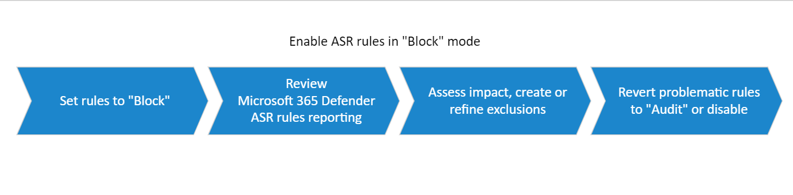

# Attack surface reduction rules deployment phase 3: implement

The implementation phase moves the ring from testing into functional state.

> [!div class="mx-imgBorder"]
> 

## Step 1: Transition ASR Rules from Audit to Block

1. After all exclusions are determined while in audit mode, start setting some ASR rules to "block" mode, starting with the rule that has the fewest triggered events. See” [Enable attack surface reduction rules](enable-attack-surface-reduction.md).
2. Review the reporting page in the Microsoft 365 Defender portal; see [Threat protection report in Microsoft Defender for Endpoint](threat-protection-reports.md). Also review feedback from your ASR champions.
3. Refine exclusions or create new exclusions as determined necessary.
4. Switch problematic rules back to Audit.

  >[!Note]
  >For problematic rules (rules creating too much noise), it is better to create exclusions than to turn rules off or switching back to Audit. You will have to determine what is best for your environment.

  >[!Tip]
  >When available, take advantage of the Warn mode setting in rules to limit disruptions. Enabling ASR rules in Warn mode enables you to capture triggered events and view their potential disruptions, without actually blocking end-user access. Learn more: [Warn mode for users](attack-surface-reduction.md#warn-mode-for-users).

### How does Warn mode work?

Warn mode is effectively a Block instruction, but with the option for the user to “Unblock” subsequent executions of the given flow or app. Warn mode unblocks on a per device, user, file and process combination. The warn mode information is stored locally and has a duration of 24 hours.

### Step 2: Expand deployment to ring n + 1

When you are confident that you have correctly configured the ASR rules for ring 1, you can widen the scope of your deployment to the next ring (ring n + 1).

The deployment process, steps 1 – 3,  is essentially the same for each subsequent ring:

1. Test rules in Audit
2. Review ASR-triggered audit events in the Microsoft 365 Defender portal
3. Create exclusions
4. Review: refine, add, or remove exclusions as necessary
5. Set rules to “block”
6. Review the reporting page in the Microsoft 365 Defender portal.
7. Create exclusions.
8. Disable problematic rules or switch them back to Audit.

## Additional topics in this deployment collection

[ASR rules deployment guide - overview](attack-surface-reduction-rules-deployment.md)

[ASR rules deployment phase 1 - plan](attack-surface-reduction-rules-deployment-phase-1.md)

[ASR rules deployment phase 2 - test](attack-surface-reduction-rules-deployment-phase-2.md)

[ASR rules deployment phase 4 - operationalize](attack-surface-reduction-rules-deployment-phase-4.md)
