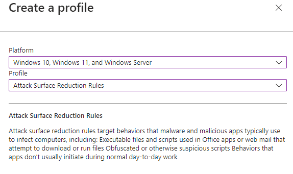

# Attack surface reduction rules deployment guide

## Before you begin

Attack surfaces are all the places where your organization is vulnerable to cyberthreats and attacks.
Your organization's attack surface includes all the places where an attacker could compromise your organization's devices or networks. Reducing your attack surface means protecting your organization's devices and network, which leaves attackers with fewer ways to perform attacks. Configuring attack surface reduction (ASR) rules – one of numerous security features found in Microsoft Defender for Endpoint – can help.

Attack surface reduction rules target certain software behaviors, such as:

- Launching executable files and scripts that attempt to download or run files
- Running obfuscated or otherwise suspicious scripts
- Behaviors that apps don't usually initiate during normal day-to-day work

By reducing the different attack surfaces, you can help prevent attacks from happening in the first place.

During your initial preparation, it is vital that you understand the capabilities of the systems that you will put in place. Understanding the capabilities will help you determine which ASR rules are most important for protecting your organization.

Before you start, review [Overview of attack surface reduction](overview-attack-surface-reduction.md), and [Demystifying attack surface reduction rules - Part 1](https://techcommunity.microsoft.com/t5/microsoft-defender-for-endpoint/demystifying-attack-surface-reduction-rules-part-1/ba-p/1306420) for foundational information. To understand the areas of coverage and potential impact, familiarize yourself with the current set of ASR rules; see [Attack surface reduction rules](attack-surface-reduction-rules.md).

Note that ASR rules are only one capability of the attack surface reduction capabilities within Microsoft Defender for Endpoint. This document will go into more detail on deploying ASR rules effectively to stop advanced threats like human-operated ransomware and other threats.  

### Rules by category

As outlined in [Use attack surface reduction rules to prevent malware infection](attack-surface-reduction.md), there are multiple attack surface reduction rules within MDE that you can enable to better protect your organization. Following are the rules broken out by category:

| Polymorphic threats | Lateral movement & credential theft | Productivity apps rules | Misc rules | Email rules | Script rules |
|:---|:---|:---|:---|:---|:---|
| Block executable files from running unless they meet a prevalence (1000 machines), age (24 hrs), or trusted list criteria | Block process creations originating from PSExec and WMI commands | Block Office apps from creating executable content | Block abuse of exploited vulnerable signed drivers | Block executable content from email client and webmail | Block obfuscated JS/VBS/PS/macro code |
| Block untrusted and unsigned processes that run from USB | Block credential stealing from the Windows local security authority subsystem (lsass.exe) | Block Office apps from creating child processes | | Block only Office communication applications from creating child processes | Block JS/VBS from launching downloaded executable content |
| Use advanced protection against ransomware | Block persistence through WMI event subscription | Block Office apps from injecting code into other processes | | Block Office communication apps from creating child processes | |
| | | Block Adobe Reader from creating child processes | | | |

### Infrastructure requirements

Although multiple methods of implementing ASR rules are possible, this guide is based on an - infrastructure consisting of:

- Azure Active Directory
- Microsoft Endpoint Management (MEM)
- Windows 10 and Windows 11 devices
- Microsoft Defender for Endpoint E5 or Windows E5 licenses

To take full advantage of ASR rules and reporting, we recommend using a Microsoft 365 Defender E5 or Windows E5 license, and A5. See: Minimum requirements for Microsoft Defender for Endpoint | Microsoft Docs.

If you have different configurations than those listed above, you can see more information about deploying attack surface reduction rules using other configurations here: [Enable attack surface reduction rules](enable-attack-surface-reduction.md).  

### ASR rules dependencies

Microsoft Defender Antivirus must be enabled and configured as primary anti-virus solution. Microsoft Defender Antivirus must be in the following mode:

- Primary antivirus/antimalware solution  
- State: Active mode

Microsoft Defender Antivirus must not be in any of the following modes:

- Passive
- EDR in block mode
- Limited periodic scanning (LPS)
- Off

See: [Cloud-delivered protection and Microsoft Defender Antivirus](cloud-protection-microsoft-defender-antivirus.md).

### Cloud Protection (MAPS) must be enabled

Microsoft Defender Antivirus works seamlessly with Microsoft cloud services. These cloud protection services, also referred to as Microsoft Advanced Protection Service (MAPS), enhances standard real-time protection, arguably providing the best antivirus defense. Cloud protection is critical to preventing breaches from malware and a critical component of ASR rules.
[Turn on cloud-delivered protection in Microsoft Defender Antivirus](enable-cloud-protection-microsoft-defender-antivirus.md).

### Microsoft Defender Antivirus components must be current versions

The following Microsoft Defender Antivirus component versions must be no more than two versions older than the most-currently-available version:

- **Microsoft Defender Antivirus Platform update version**  - Microsoft Defender Antivirus platform is updated monthly.
- **Microsoft Defender Antivirus engine version** - Microsoft Defender Antivirus engine is updated monthly.
- **Microsoft Defender Antivirus security intelligence** - Microsoft continually updates Microsoft Defender security intelligence (definition and signature) to address the latest threats, and to refine detection logic.

Keeping Microsoft Defender Antivirus versions current helps reduce ASR rules false positive results and improves Microsoft Defender Antivirus detection capabilities. For more details on the current versions and how to update the different Microsoft Defender Antivirus components visit [Microsoft Defender Antivirus platform support](manage-updates-baselines-microsoft-defender-antivirus.md).

## ASR rules deployment phases

As with any new, wide-scale implementation which could potentially impact your line-of-business operations, it is important to plan and be methodical in your implementation.
Because of the powerful capabilities of ASR rules in preventing malware, careful planning and deployment of these rules is required to ensure they work best for your unique customer workflows. To work in your environment, you need to plan, test, implement, and operationalize ASR rules carefully.  

_Deployment phases diagram 1_.

## Phase 1: Plan

Starting to test ASR rules involves starting with the right business unit. You’ll want to start with a small group of people in a specific business unit. You can identify some ASR champions within a particular business unit who can provide real-world impact to the ASR rules and help you tune your implementation.

_Deployment phase 1 diagram_.

### Start with the right business unit

How you select the business unit to roll out your ASR rules  deployment will depend on factors such as:

- Size of business unit
- Availability of ASR rules champions  
- Distribution and usage of:
  - Software
  - Shared folders
  - Use of scripts
  - Office macros
  - Other entities impacted by ASR rules

Depending on your business needs you might decide to include multiple business units to get a broad sampling of software, shared folders, scripts, macros, etc. Conversely, you might decide to limit the scope of your first ASR rules rollout to a single business unit, then repeat the entire ASR rules rollout process to your other business units, one-at-a-time.

### Identify ASR  rules champions

ASR  rules champions are members in your organization that will help with your initial ASR  rules rollout during the preliminary testing and implementation phases. Your champions are typically employees who are more technically adept, and who are not derailed by intermittent work-flow outages. In the context of this deployment, the champions involvement will continue throughout the broader expansion of ASR  rules deployment to your organization. Your ASR rules champions will be first to experience each level of the ASR  rules rollout.

It is important to provide a feedback and response channel so that your ASR rules champions can alert you to ASR  rules-related work disruptions and receive ASR  rules-rollout related communications.

### Get inventory of line-of-business apps and understand the business unit processes

Having a full understanding of the applications and per-business-unit processes that are used across your organization is critical to a successful ASR  rules deployment. Additionally, it is imperative that you understand how those apps are used within the various business units in your organization.
To start, you should get an inventory of the apps that are approved for use across the breadth of the organization. You can use tools such as the Microsoft 365 Apps admin center to help you inventory software applications. See: [Overview of inventory in the Microsoft 365 Apps admin center](https://docs.microsoft.com/deployoffice/admincenter/inventory.md).

### Define reporting and response team  roles and responsibilities

Clearly articulating roles and responsibilities of persons responsible for monitoring and communicating ASR  rules status and activity is a core activity of ASR  maintenance. Therefore, it is important to determine:

- The person or team responsible for gathering reports
- How and with whom reports are shared
- How escalation is addressed for newly identified threats or unwanted blockages caused by ASR rules

Typical roles and responsibilities include:

- IT admins: Implement ASR rules, manage exclusions. Work with different business units on apps and processes. Assembling and sharing reports to stakeholders
- Certified security operations center (CSOC) analyst: Responsible for investing high-priority, blocked processes, to determine wither the threat is valid or not
- Chief information security officer (CISO): Responsible for the overall security posture and health of the organization

### Ring deployment

For large enterprises, Microsoft recommends deploying ASR  rules in “rings.” Rings are groups of devices that are visually represented as concentric circles that radiate outward like non-overlapping tree rings. When the innermost ring is successfully deployed, you can transition the next ring into the testing phase. Thorough assessment of your business units, ASR  rules champions, apps, and processes is imperative to defining your rings.
In most cases, your organization will have designed deployment rings for phased rollouts of Windows updates. You can use your existing ring design to implement ASR  rules.
See: [Create a deployment plan for Windows](https://docs.microsoft.com/windows/deployment/update/create-deployment-plan.md)

## Phase 2: Test

Begin your ASR  rules deployment with ring 1.

_Deployment phase 2 diagram_.

### Step 1: Test ASR rules using Audit

Begin the testing phase by turning on the ASR rules with the rules set to Audit, starting with your champion users or devices in ring 1. Typically, the recommendation is that you enable all the rules (in Audit) so that you can determine which rules are triggered during the testing phase. Note that rules that are set to Audit do not impact functionality of the entity or entities to which the rule is applied but do generate logged events for the evaluation; there is no effect on end users.

#### Configure ASR Rules using MEM

You can use Microsoft Endpoint Manager (MEM) Endpoint Security to configure custom ASR rules.

1. Open [Microsoft Endpoint Manager admin center](https://endpoint.microsoft.com/#home)
2. Go to **Endpoint Security** > **Attack surface reduction**.
3. Select **Create Policy**.
4. In **Platform**, select **Windows 10 and later**, and in **Profile**, select **Attack surface reduction rules**.
  
    > [!div class="mx-imgBorder"]
    > 

5. Click **Create**.
6. In the **Basics** tab of the **Create profile** pane, in **Name** add a name for your policy. In **Description** add a description for your ASR rules policy.
7. In the **Configuration settings** tab, under **Attack Surface Reduction Rules**, set all rules to **Audit mode**.

    > [!div class="mx-imgBorder"]
    > 

8. [Optional] In the **Scope tags** pane, you can add tag information to specific devices. You can also use role-based access control and scope tags to make sure that the right admins have the right access and visibility to the right Intune objects. Learn more: [Use role-based access control (RBAC) and scope tags for distributed IT in Intune](https://docs.microsoft.com/mem/intune/fundamentals/scope-tags.md).
9. In the **Assignments** pane, you can deploy or "assign" the profile to your user or device groups. Learn more: [Assign device profiles in Microsoft Intune](https://docs.microsoft.com/mem/intune/configuration/device-profile-assign#exclude-groups-from-a-profile-assignment)
10. Review your settings in the **Review + create** pane. Click **Create** to apply the rules.

   > [!div class="mx-imgBorder"]
   > 

Your new attack surface reduction policy for ASR rules is listed in **Endpoint security | Attack surface reduction**.

> [!div class="mx-imgBorder"]
> 

### Step 2: Understand the Attack surface reduction rules reporting page in the Microsoft 365 Defender portal

The ASR  rules reporting page is found in Microsoft 365 Defender portal > Reports > Attack surface reduction rules. This page has three tabs:

- Detections
- Configuration
- Add exclusions

#### Detections tab

Provides a 30-day timeline of detected audit and blocked events.

Intro.

> [!div class="mx-imgBorder"]
> 

Text.

> [!div class="mx-imgBorder"]
> 

Text.

> [!div class="mx-imgBorder"]
> 

The **GroupBy** and **Filter** tools provide the following options:

The **GroupBy** returns results set to the following groups:

- No grouping
- Detected file
- Audit or block
- Rule
- Source app
- Device
- User
- Publisher

> [!div class="mx-imgBorder"]
> 

**Filter** opens the **Filter on rules** page, which enables you to scope the results to only the selected ASR rules:

> [!div class="mx-imgBorder"]
> 

>[!Note]
>If you have a Microsoft Microsoft 365 Security E5 or A5, Windows E5 or A5 license, the following link opens the Microsoft Defender 365  Reports > [Attack surface reductions](https://security.microsoft.com/asr?viewid=detections) > Detections tab.

#### Configuration tab

Lists – on a per-computer basis – the aggregate state of ASR rules: Off, Audit, Block.

> [!div class="mx-imgBorder"]
> 

On the Configurations tab, you can check – on a per-device basis – which ASR rules are enabled, and in which mode, by selecting the device for which you want to review ASR rules.

> [!div class="mx-imgBorder"]
> 

The **Get started** link opens the Microsoft Endpoint Manager admin center, where you can create or modify an endpoint protection policy for ASR:

> [!div class="mx-imgBorder"]
> 

In Endpoint security | Overview, select **Attack surface reduction**:

> [!div class="mx-imgBorder"]
> 

The Endpoint Security | Attack surface reduction tool opens:

> [!div class="mx-imgBorder"]
> 

>[!Note]
>If you have a Microsoft Defender 365 E5 (or Windows E5?) license, this link will open the Microsoft Defender 365  Reports > Attack surface reductions > [Configurations](https://security.microsoft.com/asr?viewid=configuration) tab.

#### Add exclusions

This tab provides a method to select detected entities (for example, false positives) for exclusion. When exclusions are added, the report provides a summary of the expected impact.

>[!Note]
> Microsoft Defender Antivirus AV exclusions are honored by ASR rules.  See [Configure and validate exclusions based on extension, name, or location](configure-extension-file-exclusions-microsoft-defender-antivirus.md).

> [!div class="mx-imgBorder"]
> 

> [!Note]
>If you have a Microsoft Defender 365 E5 (or Windows E5?) license, this link will open the Microsoft Defender 365  Reports > Attack surface reductions > [Exclusions](https://security.microsoft.com/asr?viewid=exclusions) tab.

### Step 3: Assess impact

#### Review

Use the reporting page in the Microsoft 365 Defender portal to see which – if any – ASR rules have impacted the business unit process. Include feedback from your ASR champions as part of this process. Review the audit report to determine which rules have the most fired/triggered events, and which have the fewest.

Because ASR rules target a broad array of components, and those components will be called at varying intervals, it is difficult to predict how long it will take to obtain a useful sampling of ASR rules-triggered events in your organizations rings; however, Microsoft suggests a minimum of four weeks. For example, some ASR rules for Microsoft Office applications might trigger sooner and more frequently than the ASR rule to “Use advanced protection against ransomware.” Likewise, each ring will likely use applications and other components that are subject to ASR rules differently and with dissimilar frequency. You must make the determination of when testing is complete based on the results in your organization. For a better understanding, see [How long should I test an ASR rule in audit mode before enabling it?](attack-surface-reduction-faq.yml#how-long-should-i-test-an-asr-rule-in-audit-mode-before-enabling-it-) in **Attack surface reduction frequently asked questions (FAQ)**.

#### Create exclusions

In many cases, an organization has files, or folders of files, for example that are known to be safe, and which might contain aspects that would trigger an ASR rule; audit mode will reveal such files and folders. For example, your organization might have a collection of Word or Excel documents that have macros enabled for specific purposes; such macros can trigger an ASR rule. In such cases, if audit mode identifies such files, you want to exclude these files or folders to prevent them from being captured by ASR rules. See [Exclude files and folders](enable-attack-surface-reduction.md#exclude-files-and-folders-from-asr-rules)

>[!Note]
>Keep in mind that Microsoft Defender Antivirus AV exclusions are honored by ASR rules.  See [Configure and validate exclusions based on extension, name, or location](configure-extension-file-exclusions-microsoft-defender-antivirus.md).

If you determine a rule will broadly impact line-of-business operations in a detrimental way, you can disable the rule entirely, or you can leave the rule in audit so that you can continue to capture and evaluate those ASR rule-triggered events.
Exclusions are easily enabled in **Microsoft 365 Defender** > **Reports** > **Attack surface reduction rules**. Simply select the entity or entities for which you want to create an exclusion.

> [!div class="mx-imgBorder"]
> 

### Step 4: Assess impact

#### Review impact

Use the reporting page in the Microsoft 365 Defender portal to see which – if any – ASR rules have impacted the business unit process. Include feedback from your ASR champions as part of this process. Review the audit report to determine which rules have the most fired/triggered events, and which have the fewest.

Because ASR rules target a broad array of components, and those components will be called at varying intervals, it is difficult to predict how long it will take to obtain a useful sampling of ASR rules-triggered events in your organizations rings; however, Microsoft suggests a minimum of four weeks. For example, some ASR rules for Microsoft Office applications might trigger sooner and more frequently than the ASR rule to “Use advanced protection against ransomware.” Likewise, each ring will likely use applications and other components that are subject to ASR rules differently and with dissimilar frequency. You must make the determination of when testing is complete based on the results in your organization. For a better understanding, see How long should I test an ASR rule in audit mode before enabling it?

#### Create exclusions after review

In many cases, an organization has files, or folders of files, for example that are known to be safe, and which might contain aspects that would trigger an ASR rule; audit mode will reveal such files and folders. For example, your organization might have a collection of Word or Excel documents that have macros enabled for specific purposes; such macros can trigger an ASR rule. In such cases, if audit mode identifies such files, you want to exclude these files or folders to prevent them from being captured by ASR rules. See [Exclude files and folders](enable-attack-surface-reduction.md).

>[!Note]
>Keep in mind that Microsoft Defender Antivirus AV exclusions are honored by ASR rules.  See [Configure and validate exclusions based on extension, name, or location](configure-extension-file-exclusions-microsoft-defender-antivirus.md).

If you determine a rule will broadly impact line-of-business operations in a detrimental way, you can disable the rule entirely, or you can leave the rule in audit so that you can continue to capture and evaluate those ASR rule-triggered events.
Exclusions are easily enabled in **Microsoft 365 Defender** > **Reports** > **Attack surface reduction rules**. Simply select the entity or entities for which you want to create an exclusion.

## Phase 3: Implement

The implementation phase moves the ring from testing into functional state.

_Deployment phase 3 diagram_.

### Step 1: Transition ASR Rules from Audit to Block

1. After all exclusions are determined while in audit mode, start setting some ASR rules to "block" mode, starting with the rule that has the fewest triggered events. See” [Enable attack surface reduction rules](enable-attack-surface-reduction.md).
2. Review the reporting page in the Microsoft 365 Defender portal  ; see Threat protection report in Microsoft Defender for Endpoint | Microsoft Docs. Also review feedback from your ASR champions.
3. Refine exclusions or create new exclusions as determined necessary.
4. Switch problematic rules back to Audit.

  >[!Tip]
  >
  >When available, take advantage of the Warn mode setting in rules to limit disruptions. Enabling ASR rules in Warn mode enables you to capture triggered events and view their potential disruptions, without actually blocking end-user access.

#### How does Warn mode work?

Warn mode is effectively a Block instruction, but with the option for the user to “Unblock” subsequent executions of the given flow or app. Warn mode unblocks on a per device, user, file and process combination. The warn mode information is stored locally and has a duration of 24 hours.

### Step 2: Expand deployment to ring n + 1

When you are confident that you have correctly configured the ASR rules for ring 1, you can widen the scope of your deployment to the next ring (ring n + 1).

The deployment process, steps 1 – 3,  is essentially the same for each subsequent ring:

1. Test rules in Audit
2. Review ASR-triggered audit events in the Microsoft 365 Defender portal
3. Create exclusions
4. Review: refine, add, or remove exclusions as necessary
5. Set rules to “block”
6. Review the reporting page in the Microsoft 365 Defender portal.
7. Create exclusions.
8. Disable problematic rules or switch them back to Audit.

## Phase 4: Operationalize

After you have fully deployed the ASR rules to your organization, it is vital that your organization has processes in place to monitor and respond to ASR-related activities.

### Manage false positives

False positives/negatives can occur with any threat protection solution, including Microsoft Defender for Endpoint. In endpoint protection solutions, false positives are cases in which an entity (such as a file or process) is detected and identified as malicious, although the entity isn't actually a threat. In contrast, a false negative is an entity that was not detected as a threat but is actually malicious.
For additional information about attending to false positives and false negatives, see: [Address false positives/negatives in Microsoft Defender for Endpoint](defender-endpoint-false-positives-negatives.md)

### Keeping up with reports

Consistent, regular review of reports is an essential aspect of maintaining your ASR rules deployment and keeping abreast of newly emerging threats. Your organization should have scheduled reviews of ASR  rules events on a cadence that will keep current with ASR  rules-reported events. Depending on the size of your organization, this may be daily, hourly, or continuous monitoring.

### Hunting

One of the most powerful and coolest features of [Microsoft 365 Defender](https://securitycenter.microsoft.com) is advanced hunting. If you are not familiar with advanced hunting, please refer to the documentation: [Proactively hunt for threats with advanced hunting](https://docs.microsoft.com/windows/security/threat-protection/microsoft-defender-atp/advanced-hunting-overview).

> [!div class="mx-imgBorder"]
> 

Advanced hunting is a query-based (Kusto Query Language) threat-hunting tool that lets you explore up to 30 days of the captured (raw) data, that Microsoft Defender ATP Endpoint Detection and Response (EDR) collects from all your machines. Through advanced hunting you can proactively inspect events in order to locate interesting indicators and entities. The flexible access to data facilitates unconstrained hunting for both known and potential threats.

Through advanced hunting, it is possible to extract ASR rules information, create reports, and get in-depth information on the context of a given ASR rule audit or block event.

ASR rules events are available to be queried from the DeviceEvents table in the advanced hunting section of the Microsoft 365 Defender portal. For example, a simple query such as the one below can report all the events that have ASR rules as data source, for the last 30 days, and will summarize them by the ActionType count, that in this case it will be the actual codename of the ASR rule.

> [!div class="mx-imgBorder"]
> 

> [!div class="mx-imgBorder"]
> 

The above shows that 187 events were registered for AsrLsassCredentialTheft (102 for Blocked and 85 for Audited), 2 events for AsrOfficeChildProcess (1 for Audited and 1 for Block) and 8 events for AsrPsexecWmiChildProcessAudited.

If you want to focus on the AsrOfficeChildProcess rule, and get details on the actual files and processes involved, change the filter for ActionType and replace the summarize line with a projection of the wanted fields (in this case they are DeviceName, FileName, FolderPath, etc.,).

> [!div class="mx-imgBorder"]
> 

> [!div class="mx-imgBorder"]
> 

The true benefit of advanced hunting is that you can shape the queries to your liking, so that you can see the exact story of what was happening, regardless of whether you want to pinpoint something on an individual machine, or you want to extract insights from your entire environment.

For additional information about additional hunting options, see: [Demystifying attack surface reduction rules - Part 3](https://techcommunity.microsoft.com/t5/microsoft-defender-for-endpoint/demystifying-attack-surface-reduction-rules-part-3/ba-p/1360968).
