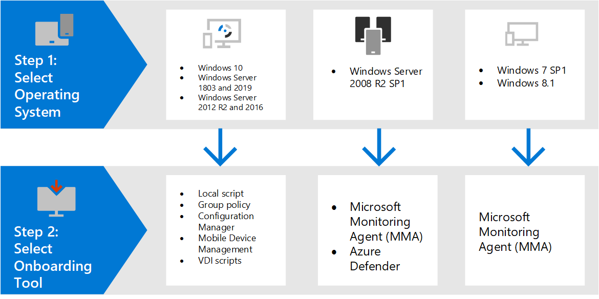

# Onboarding tools and methods for Windows devices

[!INCLUDE [Microsoft 365 Defender rebranding](../../includes/microsoft-defender.md)]

**Applies to:**
- [Microsoft Defender for Endpoint](https://go.microsoft.com/fwlink/p/?linkid=2154037)
- [Microsoft 365 Defender](https://go.microsoft.com/fwlink/?linkid=2118804)
- [Microsoft 365 Endpoint data loss prevention (DLP)](/microsoft-365/compliance/endpoint-dlp-learn-about)
- [Microsoft 365 Insider risk management](/microsoft-365/compliance/insider-risk-management)

>Want to experience Defender for Endpoint? [Sign up for a free trial.](https://www.microsoft.com/microsoft-365/windows/microsoft-defender-atp?ocid=docs-wdatp-assignaccess-abovefoldlink)

Devices in your organization must be configured so that the Defender for Endpoint service can get sensor data from them. There are various methods and deployment tools that you can use to configure the devices in your organization.

In general, you'll identify the Windows device you're onboarding, then follow the corresponding tool appropriate to the device or your environment.

## Endpoint onboarding tools
Depending on the Windows endpoint you want to onboard, use the corresponding tool or method described in the following table.

Windows device | Onboarding tool or method
:---|:---
Windows 7 SP1      Windows 7 SP1 Pro      Windows 8.1 Pro      Windows 8.1 Enterprise | [Microsoft Monitoring Agent (MMA)](onboard-downlevel.md)
Windows Server 2008 R2 SP1 | [Microsoft Monitoring Agent (MMA)](onboard-server-2008r2.md#option-1-onboard-by-installing-and-configuring-microsoft-monitoring-agent-mma) or [Azure Security Center](onboard-server-2008r2.md#option-2-onboard-windows-servers-through-azure-security-center)
Windows 10      Windows Server 1803 and 2019      Windows Server 2012 R2 and 2016      |  [Local script (up to 10 devices)](configure-endpoints-script.md)      [Group Policy](configure-endpoints-gp.md)    [Microsoft Endpoint Configuration Manager](configure-endpoints-sccm.md)       [Microsoft Endpoint Manager/ Mobile Device Manager](configure-endpoints-mdm.md)       [VDI scripts](configure-endpoints-vdi.md) 

