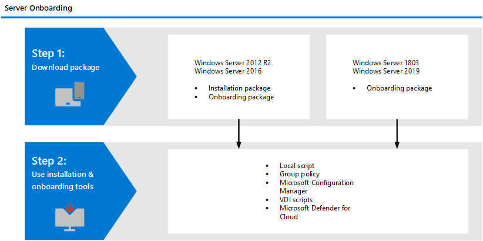

# Onboard Windows servers to the Microsoft Defender for Endpoint service

[!INCLUDE [Microsoft 365 Defender rebranding](../../includes/microsoft-defender.md)]

**Applies to:**

- Windows Server 2012 R2
- Windows Server 2016
- Windows Server Semi-Annual Channel
- Windows Server 2019 and later
- Windows Server 2019 core edition

> Want to experience Defender for Endpoint? [Sign up for a free trial.](https://www.microsoft.com/microsoft-365/windows/microsoft-defender-atp?ocid=docs-wdatp-configserver-abovefoldlink)


This topic describes how to onboard specific Windows Servers to Microsoft Defender for Endpoint. 

Defender for Endpoint extends support to also include the Windows Server operating system. This support provides advanced attack detection and investigation capabilities seamlessly through the Microsoft Defender Security Center console. Support for Windows Server provides deeper insight into server activities, coverage for kernel and memory attack detection, and enables response actions.


For a practical guidance on what needs to be in place for licensing and infrastructure, see [Protecting Windows Servers with Defender for Endpoint](https://techcommunity.microsoft.com/t5/What-s-New/Protecting-Windows-Server-with-Windows-Defender-ATP/m-p/267114#M128).

For guidance on how to download and use Windows Security Baselines for Windows servers, see [Windows Security Baselines](/windows/device-security/windows-security-baselines).

## Windows Server onboarding overview

You'll need to complete the following genaral steps to succesfully onboard servers.




**Windows Server 2012 R2 and Windows Server 2016**
- Download installation and onboarding packages
- Install application
- Follow the onboarding steps for the corresponding tool

**Windows Server Semi-Annual Channel**

- Download the onboarding package
- Follow the onboarding steps for the corresponding tool


### Previous onboarding implementation
Earlier implementation of onboarding Windows Server 2012 R2 and Windows Server 2016 required the use of Microsoft Monitoring Agent (MMA). The updated guidance makes it easier to onboard servers. 

If you onboarded your servers using MMA, follow the guidance provided in [Server migration](server-migration.md) to migrate to the new solution.


## Integration with Azure Defender
Microsoft Defender for Endpoint integrates seamlessly with Azure Defender. You can onboard servers automatically, have servers monitored by Azure Defender appear in Defender for Endpoint, and conduct detailed investigations as an Azure Defender customer. 

For more information, see [Integration with Azure Defender](azure-server-integration.md).

## Windows Server 2012 R2 and Windows Server 2016

### Prerequisites

**Prerequisites for Windows Server 2012 R2** 

Verify that you have installed the following hotfix:

- [Update for customer experience and diagnostic telemetry](https://support.microsoft.com/help/3080149/update-for-customer-experience-and-diagnostic-telemetry)
- [Update for Universal C Runtime in Windows](https://support.microsoft.com/topic/update-for-universal-c-runtime-in-windows-c0514201-7fe6-95a3-b0a5-287930f3560c)

**Prerequisites for Windows Server 2016** 

Verify that Microsoft Defender Antivirus is installed and is active.

### Download installation and onboarding packages 

1. In Microsoft Defender Security Center, go to **Settings > Device Management > Onboarding**.
2. Select **Windows Server 2012 R2 and 2016**.
3. Select **Download installation package** and save the .msi file. You can run the msi package through the installation wizard, or follow the command line steps in [Install Microsoft Defender Antivirus using command line](#install-microsoft-defender-antivirus-using-command-line).
          
    >[!NOTE]
    >Microsoft Defender Antivirus will get installed and will be active unless you set it to passive mode. 
 
4. Select **Download onboarding package** and save the .zip file.
5. Install the installation package using any of the [Options to install Microsoft Defender Antivirus]()
6. Follow the steps provided in the [onboarding steps](#onboarding-steps) section.

## Options to install Microsoft Defender Antivirus
In the previous section, you downloaded an installation package. The installation package contains the installer for Microsoft Defender Antivirus. 


### Install Microsoft Defender Antivirus using command line
Use the installation package from the previous step to install Microsoft Defender Antivirus. 

Run the following command to install Microsoft Defender Antivirus:

```
Msiexec /i md4ws.msi /quiet FORCEPASSIVEMODE=1
```

The `/quiet` command suppresses all notifications, while `FORCEPASSIVEMODE=1` immediately sets Microsoft Defender Antivirus to Passive mode.

>[!NOTE]
>Microsoft Defender Antivirus doesn't automatically go into passive mode. You can choose to set Microsoft Defender Antivirus to run on passive mode if you are running a non-Microsoft antivirus/antimalware solution. <br><br>
>For more information, see [Need to set Microsoft Defender Antivirus to passive mode?](microsoft-defender-antivirus-on-windows-server.md#need-to-set-microsoft-defender-antivirus-to-passive-mode).


## Windows Server Semi-Annual Channel and Windows Server 2019

The onboarding package for Windows Server 2019 through Microsoft Endpoint Manager currently ships a script. For more information on how to deploy scripts in Configuration Manager, see [Packages and programs in Configuration Manager](/configmgr/apps/deploy-use/packages-and-programs).


### Download package
1. In Microsoft Defender Security Center, go to **Settings > Device Management > Onboarding**.
2. Select **Windows Server 1803 and 2019**.
3. Select **Download package**. Save it as WindowsDefenderATPOnboardingPackage.zip.
4. Follow the steps provided in the [onboarding steps](#onboarding-steps) section. 


## Onboarding steps

1. Now that you have downloaded the required onboarding packages use the guidance listed in [onboarding tools and methods](configure-endpoints.md#endpoint-onboarding-tools) for your server.

2. (Only applicable if you're using a third-party anti-malware solution). You'll need to apply the following Microsoft Defender AV passive mode settings. Verify that it was configured correctly:

    1. Set the following registry entry:
       - Path: `HKLM\SOFTWARE\Policies\Microsoft\Windows Advanced Threat Protection`
       - Name: ForceDefenderPassiveMode
       - Type: REG_DWORD
       - Value: 1

    1. Run the following PowerShell command to verify that the passive mode was configured:

       ```PowerShell
       Get-WinEvent -FilterHashtable @{ProviderName="Microsoft-Windows-Sense" ;ID=84}
       ```

    1. Confirm  that a recent event containing the passive mode event is found:

       


## Verify the onboarding and installation

Verify that Microsoft Defender AV and Microsoft Defender for Endpoint are running. 


> [!NOTE]
> Running Microsoft Defender AV is not required but it is recommended. If another antivirus vendor product is the primary endpoint protection solution, you can run Defender Antivirus in Passive mode. You can only confirm that passive mode is on after verifying that Microsoft Defender for Endpoint sensor (SENSE) is running. 

1. Run the following command to verify that Microsoft Defender AV is installed:

    >[!NOTE]
    >This verifcation step is only required if you're using Microsoft Defender AV as your active antimalware solution. 

   ```sc.exe query Windefend```

    If the result is 'The specified service doesn't exist as an installed service', then you'll need to install Microsoft Defender AV. For more information, see [Microsoft Defender Antivirus on Windows Server](microsoft-defender-antivirus-on-windows-server.md).

    For information on how to use Group Policy to configure and manage Microsoft Defender Antivirus on your Windows servers, see [Use Group Policy settings to configure and manage Microsoft Defender Antivirus](use-group-policy-microsoft-defender-antivirus.md).


2. Run the following command to verify that Microsoft Defender for Endpoint is running:

    ```sc.exe query sense```
    
    The result should show it is running. If you encounter issues with onboarding, see [Troubleshoot onboarding](troubleshoot-onboarding.md).

## Run a detection test
Follow the steps in [Run a detection test on a newly onboarded device](run-detection-test.md) to verify that the server is reporting to Defender for the Endpoint service.

## Offboard Windows servers

You can offboard servers in the same method available for other Windows devices. Following the offboarding steps provided within the guidance on each of the management tools. 

## Next steps
After successfully onboarding devices to the service, you'll need to configure the individual components of Microsoft Defender for Endpoint. Follow the [Adoption order](prepare-deployment.md#adoption-order) to be guided on enabling the various components.

## Related topics
- [Onboard Windows Server 2008 R2 SP1](onboard-server-2008r2.md)
- [Onboard Windows 10 devices](configure-endpoints.md)
- [Onboard non-Windows devices](configure-endpoints-non-windows.md)
- [Configure proxy and Internet connectivity settings](configure-proxy-internet.md)
- [Run a detection test on a newly onboarded Defender for Endpoint device](run-detection-test.md)
- [Troubleshooting Microsoft Defender for Endpoint onboarding issues](troubleshoot-onboarding.md)
