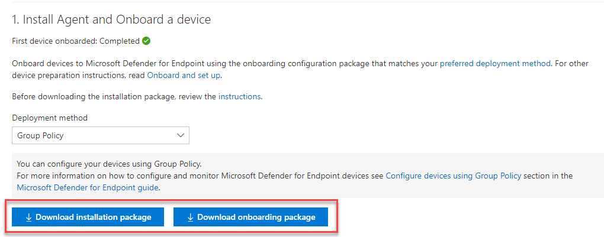

# Onboard Windows servers to the Microsoft Defender for Endpoint service

[!INCLUDE [Microsoft 365 Defender rebranding](../../includes/microsoft-defender.md)]

**Applies to:**

- Windows Server 2012 R2
- Windows Server 2016
- Windows Server Semi-Annual Enterprise Channel
- Windows Server 2019 and later
- Windows Server 2019 core edition
- Windows Server 2022
- [Microsoft Defender for Endpoint](https://go.microsoft.com/fwlink/p/?linkid=2154037)

> Want to experience Defender for Endpoint? [Sign up for a free trial.](https://signup.microsoft.com/create-account/signup?products=7f379fee-c4f9-4278-b0a1-e4c8c2fcdf7e&ru=https://aka.ms/MDEp2OpenTrial?ocid=docs-wdatp-configserver-abovefoldlink)

Defender for Endpoint extends support to also include the Windows Server operating system. This support provides advanced attack detection and investigation capabilities seamlessly through the Microsoft 365 Defender console. Support for Windows Server provides deeper insight into server activities, coverage for kernel and memory attack detection, and enables response actions.

This article describes how to onboard specific Windows servers to Microsoft Defender for Endpoint.

For guidance on how to download and use Windows Security Baselines for Windows servers, see [Windows Security Baselines](/windows/device-security/windows-security-baselines).

## Windows Server onboarding overview

You'll need to complete the following general steps to successfully onboard servers.

:::image type="content" source="images/server-onboarding-tools-methods.png" alt-text="An illustration of onboarding flow for Windows Servers and Windows 10 devices" lightbox="images/server-onboarding-tools-methods.png":::

> [!NOTE]
> Windows Hyper-V Server editions are not supported.

**Integration with Microsoft Defender for Servers**:

Microsoft Defender for Endpoint integrates seamlessly with Microsoft Defender for Servers. You can onboard servers automatically, have servers monitored by Microsoft Defender for Cloud appear in Defender for Endpoint, and conduct detailed investigations as a Microsoft Defender for Cloud customer. For more information please go to [Protect your endpoints with Defender for Cloud's integrated EDR solution: Microsoft Defender for Endpoint](/azure/defender-for-cloud/integration-defender-for-endpoint?tabs=windows)

> [!NOTE]
> For Windows Server 2012 R2 and 2016, you can either manually install/upgrade the modern, unified solution on these machines, or use the integration to automatically deploy or upgrade servers covered by your respective Microsoft Defender for Server plan. More information about making the switch at [Protect your endpoints with Defender for Cloud's integrated EDR solution: Microsoft Defender for Endpoint](/azure/defender-for-cloud/integration-defender-for-endpoint?tabs=windows#enable-the-integration).
> - When you use Microsoft Defender for Cloud to monitor servers, a Defender for Endpoint tenant is automatically created (in the US for US users, in the EU for European users, and in the UK for UK users).
Data collected by Defender for Endpoint is stored in the geo-location of the tenant as identified during provisioning.
> - If you use Defender for Endpoint before using Microsoft Defender for Cloud, your data will be stored in the location you specified when you created your tenant even if you integrate with Microsoft Defender for Cloud at a later time.
> - Once configured, you cannot change the location where your data is stored. If you need to move your data to another location, you need to contact Microsoft Support to reset the tenant.
> - Server endpoint monitoring utilizing this integration has been disabled for Office 365 GCC customers.
> - Previously, the use of the Microsoft Monitoring Agent (MMA) on Windows Server 2016 and previous versions of Windows Server allowed for the OMS / Log Analytics gateway to provide connectivity to Defender cloud services. The new solution, like Microsoft Defender for Endpoint on Windows Server 2019, Windows Server 2022, and Windows 10, doesn't support this gateway.
> - Linux servers onboarded through Microsoft Defender for Cloud will have their initial configuration set to run Defender Antivirus in [passive mode](/defender-endpoint/microsoft-defender-antivirus-compatibility#microsoft-defender-antivirus-and-non-microsoft-antivirusantimalware-solutions).

**Windows Server 2012 R2 and Windows Server 2016**:

- Download installation and onboarding packages
- Apply the installation package
- Follow the onboarding steps for the corresponding tool

**Windows Server Semi-Annual Enterprise Channel and Windows Server 2019**:

- Download the onboarding package
- Follow the onboarding steps for the corresponding tool

## Windows Server 2012 R2 and Windows Server 2016

### New Windows Server 2012 R2 and 2016 functionality in the modern unified solution

The previous implementation (before April of 2022) of onboarding Windows Server 2012 R2 and Windows Server 2016 required the use of Microsoft Monitoring Agent (MMA).

The new unified solution package makes it easier to onboard servers by removing dependencies and installation steps. It also provides a much expanded feature set. For more information, please refer to [Defending Windows Server 2012 R2 and 2016](https://techcommunity.microsoft.com/t5/microsoft-defender-for-endpoint/defending-windows-server-2012-r2-and-2016/ba-p/2783292).

Depending on the server that you're onboarding, the unified solution installs Microsoft Defender Antivirus and/or the EDR sensor. The following table indicates what component is installed and what is built in by default.

|Server version|AV|EDR|
|----|----|----|
|Windows Server 2012 R2|||
|Windows Server 2016|Built-in||
|Windows Server 2019 or later|Built-in|Built-in|

If you've previously onboarded your servers using MMA, follow the guidance provided in [Server migration](server-migration.md) to migrate to the new solution.

> [!IMPORTANT]
> Before proceeding with onboarding, see the section [Known issues and limitations in the new, unified solution package for Windows Server 2012 R2 and 2016](#known-issues-and-limitations-in-the-new-unified-solution-package-for-windows-server-2012-r2-and-2016).

### Prerequisites

#### Prerequisites for Windows Server 2012 R2

If you've fully updated your machines with the latest [monthly rollup](https://support.microsoft.com/topic/windows-8-1-and-windows-server-2012-r2-update-history-47d81dd2-6804-b6ae-4112-20089467c7a6) package, there are **no** other prerequisites and the below requirements will already be filled.

The installer package will check if the following components have already been installed via an update to assess if minimum requirements have been met for a successful installation:

- [Update for customer experience and diagnostic telemetry](https://support.microsoft.com/help/3080149/update-for-customer-experience-and-diagnostic-telemetry)
- [Update for Universal C Runtime in Windows](https://support.microsoft.com/topic/update-for-universal-c-runtime-in-windows-c0514201-7fe6-95a3-b0a5-287930f3560c)
- [Security Update for Windows Server 2012 R2 (KB3045999)](https://support.microsoft.com/topic/ms15-038-description-of-the-security-update-for-windows-april-14-2015-99265f07-6926-d6d2-5203-3b32b214a9c3)

#### Prerequisites for Windows Server 2016

It's recommended to install the latest available SSU and LCU on the server.

- The Servicing Stack Update (SSU) from September 14, 2021 or later must be installed.
- The Latest Cumulative Update (LCU) from September 20, 2018 or later must be installed.  
- Enable the Microsoft Defender Antivirus feature and ensure it's up to date. For more information on enabling Defender Antivirus on Windows Server, see [Re-enable Defender Antivirus on Windows Server if it was disabled](enable-update-mdav-to-latest-ws.md#re-enable-microsoft-defender-antivirus-on-windows-server-if-it-was-disabled) and [Re-enable Defender Antivirus on Windows Server if it was uninstalled](enable-update-mdav-to-latest-ws.md#re-enable-microsoft-defender-antivirus-on-windows-server-if-it-was-uninstalled).
- Download and install the latest platform version using Windows Update. Alternatively, download the update package manually from the [Microsoft Update Catalog](https://www.catalog.update.microsoft.com/Search.aspx?q=KB4052623) or from [MMPC](https://go.microsoft.com/fwlink/?linkid=870379&arch=x64).

#### Prerequisites for running with third-party security solutions

If you intend to use a third-party anti-malware solution, you'll need to run Microsoft Defender Antivirus in passive mode. You must remember to set to passive mode during the installation and onboarding process.

> [!NOTE]
> If you're installing Microsoft Defender for Endpoint on Servers with McAfee Endpoint Security (ENS) or VirusScan Enterprise (VSE), the version of the McAfee platform may need to be updated to ensure Microsoft Defender Antivirus is not removed or disabled. For more information including the specific version numbers required, see, [McAfee Knowledge Center article](https://kcm.trellix.com/corporate/index?page=content&id=KB88214).

#### Update packages for Microsoft Defender for Endpoint on Windows Server 2012 R2 and 2016

To receive regular product improvements and fixes for the EDR Sensor component, ensure Windows Update [KB5005292](https://go.microsoft.com/fwlink/?linkid=2168277) gets applied or approved. In addition, to keep protection components updated, see [Manage Microsoft Defender Antivirus updates and apply baselines](/microsoft-365/security/defender-endpoint/manage-updates-baselines-microsoft-defender-antivirus#monthly-platform-and-engine-versions).

If you're using Windows Server Update Services (WSUS) and/or Microsoft Endpoint Configuration Manager, this new "Microsoft Defender for Endpoint update for EDR Sensor" is available under the category "Microsoft Defender for Endpoint".

### Onboarding steps summary

- STEP 1: [Download the installation and onboarding packages](#step-1-download-installation-and-onboarding-packages)
- STEP 2: [Apply the installation and onboarding package](#step-2-apply-the-installation-and-onboarding-package)
- STEP 3: [Complete the onboarding steps](#step-3-complete-the-onboarding-steps)

### STEP 1: Download installation and onboarding packages

You'll need to download both the **installation** and **onboarding** packages from the portal.

> [!NOTE]
> The installation package is updated monthly. Be sure to download the latest package before usage.
> To update after installation, you do not have to run the installer package again. If you do, the installer will ask you to offboard first as that is a requirement for uninstallation. See [Update packages for Microsoft Defender for Endpoint on Windows Server 2012 R2 and 2016](#update-packages-for-microsoft-defender-for-endpoint-on-windows-server-2012-r2-and-2016).

> [!div class="mx-imgBorder"]
> 

   > [!NOTE]
   > On Windows Server 2012R2, Microsoft Defender Antivirus will get installed by the installation package and will be active unless you set it to passive mode. On Windows Server 2016, Microsoft Defender Antivirus must be installed as a feature (see [Switch to MDE](/microsoft-365/security/defender-endpoint/switch-to-mde-phase-2#re-enable-microsoft-defender-antivirus-on-windows-server-2016)) first and fully updated before proceeding with the installation.
   >
   > If you are running a non-Microsoft anti-malware solution ensure you add exclusions for Microsoft Defender Antivirus ([from this list of Microsoft Defender Processes on the Defender Processes tab](https://download.microsoft.com/download/6/b/f/6bfff670-47c3-4e45-b01b-64a2610eaefa/mde-urls-commercial.xlsx)) to the non-Microsoft solution before installation.  It is also recommended to add non-Microsoft security solutions to the Defender Antivirus exclusion list.

The **installation package** contains an MSI file that installs the Microsoft Defender for Endpoint agent.

The **onboarding package** contains the following files:

- `OptionalParamsPolicy` - contains the setting that enables sample collection
- `WindowsDefenderATPOnboardingScript.cmd` - contains the onboarding script

Follow these steps to download the packages:

1. In Microsoft 365 Defender, go to **Settings > Endpoint > Onboarding**.

2. Select **Windows Server 2012 R2 and 2016**.

3. Select **Download installation package** and save the .msi file.

4. Select **Download onboarding package** and save the .zip file.

5. Install the installation package using any of the options to install Microsoft Defender Antivirus. The installation requires administrative permissions.

> [!IMPORTANT]
>
> - A local onboarding script is suitable for a proof of concept but should not be used for production deployment. For a production deployment, we recommend using Group Policy, or Microsoft Endpoint Configuration Manager.

### STEP 2: Apply the installation and onboarding package

In this step, you'll install the prevention and detection components required before onboarding your device to the Microsoft Defender for Endpoint cloud environment, to prepare the machine for onboarding. Ensure all [prerequisites](#prerequisites) have been met.

   > [!NOTE]
   > Microsoft Defender Antivirus will get installed and will be active unless you set it to passive mode.

#### Options to install the Microsoft Defender for Endpoint packages

In the previous section, you downloaded an installation package. The installation package contains the installer for all Microsoft Defender for Endpoint components.

You can use any of the following options to install the agent:

- [Install using the command line](#install-microsoft-defender-for-endpoint-using-the-command-line)
- [Install using a script](#install-microsoft-defender-for-endpoint-using-a-script)
- [Apply the installation and onboarding packages using Group Policy](#apply-the-microsoft-defender-for-endpoint-installation-and-onboarding-packages-using-group-policy)

##### Install Microsoft Defender For Endpoint using the command line

Use the installation package from the previous step to install Microsoft Defender for Endpoint.

Run the following command to install Microsoft Defender for Endpoint:

```console
Msiexec /i md4ws.msi /quiet
```

To uninstall, ensure the machine is offboarded first using the appropriate offboarding script. Then, use Control Panel \> Programs \> Programs and Features to perform the uninstall.

Alternatively, run the following uninstall command to uninstall Microsoft Defender for Endpoint:

```console
Msiexec /x md4ws.msi /quiet
```

You must use the same package you used for installation for the above command to succeed.

The `/quiet` switch suppresses all notifications.

> [!NOTE]
> Microsoft Defender Antivirus doesn't automatically go into passive mode. You can choose to set Microsoft Defender Antivirus to run in passive mode if you are running a non-Microsoft antivirus/antimalware solution. For command line installations, the optional `FORCEPASSIVEMODE=1` immediately sets the Microsoft Defender Antivirus component to Passive mode to avoid interference. Then, to ensure Defender Antivirus remains in passive mode after onboarding to support capabilities like EDR Block, set the "ForceDefenderPassiveMode" registry key.

Support for Windows Server provides deeper insight into server activities, coverage for kernel and memory attack detection, and enables response actions.

##### Install Microsoft Defender for Endpoint using a script

You can use the [installer helper script](server-migration.md#installer-script) to help automate installation, uninstallation, and onboarding.

> [!NOTE]
> The installation script is signed. Any modifications to the script will invalidate the signature. When you download the script from GitHub, the recommended approach to avoid inadvertent modification is to download the source files as a zip archive then extract it to obtain the install.ps1 file (on the main Code page, click the Code dropdown menu and select "Download ZIP").

This script can be used in various scenarios, including those scenarios described in [Server migration scenarios from the previous, MMA-based Microsoft Defender for Endpoint solution](/microsoft-365/security/defender-endpoint/server-migration) and for deployment using Group Policy as described below.

##### Apply the Microsoft Defender for Endpoint installation and onboarding packages using Group policy

1. Create a group policy: <br> Open the [Group Policy Management Console](/internet-explorer/ie11-deploy-guide/group-policy-and-group-policy-mgmt-console-ie11) (GPMC), right-click **Group Policy Objects** you want to configure and select **New**. Enter the name of the new GPO in the dialogue box that is displayed and select **OK**.

2. Open the [Group Policy Management Console](/internet-explorer/ie11-deploy-guide/group-policy-and-group-policy-mgmt-console-ie11) (GPMC), right-click the Group Policy Object (GPO) you want to configure and select **Edit**.

3. In the **Group Policy Management Editor**, go to **Computer configuration**, then **Preferences**, and then **Control panel settings**.

4. Right-click **Scheduled tasks**, point to **New**, and then click **Immediate Task (At least Windows 7)**.

5. In the **Task** window that opens, go to the **General** tab. Under **Security options** select **Change User or Group** and type SYSTEM and then select **Check Names** then **OK**. NT AUTHORITY\SYSTEM appears as the user account the task will run as.

6. Select **Run whether user is logged on or not** and check the **Run with highest privileges** check box.

7. In the Name field, type an appropriate name for the scheduled task (for example, Defender for Endpoint Deployment).

8. Go to the **Actions** tab and select **New...** Ensure that **Start a program** is selected in the **Action** field. The [installer script](server-migration.md#installer-script) handles the installation, and immediately perform the onboarding step after installation completes. Select *C:\Windows\System32\WindowsPowerShell\v1.0\powershell.exe* then provide the arguments:

    ```console
     -ExecutionPolicy RemoteSigned \\servername-or-dfs-space\share-name\install.ps1 -OnboardingScript \\servername-or-dfs-space\share-name\windowsdefenderatponboardingscript.cmd
    ```

    > [!NOTE]
    > The recommended execution policy setting is `Allsigned`. This requires importing the script's signing certificate into the Local Computer Trusted Publishers store if the script is running as SYSTEM on the endpoint.

    Replace \\\servername-or-dfs-space\share-name with the UNC path, using the file server's fully qualified domain name (FQDN), of the shared *install.ps1* file. The installer package md4ws.msi must be placed in the same directory. Ensure that the permissions of the UNC path allow write access to the computer account that is installing the package, to support creation of log files. If you wish to disable the creation of log files (not recommended), you can use the -noETL -noMSILog parameters.

    For scenarios where you want Microsoft Defender Antivirus to co-exist with non-Microsoft antimalware solutions, add the $Passive parameter to set passive mode during installation.

9. Select **OK** and close any open GPMC windows.

10. To link the GPO to an Organization Unit (OU), right-click and select **Link an existing GPO**. In the dialogue box that is displayed, select the Group Policy Object that you wish to link. Select **OK**.

For more configuration settings, see [Configure sample collection settings](configure-endpoints-gp.md#configure-sample-collection-settings) and [Other recommended configuration settings](configure-endpoints-gp.md#other-recommended-configuration-settings).

### STEP 3: Complete the onboarding steps

The following steps are only applicable if you're using a third-party anti-malware solution. You'll need to apply the following Microsoft Defender Antivirus passive mode setting. Verify that it was configured correctly:

1. Set the following registry entry:
    - Path: `HKLM\SOFTWARE\Policies\Microsoft\Windows Advanced Threat Protection`
    - Name: `ForceDefenderPassiveMode`
    - Type: `REG_DWORD`
    - Value: `1`

   :::image type="content" source="images/atp-verify-passive-mode.png" alt-text="The passive mode verification result" lightbox="images/atp-verify-passive-mode.png":::

#### Known issues and limitations in the new, unified solution package for Windows Server 2012 R2 and 2016

> [!IMPORTANT]
>
> Always download the latest installer package from the Microsoft 365 Defender portal ([https://security.microsoft.com](https://security.microsoft.com)) before performing a new installation and ensure prerequisites have been met. After installation, ensure to regularly update using component updates described in the section [Update packages for Microsoft Defender for Endpoint on Windows Server 2012 R2 and 2016](#update-packages-for-microsoft-defender-for-endpoint-on-windows-server-2012-r2-and-2016).

- An operating system update can introduce an installation issue on machines with slower disks due to a timeout with service installation. Installation fails with the message "Could not find c:\program files\windows defender\mpasdesc.dll, - 310 WinDefend". Use the latest installation package, and the latest [install.ps1](https://github.com/microsoft/mdefordownlevelserver) script to help clear the failed installation if necessary.
- We've identified an issue with Windows Server 2012 R2 connectivity to cloud when static TelemetryProxyServer is used **and** the certificate revocation list (CRL) URLs aren't reachable from the SYSTEM account context. Ensure the EDR sensor is updated to version 10.8210.* or later (using [KB5005292](https://support.microsoft.com/topic/microsoft-defender-for-endpoint-update-for-edr-sensor-f8f69773-f17f-420f-91f4-a8e5167284ac)) to resolve the issue. Alternatively, use a different proxy option ("system-wide") that provides such connectivity, or configure the same proxy via the WinInet setting on the SYSTEM account context.
- On Windows Server 2012 R2, there's no user interface for Microsoft Defender Antivirus. In addition, the user interface on Windows Server 2016 only allows for basic operations. To perform operations on a device locally, refer to [Manage Microsoft Defender for Endpoint with PowerShell, WMI, and MPCmdRun.exe](/microsoft-365/security/defender-endpoint/manage-mde-post-migration-other-tools). As a result, features that specifically rely on user interaction, such as where the user is prompted to make a decision or perform a specific task, may not work as expected. It's recommended to disable or not enable the user interface nor require user interaction on any managed server as it may impact protection capability.
- Not all Attack Surface Reduction rules are applicable to all operating systems. See [Attack Surface Reduction (ASR) rules](/microsoft-365/security/defender-endpoint/attack-surface-reduction-rules).
- Operating system upgrades aren't supported. Offboard then uninstall before upgrading. The installer package can only be used to upgrade installations that have not yet been updated with new antimalware platform or EDR sensor update packages.
- Automatic exclusions for **server roles** aren't supported on Windows Server 2012 R2; however, built-in exclusions for operating system files are. For more information about adding exclusions, see [Configure Microsoft Defender Antivirus exclusions on Windows Server](configure-server-exclusions-microsoft-defender-antivirus.md).
- To automatically deploy and onboard the new solution using Microsoft Endpoint Configuration Manager (MECM) you need to be on [version 2207 or later](/mem/configmgr/core/plan-design/changes/whats-new-in-version-2207#improved-microsoft-defender-for-endpoint-mde-onboarding-for-windows-server-2012-r2-and-windows-server-2016). You can still configure and deploy using version 2107 with the hotfix rollup, but this requires additional deployment steps. See [Microsoft Endpoint Configuration Manager migration scenarios](/microsoft-365/security/defender-endpoint/server-migration#microsoft-endpoint-configuration-manager-migration-scenarios) for more information.

## Windows Server Semi-Annual Enterprise Channel (SAC), Windows Server 2019 and Windows Server 2022

### Download package

1. In Microsoft 365 Defender, go to **Settings > Endpoints > Device Management > Onboarding**.

2. Select **Windows Server 1803 and 2019**.

3. Select **Download package**. Save it as WindowsDefenderATPOnboardingPackage.zip.

4. Follow the steps provided in the [Complete the onboarding steps](#step-3-complete-the-onboarding-steps) section.

## Verify the onboarding and installation

Verify that Microsoft Defender Antivirus and Microsoft Defender for Endpoint are running.

## Run a detection test to verify onboarding

After onboarding the device, you can choose to run a detection test to verify that a device is properly onboarded to the service. For more information, see [Run a detection test on a newly onboarded Microsoft Defender for Endpoint device](run-detection-test.md).

> [!NOTE]
> Running Microsoft Defender Antivirus is not required but it is recommended. If another antivirus vendor product is the primary endpoint protection solution, you can run Defender Antivirus in Passive mode. You can only confirm that passive mode is on after verifying that Microsoft Defender for Endpoint sensor (SENSE) is running.

1. Run the following command to verify that Microsoft Defender Antivirus is installed:

    > [!NOTE]
    > This verification step is only required if you're using Microsoft Defender Antivirus as your active antimalware solution.

    ```DOS
    sc.exe query Windefend
    ```

    If the result is 'The specified service doesn't exist as an installed service', then you'll need to install Microsoft Defender Antivirus.

    For information on how to use Group Policy to configure and manage Microsoft Defender Antivirus on your Windows servers, see [Use Group Policy settings to configure and manage Microsoft Defender Antivirus](use-group-policy-microsoft-defender-antivirus.md).

2. Run the following command to verify that Microsoft Defender for Endpoint is running:

    ```DOS
    sc.exe query sense
    ```

    The result should show it's running. If you encounter issues with onboarding, see [Troubleshoot onboarding](troubleshoot-onboarding.md).

## Run a detection test

Follow the steps in [Run a detection test on a newly onboarded device](run-detection-test.md) to verify that the server is reporting to Defender for the Endpoint service.

## Next steps

After successfully onboarding devices to the service, you'll need to configure the individual components of Microsoft Defender for Endpoint. Follow [Configure capabilities](onboard-configure.md#configure-capabilities) to be guided on enabling the various components.

## Offboard Windows servers

You can offboard Windows Server 2012 R2, Windows Server 2016, Windows Server (SAC), Windows Server 2019, and Windows Server 2019 Core edition in the same method available for Windows 10 client devices.

- [Offboard devices using Group Policy](configure-endpoints-gp.md#offboard-devices-using-group-policy)
- [Offboard devices using Configuration Manager](configure-endpoints-sccm.md#offboard-devices-using-configuration-manager)
- [Offboard devices using Mobile Device Management tools](configure-endpoints-mdm.md#offboard-devices-using-mobile-device-management-tools)
- [Offboard devices using a local script](configure-endpoints-script.md#offboard-devices-using-a-local-script)

After offboarding, you can proceed to uninstall the unified solution package on Windows Server 2012 R2 and Windows Server 2016.

For other Windows server versions, you have two options to offboard Windows servers from the service:

- Uninstall the MMA agent
- Remove the Defender for Endpoint workspace configuration

> [!NOTE]
> These offboarding instructions for other Windows server versions also apply if you are running the previous Microsoft Defender for Endpoint for Windows Server 2016 and Windows Server 2012 R2 that requires the MMA. Instructions to migrate to the new unified solution are at [Server migration scenarios in Microsoft Defender for Endpoint](/microsoft-365/security/defender-endpoint/server-migration).

## Related articles

- [Onboard previous versions of Windows](onboard-downlevel.md)
- [Onboard Windows 10 devices](configure-endpoints.md)
- [Onboard non-Windows devices](configure-endpoints-non-windows.md)
- [Configure proxy and Internet connectivity settings](configure-proxy-internet.md)
- [Run a detection test on a newly onboarded Defender for Endpoint device](run-detection-test.md)
- [Troubleshooting Microsoft Defender for Endpoint onboarding issues](troubleshoot-onboarding.md)
- [Azure Active Directory Seamless single sign-on](/azure/active-directory/hybrid/how-to-connect-sso-quick-start)
- [Troubleshoot onboarding issues related to Security Management for Microsoft Defender for Endpoint](/microsoft-365/security/defender-endpoint/troubleshoot-security-config-mgt#instructions-for-applying-computer-join-rule-in-aad-connect)
[!INCLUDE [Microsoft Defender for Endpoint Tech Community](../../includes/defender-mde-techcommunity.md)]
