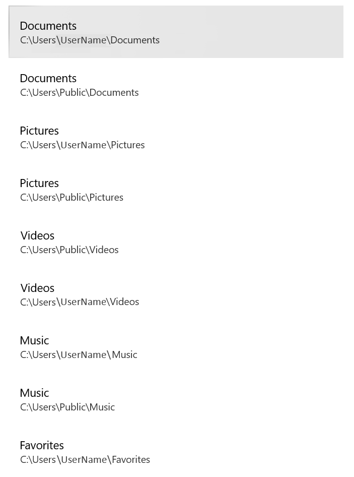

# Protect important folders with controlled folder access

[!INCLUDE [Microsoft 365 Defender rebranding](../../includes/microsoft-defender.md)]

**Applies to:**

- [Microsoft Defender for Endpoint Plan 1](https://go.microsoft.com/fwlink/p/?linkid=2154037)
- [Microsoft Defender for Endpoint Plan 2](https://go.microsoft.com/fwlink/p/?linkid=2154037)
- [Microsoft 365 Defender](https://go.microsoft.com/fwlink/?linkid=2118804)
- Microsoft Defender Antivirus

**Applies to**
- Windows


> Want to experience Defender for Endpoint? [Sign up for a free trial.](https://signup.microsoft.com/create-account/signup?products=7f379fee-c4f9-4278-b0a1-e4c8c2fcdf7e&ru=https://aka.ms/MDEp2OpenTrial?ocid=docs-wdatp-assignaccess-abovefoldlink)

## What is controlled folder access?

Controlled folder access helps protect your valuable data from malicious apps and threats, such as ransomware. Controlled folder access protects your data by checking apps against a list of known, trusted apps. Supported on Windows Server 2012 R2, Windows Server 2016, Windows Server 2019, Windows Server 2022, Windows 10, and Windows 11 clients, controlled folder access can be turned on using the Windows Security App, Microsoft Endpoint Configuration Manager, or Intune (for managed devices).

> [!NOTE]
> Scripting engines are not trusted and you cannot allow them access to controlled protected folders. For example, PowerShell is not trusted by controlled folder access, even if you allow with [certificate and file indicators](/microsoft-365/security/defender-endpoint/indicator-certificates).

Controlled folder access works best with [Microsoft Defender for Endpoint](microsoft-defender-endpoint.md), which gives you detailed reporting into controlled folder access events and blocks as part of the usual [alert investigation scenarios](investigate-alerts.md).

> [!TIP]
> Controlled folder access blocks don't generate alerts in the [Alerts queue](alerts-queue.md). However, you can view information about controlled folder access blocks in the [device timeline view](investigate-machines.md), while using [advanced hunting](advanced-hunting-overview.md), or with [custom detection rules](custom-detection-rules.md).

## How does controlled folder access work?

Controlled folder access works by only allowing trusted apps to access protected folders. Protected folders are specified when controlled folder access is configured. Typically, commonly used folders, such as those used for documents, pictures, downloads, and so on, are included in the list of controlled folders.

Controlled folder access works with a list of trusted apps. Apps that are included in the list of trusted software work as expected. Apps that are not included in the list are prevented from making any changes to files inside protected folders.

Apps are added to the list based upon their prevalence and reputation. Apps that are highly prevalent throughout your organization and that have never displayed any behavior deemed malicious are considered trustworthy. Those apps are added to the list automatically.

Apps can also be added manually to the trusted list by using Configuration Manager or Intune. Additional actions can be performed from the Microsoft 365 Defender portal.

## Why controlled folder access is important

Controlled folder access is especially useful in helping to protect your documents and information from [ransomware](https://www.microsoft.com/wdsi/threats/ransomware). In a ransomware attack, your files can get encrypted and held hostage. With controlled folder access in place, a notification appears on the computer where an app attempted to make changes to a file in a protected folder. You can [customize the notification](attack-surface-reduction-rules-deployment-implement.md#customize-attack-surface-reduction-rules) with your company details and contact information. You can also enable the rules individually to customize what techniques the feature monitors.

The [protected folders](#review-controlled-folder-access-events-in-windows-event-viewer) include common system folders (including boot sectors), and you can [add more folders](customize-controlled-folders.md#protect-additional-folders). You can also [allow apps](customize-controlled-folders.md#allow-specific-apps-to-make-changes-to-controlled-folders) to give them access to the protected folders.

You can use [audit mode](audit-windows-defender.md) to evaluate how controlled folder access would impact your organization if it were enabled.

Controlled folder access is supported on the following versions of Windows:

- [Windows 10, version 1709](/windows/whats-new/whats-new-windows-10-version-1709) and later
- Windows 11
- Windows 2012 R2
- Windows 2016
- [Windows Server 2019](/windows-server/get-started-19/whats-new-19)
- Windows Server 2022

## Windows system folders are protected by default

Windows system folders are protected by default, along with several other folders:

The protected folders include common system folders (including boot sectors), and you can add additional folders. You can also allow apps to give them access to the protected folders.  The Windows systems folders that are protected by default are:

- `c:\Users\<username>\Documents`
- `c:\Users\Public\Documents`
- `c:\Users\<username>\Pictures`
- `c:\Users\Public\Pictures`
- `c:\Users\Public\Videos`
- `c:\Users\<username>\Videos`
- `c:\Users\<username>\Music`
- `c:\Users\Public\Music`
- `c:\Users\<username>\Favorites`

Default folders appear in the user's profile, under **This PC**.
   > [!div class="mx-imgBorder"]
   > 

> [!NOTE]
> You can configure additional folders as protected, but you cannot remove the Windows system folders that are protected by default.

## Requirements for controlled folder access

Controlled folder access requires enabling [Microsoft Defender Antivirus real-time protection](configure-real-time-protection-microsoft-defender-antivirus.md).

## Review controlled folder access events in the Microsoft 365 Defender portal

Defender for Endpoint provides detailed reporting into events and blocks as part of its [alert investigation scenarios](investigate-alerts.md) in the Microsoft 365 Defender portal; see [Microsoft Defender for Endpoint in Microsoft 365 Defender](../defender/microsoft-365-security-center-mde.md).

You can query Microsoft Defender for Endpoint data by using [Advanced hunting](advanced-hunting-overview.md). If you're using [audit mode](audit-windows-defender.md), you can use [advanced hunting](advanced-hunting-overview.md) to see how controlled folder access settings would affect your environment if they were enabled.

Example query:

```PowerShell
DeviceEvents
| where ActionType in ('ControlledFolderAccessViolationAudited','ControlledFolderAccessViolationBlocked')
```

## Review controlled folder access events in Windows Event Viewer

You can review the Windows event log to see events that are created when controlled folder access blocks (or audits) an app:

1. Download the [Evaluation Package](https://aka.ms/mp7z2w) and extract the file *cfa-events.xml* to an easily accessible location on the device.
2. Type **Event viewer** in the Start menu to open the Windows Event Viewer.
3. On the left panel, under **Actions**, select **Import custom view...**.
4. Navigate to where you extracted *cfa-events.xml* and select it. Alternatively, [copy the XML directly](event-views.md).
5. Select **OK**.

The following table shows events related to controlled folder access:

<br/><br/>

|Event ID|Description|
|---|---|
|5007|Event when settings are changed|
|1124|Audited controlled folder access event|
|1123|Blocked controlled folder access event|

## View or change the list of protected folders

You can use the Windows Security app to view the list of folders that are protected by controlled folder access.

1. On your Windows 10 or Windows 11 device, open the Windows Security app.
2. Select **Virus & threat protection**.
3. Under **Ransomware protection**, select **Manage ransomware protection**.
4. If controlled folder access is turned off, you'll need to turn it on. Select **protected folders**.
5. Do one of the following steps:
   - To add a folder, select **+ Add a protected folder**.
   - To remove a folder, select it, and then select **Remove**.

> [!NOTE]
> [Windows system folders](#windows-system-folders-are-protected-by-default) are protected by default, and you cannot remove them from the list. Subfolders are also included in protection when you add a new folder to the list.
[!INCLUDE [Microsoft Defender for Endpoint Tech Community](../../includes/defender-mde-techcommunity.md)]
