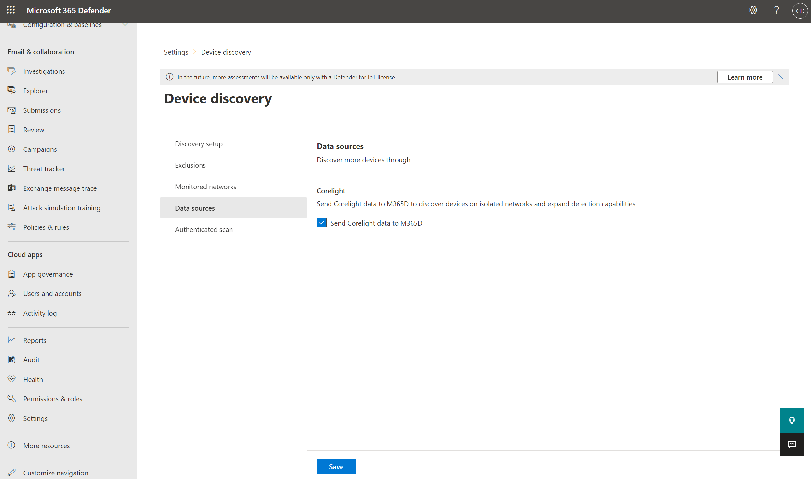
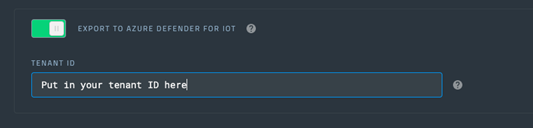
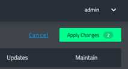

# Enable Corelight data integration

[!INCLUDE [Microsoft 365 Defender rebranding](../../includes/microsoft-defender.md)]

**Applies to:**

- [Microsoft Defender for Endpoint](https://go.microsoft.com/fwlink/?linkid=2154037)
- [Microsoft 365 Defender](https://go.microsoft.com/fwlink/?linkid=2118804)

[!include[Prerelease information](../../includes/prerelease.md)]

> Want to experience Microsoft Defender for Endpoint? [Sign up for a free trial.](https://signup.microsoft.com/create-account/signup?products=7f379fee-c4f9-4278-b0a1-e4c8c2fcdf7e&ru=https://aka.ms/MDEp2OpenTrial?ocid=docs-wdatp-enablesiem-abovefoldlink)

Microsoft has partnered with [Corelight](https://corelight.com/integrations/iot-security), provider of the industry’s leading open network detection and response (NDR) platform, to help you discover IoT/OT devices across your organization. Using data, sent from Corelight network appliances, Microsoft 365 Defender gains increased visibility into the network activities of unmanaged devices, including communication with other unmanaged devices or external networks.

With this data source enabled, all events from Corelight network appliances are sent to Microsoft 365 Defender. You can view these activities in the unmanaged devices timeline, available in the Microsoft Defender for Endpoint device inventory. For more information, see [Device discovery](device-discovery.md).

## Enabling the Corelight integration

To enable the Corelight integration, you’ll need to take the following steps:

1. [Step 1: Turn on Corelight as a data source](#turn-on-Corelight-as-a-data-source)
2. [Step 2: Provide permission for Corelight to send events to Microsoft 365 Defender](#provide-permission-for-corelight-to-send-events-to-microsoft-365-defender)
3. [Step 3: Configure your Corelight appliance to send data to Microsoft 365 Defender](#configure-your-corelight-appliance-to-send-data-to-microsoft-365-defender)

### Step 1: Turn on Corelight as a data source

1. In the navigation pane of the [https://security.microsoft.com](https://security.microsoft.com/) portal, select **Settings** \> **Device discovery** \> **Data sources**.

    

2. Select **Send Corelight data to M365D** and select **Save**.

### Step 2: Provide permission for Corelight to send events to Microsoft 365 Defender

You must be a global admin to grant Corelight permission to access resources in your organization. As a Tenant Global Administrator, go to:
<https://login.microsoftonline.com/common/oauth2/authorize?prompt=consent&client_id=d8be544e-9d1a-4825-a5cb-fb447457f692&response_type=code&sso_reload=true> to grant permission.

Next, go to [https://security.microsoft.com](https://security.microsoft.com/) portal, select **Settings** \> **Microsoft 365 Defender**, and take note of the **Tenant ID**. You'll need this information when configuring Corelight.

### Step 3: Configure your Corelight appliance to send data to Microsoft 365 Defender

**Applies to**: Corelight Sensor software v24.2 and later

> [!NOTE]
> To enable on a previous release that support sending data, you must first execute: `corelight-client configuration update --enable.adfiot 1`

1. In the Corelight Sensor GUI configuration section, select **Sensor** \> **Export**
2. Go to **Export to Kafka** in the list and enable it (switch should be green)

   

3. Next, go to the **Export to Azure Defender for IOT** section and enable it
4. Add your tenant ID, noted in Step 1 to the configuration field

> [!NOTE]
> Note the configuration options in Kafka (other than Log Exclusion and Filters) should not be changed. Any changes made will be ignored.

   
5. Select **Apply Changes**

   

Alternately, you can use the following command in the corelight-client:

`corelight-client configuration update --bro.export.kafka.defender.enable true --bro.export.kafka.defender.tenant\_id <your tenant>`

If you're already using Kafka export, contact Corelight Support for an alternate configuration.

To configure only sending the minimal set of logs:

1. In the Corelight Sensor GUI, go to the Kafka section
2. Go to the Zeek logs to exclude
3. Select **All**
4. To delete, select **x** beside the following logs:  
    `dns  conn  files  http  ssl  ssh  x509  snmp  smtp  ftp  sip  dhcp  notice`

That way these logs will still flow to Microsoft. This list may be expanded over time.
5. Select **Apply Changes**.

> [!NOTE]
>Note that you will need internet connectivity for your sensor to reach both the Defender and Corelight cloud services for the solution to work.

## See also

- [Device discovery FAQ](device-discovery-faq.md)