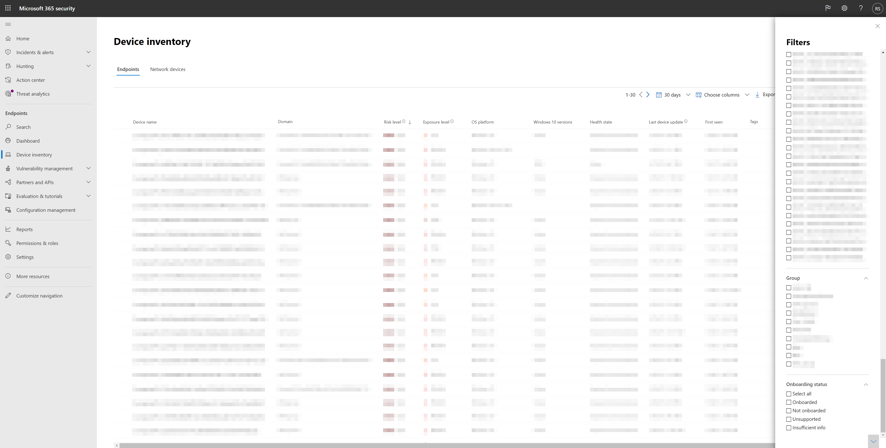
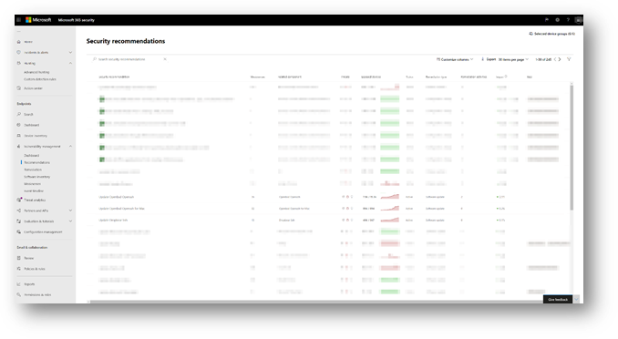
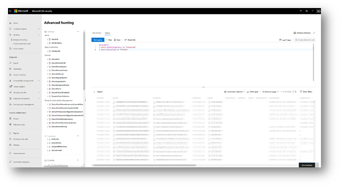

---
title: Device discovery 
description: Learn how to leverage endpoint discovery in Microsoft 365 Defender to find unmanaged devices in your network
keywords: device discovery, discover, passive, proactive, network, visibility, server, workstation, onboard, unmanaged devices
search.product: eADQiWindows 10XVcnh
search.appverid: met150
ms.prod: m365-security
ms.mktglfcycl: deploy
ms.sitesec: library
ms.pagetype: security
f1.keywords:
- NOCSH
ms.author: macapara
author: mjcaparas
ms.localizationpriority: medium
manager: dansimp
audience: ITPro
ms.collection: 
- M365-security-compliance 
- m365initiative-m365-defender 
ms.topic: conceptual
ms.technology: m365d
---

# Device discovery 

[!INCLUDE [Microsoft 365 Defender rebranding](../../includes/microsoft-defender.md)]

**Applies to:**
- [Microsoft Defender for Endpoint](https://go.microsoft.com/fwlink/p/?linkid=2146631)
- [Microsoft 365 Defender](https://go.microsoft.com/fwlink/?linkid=2118804)

[!include[Prerelease information](../../includes/prerelease.md)]

Protecting your environment requires taking inventory of the devices that are in your network. However, mapping devices in a network can often be expensive, challenging, and time-consuming. 

Microsoft Defender for Endpoint provides a device discovery capability that helps you find unmanaged devices connected to your corporate network without the need for extra appliances or cumbersome process changes.


The device discovery capability allows you to:

- **Discover enterprise endpoints connected to your corporate network** <br>
Using either basic or standard discovery options, you can discover workstations, servers, and mobile endpoints that are not yet onboarded to Microsoft Defender for Endpoint.  

- **Onboard discovered endpoints**<br>
Unmanaged endpoints in your network introduce vulnerabilities and risks to your network. Onboarding them to the service can increase the security visibility on them. 

In conjunction with this capability, a new security recommendation to onboard devices to Microsoft Defender for Endpoint will be available as part of the existing Threat and Vulnerability Management experience.


## Discovery methods
There are two modes of discovery: 

-	Basic discovery 
-	Standard discovery (recommended) 


> [!IMPORTANT]
> Discovery is set to basic mode. You can choose to retain this configuration through the settings page. Standard discovery will be the default mode for all preview customers starting May 2, 2021 - unless modified through the settings page before this date.

### Basic discovery 

In this mode, endpoints will passively collect events in your network and extract device information from them. Basic discovery uses the SenseNDR.exe binary for passive network data collection and no network traffic will be initiated. Endpoints will simply extract data from every network traffic that is seen by an onboarded device. 

### Standard discovery 

This mode allows endpoints to actively probe observed devices in the network to enrich collected data - helping you build a reliable and coherent device inventory. Standard mode uses smart, active probing to discover even more information about observed devices to enrich existing device information.  

When Standard mode is enabled, minimal and negligible network activity generated by the discovery sensor might be observed by network monitoring tools in your organization.  

 If you choose not to enable this mode, you will only gain limited visibility of unmanaged endpoints in your network.


> [!NOTE]
> The discovery engine distinguishes between network events that are received in the corporate network versus outside of the corporate network. Devices that are not connected to corporate networks will not be discovered or listed in the device inventory. 

Standard discovery uses various PowerShell scripts to actively probe devices in the network. Those PowerShell scripts are Microsoft signed and are executed from the following location: `C:\ProgramData\Microsoft\Windows Defender Advanced Threat Protection\Downloads\*.ps`. For example, `C:\ProgramData\Microsoft\Windows Defender Advanced Threat Protection\Downloads\UnicastScannerV1.1.0.ps1`.


## Device Inventory 
Devices that have been discovered but have not yet been onboarded and secured by Microsoft Defender for Endpoint will be listed in Device Inventory within the Endpoints tab. 
You can now use a new filter in the device inventory list called Onboarding status which can have any of the following values:

- Onboarded – The endpoint is onboarded to Microsoft Defender for Endpoint.
- Can be onboarded – The endpoint was discovered in the network and the Operating System was identified as one that is supported by Microsoft Defender for Endpoint, but it is not currently onboarded. We highly recommend onboarding these devices.
- Unsupported – The endpoint was discovered in the network but is not supported by Microsoft Defender for Endpoint.
- Insufficient info – The system could not determine the supportability of the device. Enabling standard discovery on more devices in the network can enrich the discovered attributes. 
 




## Device discovery applications

### Vulnerability assessment on discovered devices
Vulnerabilities and risks on your devices as well as other discovered unmanaged devices in the network are part of the current TVM flows under “Security Recommendations” and represented in entity pages across the portal. 
Search for "SSH" related security recommendations to find SSH vulnerabilities that are related for unmanaged and managed devices. 

  

## Use Advanced Hunting on discovered devices
You can use Advanced Hunting queries to gain visibility on discovered devices.
Find details about discovered Endpoints in the DeviceInfo table, or network-related information about those devices in the DeviceNetworkInfo table.
  




Device discovery leverages Microsoft Defender for Endpoint onboarded devices as a network data source to attribute activities to non-onboarded devices. This means that if a Microsoft Defender for Endpoint onboarded device communicated with a non-onboarded device, activities on the non-onboarded device can be seen on the timeline and through the Advanced hunting DeviceNetworkEvents table. 


New events are Transmission Control Protocol (TCP) connections-based and will fit to the current DeviceNetworkEvents scheme. TCP ingress to the Microsoft Defender for Endpoint enabled device from a non-Microsoft Defender for Endpoint enabled.  

The following action types have also been added:  

- ConnectionAttempt - An attempt to establish a TCP connection (syn)  
- ConnectionAcknowledged - An acknowledgement that a TCP connection was accepted (syn\ack)  

You can try this example query:  

```
DeviceNetworkEvents  
| where ActionType == "ConnectionAcknowledged" or ActionType == "ConnectionAttempt"  
| take 10  
```

## Next steps
- [Configure device discovery](configure-device-discovery.md)
