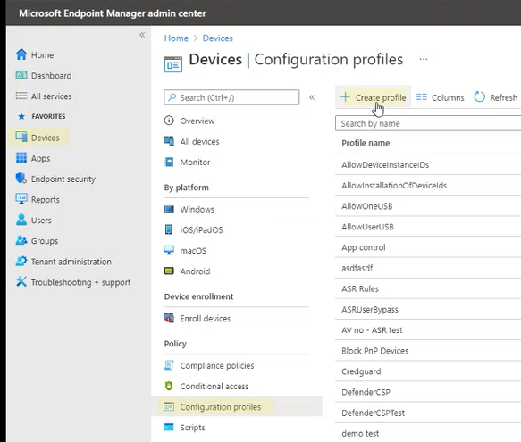
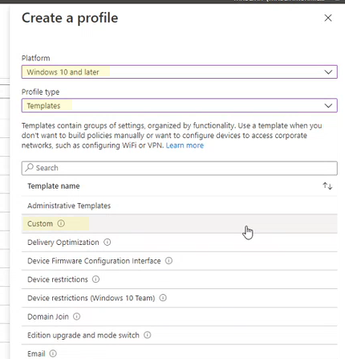
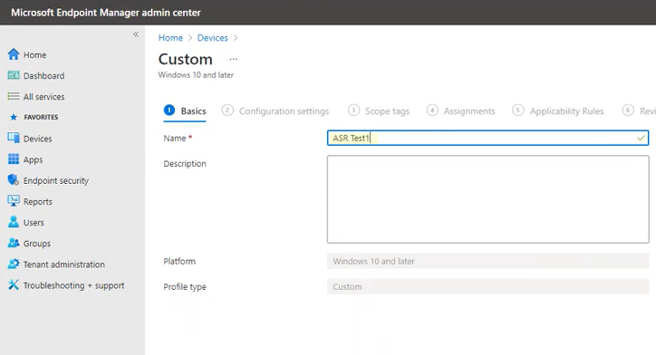
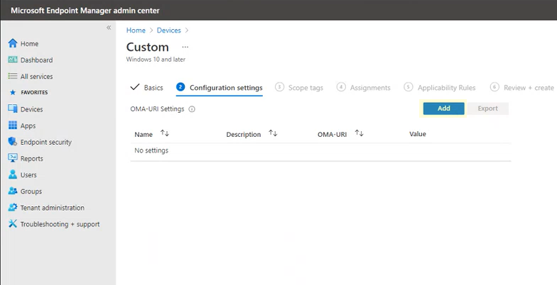
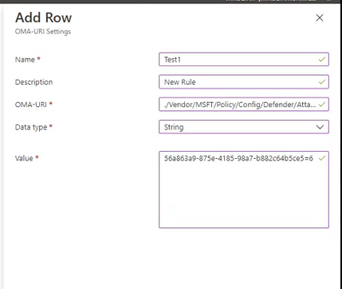
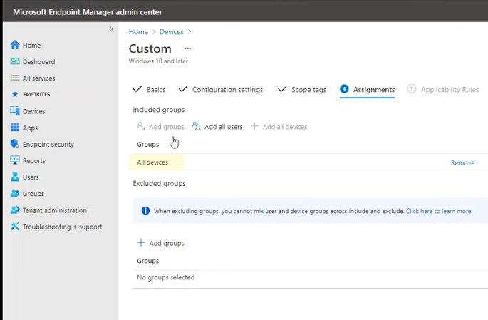
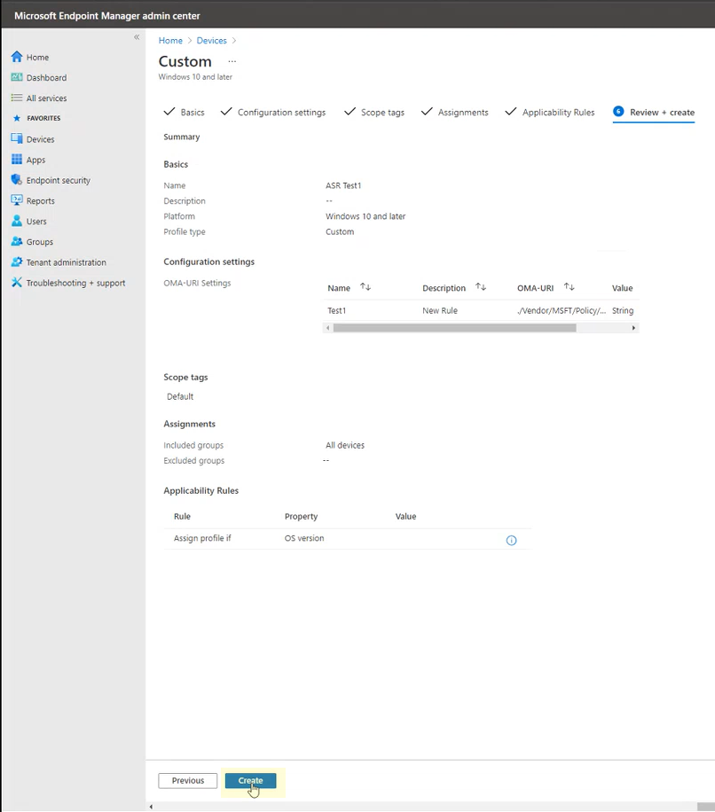

# Enable attack surface reduction rules

[!INCLUDE [Microsoft 365 Defender rebranding](../../includes/microsoft-defender.md)]

**Applies to:**

- [Microsoft Defender for Endpoint](https://go.microsoft.com/fwlink/p/?linkid=2154037)
- [Microsoft 365 Defender](https://go.microsoft.com/fwlink/?linkid=2118804)

> [!TIP]
> Want to experience Defender for Endpoint? [Sign up for a free trial.](https://www.microsoft.com/microsoft-365/windows/microsoft-defender-atp?ocid=docs-wdatp-assignaccess-abovefoldlink)

[Attack surface reduction rules](attack-surface-reduction.md) (ASR rules) help prevent actions that malware often abuses to compromise devices and networks.

**Requirements**
You can set attack surface reduction rules for devices that are running any of the following editions and versions of Windows:

- Windows 10 Pro, [version 1709](/windows/whats-new/whats-new-windows-10-version-1709) or later
- Windows 10 Enterprise, [version 1709](/windows/whats-new/whats-new-windows-10-version-1709) or later
- Windows Server, [version 1803 (Semi-Annual Channel)](/windows-server/get-started/whats-new-in-windows-server-1803) or later
- [Windows Server 2019](/windows-server/get-started-19/whats-new-19)

Although attack surface reduction rules don't require a [Windows E5 license](/windows/deployment/deploy-enterprise-licenses), if you have Windows E5, you get advanced management capabilities. These capabilities available only in Windows E5 include monitoring, analytics, and workflows available in [Defender for Endpoint](/microsoft-365/security/defender-endpoint/microsoft-defender-endpoint?view=o365-worldwide&preserve-view=true), as well as reporting and configuration capabilities in the [Microsoft 365 security center](/microsoft-365/security/defender/overview-security-center?view=o365-worldwide&preserve-view=true). These advanced capabilities aren't available with a Windows Professional or Windows E3 license; however, if you do have those licenses, you can use Event Viewer and Microsoft Defender Antivirus logs to review your attack surface reduction rule events.

Each ASR rule contains one of four settings:

- **Not configured**: Disable the ASR rule
- **Block**: Enable the ASR rule
- **Audit**: Evaluate how the ASR rule would impact your organization if enabled
- **Warn**: Enable the ASR rule but allow the end user to bypass the block

> [!IMPORTANT]
> Currently, warn mode is not supported for three ASR rules when you configure ASR rules in Microsoft Endpoint Manager (MEM). To learn more, see [Cases where warn mode is not supported](attack-surface-reduction.md#cases-where-warn-mode-is-not-supported).

It's highly recommended you use ASR rules with a Windows E5 license (or similar licensing SKU) to take advantage of the advanced monitoring and reporting capabilities available in [Microsoft Defender for Endpoint](https://docs.microsoft.com/windows/security/threat-protection) (Defender for Endpoint). However, for other licenses like Windows Professional or E3 that don't have access to advanced monitoring and reporting capabilities, you can develop your own monitoring and reporting tools on top of the events that are generated at each endpoint when ASR rules are triggered (e.g., Event Forwarding).

> [!TIP]
> To learn more about Windows licensing, see [Windows 10 Licensing](https://www.microsoft.com/licensing/product-licensing/windows10?activetab=windows10-pivot:primaryr5) and get the [Volume Licensing guide for Windows 10](https://download.microsoft.com/download/2/D/1/2D14FE17-66C2-4D4C-AF73-E122930B60F6/Windows-10-Volume-Licensing-Guide.pdf).

You can enable attack surface reduction rules by using any of these methods:

- [Microsoft Intune](#intune)
- [Mobile Device Management (MDM)](#mdm)
- [Microsoft Endpoint Configuration Manager](#microsoft-endpoint-configuration-manager)
- [Group Policy](#group-policy)
- [PowerShell](#powershell)

Enterprise-level management such as Intune or Microsoft Endpoint Manager is recommended. Enterprise-level management will overwrite any conflicting Group Policy or PowerShell settings on startup.

## Exclude files and folders from ASR rules

You can exclude files and folders from being evaluated by most attack surface reduction rules. This means that even if an ASR rule determines the file or folder contains malicious behavior, it will not block the file from running. This could potentially allow unsafe files to run and infect your devices.

You can also exclude ASR rules from triggering based on certificate and file hashes by allowing specified Defender for Endpoint file and certificate indicators. (See [Manage indicators](https://docs.microsoft.com/microsoft-365/security/defender-endpoint/manage-indicators).)

> [!IMPORTANT]
> Excluding files or folders can severely reduce the protection provided by ASR rules. Excluded files will be allowed to run, and no report or event will be recorded.
> If ASR rules are detecting files that you believe shouldn't be detected, you should [use audit mode first to test the rule](evaluate-attack-surface-reduction.md).

You can specify individual files or folders (using folder paths or fully qualified resource names), but you can't specify which rules the exclusions apply to. An exclusion is applied only when the excluded application or service starts. For example, if you add an exclusion for an update service that is already running, the update service will continue to trigger events until the service is stopped and restarted.

ASR rules support environment variables and wildcards. For information about using wildcards, see [Use wildcards in the file name and folder path or extension exclusion lists](https://docs.microsoft.com/windows/security/threat-protection/microsoft-defender-antivirus/configure-extension-file-exclusions-microsoft-defender-antivirus#use-wildcards-in-the-file-name-and-folder-path-or-extension-exclusion-lists).

The following procedures for enabling ASR rules include instructions for how to exclude files and folders.

## Intune

1. Select **Device configuration** > **Profiles**. Choose an existing endpoint protection profile or create a new one. To create a new one, select **Create profile** and enter information for this profile. For **Profile type**, select **Endpoint protection**. If you've chosen an existing profile, select **Properties** and then select **Settings**.

2. In the **Endpoint protection** pane, select **Windows Defender Exploit Guard**, then select **Attack Surface Reduction**. Select the desired setting for each ASR rule.

3. Under **Attack Surface Reduction exceptions**, enter individual files and folders. You can also select **Import** to import a CSV file that contains files and folders to exclude from ASR rules. Each line in the CSV file should be formatted as follows:

   `C:\folder`, `%ProgramFiles%\folder\file`, `C:\path`

4. Select **OK** on the three configuration panes. Then select **Create** if you're creating a new endpoint protection file or **Save** if you're editing an existing one.

## MDM

Use the [./Vendor/MSFT/Policy/Config/Defender/AttackSurfaceReductionRules](https://docs.microsoft.com/windows/client-management/mdm/policy-csp-defender#defender-attacksurfacereductionrules) configuration service provider (CSP) to individually enable and set the mode for each rule.

The following is a sample for reference, using [GUID values for ASR rules](attack-surface-reduction.md#attack-surface-reduction-rules).

`OMA-URI path: ./Vendor/MSFT/Policy/Config/Defender/AttackSurfaceReductionRules`

`Value: 75668C1F-73B5-4CF0-BB93-3ECF5CB7CC84=2|3B576869-A4EC-4529-8536-B80A7769E899=1|D4F940AB-401B-4EfC-AADC-AD5F3C50688A=2|D3E037E1-3EB8-44C8-A917-57927947596D=1|5BEB7EFE-FD9A-4556-801D-275E5FFC04CC=0|BE9BA2D9-53EA-4CDC-84E5-9B1EEEE46550=1`

The values to enable (Block), disable, warn, or enable in audit mode are:

- 0 : Disable (Disable the ASR rule)
- 1 : Block (Enable the ASR rule)
- 2 : Audit (Evaluate how the ASR rule would impact your organization if enabled)
- 6 : Warn  (Enable the ASR rule but allow the end-user to bypass the block). Warn mode is now available for most of the ASR rules.

Use the [./Vendor/MSFT/Policy/Config/Defender/AttackSurfaceReductionOnlyExclusions](https://docs.microsoft.com/windows/client-management/mdm/policy-csp-defender#defender-attacksurfacereductiononlyexclusions) configuration service provider (CSP) to add exclusions.

Example:

`OMA-URI path: ./Vendor/MSFT/Policy/Config/Defender/AttackSurfaceReductionOnlyExclusions`

`Value: c:\path|e:\path|c:\Exclusions.exe`

> [!NOTE]
> Be sure to enter OMA-URI values without spaces.

## Microsoft Endpoint Configuration Manager

1. In Microsoft Endpoint Configuration Manager, go to **Assets and Compliance** > **Endpoint Protection** > **Windows Defender Exploit Guard**.

2. Select **Home** > **Create Exploit Guard Policy**.

3. Enter a name and a description, select **Attack Surface Reduction**, and select **Next**.

4. Choose which rules will block or audit actions and select **Next**.

5. Review the settings and select **Next** to create the policy.

6. After the policy is created, **Close**.

## Group Policy

> [!WARNING]
> If you manage your computers and devices with Intune, Configuration Manager, or other enterprise-level management platform, the management software will overwrite any conflicting Group Policy settings on startup.

1. On your Group Policy management computer, open the [Group Policy Management Console](https://technet.microsoft.com/library/cc731212.aspx), right-click the Group Policy Object you want to configure and select **Edit**.

2. In the **Group Policy Management Editor**, go to **Computer configuration** and select **Administrative templates**.

3. Expand the tree to **Windows components** > **Microsoft Defender Antivirus** > **Microsoft Defender Exploit Guard** > **Attack surface reduction**.

4. Select **Configure Attack surface reduction rules** and select **Enabled**. You can then set the individual state for each rule in the options section.

   Select **Show...** and enter the rule ID in the **Value name** column and your chosen state in the **Value** column as follows:

   - 0 : Disable (Disable the ASR rule)
   - 1 : Block (Enable the ASR rule)
   - 2 : Audit (Evaluate how the ASR rule would impact your organization if enabled)
   - 6 : Warn  (Enable the ASR rule but allow the end-user to bypass the block)

   :::image type="content" source="images/asr-rules-gp.png" alt-text="ASR rules in Group Policy":::

5. To exclude files and folders from ASR rules, select the **Exclude files and paths from Attack surface reduction rules** setting and set the option to **Enabled**. Select **Show** and enter each file or folder in the **Value name** column. Enter **0** in the **Value** column for each item.

   > [!WARNING]
   > Do not use quotes as they are not supported for either the **Value name** column or the **Value** column.

## Microsoft Endpoint Manager custom procedure

You can use a Microsoft Endpoint Manager (MEM) admin center to configure custom ASR rules.

1. Open the Microsoft Endpoint Manager (MEM) admin center. In the **Home** menu, click  **Devices**, select **Configuration profile**, and then click **Create profile**.

   

2. In **Create a profile**, in the following two drop-down lists, select the following:

   - In **Platform**, select **Windows 10 and later**
   - In **Profile type**, select **Templates**

   Select **Custom**, and then click **Create**.

   

3. The Custom template tool opens to step **1 Basics**. In **1 Basics**, in **Name**, type a name for your template, and in **Description** you can type a description (optional ).

   

4. Click **Next**. Step **2 Configuration settings** opens. For OMA-URI Settings, click **Add**. Two options now appear: **Add** and **Export**.

   

5. Click **Add** again. The **Add Row OMA-URI Settings** opens. In **Add Row**, do the following:

   - In **Name**, type a name for the rule.
   - In **Description**, type a brief description.
   - In **OMA-URI**, type or paste the specific OMA-URI link for the rule that you are adding.
   - In **Data type**, select **String**.
   - In **Value**, type or paste the GUID value, the \= sign and the State value with no spaces (_GUID=StateValue_). Where: {0 : Disable (Disable the ASR rule)}, {1 : Block (Enable the ASR rule)}, {2 : Audit (Evaluate how the ASR rule would impact your organization if enabled)}, {6 : Warn (Enable the ASR rule but allow the end-user to bypass the block)}

   

6. Click **Save**. **Add Row** closes. In **Custom**, click **Next**. In step **3 Scope tags**, scope tags are optional. Do one of the following:

   - Click **Select Scope tags**, select the scope tag (optional) and then click **Next**.
   - Or click **Next**

7. In step **4 Assignments**, in **Included Groups** - for the groups that you want this rule to apply - select from the following options:

   - **Add groups**
   - **Add all users**
   - **Add all devices**

   

8. In **Excluded groups**, select any groups that you want to exclude from this rule, and then click **Next**.

9. In step **5 Applicability Rules** for the following settings, do the following:

   - In **Rule**, select either **Assign profile if**, or **Don’t assign profile if**
   - In **Property**, select the property to which you want this rule to apply
   - In **Value**, enter the applicable value or value range

   

10. Click **Next**. In step **6 Review + create**, review the settings and information you have selected and entered, and then click **Create**.

   

>[!NOTE]
> Rules are active and live within minutes.

>[!NOTE]
> Conflict handling:
> If you assign a device two different ASR policies, the way conflict is handled is rules that are assigned different states, there is no conflict management in place, and the result is an error.
> Non-conflicting rules will not result in an error, and the rule will be applied correctly. The result is that the first rule is applied, and subsequent non-conflicting rules are merged into the policy.

## PowerShell

> [!WARNING]
> If you manage your computers and devices with Intune, Configuration Manager, or another enterprise-level management platform, the management software will overwrite any conflicting PowerShell settings on startup. To allow users to define the value using PowerShell, use the "User Defined" option for the rule in the management platform.

1. Type **powershell** in the Start menu, right-click **Windows PowerShell** and select **Run as administrator**.

2. Type the following cmdlet:

    ```PowerShell
    Set-MpPreference -AttackSurfaceReductionRules_Ids <rule ID> -AttackSurfaceReductionRules_Actions Enabled
    ```

    To enable ASR rules in audit mode, use the following cmdlet:

    ```PowerShell
    Add-MpPreference -AttackSurfaceReductionRules_Ids <rule ID> -AttackSurfaceReductionRules_Actions AuditMode
    ```

    To enable ASR rules in warn mode, use the following cmdlet:

    ```PowerShell
    Add-MpPreference -AttackSurfaceReductionRules_Ids <rule ID> -AttackSurfaceReductionRules_Actions Warn
    ```

    To turn off ASR rules, use the following cmdlet:

    ```PowerShell
    Add-MpPreference -AttackSurfaceReductionRules_Ids <rule ID> -AttackSurfaceReductionRules_Actions Disabled
    ```

    > [!IMPORTANT]
    > You must specify the state individually for each rule, but you can combine rules and states in a comma-separated list.
    >
    > In the following example, the first two rules will be enabled, the third rule will be disabled, and the fourth rule will be enabled in audit mode:
    >
    > ```PowerShell
    > Set-MpPreference -AttackSurfaceReductionRules_Ids <rule ID 1>,<rule ID 2>,<rule ID 3>,<rule ID 4> -AttackSurfaceReductionRules_Actions Enabled, Enabled, Disabled, AuditMode
    > ```

    You can also use the `Add-MpPreference` PowerShell verb to add new rules to the existing list.

    > [!WARNING]
    > `Set-MpPreference` will always overwrite the existing set of rules. If you want to add to the existing set, use `Add-MpPreference` instead.
    > You can obtain a list of rules and their current state by using `Get-MpPreference`.

3. To exclude files and folders from ASR rules, use the following cmdlet:

    ```PowerShell
    Add-MpPreference -AttackSurfaceReductionOnlyExclusions "<fully qualified path or resource>"
    ```

    Continue to use `Add-MpPreference -AttackSurfaceReductionOnlyExclusions` to add more files and folders to the list.

    > [!IMPORTANT]
    > Use `Add-MpPreference` to append or add apps to the list. Using the `Set-MpPreference` cmdlet will overwrite the existing list.

## Related articles

- [Reduce attack surfaces with attack surface reduction rules](attack-surface-reduction.md)

- [Evaluate attack surface reduction](evaluate-attack-surface-reduction.md)

- [Attack surface reduction FAQ](attack-surface-reduction.md)
