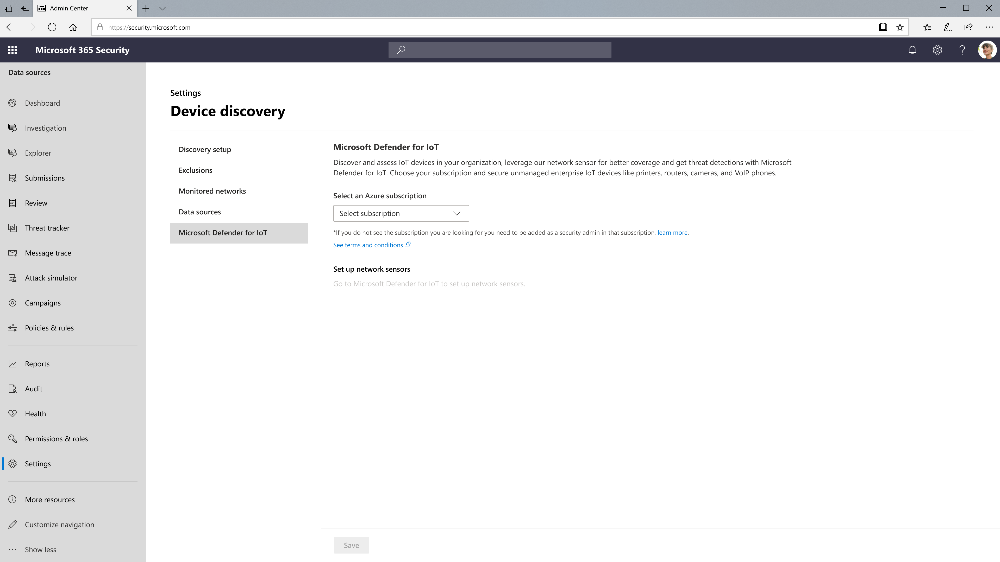

# Enable Microsoft Defender for IoT integration

[!INCLUDE [Microsoft 365 Defender rebranding](../../includes/microsoft-defender.md)]

**Applies to:**

- [Microsoft Defender for Endpoint](https://go.microsoft.com/fwlink/?linkid=2154037)
- [Microsoft 365 Defender](https://go.microsoft.com/fwlink/?linkid=2118804)

> Want to experience Microsoft Defender for Endpoint? [Sign up for a free trial.](https://signup.microsoft.com/create-account/signup?products=7f379fee-c4f9-4278-b0a1-e4c8c2fcdf7e&ru=https://aka.ms/MDEp2OpenTrial?ocid=docs-wdatp-enablesiem-abovefoldlink)

Microsoft Defender for Endpoint can integrate with Microsoft Defender for IoT to extend your device discovery capabilities. Microsoft Defender for IoT provides a unified security solution for identifying IoT/OT devices, vulnerabilities, and threats, and provides agentless monitoring capabilities to secure enterprise IoT devices connected to IT networks, for example, Voice over Internet Protocol (VoIP) devices, printers, and cameras. For more information see [Enterprise IoT network protection -Add link]

With this integration enabled, IoT devices discovered by either Microsoft Defender for IoT or Microsoft Defender for Endpoint will be synched automatically to the device inventory in both portals. This gives you a single unified view of your complete OT/IoT inventory alongside the rest of your IT devices (workstations, servers and mobile).

Microsoft Defender for IoT also includes a deployable network sensor that provides an additional data source. Setting up a network sensor as part of your integration will give you the most complete view of your IoT and OT devices, specifically for network segments where Defender for Endpoint sensors are not present and when employees are accessing information remotely. For more information, see [Manage sensors with Defender for IoT in the Azure portal](https://docs.microsoft.com/azure/defender-for-iot/organizations/how-to-manage-sensors-on-the-cloud).

The integration allows organizations to take advantage of a single integrated solution that secures all of their IoT, and OT infrastructure.

## Prerequisites

To enable Microsoft Defender for IoT the user must have the following roles:

- Tenant global administrator in Azure Active Directory
- Security administration for the Azure subscription that will be used for the Defender for IoT integration

## Enabling Microsoft Defender for IoT integration

1. In the navigation pane, select **Settings** \> **Device discovery** \> **Microsoft Defender for IoT**.

2. **Select subscription** displays a list of the available subscriptions under your Azure Active Directory (Azure AD) tenant.

3. Choose the Azure subscription and select **Save**.

## Setup a network sensor

You can configure a network sensor. For more information, see [Set up a network sensor](Add link).

## See also

- [Device discovery overview](configure-device-discover.md)
- [Device discovery FAQ](device-discovery-faq.md)
