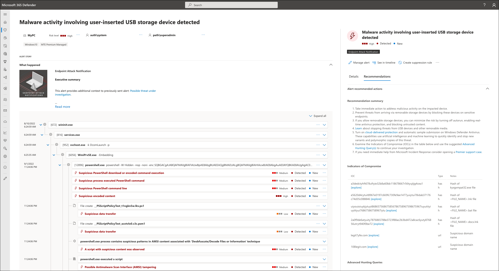
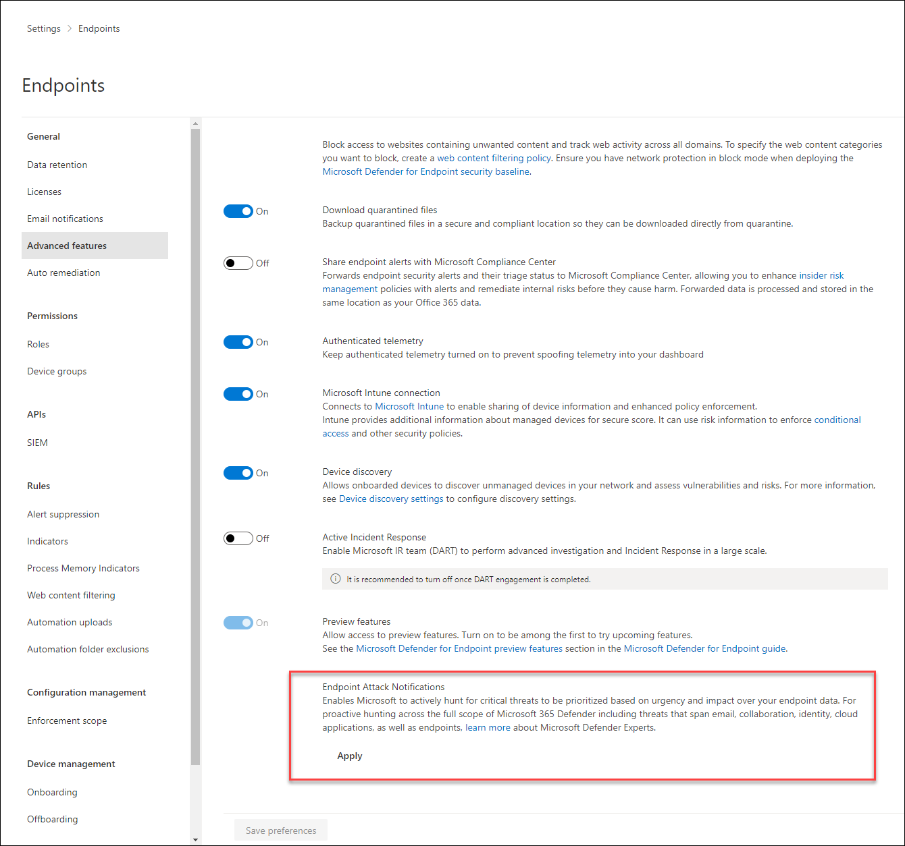

# Endpoint Attack Notifications

[!INCLUDE [Microsoft 365 Defender rebranding](../../includes/microsoft-defender.md)]

**Applies to:**
- [Microsoft Defender for Endpoint Plan 2](https://go.microsoft.com/fwlink/p/?linkid=2154037)
- [Microsoft 365 Defender](https://go.microsoft.com/fwlink/?linkid=2118804)

> Want to experience Microsoft Defender for Endpoint? [Sign up for a free trial.](https://signup.microsoft.com/create-account/signup?products=7f379fee-c4f9-4278-b0a1-e4c8c2fcdf7e&ru=https://aka.ms/MDEp2OpenTrial?ocid=docs-wdatp-exposedapis-abovefoldlink)

> [!NOTE]
> This covers threat hunting on your Microsoft Defender for Endpoint service. However, if you're interested to explore the service beyond your current license, and proactively hunt threats not just on endpoints but also across Office 365, cloud applications, and identity, refer to [Microsoft Defender Experts for Hunting](/microsoft-365/security/defender/defender-experts-for-hunting).

> [!NOTE]
> Customers who signed up for Experts on Demand prior to sunset will have access to Ask Defender Experts until the expiration of their current contract.

Endpoint Attack Notifications (previously referred to as Microsoft Threat Experts - Targeted Attack Notification) provides proactive hunting for the most important threats to your network, including human adversary intrusions, hands-on-keyboard attacks, or advanced attacks like cyber-espionage. These notifications show up as a new alert. The managed hunting service includes:

- Threat monitoring and analysis, reducing dwell time and risk to the business
- Hunter-trained artificial intelligence to discover and prioritize both known and unknown attacks
- Identifying the most important risks, helping SOCs maximize time and energy
- Scope of compromise and as much context as can be quickly delivered to enable fast SOC response

## Apply for Endpoint Attack Notifications
If you're a Microsoft Defender for Endpoint customer, you can apply for Endpoint Attack Notifications. Go to **Settings** \> **Endpoints** \> **General** \> **Advanced features** \> **Endpoint Attack Notifications** to apply. Once accepted, you'll get the benefits of Endpoint Attack Notifications.

## Receive Endpoint Attack notifications
Endpoint Attack Notifications are alerts that have been hand crafted by Microsoft's managed hunting service based on suspicious activity in your environment. They can be viewed through several mediums:
- The alerts queue in the Microsoft 365 Defender portal
- Using the [API](../../security/defender-endpoint/get-alerts.md)
- [DeviceAlertEvents](../../security/defender-endpoint/advanced-hunting-devicealertevents-table.md) table in Advanced hunting
- Your email if you [configure an email notifications](../../security/defender-endpoint/configure-vulnerability-email-notifications.md) rule

Endpoint Attack Notifications can be identified by:
- Have a tag named **Endpoint Attack Notification**
- Have a service source of **Microsoft Defender for Endpoint** \> **Microsoft Defender Experts**

> [!NOTE]
> If you have enrolled for Endpoint Attack Notifications but are not seeing any alerts from the service, it indicates that you have a strong security posture and are less prone to attacks.

## Create an email notification rule
You can create rules to send email notifications for notification recipients. See [Configure alert notifications](configure-email-notifications.md) to create, edit, delete, or troubleshoot email notification, for details.

## Next steps

- To proactively hunt threats across endpoints, Office 365, cloud applications, and identity, refer to [Microsoft Defender Experts for Hunting](../defender/defender-experts-for-hunting.md).
[!INCLUDE [Microsoft Defender for Endpoint Tech Community](../../includes/defender-mde-techcommunity.md)]
