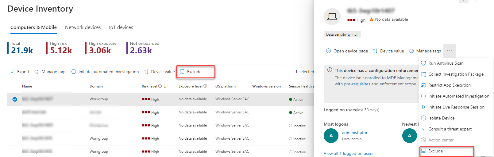
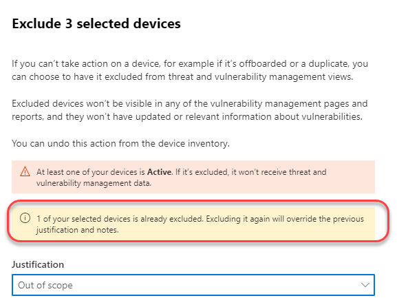

# Exclude devices

[!INCLUDE [Microsoft 365 Defender rebranding](../../includes/microsoft-defender.md)]

**Applies to:**

- [Microsoft Defender for Endpoint Plan 1](https://go.microsoft.com/fwlink/p/?linkid=2154037)
- [Microsoft Defender for Endpoint Plan 2](https://go.microsoft.com/fwlink/p/?linkid=2154037)
- [Microsoft 365 Defender](https://go.microsoft.com/fwlink/?linkid=2118804)

> Want to experience Defender for Endpoint? [Sign up for a free trial.](https://signup.microsoft.com/create-account/signup?products=7f379fee-c4f9-4278-b0a1-e4c8c2fcdf7e&ru=https://aka.ms/MDEp2OpenTrial?ocid=docs-wdatp-respondmachine-abovefoldlink)

## Exclude devices from vulnerability management

Excluding devices that are inactive, duplicate, or out of scope allows you to focus on discovering and prioritizing the risks on your active devices. This action can also help reflect a more accurate vulnerability management exposure score, as the excluded devices won't be visible in your vulnerability management reports.

Once devices are excluded, you won't be able to view updated or relevant information about vulnerabilities and installed software on these devices. It affects all vulnerability management pages, reports, and related tables in advanced hunting.

Even though the device exclusion feature removes the device data from vulnerability management pages and reports, the devices remain connected to the network and can still be a risk to the organization. You'll be able to cancel the device exclusion at any time.

## How to exclude a device

You can choose to exclude a single device or multiple devices at the same time.

### Exclude a single device

1. Go to the **Device inventory** page and select the device to exclude.
2. Select **Exclude** from the action bar on the device inventory page or from the actions menu in the device flyout.

   

3. Select a justification:

    - Inactive device
    - Duplicate device
    - Device doesn't exist
    - Out of scope
    - Other

4. Type a note and select **Exclude device**.

You can also exclude a device from its device page.

> [!NOTE]
> Excluding active devices is not recommended, since it is especially risky to not have visibility into their vulnerability info. If a device is active and you try to exclude it, you'll get a warning message and a confirmation pop-up asking if you are sure you want to exclude an active device.

It can take up to 10 hours for a device to be fully excluded from vulnerability management views and data.

Excluded devices are still visible in the Device inventory list. You can manage your view of excluded devices by:

- Adding the **Exclusion state** column to the device inventory view.
- Using the **Exclusion state** filter to view the relevant list of devices.

### Bulk device exclusion

You can also choose to exclude multiple devices at the same time:

1. Go to the **Device inventory** page and select the devices to exclude.

2. From the actions bar, select **Exclude**.

3. Choose a justification and select **Exclude device**.

If you select multiple devices in the device list with different exclusion statuses, the exclude selected devices flyout will provide you details on how many of the selected devices are already excluded. You can exclude the devices again, but the justification and notes will be overridden.

Once a device is excluded, if you go to the device page of an excluded device, you won't be able to see data for discovered vulnerabilities, software inventory or security recommendations. The data also won't show up in vulnerability management pages, related advanced hunting tables and the vulnerable devices report.

## Stop excluding a device

You'll be able to stop excluding a device at any time. Once devices are no longer excluded, their vulnerability data will be visible in vulnerability management pages, reports, and in advanced hunting. It may take up to 8 hours for the changes to take effect.

1. Go to the Device inventory, select the excluded device to open the flyout, and then select **Exclusion details**
2. Select **Stop exclusion**

## See also

- [Device inventory](machines-view-overview.md)
[!INCLUDE [Microsoft Defender for Endpoint Tech Community](../../includes/defender-mde-techcommunity.md)]
