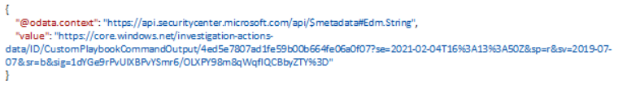
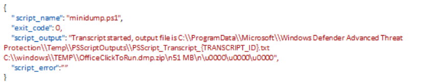

#  Get live response results

[!INCLUDE [Microsoft 365 Defender rebranding](../../includes/microsoft-defender.md)]

**Applies to:**
- [Microsoft Defender for Endpoint](https://go.microsoft.com/fwlink/p/?linkid=2146631)

>Want to experience Microsoft Defender for Endpoint? [Sign up for a free trial.](https://www.microsoft.com/microsoft-365/windows/microsoft-defender-atp?ocid=docs-wdatp-exposedapis-abovefoldlink) 

[!include[Microsoft Defender for Endpoint API URIs for US Government](../../includes/microsoft-defender-api-usgov.md)]

[!include[Improve request performance](../../includes/improve-request-performance.md)]

## API description

Retrieves specific live response command by its index

## Limitations

1.  Rate limitations for this API are 100 calls per minute and 1500 calls per
    hour.

## Permissions

One of the following permissions is required to call this API. To learn more,
including how to choose permissions, see [Get
started](apis-intro.md).

| Permission type                    | Permission           | Permission display name                   |
|------------------------------------|----------------------|-------------------------------------------|
| Application                        | Machine.LiveResponse | 'Run live response on a specific machine' |
| Delegated (work or school account) | Machine.LiveResponse | 'Run live response on a specific machine' |

## HTTP request

```HTTP
GET https://api.securitycenter.microsoft.com/api/machineactions/{machine action
id}/GetLiveResponseResultDownloadLink(index={command-index})
```

## Request headers

| Name      | Type | Description               |
|---------------|----------|-------------------------------|
| Authorization | String   | Bearer {token}.Required. |

## Request body

Empty

## Response

If successful, this method returns 200, Ok response code with object that holds
the link to the command result in the *value* property. This link is valid for
30 minutes and should be used immediately for downloading the package to a local
storage. An expired link can be re-created by another redirect, and there is no
need to run live response again.

*Runscript transcript properties:*

| Property  | Description                       |
|---------------|---------------------------------------|
| name          | Executed script name                  |
| exit_code     | Executed script exit code             |
| script_output | Executed script standard output       |
| script_error  | Executed script standard error output |

## Example

**Request**

Here is an example of the request.

```HTTP
GET
https://api.securitycenter.microsoft.com/api/machineactions/988cc94e-7a8f-4b28-ab65-54970c5d5018/GetLiveResponseResultDownloadLink(index=0)
```

**Response**

Here is an example of the response.

HTTP/1.1 200 Ok

Content-type: application/json



*File content:* 



## Related topics

- [Get machine action API](get-machineaction-object.md)
- [Cancel machine action](cancel-machine-action.md)
- [Run live response](run-live-response.md) 
- [Upload to library](upload-library.md)