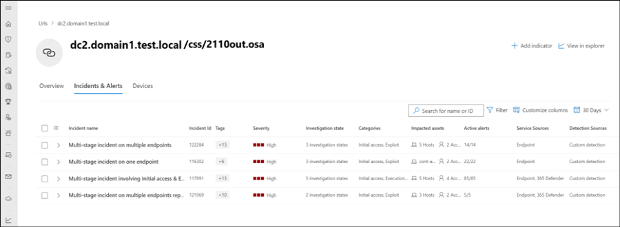
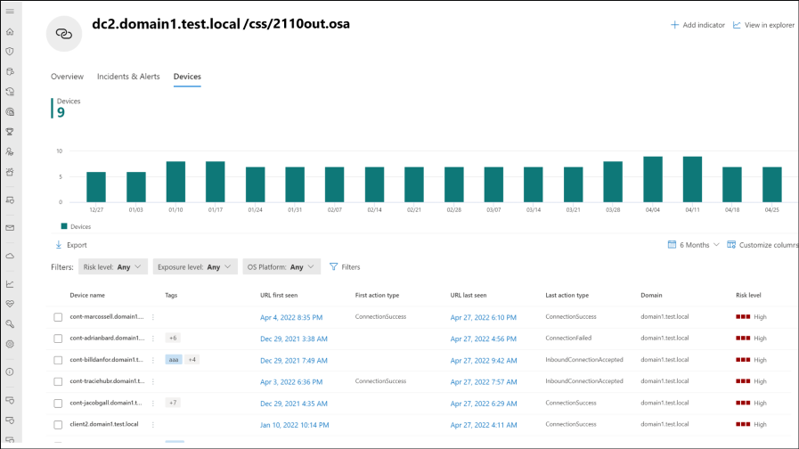

# Investigate domains and URLs

[!INCLUDE [Microsoft 365 Defender rebranding](../../includes/microsoft-defender.md)]

**Applies to:**
- [Microsoft Defender for Endpoint Plan 1](https://go.microsoft.com/fwlink/p/?linkid=2154037)
- [Microsoft Defender for Endpoint Plan 2](https://go.microsoft.com/fwlink/p/?linkid=2154037)
- [Microsoft 365 Defender](https://go.microsoft.com/fwlink/?linkid=2118804)

> Want to experience Defender for Endpoint? [Sign up for a free trial.](https://signup.microsoft.com/create-account/signup?products=7f379fee-c4f9-4278-b0a1-e4c8c2fcdf7e&ru=https://aka.ms/MDEp2OpenTrial?ocid=docs-wdatp-investigatedomain-abovefoldlink)

Investigate a domain to see if the devices and servers in your enterprise network have been communicating with a known malicious domain.

You can investigate a URL or domain by using the search feature, from the incident experience (in evidence tab, or from the alert story), from advanced hunting, from the email page and side panel, or by clicking on the URL or domain link from the **Device timeline**.

You can see information from the following sections in the URL and domain view:

- Domain details, registrant contact information

- Microsoft verdict

- Incidents and alerts related to this URL or domain

- Prevalence of the URL or domain in the organization

- Most recent observed devices with URL or domain

- Most recent emails containing the URL or domain

- Most recent clicks to the URL or domain

:::image type="content" source="../../media/investigate-urls/investigate-url.png" alt-text="The main URL/domain page" lightbox="../../media/investigate-urls/investigate-url.png":::

## Domain entity

You can pivot to the domain page from the domain details in the URL page or side panel, just click on **View domain page** link. The domain entity shows an aggregation of all the data from the URLs with the FQDN (Fully qualified domain name). For example, if one device is observed communicating with `sub.domain.tld/path1`, and another device is observed communicating with `sub.domain.tld/path2`, each URL of the above will show one device observation, and the domain will show the two device observations. In this case, a device that communicated with `othersub.domain.tld/path` won't correlate to this domain page, but to `othersub.domain.tld`.

## URL and Domain overview

The URL worldwide section lists the URL, a link to further details at whois, the number of related open incidents, and the number of active alerts, the number of affected devices, emails, and the number of user clicks observed.

### URL summary details

Displays the original URL (existing URL information), with the query parameters and the application-level protocol. Below that you can find the full domain details, such as registration date, modification date and registrant contact info.

Microsoft verdict of the URL or domain, a devices prevalence, emails and user clicks section. In this area, you can see the number of devices that communicated with the URL or domain in the last 30 days, and pivot to the first or last event in the device timeline right away. To investigate initial access or if there's still a malicious activity in your environment.

### Incidents and alerts

The Incident and alerts section displays a bar chart of all active alerts in incidents over the past 180 days.

### Microsoft verdict

The Microsoft verdict section displays the verdict of the URL or domain from Microsoft TI library. It shows if the URL or domain is already known as phishing or malicious entity.

### Prevalence

The Prevalence section provides the details on the prevalence of the URL within the organization, over the last 30 days, such and trend chart – which shows the number of distinct devices that communicated with the URL or domain over a specific period of time. Below you can find details of the first and last device observations communicated with the URL in the last 30 days, where you can pivot to the device timeline right away, to investigate initial access from the phish link, or if there's still a malicious communication in your environment.

## Incident and alerts

The incident and alerts tab provides a list of incidents that are associated with the URL or domain. The table shown here is a filtered version of the incidents visible on the Incident queue screen, showing only incidents associated with the URL or domain, their severity, impacted assets and more.

The incidents and alerts tab can be adjusted to show more or less information, by selecting **Customize columns** from the action menu above the column headers. The number of items displayed can also be adjusted, by selecting items per page on the same menu.

## Devices

The Devices tab provides a chronological view of all the devices that were observed for a specific URL or a domain. This tab includes a trend chart and a customizable table listing device details, such as risk level, domain and more. Beyond that, you can see the first and last event times where the device interacted with the URL or domain, and the action type of this event. Using the menu next to the device name, you can quickly pivot to the device timeline to further investigate what happened before or after the event that involved this URL or domain.

Although the default time period is the past 30 days, you can customize this from the drop-down available at the corner of the card. The shortest range available is for prevalence over the past day, while the longest range is over the past six months.

Using the export button above the table, you can export all the data into a .csv file (including the first and last event time and action type), for further investigation and reporting.

## Emails

The Emails tab provides a detailed view of all the emails observed in the last 30 days that contained the URL or domain. This tab includes a trend chart and a customizable table listing email details, such as subject, sender, recipient, and more.

:::image type="content" source="../../media/investigate-urls/investigate-url-email-view.png" alt-text="The email tab for investigating a URL/domain" lightbox="../../media/investigate-urls/investigate-url-email-view.png":::

## Clicks

The Clicks tab provides a detailed view of all the clicks to the URL or domain observed in the last 30 days.

### Investigate a URL or domain

1. Select **URL** from the **Search bar** drop-down menu.

2. Enter the URL in the **Search** field. Alternatively, you can navigate to the URL or domain from the **Incident attack story tab**, from the **device timeline**, through **advanced hunting**, or from the **email side panel and page**.

3. Click the search icon or press **Enter**. Details about the URL are displayed.

   > [!NOTE]
   > Search results will only be returned for URLs observed in communications from devices in the organization.

4. Use the search filters to define the search criteria. You can also use the timeline search box to filter the displayed results of all devices in the organization observed communicating with the URL, the file associated with the communication and the last date observed.

5. Clicking any of the device names will take you to that device's view, where you can continue to investigate reported alerts, behaviors, and events.
**
6. If you disagree with the verdict of a URL or domain, you can report it to Microsoft as *clean*, *phishing*, or *malicious* by selecting **Submit to Microsoft for analysis.

:::image type="content" source="../../media/investigate-urls/investigate-url-submission.png" alt-text="Submit for analysis option in the URL/domain page" lightbox="../../media/investigate-urls/investigate-url-submission.png":::

## Related articles

- [View and organize the Microsoft Defender for Endpoint Alerts queue](alerts-queue.md)
- [Manage Microsoft Defender for Endpoint alerts](manage-alerts.md)
- [Investigate Microsoft Defender for Endpoint alerts](investigate-alerts.md)
- [Investigate a file associated with a Microsoft Defender for Endpoint alert](investigate-files.md)
- [Investigate devices in the Microsoft Defender for Endpoint Devices list](investigate-machines.md)
- [Investigate an IP address associated with a Microsoft Defender for Endpoint alert](investigate-ip.md)
- [Investigate a user account in Microsoft Defender for Endpoint](investigate-user.md)
[!INCLUDE [Microsoft Defender for Endpoint Tech Community](../../includes/defender-mde-techcommunity.md)]
