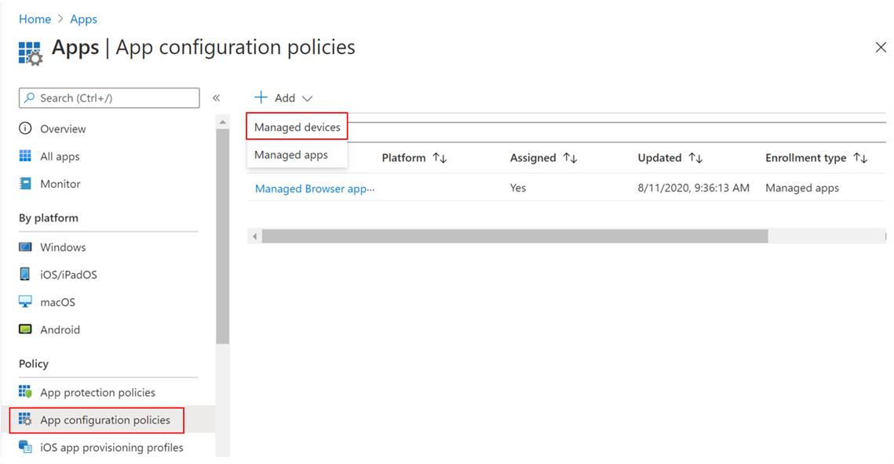
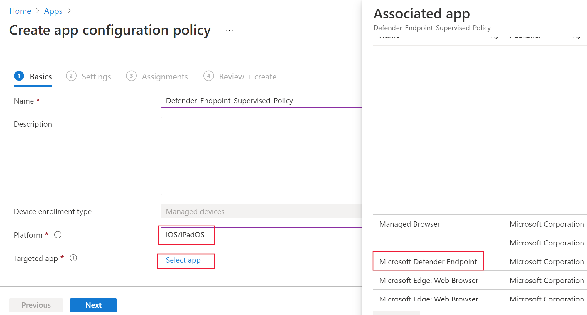
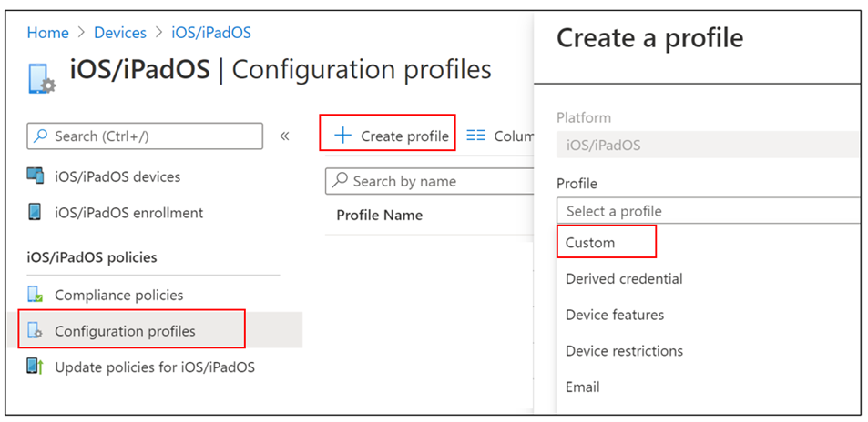

# Deploy Microsoft Defender for Endpoint on iOS

[!INCLUDE [Microsoft 365 Defender rebranding](../../includes/microsoft-defender.md)]

**Applies to:**
- [Microsoft Defender for Endpoint Plan 1](https://go.microsoft.com/fwlink/p/?linkid=2154037)
- [Microsoft Defender for Endpoint Plan 2](https://go.microsoft.com/fwlink/p/?linkid=2154037)
- [Microsoft 365 Defender](https://go.microsoft.com/fwlink/?linkid=2118804)

> Want to experience Defender for Endpoint? [Sign up for a free trial.](https://signup.microsoft.com/create-account/signup?products=7f379fee-c4f9-4278-b0a1-e4c8c2fcdf7e&ru=https://aka.ms/MDEp2OpenTrial?ocid=docs-wdatp-investigateip-abovefoldlink)

This topic describes deploying Defender for Endpoint on iOS on Intune Company Portal enrolled devices. For more information about Intune device enrollment, see [Enroll iOS/iPadOS devices in Intune](/mem/intune/enrollment/ios-enroll).

## Before you begin

- Ensure you have access to [Microsoft Endpoint manager admin center](https://go.microsoft.com/fwlink/?linkid=2109431).

- Ensure iOS enrollment is done for your users. Users need to have a Defender for Endpoint license assigned in order to use Defender for Endpoint on iOS. Refer to [Assign licenses to users](/azure/active-directory/users-groups-roles/licensing-groups-assign) for instructions on how to assign licenses.

> [!NOTE]
> Microsoft Defender for Endpoint on iOS is available in the [Apple App Store](https://aka.ms/mdatpiosappstore).

## Deployment steps

Deploy Defender for Endpoint on iOS via Intune Company Portal.

### Add iOS store app

1. In [Microsoft Endpoint manager admin center](https://go.microsoft.com/fwlink/?linkid=2109431), go to **Apps** > **iOS/iPadOS** > **Add** > **iOS store app** and click **Select**.

    > :::image type="content" source="images/ios-deploy-1.png" alt-text="The Add applications tab in the Microsoft Endpoint Manager Admin Center" lightbox="images/ios-deploy-1.png":::

1. On the **Add app** page, click on **Search the App Store** and type **Microsoft Defender** in the search bar. In the search results section, click on *Microsoft Defender* and click **Select**.

1. Select **iOS 12.0** as the Minimum operating system. Review the rest of information about the app and click **Next**.

1. In the **Assignments** section, go to the **Required** section and select **Add group**. You can then choose the user group(s) that you would like to target Defender for Endpoint on iOS app. Click **Select** and then **Next**.

    > [!NOTE]
    > The selected user group should consist of Intune enrolled users.

   :::image type="content" source="images/ios-deploy-2.png" alt-text="The Add group tab in the Microsoft Endpoint Manager Admin Center" lightbox="images/ios-deploy-2.png":::

1. In the *Review + Create* section, verify that all the information entered is correct and then select **Create**. In a few moments, the Defender for Endpoint app should be created successfully, and a notification should show up at the top-right corner of the page.

1. In the app information page that is displayed, in the **Monitor** section, select **Device install status** to verify that the device installation has completed successfully.

    > :::image type="content" source="images/ios-deploy-3.png" alt-text="The Device install status page" lightbox="images/ios-deploy-3.png":::

## Complete deployment for supervised devices

The Microsoft Defender for Endpoint on iOS app has specialized ability on supervised iOS/iPadOS devices, given the increased management capabilities provided by the platform on these types of devices. It can also provide Web Protection **without setting up a local VPN on the device**. This gives end-users a seamless experience while still being protected from phishing and other web-based attacks.

Admins can use the following steps to configure supervised devices.

### Configure Supervised Mode via Intune

Configure the supervised mode for Defender for Endpoint app through an App configuration policy and Device configuration profile.

#### App configuration policy

   > [!NOTE]
   > This app configuration policy for supervised devices is applicable only to managed devices and should be targeted for ALL managed iOS devices as a best practice.

1. Sign in to the [Microsoft Endpoint Manager admin center](https://go.microsoft.com/fwlink/?linkid=2109431) and go to **Apps** \> **App configuration policies** \> **Add**. Select **Managed devices**.

    > [!div class="mx-imgBorder"]
    > 

1. In the *Create app configuration policy* page, provide the following information:
    - Policy Name
    - Platform: Select iOS/iPadOS
    - Targeted app: Select **Microsoft Defender for Endpoint** from the list

    > [!div class="mx-imgBorder"]
    > 

1. In the next screen, select **Use configuration designer** as the format. Specify the following property:
    - Configuration Key: `issupervised`
    - Value type: String
    - Configuration Value: `{{issupervised}}`

    > [!div class="mx-imgBorder"]
    > 

1. Select **Next** to open the **Scope tags** page. Scope tags are optional. Select **Next** to continue.

1. On the **Assignments** page, select the groups that will receive this profile. For this scenario, it is best practice to target **All Devices**. For more information on assigning profiles, see [Assign user and device profiles](/mem/intune/configuration/device-profile-assign).

   When deploying to user groups, a user must sign in to a device before the policy applies.

   Click **Next**.

1. On the **Review + create** page, when you're done, choose **Create**. The new profile is displayed in the list of configuration profiles.

#### Device configuration profile

   > [!NOTE]
   > For devices that run iOS/iPadOS (in Supervised Mode), there is  custom **.mobileconfig** profile, called the **ControlFilter** profile available. This profile enables Web Protection **without setting up the local loopback VPN on the device**. This gives end-users a seamless experience while still being protected from phishing and other web-based attacks.

 Deploy a custom profile on supervised iOS devices. This is for enhanced Anti-phishing capabilities. Follow the steps below:

1. Download the config profile from [https://aka.ms/mdeiosprofilesupervised](https://aka.ms/mdeiosprofilesupervised)
1. Navigate to **Devices** > **iOS/iPadOS** > **Configuration profiles** > **Create Profile**
1. Select **Profile Type** > **Templates** and **Template name** > **Custom**

    > [!div class="mx-imgBorder"]
    > 

1. Provide a name of the profile. When prompted to import a Configuration profile file, select the one downloaded from the previous step.
1. In the **Assignment** section, select the device group to which you want to apply this profile. As a best practice, this should be applied to all managed iOS devices. Select **Next**.
    > [!NOTE]
    > Device Group creation is supported in both Defender for Endpoint Plan 1 and Plan 2

1. On the **Review + create** page, when you're done, choose **Create**. The new profile is displayed in the list of configuration profiles.

## Auto-Onboarding of VPN profile (Simplified Onboarding)

For unsupervised devices, a VPN is used in order to provide the Web Protection feature. This is not a regular VPN and is a local/self-looping VPN that does not take traffic outside the device.

>[!NOTE]
>For supervised devices, a VPN is not needed for Web Protection capability and requires admins to set up a configuration profile on supervised devices. To configure for supervised devices, follow the steps in the [Complete deployment for supervised devices](#complete-deployment-for-supervised-devices) section.

Admins can configure auto-setup of VPN profile. This will automatically set up the Defender for Endpoint VPN profile without having the user to do so while onboarding.

This step simplifies the onboarding process by setting up the VPN profile. For a zero-touch or silent onboarding experience, see the next section: [Zero-touch onboard](#zero-touch-onboarding-of-microsoft-defender-for-endpoint).

1. In [Microsoft Endpoint manager admin center](https://go.microsoft.com/fwlink/?linkid=2109431), go to **Devices** > **Configuration Profiles** > **Create Profile**.
1. Choose **Platform** as **iOS/iPadOS** and **Profile type** as **VPN**. Click **Create**.
1. Type a name for the profile and click **Next**.
1. Select **Custom VPN** for Connection Type and in the **Base VPN** section, enter the following:
    - Connection Name = Microsoft Defender for Endpoint
    - VPN server address = 127.0.0.1
    - Auth method = "Username and password"
    - Split Tunneling = Disable
    - VPN identifier = com.microsoft.scmx
    - In the key-value pairs, enter the key **AutoOnboard** and set the value to **True**.
    - Type of Automatic VPN = On-demand VPN
    - Select **Add** for **On Demand Rules** and select **I want to do the following = Connect VPN**, **I want to restrict to = All domains**.

    :::image type="content" source="images/ios-deploy-8.png" alt-text="The VPN profile Configuration settings tab" lightbox="images/ios-deploy-8.png":::
    - To mandate that VPN cannot be disabled in users device, Admins can select **Yes** from **Block users from disabling automatic VPN**. By default, it's not configured and users can disable VPN only in the Settings.
    - To allow Users to Change the VPN toggle from within the app, add **EnableVPNToggleInApp = TRUE**, in the key-value pairs. By default, users cannot change the toggle from within the app.

1. Click Next and assign the profile to targeted users.
1. In the *Review + Create* section, verify that all the information entered is correct and then select **Create**.

## Zero-touch onboarding of Microsoft Defender for Endpoint

> [!NOTE]
> Zero-touch cannot be configured on iOS devices that are enrolled without user affinity (user-less devices or shared devices).

Admins can configure Microsoft Defender for Endpoint to deploy and activate silently. In this flow, the administrator creates a deployment profile and the user is simply notified of the installation. Defender for Endpoint is automatically installed without the need for the user to open the app. Follow the steps below to set up zero-touch or silent deployment of Defender for Endpoint on enrolled iOS devices:

1. In [Microsoft Endpoint manager admin center](https://go.microsoft.com/fwlink/?linkid=2109431), go to **Devices** > **Configuration Profiles** > **Create Profile**.
1. Choose **Platform** as **iOS/iPadOS** and **Profile type** as **VPN**. Select **Create**.
1. Type a name for the profile and select **Next**.
1. Select **Custom VPN** for Connection Type and in the **Base VPN** section, enter the following:
    - Connection Name = Microsoft Defender for Endpoint
    - VPN server address = 127.0.0.1
    - Auth method = "Username and password"
    - Split Tunneling = Disable
    - VPN identifier = com.microsoft.scmx
    - In the key-value pairs, enter the key **SilentOnboard** and set the value to **True**.
    - Type of Automatic VPN = On-demand VPN
    - Select **Add** for **On Demand Rules** and select **I want to do the following = Connect VPN**, **I want to restrict to = All domains**.

    :::image type="content" source="images/ios-deploy-9.png" alt-text="The VPN profile Configuration page" lightbox="images/ios-deploy-9.png":::

    - To mandate that VPN can't be disabled in users device, Admins can select **Yes** from **Block users from disabling automatic VPN**. By default, it's not configured and users can disable VPN only in the Settings.
    - To allow Users to Change the VPN toggle from within the app, add **EnableVPNToggleInApp = TRUE**, in the key-value pairs. By default, users can't change the toggle from within the app.

1. Select **Next** and assign the profile to targeted users.
1. In the *Review + Create* section, verify that all the information entered is correct and then select **Create**.

Once the above configuration is done and synced with the device, the following actions take place on the targeted iOS device(s):
    - Microsoft Defender for Endpoint will be deployed and silently onboarded and the device will be seen in the Defender for Endpoint portal.
    - A provisional notification will be sent to the user device.
    - Web Protection and other features will be activated.

   > [!NOTE]
   > For supervised devices, although a VPN profile is not required, admins still can set up Zero-touch onboarding by configuring the Defender for Endpoint VPN profile through Intune. The VPN profile will be deployed on the device but will only be present on the device as a pass-through profile and can be deleted after initial onboarding.

## Complete onboarding and check status

1. Once Defender for Endpoint on iOS has been installed on the device, you
    will see the app icon.

    :::image type="content" source="images/41627a709700c324849bf7e13510c516.png" alt-text="A smart phone Description automatically generated" lightbox="images/41627a709700c324849bf7e13510c516.png":::

2. Tap the Defender for Endpoint app icon (MSDefender) and follow the on-screen instructions to complete the onboarding steps. The details include end-user acceptance of iOS permissions required by Defender for Endpoint on iOS.

3. Upon successful onboarding, the device will start showing up on the Devices list in the Microsoft 365 Defender portal.

    > :::image type="content" source="images/device-inventory-screen.png" alt-text="The Device inventory page" lightbox="images/device-inventory-screen.png":::

## Configure Microsoft Defender for Endpoint for Supervised Mode

The Microsoft Defender for Endpoint on iOS app has specialized ability on supervised iOS/iPadOS devices, given the increased management capabilities provided by the platform on these types of devices. To take advantage of these capabilities, the Defender for Endpoint app needs to know if a device is in Supervised Mode.

### Configure Supervised Mode via Intune

Intune allows you to configure the Defender for iOS app through an App Configuration policy.

   > [!NOTE]
   > This app configuration policy for supervised devices is applicable only to managed devices and should be targeted for all managed iOS devices as a best practice.

1. Sign in to the [Microsoft Endpoint Manager admin center](https://go.microsoft.com/fwlink/?linkid=2109431) and go to **Apps** \> **App configuration policies** \> **Add**. Click on **Managed devices**.

    > :::image type="content" source="images/ios-deploy-4.png" alt-text="The Managed devices option" lightbox="images/ios-deploy-4.png":::

1. In the *Create app configuration policy* page, provide the following information:
    - Policy Name
    - Platform: Select iOS/iPadOS
    - Targeted app: Select **Microsoft Defender for Endpoint** from the list

    > :::image type="content" source="images/ios-deploy-5.png" alt-text="The basic fields for the configuration policy for the application" lightbox="images/ios-deploy-5.png":::

1. In the next screen, select **Use configuration designer** as the format. Specify the following property:
    - Configuration Key: `issupervised`
    - Value type: String
    - Configuration Value: `{{issupervised}}`

    > :::image type="content" source="images/ios-deploy-6.png" alt-text="The page from which to choose the format for the settings of the policy configuration" lightbox="images/ios-deploy-6.png":::

1. Click **Next** to open the **Scope tags** page. Scope tags are optional. Click **Next** to continue.

1. On the **Assignments** page, select the groups that will receive this profile. For this scenario, it is best practice to target **All Devices**. For more information on assigning profiles, see [Assign user and device profiles](/mem/intune/configuration/device-profile-assign).

   When deploying to user groups, a user must sign in to a device before the policy applies.

   Select **Next**.

1. On the **Review + create** page, when you're done, choose **Create**. The new profile is displayed in the list of configuration profiles.

## Next Steps

- [Configure app protection policy to include Defender for Endpoint risk signals (MAM)](ios-install-unmanaged.md)
- [Configure Defender for Endpoint on iOS features](ios-configure-features.md)
