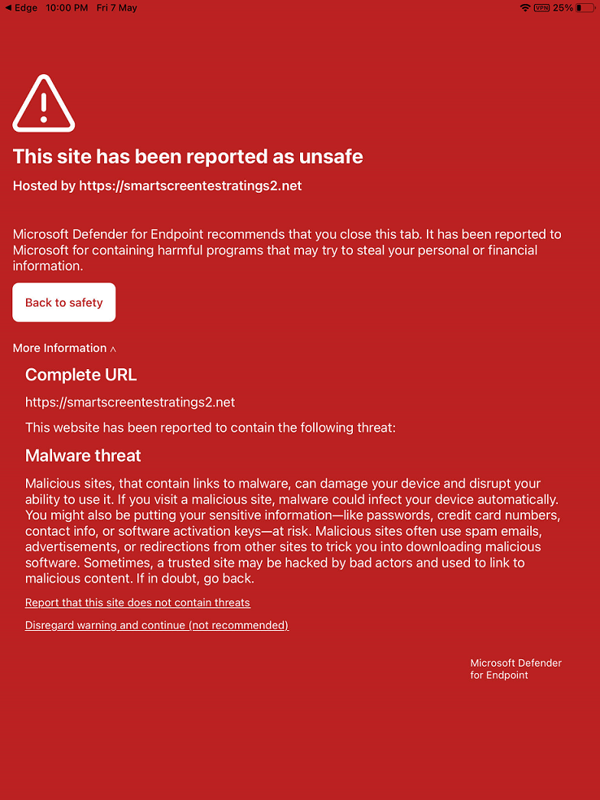

# Configure Microsoft Defender for Endpoint on iOS features

[!INCLUDE [Microsoft 365 Defender rebranding](../../includes/microsoft-defender.md)]

**Applies to:**
- [Microsoft Defender for Endpoint](https://go.microsoft.com/fwlink/p/?linkid=2154037)
- [Microsoft 365 Defender](https://go.microsoft.com/fwlink/?linkid=2118804)

> Want to experience Defender for Endpoint? [Sign up for a free trial.](https://www.microsoft.com/microsoft-365/windows/microsoft-defender-atp?ocid=docs-wdatp-exposedapis-abovefoldlink) 

> [!NOTE]
> Defender for Endpoint on iOS would use a VPN in order to provide the Web Protection feature. This is not a regular VPN and is a local/self-looping VPN that does not take traffic outside the device.

## How to disable VPN?

By default, Defender for Endpoint on iOS includes and enables the web protection feature. [Web protection](web-protection-overview.md) helps to secure devices against web threats and protect users from phishing attacks. Defender for Endpoint on iOS uses a VPN in order to provide this protection. Please note this is a local VPN and unlike traditional VPN, network traffic is not sent outside the device.

While enabled by default, there might be some cases that require you to disable VPN. For example, you want to run some apps that do not work when a VPN is configured. In such cases, you can choose to disable VPN from the app on the device by following the steps below:

1. On your iOS device, open the **Settings** app, click or tap **General** and then **VPN**.
1. Click or tap the "i" button for Microsoft Defender for Endpoint.
1. Toggle off **Connect On Demand** to disable VPN.

    > [!div class="mx-imgBorder"]
    > 

> [!NOTE]
> Web Protection will not be available when VPN is disabled. To re-enable Web Protection, open the Microsoft Defender for Endpoint app on the device and click or tap **Start VPN**.

## Co-existence of multiple VPN profiles

Apple iOS does not support multiple device-wide VPNs to be active simultaneously. While multiple VPN profiles can exist on the device, only one VPN can be active at a time.

## An app doesn't work when VPN is active

There are some apps that stop functioning when an active VPN is detected. You can disable the VPN during the time you are using such apps. Please see [steps to disable VPN](#how-to-disable-VPN).

## Battery Consumption

The battery usage by an app is computed by Apple based on a multitude of factors including CPU and Network usage. Microsoft Defender for Endpoint uses a local/loop-back VPN in the background to check web traffic for any malicious websites or connections. Network packets from any app go through this check and that causes the battery usage of Microsoft Defender for Endpoint to be computed inaccurately. This gives a false impression to the user. The actual battery consumption of Microsoft Defender for Endpoint is lesser than what is shown on the Battery Settings page on the device. This is based on conducted tests done on the Microsoft Defender for Endpoint app to understand battery consumption.

Also the VPN used is a local VPN and unlike a traditional VPN, network traffic is not sent outside the device.

## Data usage

Microsoft Defender for Endpoint uses a local/loopback VPN to check web traffic for any malicious websites or connections. Due to this reason Apple accounts data usage to Microsoft Defender for Endpoint inaccurately. The actual data usage by Microsoft Defender for Endpoint is not significant and much less than what is shown on the Data Usage Settings on the device.

## Report unsafe site

Phishing websites impersonate trustworthy websites for the purpose of obtaining your personal or financial information. Visit the [Provide feedback about network protection](https://www.microsoft.com/wdsi/filesubmission/exploitguard/networkprotection) page if you want to report a website that could be a phishing site.

## What happens if a malicious site is detected?

Microsoft Defender for Endpoint protects you against phishing or other web-based attacks. If a malicious site is detected, the connection is blocked and an alert is sent to the organization's Security Center portal. The alert includes the domain name of the connection, remote IP address and the device details.

In addition, a notification is shown on the iOS device. Tapping on the notification opens the following screen for the user to review the details.

> [!div class="mx-imgBorder"]
> 

## Data and Privacy

For details about data collected and privacy, see [Privacy Information - Microsoft Defender for Endpoint on iOS](ios-privacy.md).

