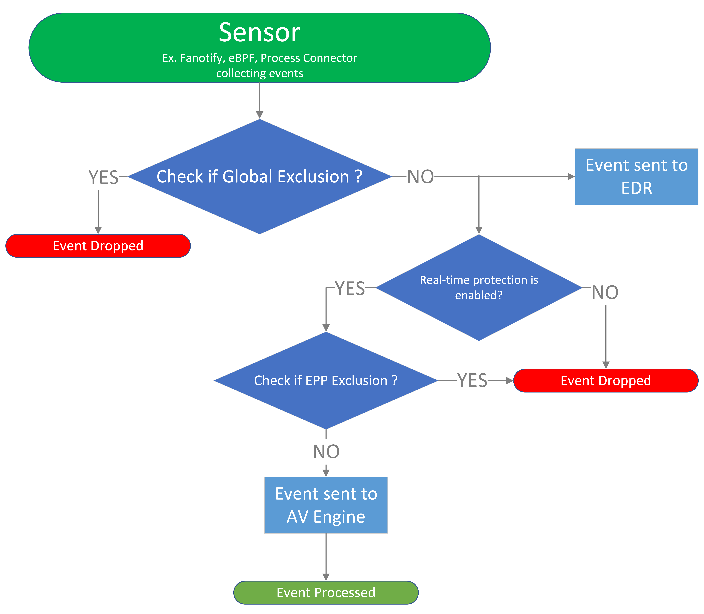

# Exclusion Settings for Microsoft Defender for Endpoint on Linux [PREVIEW]

[!INCLUDE [Microsoft 365 Defender rebranding](../../includes/microsoft-defender.md)]

**Applies to:**

- [Microsoft Defender for Endpoint Plan 1](https://go.microsoft.com/fwlink/?linkid=2154037)
- [Microsoft Defender for Endpoint Plan 2](https://go.microsoft.com/fwlink/p/?linkid=2154037)
- [Microsoft 365 Defender](https://go.microsoft.com/fwlink/?linkid=2118804)

> Want to experience Defender for Endpoint? [Sign up for a free trial.](https://signup.microsoft.com/create-account/signup?products=7f379fee-c4f9-4278-b0a1-e4c8c2fcdf7e&ru=https://aka.ms/MDEp2OpenTrial?ocid=docs-wdatp-investigateip-abovefoldlink)

This article provides information on how to configure exclusions that apply to real-time protection and monitoring through managed settings and command line.

> [!NOTE]
> This feature is currently in **PREVIEW** feature, but we continue to support the actions mentioned in [Set preferences for Microsoft Defender for Endpoint on Linux](linux-preferences.md) and [Configure and validate exclusions for Microsoft Defender for Endpoint on Linux](linux-exclusions.md).

## Supported exclusion scopes

Microsoft Defender for Endpoint on Linux supports two types of exclusion `scopes`: *epp* and *global*.

| Exclusion Scope | Description | Use Case |
| --- | --- | --- |
| EPP | Excludes content from antivirus (AV) scans. Also know as AV Exclusions. | Used to exclude files or directories from being scanned by the antivirus engine |
| Global | Implemented at the sensor level, mutes events that match the exclusions. | Used to exclude events from triggering EDR alerts and AV detetctions (through scans). Applicable to real-time protection and passive mode, but not to custom scans. |

More scopes will be introduced in future. 



Global Exclusions can be useful to avoid incorrect detections on trusted files or software that are unique or customized to your organization. They can also be useful for mitigating performance issues caused by Defender for Endpoint on Linux.

> [!WARNING]
> Defining exclusions lowers the protection offered by Defender for Endpoint on Linux. You should always evaluate the risks that are associated with implementing exclusions, and you should only exclude files that you are confident are not malicious.

## Supported exclusion types

The following tables show the exclusion types supported by Defender for Endpoint on Linux. You can exclude certain files, folders,extensions and processes. 

### For Antivirus Exclusions
These exclusions come under the *epp*

Exclusion|Definition|Examples
---|---|---
File extension|All files with the extension, anywhere on the device|`.test`
File|A specific file identified by the full path|`/var/log/test.log`<br/>`/var/log/*.log`<br/>`/var/log/install.?.log`
Folder|All files under the specified folder (recursively)|`/var/log/`<br/>`/var/*/`
Process|A specific process (specified either by the full path or file name) and all files opened by it|`/bin/cat`<br/>`cat`<br/>`c?t`

### For Global Exclusions
These exclusions come under the *global*

Exclusion|Definition|Examples
---|---|---
File|A specific file identified by the full path|`/var/log/test.log`
Folder|All files under the specified folder (recursively)|`/var/log/`
Process|A specific process specified by the full path and all files opened by it|`/bin/cat

> [!IMPORTANT]
> Global Exclusions does not support wildcard paths.

## How to configure the list of exclusions

### From the managed configuration

The *exclusionSettings* section of the configuration profile is used to manage the preferences and list the exclusions of the product.

|Description|Value|
|---|---|
|**Key**|exclusionSettings|
|**Data type**|Dictionary (nested preference)|
|**Comments**|See the following sections for a description of the dictionary contents.|

#### Merge policy

Specifies the merge policy for exclusions. It can be a combination of administrator-defined and user-defined exclusions (`merge`) or only administrator-defined exclusions (`admin_only`). This setting can be used to restrict local users from defining their own exclusions. It is applicable for exclusions of all [scopes](#supported-exclusion-scopes).

|Description|Value|
|---|---|
|**Key**|mergePolicy|
|**Data type**|String|
|**Possible values**|merge (default) <p> admin_only|
|**Comments**|Available in Defender for Endpoint version Sept 2023 or higher.|

#### Exclusions

Entities that have been excluded. Exclusions can be specified by full paths, extensions, or file names. Each exclusion has a scope that can be specified. 
(Exclusions are specified as an array of items, administrator can specify as many elements as necessary, in any order.)

|Description|Value|
|---|---|
|**Key**|exclusions|
|**Data type**|Dictionary (nested preference)|
|**Comments**|See the following sections for a description of the dictionary contents.|

##### Type of exclusion

Specifies the type of content excluded from the scan.

|Description|Value|
|---|---|
|**Key**|$type|
|**Data type**|String|
|**Possible values**|excludedPath <p> excludedFileExtension <p> excludedFileName|

##### Scopes of exclusion (optional)

Specifies the set of [scopes](#supported-exclusion-scopes) of content excluded. Scopes supported are `epp` and `global`.

If nothing is specified in for an exclusion under *exclusionSettings* in managed configuration, then `global` is considered as scope.

|Description|Value|
|---|---|
|**Key**|scopes|
|**Data type**|Set of strings|
|**Possible values**|epp <p> global|

>[!NOTE]
>Previously applied exclusions using (`mdatp_managed.json`) or by CLI will remain unaffected. The scope for those exclusions will be (`epp`) since they were added under (`antivirusEngine`).

##### Path to excluded content

Used to exclude content from the scan by full file path.

|Description|Value|
|---|---|
|**Key**|path|
|**Data type**|String|
|**Possible values**|valid paths|
|**Comments**|Applicable only if *$type* is *excludedPath*. Wildcard not supported if exclusion has *global* as a scope.|

##### Path type (file / directory)

Indicates if the *path* property refers to a file or directory.

|Description|Value|
|---|---|
|**Key**|isDirectory|
|**Data type**|Boolean|
|**Possible values**|false (default) <p> true|
|**Comments**|Applicable only if *$type* is *excludedPath* Wildcard not supported if exclusion has *global* as a scope.|

##### File extension excluded from the scan

Used to exclude content from the scan by file extension.

|Description|Value|
|---|---|
|**Key**|extension|
|**Data type**|String|
|**Possible values**|valid file extensions|
|**Comments**|Applicable only if *$type* is *excludedFileExtension*. Not supported if exclusion has *global* as a scope.|

##### Process excluded from the scan*

Specifies a process for which all file activity is excluded from scanning. The process can be specified either by its name (for example, `cat`) or full path (for example, `/bin/cat`).

|Description|Value|
|---|---|
|**Key**|name|
|**Data type**|String|
|**Possible values**|any string|
|**Comments**|Applicable only if *$type* is *excludedFileName*. Wildcard and process name not supported if exclusion has *global* as a scope, need to provide full path.|

For more information about managed configuration, see [Set preferences for Microsoft Defender for Endpoint on Linux](linux-preferences.md)

#### Sample profile

```JSON
{
   "exclusionSettings":{
        "exclusions":[
           {
              "$type":"excludedPath",
              "isDirectory":true,
              "path":"/home/*/git<EXAMPLE DO NOT USE>",
              "scopes": [
                    "epp"
              ]
           },
           {
              "$type":"excludedPath",
              "isDirectory":true,
              "path":"/run<EXAMPLE DO NOT USE>",
              "scopes": [
                    "global"
              ]
           },
           {
              "$type":"excludedPath",
              "isDirectory":false,
              "path":"/var/log/system.log<EXAMPLE DO NOT USE><SAME AS APPLYING ONLY GLOBAL>",
              "scopes": [
                    "epp", "global"
              ]
           },
           {
              "$type":"excludedFileExtension",
              "extension":".pdf<EXAMPLE DO NOT USE>",
              "scopes": [
                    "epp"
              ]
           },
           {
              "$type":"excludedFileName",
              "name":"/bin/cat<EXAMPLE DO NOT USE><NO SCOPE PROVIDED - GLOBAL CONSIDERED>"
           }
        ],
        "mergePolicy":"admin_only",
   }
}
```

### From the command line

#### For Global Exclusions

Similar to how AV exclusions ( scope = `epp` ) are configured in [How to configure list of exclusions from the command line](linux-exclusions.md#from-the-command-line).

Run the following command to see the available switches for managing exclusions:

> [!NOTE]
> --scope is an optional flag with accepted values as *epp* or *global*. 
> Provide same scope used during adding exclusion to remove exclusions.

```bash
mdatp exclusion
```

Examples:

- Add/Remove a global exclusion for a file extension:

    ```bash
    mdatp exclusion extension add --name .txt --scope global
    ```

    ```Output
    Extension exclusion configured successfully
    ```

    ```bash
    mdatp exclusion extension remove --name .txt --scope global
    ```

    ```Output
    Extension exclusion removed successfully
    ```

- Add/Remove a global exclusion for a file:

    ```bash
    mdatp exclusion file add --path /var/log/dummy.log --scope global
    ```

    ```Output
    File exclusion configured successfully
    ```

    ```bash
    mdatp exclusion file remove --path /var/log/dummy.log --scope global
    ```

    ```Output
    Extension exclusion removed successfully
    ```

- Add/Remove a global exclusion for a folder:

    ```bash
    mdatp exclusion folder add --path /var/log/ --scope global
    ```

    ```Output
    Folder exclusion configured successfully
    ```

    ```bash
    mdatp exclusion folder remove --path /var/log/ --scope global
    ```

    ```Output
    Extension exclusion removed successfully
    ```


- Add/Remove a global exclusion for a process:

    ```bash
    mdatp exclusion process add --name /usr/bin/cat  --scope global
    ```

    ```Output
    Process exclusion configured successfully
    ```

    ```bash
    mdatp exclusion process remove --name /usr/bin/cat  --scope global
    ```

    ```Output
    Extension exclusion removed successfully
    ```

## Validate Exclusions

Same as [Validate exclusions lists with the EICAR test file](linux-exclusions.md#validate-exclusions-lists-with-the-eicar-test-file).

[!INCLUDE [Microsoft Defender for Endpoint Tech Community](../../includes/defender-mde-techcommunity.md)]
