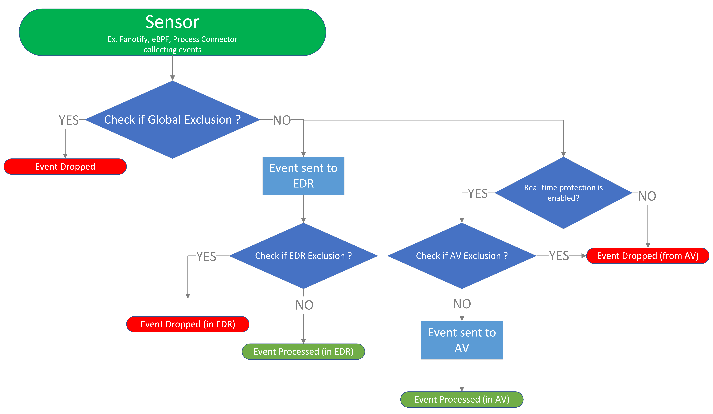

# Global Exclusions for Microsoft Defender for Endpoint on Linux

[!INCLUDE [Microsoft 365 Defender rebranding](../../includes/microsoft-defender.md)]

**Applies to:**

- [Microsoft Defender for Endpoint Plan 1](https://go.microsoft.com/fwlink/?linkid=2154037)
- [Microsoft Defender for Endpoint Plan 2](https://go.microsoft.com/fwlink/p/?linkid=2154037)
- [Microsoft 365 Defender](https://go.microsoft.com/fwlink/?linkid=2118804)

> Want to experience Defender for Endpoint? [Sign up for a free trial.](https://signup.microsoft.com/create-account/signup?products=7f379fee-c4f9-4278-b0a1-e4c8c2fcdf7e&ru=https://aka.ms/MDEp2OpenTrial?ocid=docs-wdatp-investigateip-abovefoldlink)

This article provides information on how to define Global Exclusions that apply to real-time protection and monitoring.

Global Exclusions are implemented at the level of sensors, by muting the events that match the exclusions. Hence they don't trigger EDR or AV alerts and are excluded from scanning.

> [!NOTE]
> Apart from real-time protection, Global Exclusions are also applicable to passive mode as sensor events will still be passed to EDR. However they will not be applied during a mdatp custom scan.



Global Exclusions can be useful to avoid incorrect detections on files or software that are unique or customized to your organization. They can also be useful for mitigating performance issues caused by Defender for Endpoint on Linux.

> [!WARNING]
> Defining exclusions lowers the protection offered by Defender for Endpoint on Linux. You should always evaluate the risks that are associated with implementing exclusions, and you should only exclude files that you are confident are not malicious.

## Supported exclusion types

The following table shows the exclusion types supported by Defender for Endpoint on Linux. You can exclude certain files, folders, processes. These exclusions come under the *global* [scope](linux-preferences.md#scopes-of-exclusion-optional).

Exclusion|Definition|Examples
---|---|---
File|A specific file identified by the full path|`/var/log/test.log`
Folder|All files under the specified folder (recursively)|`/var/log/`
Process|A specific process specified by the full path and all files opened by it|`/bin/cat

> [!IMPORTANT]
> Global Exclusions does not support wildcard paths.

## How to configure the list of exclusions

### From the manged configuration

For more information, see [Exclusion Settings under set preferences for Defender for Endpoint on Linux](linux-preferences.md#exclusion-setting-preferences-preview)

#### Sample profile

```JSON
{
   "exclusionSettings":{
        "exclusions":[
           {
              "$type":"excludedPath",
              "isDirectory":true,
              "path":"/home/*/git<EXAMPLE DO NOT USE>",
              "scopes": [
                    "epp"
              ]
           },
           {
              "$type":"excludedPath",
              "isDirectory":true,
              "path":"/run<EXAMPLE DO NOT USE>",
              "scopes": [
                    "global"
              ]
           },
           {
              "$type":"excludedPath",
              "isDirectory":false,
              "path":"/var/log/system.log<EXAMPLE DO NOT USE><SAME AS APPLYING ONLY GLOBAL>",
              "scopes": [
                    "epp", "global"
              ]
           },
           {
              "$type":"excludedFileExtension",
              "extension":".pdf<EXAMPLE DO NOT USE>",
              "scopes": [
                    "epp"
              ]
           },
           {
              "$type":"excludedFileName",
              "name":"/bin/cat<EXAMPLE DO NOT USE><NO SCOPE PROVIDED - GLOBAL CONSIDERED>"
           }
        ],
        "mergePolicy":"admin_only",
   }
}
```

### From the command line

Similar to how AV exclusions ( scope = *'epp'* ) are configured in [How to configure list of exclusions from the command line](linux-exclusions.md#From-the-command-line).

Run the following command to see the available switches for managing exclusions:

```bash
mdatp exclusion
```

Examples:

- Add/Remove a global exclusion for a file extension:

    ```bash
    mdatp exclusion extension add --name .txt --scope global
    ```

    ```Output
    Extension exclusion configured successfully
    ```

    ```bash
    mdatp exclusion extension remove --name .txt --scope global
    ```

    ```Output
    Extension exclusion removed successfully
    ```

- Add/Remove a global exclusion for a file:

    ```bash
    mdatp exclusion file add --path /var/log/dummy.log --scope global
    ```

    ```Output
    File exclusion configured successfully
    ```

    ```bash
    mdatp exclusion file remove --path /var/log/dummy.log --scope global
    ```

    ```Output
    Extension exclusion removed successfully
    ```

- Add/Remove a global exclusion for a folder:

    ```bash
    mdatp exclusion folder add --path /var/log/ --scope global
    ```

    ```Output
    Folder exclusion configured successfully
    ```

    ```bash
    mdatp exclusion folder remove --path /var/log/ --scope global
    ```

    ```Output
    Extension exclusion removed successfully
    ```


- Add/Remove a global exclusion for a process:

    ```bash
    mdatp exclusion process add --name /usr/bin/cat  --scope global
    ```

    ```Output
    Process exclusion configured successfully
    ```

    ```bash
    mdatp exclusion process remove --name /usr/bin/cat  --scope global
    ```

    ```Output
    Extension exclusion removed successfully
    ```

## Validate global exclusions

Same as [Validate exclusions lists with the EICAR test file](linux-exclusions.md#Validate-exclusions-lists-with-the-EICAR-test-file).

[!INCLUDE [Microsoft Defender for Endpoint Tech Community](../../includes/defender-mde-techcommunity.md)]
