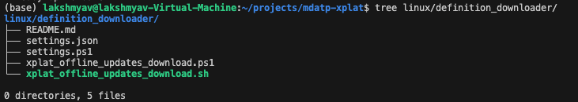

# Configure Offline Definitions Update for Microsoft Defender for Endpoint on Linux

[!INCLUDE [Microsoft 365 Defender rebranding](../../includes/microsoft-defender.md)]

**Applies to:**

- [Microsoft Defender for Endpoint on Linux](microsoft-defender-endpoint-linux.md)
- [Microsoft Defender for Endpoint Plan 1](https://go.microsoft.com/fwlink/p/?linkid=2154037)
- [Microsoft Defender for Endpoint Plan 2](https://go.microsoft.com/fwlink/p/?linkid=2154037)

The offline definition update feature of Microsoft Defender for Endpoint on Linux enables organizations to download definitions on Linux endpoints which are not exposed to the internet via a local hosting server (termed as *Mirror Server* in this document). The Mirror Server is any server in the customer's environment which can connect to the Microsoft cloud to download the signatures. Other Linux endpoints pull the definitions from the Mirror Server at a predefined interval.

Key benefits include:

- Instead of exposing your entire fleet to the internet, you can now just use one local server to poll the Microsoft cloud to get the latest signatures. Thus, reducing risk and network bandwidth 
- This feature lets you control and manage the frequency of signature downloads on the local server 
- Customers can also control and manage the frequency at which the Linux endpoints pull the signatures from the local server 
- You can test the downloaded signatures on a test device before propagating it to the entire fleet, providing greater security and control 
- Local server can run any of the 3 OS -  Windows, Mac, Linux 
- Signatures are always downloaded along with the latest compatible AV engine. Thus, keeping AV engine + signatures updated after every cycle 
- You can keep a backup of n-1 signature version as well on the local server

## How offline definition update works

- Organizations need to set up a local hosting server which is reachable to Microsoft cloud; management and maintenance of the local server will be controlled by the organization 
- Signatures are downloaded from MS Cloud on this local Web/NFS server by executing a script using cron job/task scheduler on the local server 
- Endpoints running MDE will pull the downloaded signatures from this local web/nfs server at a user defined time interval 
- Signatures pulled on the endpoints from the local server are first verified before loading it into the MDE Agent 

## Prerequisites

- MDE version "101.24012.0001" or higher needs to be installed on the Linux endpoints.
- The Linux endpoints need to have connectivity to the Mirror Server.
- The Mirror Server can be either an HTTP/ HTTPS server or a network share server. For e.g., an NFS Server.
- The Mirror Server needs to have access to the following URLs:
    - https://github.com/microsoft/mdatp-xplat.git 
    - https://go.microsoft.com/fwlink/?linkid=2144709 
- The following operating systems are supported for the Mirror Server:
    - Linux (Any Flavor)
    - Windows (Any Version)
    - Mac (Any version)
- The Mirror Server should support bash or PowerShell.
- The following minimum system specifications are required for the Mirror Server:

    | CPU Core	| RAM	| Free disk	 | Swap |
    |--|--|--|--|
    | 2 cores (Preferred 4 Core) |	1 GB Min	(Preferred 4 GB)  | 2 GB	 | System Dependent|

    > NOTE: The above configuration may vary depending on the number of requests that are served and the load each server must process.

- The Linux endpoint must be running any of the MDE supported distributions.


## Configuring the Mirror Server

> [!NOTE]
> The management and ownership of the Mirror Server lies solely with the customer as it resides in the customer's private environment.

> [!NOTE]
> The Mirror Server is not required to have MDE installed.

Microsoft hosts a downloader script on [this GitHub repo](https://github.com/microsoft/mdatp-xplat).

Follow these steps to get the downloader script:

#### Option 1: Clone the repo (Preferred)

- [Install git](https://kinsta.com/knowledgebase/install-git/) on the Mirror Server.
- Navigate to the directory where you want to clone the repo.
- Execute the command: `git clone https://github.com/microsoft/mdatp-xplat.git`

#### Option 2: Download the zip file

- Download the zip file of the repo as shown here.

- Copy the zip file to the folder where you want to keep the script.
- Extract the zip.

After cloning the repo / downloading the zip file, the local directory structure should be as follows:



> NOTE
Go through the README file to understand in detail about how to use the script.

The `settings.json` file consists of a few variables which the user can configure to determine the output of the script execution.

| Field Name               | Value  | Description                                            |
|--------------------------|--------|--------------------------------------------------------|
| `downloadFolder`         | string | Maps to the location which the script downloads the files to |
| `downloadLinuxUpdates`   | bool   | When set to true, the script downloads the Linux specific updates to the `downloadFolder` |
| `logFilePath`            | string | Sets up the diagnostic logs at a given folder. This file can be shared with Microsoft for debugging the script if it is not working |
| `downloadMacUpdates`     | bool   | The script downloads the Mac specific updates to the `downloadFolder` |
| `downloadPreviewUpdates` | bool   | Downloads the preview version of the updates available for the specific OS |
| `backupPreviousUpdates`  | bool   | Allows the script to copy the previous update in the _back folder, and new updates are downloaded to `downloadFolder` |

Execute the downloader script based on the OS of the Mirror Server:
- Bash
  `./xplat_offline_updates_download.sh`
- PowerShell
  `./xplat_offline_updates_download.ps1`

Once the script is executed, the latest definitions will get downloaded to the folder configured in the `settings.json` file (`updates.zip`).

Execute the downloaded script: 

- Linux/ Mac: Schedule a cron job (Linux/ Mac) to trigger the execution of downloader script at the scheduled time. Sample command:

    `0 * * * * /path/to/your/command`

- Windows: [Schedule a cron job in Windows](https://phoenixnap.com/kb/cron-job-windows)


Once the definitions zip is downloaded, it is ready to be hosted by the Mirror Server. The Mirror Server can be hosted using any HTTP / HTTPS / Network share servers.

Once hosted, copy the absolute path of the hosted server (up to and not including the `arch_*` directory).

For example, if the script is executed with `downloadFolder=/tmp/wdav-update`, and the HTTP server (www.example.server.com:8000) is hosting the `/tmp/wdav-update` path, the URI will be: `http://www.example.server.com:8000/linux/production/`

Once the Mirror Server is set up, we need to propagate this URL to the Linux endpoints using the Managed Configuration as described in the next section.

## Configure the Endpoints

-   Use the following sample `mdatp_managed.json` and update the parameters as per the configuration and copy the file to the location `/etc/opt/microsoft/mdatp/managed/mdatp_managed.json`.

```
{
  "cloudService": {
    "automaticDefinitionUpdateEnabled": true,
    "definitionUpdatesInterval": 1202
  },
  "antivirusEngine": {
    "offlineDefinitionUpdateUrl": "http://172.22.199.67:8000/linux/production/",
    "offlineDefintionUpdateFallbackToCloud":false
  },
  "features": {
    "offlineDefinitionUpdate": "disabled"
  }
}
```

| Field Name                                | Values               | Comments                                            |
|-------------------------------------------|----------------------|-----------------------------------------------------|
| `automaticDefinitionUpdateEnabled`        | True / False         | Determines the behavior of MDE attempting to perform updates automatically, is turned on or off respectively |
| `definitionUpdatesInterval`               | Numeric              | Time of interval between each auto update of definitions (in seconds) |
| `offlineDefinitionUpdateUrl`              | String               | URL value generated as part of the Mirror Server set up |
| `offlineDefinitionUpdate`                 | enabled / disabled   | When set to `enabled`, offline definition update feature is enabled, and vice versa. |
| `offlineDefinitionUpdateFallbackToCloud`  | True / False         | Determine MDE update approach when offline Mirror Server fails to serve the update request. If set to true, the update will be retried via the Microsoft cloud when offline definition update failed, else vice versa. |

## Useful commands

### Check update status
- Once the Mirror Server and the Linux endpoints have been configured, to test if the settings are applied correctly on the Linux endpoints:
    ```
    mdatp health --details --definitions
    ```
   Verify the updated fields according to the managed.json

   

### Manual update
- Trigger a manual update request from the Linux endpoints to download the definitions from the Mirror Server using the command:
    `mdatp definitions update`

## Troubleshooting and Diagnostics

### Issues: MDATP update failure

- Update stuck or update did not trigger
- Update failed

### Common Troubleshooting Steps

- Check the status of offline definition update by using the command: `mdatp health -details definitions`
    - This should provide us with some user-friendly message in the `definitions_update_fail_reason` section.
    - Check if `offline_definition_update` and `offline_definition_update_verify_sig` is enabled.
    - Check if `definitions_update_source_uri` is equal to `offline_definition_url_configured`
        - `definitions_update_source_uri` is the source from where the definitions were downloaded.
        - `offline_definition_url_configured` is the source from where definitions should have been downloaded, the one mentioned in the managed config file.
- Try performing the connectivity test to check if Mirror Server is reachable from the host: 
    - `mdatp connectivity test`
- Try to trigger manual update using the command: 
    - `mdatp definitions update`


## FAQ

### Q. Can we manage / configure offline definitions update via Security Portal?
A. No, as of today you can configure it via managed json only. Integration with security settings management on the security portal is in our roadmap.

### Q. Is it required to install Microsoft Defender on Endpoint on the Mirror Server?
A. No, the Mirror Server need not have Microsoft Defender for Endpoint installed. The Mirror Server's management and maintenance ownership lies with the customers since the Mirror Server resides in the customer's private environment and Microsoft will have no visibility into it.

### Q. Is Automatic rollback available? 
A. In case of an issue with the latest downloaded signatures, you can pull the signatures on your Linux endpoints from the backup folder on the local server, which will contain signatures with n-1 version.
