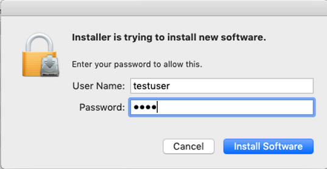
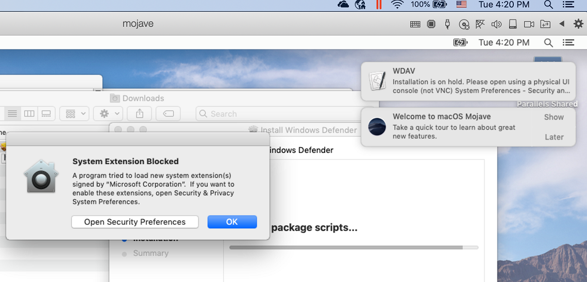
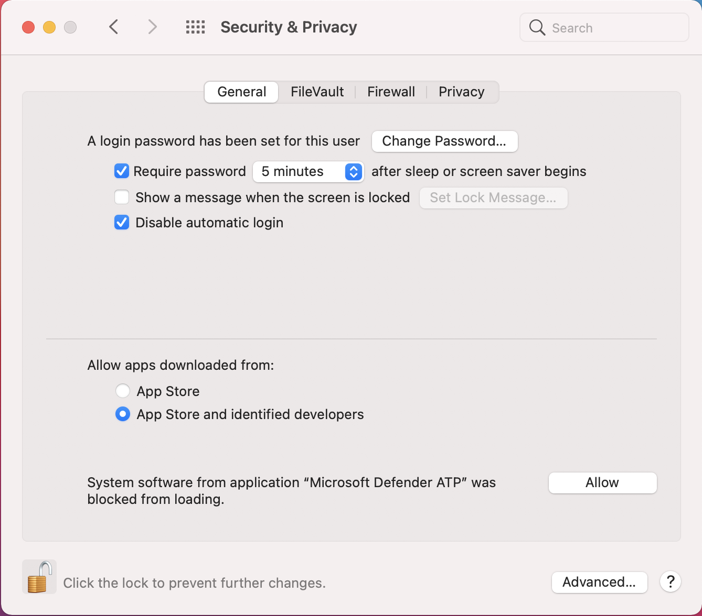

# Manual deployment for Microsoft Defender for Endpoint for macOS

[!INCLUDE [Microsoft 365 Defender rebranding](../../includes/microsoft-defender.md)]

**Applies to:**
- [Microsoft Defender for Endpoint](https://go.microsoft.com/fwlink/p/?linkid=2154037)
- [Microsoft 365 Defender](https://go.microsoft.com/fwlink/?linkid=2118804)

> Want to experience Defender for Endpoint? [Sign up for a free trial.](https://www.microsoft.com/microsoft-365/windows/microsoft-defender-atp?ocid=docs-wdatp-investigateip-abovefoldlink)

This topic describes how to deploy Microsoft Defender for Endpoint for macOS manually. A successful deployment requires the completion of all of the following steps:
- [Download installation and onboarding packages](#download-installation-and-onboarding-packages)
- [Application installation (macOS 10.15 and older versions)](#application-installation-macos-1015-and-older-versions)
- [Application installation (macOS 11 and newer versions)](#application-installation-macos-11-and-newer-versions)
- [Client configuration](#client-configuration)

## Prerequisites and system requirements

Before you get started, see [the main Microsoft Defender for Endpoint for macOS page](microsoft-defender-endpoint-mac.md) for a description of prerequisites and system requirements for the current software version.

## Download installation and onboarding packages

Download the installation and onboarding packages from Microsoft Defender Security Center:

1. In Microsoft Defender Security Center, go to **Settings > Device Management > Onboarding**.
2. In Section 1 of the page, set operating system to **macOS** and Deployment method to **Local script**.
3. In Section 2 of the page, select **Download installation package**. Save it as wdav.pkg to a local directory.
4. In Section 2 of the page, select **Download onboarding package**. Save it as WindowsDefenderATPOnboardingPackage.zip to the same directory.

    

5. From a command prompt, verify that you have the two files.
    
## Application installation (macOS 10.15 and older versions)

To complete this process, you must have admin privileges on the device.

1. Navigate to the downloaded wdav.pkg in Finder and open it.

    

2. Select **Continue**, agree with the License terms, and enter the password when prompted.

    

   > [!IMPORTANT]
   > You will be prompted to allow a driver from Microsoft to be installed (either "System Extension Blocked" or "Installation is on hold" or both. The driver must be allowed to be installed.

   

3. Select **Open Security Preferences** or **Open System Preferences > Security & Privacy**. Select **Allow**:

    

   The installation proceeds.

   > [!CAUTION]
   > If you don't select **Allow**, the installation will proceed after 5 minutes. Microsoft Defender for Endpoint will be loaded, but some features, such as real-time protection, will be disabled. See [Troubleshoot kernel extension issues](mac-support-kext.md) for information on how to resolve this.

> [!NOTE]
> macOS may request to reboot the device upon the first installation of Microsoft Defender for Endpoint. Real-time protection will not be available until the device is rebooted.

## Application installation (macOS 11 and newer versions)

To complete this process, you must have admin privileges on the device.

1. Navigate to the downloaded wdav.pkg in Finder and open it.

    

2. Select **Continue**, agree with the License terms, and enter the password when prompted.

3. At the end of the installation process, you'll be promoted to approve the system extensions used by the product. Select **Open Security Preferences**.

    

4. From the **Security & Privacy** window, select **Allow**.

    

5. Repeat steps 3 & 4 for all system extensions distributed with Microsoft Defender for Endpoint for Mac.

6. As part of the Endpoint Detection and Response capabilities, Microsoft Defender for Endpoint for Mac inspects socket traffic and reports this information to the Microsoft Defender Security Center portal. When prompted to grant Microsoft Defender for Endpoint permissions to filter network traffic, select **Allow**.

    

7. Open **System Preferences** > **Security & Privacy** and navigate to the **Privacy** tab. Grant **Full Disk Access** permission to **Microsoft Defender ATP** and **Microsoft Defender ATP Endpoint Security Extension**.

    

## Client configuration

1. Copy wdav.pkg and MicrosoftDefenderATPOnboardingMacOs.py to the device where you deploy Microsoft Defender for Endpoint for macOS.

    The client device isn't associated with orgId. Note that the *orgId* attribute is blank.

    ```bash
    mdatp health --field org_id
    ```

2. Run the Python script to install the configuration file:

    ```bash
    /usr/bin/python MicrosoftDefenderATPOnboardingMacOs.py
    ```

3. Verify that the device is now associated with your organization and reports a valid *orgId*:

    ```bash
    mdatp health --field org_id
    ```

After installation, you'll see the Microsoft Defender icon in the macOS status bar in the top-right corner.

   
   

## How to Allow Full Disk Access

> [!CAUTION]
> macOS 10.15 (Catalina) contains new security and privacy enhancements. Beginning with this version, by default, applications are not able to access certain locations on disk (such as Documents, Downloads, Desktop, etc.) without explicit consent. In the absence of this consent, Microsoft Defender for Endpoint is not able to fully protect your device.

1. To grant consent, open **System Preferences** > **Security & Privacy** > **Privacy** > **Full Disk Access**. Click the lock icon to make changes (bottom of the dialog box). Select Microsoft Defender for Endpoint.

2. Run an AV detection test to verify that the device is properly onboarded and reporting to the service. Perform the following steps on the newly onboarded device:

- Ensure that real-time protection is enabled (denoted by a result of 1 from running the following command):

```bash
    mdatp health --field real_time_protection_enabled
```

- Open a Terminal window. Copy and execute the following command:

```bash
    curl -o ~/Downloads/eicar.com.txt https://www.eicar.org/download/eicar.com.txt
```

- The file should have been quarantined by Defender for Endpoint for Mac. Use the following command to list all the detected threats:

```bash
    mdatp threat list
```

3. Run an EDR detection test to verify that the device is properly onboarded and reporting to the service. Perform the following steps on the newly onboarded device:
In your browser such as Microsoft Edge for Mac or Safari
Download MDATP MacOS DIY.zip from https://aka.ms/mdatpmacosdiy and extract.
You may get prompted:

> Do you want to allow downloads on "mdatpclientanalyzer.blob.core.windows.net"?
You can change which websites can download files in Websites Preferences.

4. Click **Allow**.
5. Open **Downloads**.
6. You should see **MDATP MacOS DIY**.

> [!TIP]
> If you double-click, you will get the following message:
"MDATP MacOS DIY" cannot be opened because the developer cannot be verifier.
macOS cannot verify that this app is free from malware.
Move to **Trash Cancel**.
Click **Cancel**.
Right-click on **MDATP MacOS DIY**.
Click **Open**.

macOS cannot verify the developer of **MDATP MacOS DIY**. Are you sure you want to open it?
By opening this app, you will be overriding system security which can expose your computer and personal information to malware that may harm your Mac or compromise your privacy.
Click **Open**.

Microsoft Defender ATP - macOS EDR DIY test file
Corresponding alert will be available in the MDATP portal.
Cancel **Open**.
Click **Open**.
In a few minutes an alert named macOS EDR Test Alert should be raised.

Go to Microsoft Defender Security Center (https://SecurityCenter.microsoft.com)
Go to the Alert Queue
:::image type="content" source="images/b8db76c2-c368-49ad-970f-dcb87534d9be.png" alt-text="aaa":::
Look at the alert details, device timeline and perform the regular investigation steps.

## Logging installation issues

See [Logging installation issues](mac-resources.md#logging-installation-issues) for more information on how to find the automatically generated log that is created by the installer when an error occurs.

## Uninstallation

See [Uninstalling](mac-resources.md#uninstalling) for details on how to remove Microsoft Defender for Endpoint for macOS from client devices.
