# Intune-based deployment for Microsoft Defender for Endpoint on macOS

[!INCLUDE [Microsoft 365 Defender rebranding](../../includes/microsoft-defender.md)]

**Applies to:**

- [Microsoft Defender for Endpoint on macOS](microsoft-defender-endpoint-mac.md)

This topic describes how to deploy Microsoft Defender for Endpoint on macOS through Intune. A successful deployment requires the completion of all of the following steps:

1. [Download installation and onboarding packages](#download-the-onboarding-packages)
1. [Client device setup](#client-device-setup)
1. [Approve system extensions](#approve-system-extensions)
1. [Create System Configuration profiles](#create-system-configuration-profiles)
1. [Publish application](#publish-application)

## Prerequisites and system requirements

Before you get started, see [the main Microsoft Defender for Endpoint on macOS page](microsoft-defender-endpoint-mac.md) for a description of prerequisites and system requirements for the current software version.

## Overview

The following table summarizes the steps you would need to take to deploy and manage Microsoft Defender for Endpoint on Macs, via Intune. More detailed steps are available below.

| Step | Sample file names | BundleIdentifier |
|-|-|-|
| [Download installation and onboarding packages](#download-the-onboarding-packages) | WindowsDefenderATPOnboarding__MDATP_wdav.atp.xml | com.microsoft.wdav.atp |
| [Approve System Extension for Microsoft Defender for Endpoint](#approve-system-extensions) | MDATP_SysExt.xml | N/A |
| [Approve Kernel Extension for Microsoft Defender for Endpoint](#download-the-onboarding-package) | MDATP_KExt.xml | N/A |
| [Grant full disk access to Microsoft Defender for Endpoint](#create-system-configuration-profiles-step-8) | MDATP_tcc_Catalina_or_newer.xml | com.microsoft.wdav.tcc |
| [Network Extension policy](#create-system-configuration-profiles-step-9) | MDATP_NetExt.xml | N/A |
| [Configure Microsoft AutoUpdate (MAU)](https://docs.microsoft.com/microsoft-365/security/defender-endpoint/mac-updates#intune) | MDATP_Microsoft_AutoUpdate.xml | com.microsoft.autoupdate2 |
| [Microsoft Defender for Endpoint configuration settings](https://docs.microsoft.com/microsoft-365/security/defender-endpoint/mac-preferences#intune-profile-1)<br/><br/> **Note:** If you're planning to run a third-party AV for macOS, set `passiveMode` to `true`. | MDATP_WDAV_and_exclusion_settings_Preferences.xml | com.microsoft.wdav |
| [Configure Microsoft Defender for Endpoint and MS AutoUpdate (MAU) notifications](#create-system-configuration-profiles-step-10) | MDATP_MDAV_Tray_and_AutoUpdate2.mobileconfig | com.microsoft.autoupdate2 or com.microsoft.wdav.tray |

## Download the onboarding package

Download the onboarding packages from Microsoft Defender Security Center:

1. In Microsoft Defender Security Center, go to **Settings** > **Device Management** > **Onboarding**.

2. Set the operating system to **macOS** and the deployment method to **Mobile Device Management / Microsoft Intune**.

    

3. Select **Download onboarding package**. Save it as _WindowsDefenderATPOnboardingPackage.zip_ to the same directory.

4. Extract the contents of the .zip file:

    ```bash
    unzip WindowsDefenderATPOnboardingPackage.zip
    ```
    ```Output
    Archive:  WindowsDefenderATPOnboardingPackage.zip
    warning:  WindowsDefenderATPOnboardingPackage.zip appears to use backslashes as path separators
      inflating: intune/kext.xml
      inflating: intune/WindowsDefenderATPOnboarding.xml
      inflating: jamf/WindowsDefenderATPOnboarding.plist
    ```

## Create System Configuration profiles

The next step is to create system configuration profiles that Microsoft Defender for Endpoint needs.
In the [Microsoft Endpoint Manager admin center](https://endpoint.microsoft.com/), open **Devices** > **Configuration profiles**.

### Onboarding blob

This profile contains a license information for Microsoft Defender for Endpoint, without it it will report that it is not licensed.

1. Select **Create Profile** under **Configuration Profiles**
1. Select **Platform**=**macOS**, **Profile type**=**Templates**. **Template name**=**Custom**. Click **Create**.

    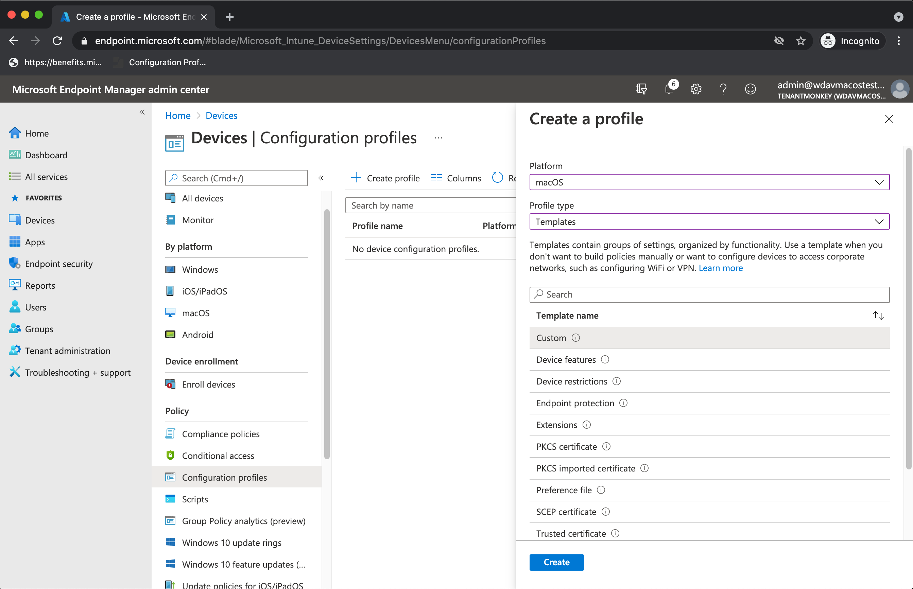

1. Choose a name for the profile, e.g. "MDATP onboarding for macOS". Click **Next**.

    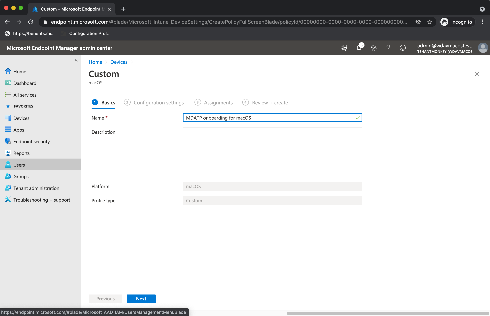

1. Choose a name for the configuration profile name, e.g. "MDATP onboarding for macOS".
1. Select intune/WindowsDefenderATPOnboarding.xml that you extracted from the onboarding package above as configuration profile file.

    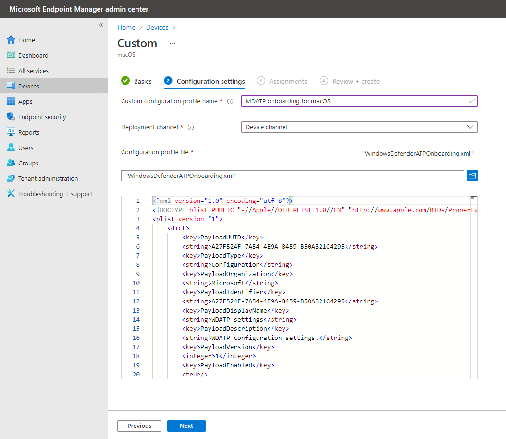

1. Click **Next**.
1. Assign devices on the **Assignment** tab. Click **Next**.

    

1. Review and **Create**.
1. Open **Devices** > **Configuration profiles**, you can see your created profile there.

    

### Approve System Extensions

This profile is needed for macOS 10.15 (Catalina) or newer. It will be ignored on older macOS.

1. Select **Create Profile** under **Configuration Profiles**
1. Select **Platform**=**macOS**, **Profile type**=**Templates**. **Template name**=**Extensions**. Click **Create**.
1. In the **Basics** tab, give a name to this new profile.
1. In the **Configuration settings** tab, expand **System Extensions** add the following entries in the **Allowed system extensions** section:

    Bundle identifier         | Team identifier
    --------------------------|----------------
    com.microsoft.wdav.epsext | UBF8T346G9
    com.microsoft.wdav.netext | UBF8T346G9

    > [!div class="mx-imgBorder"]
    > 

1. In the **Assignments** tab, assign this profile to **All Users & All devices**.
1. Review and create this configuration profile.

### Kernel Extensions

This profile is needed for macOS 10.15 (Catalina) or older. It will be ignored on newer macOS.

> [!CAUTION]
> Apple Silicon (M1) devices do not support KEXT. Installation of a configuration profile consisting KEXT policies will fail on these devices.

1. Select **Create Profile** under **Configuration Profiles**
1. Select **Platform**=**macOS**, **Profile type**=**Templates**. **Template name**=**Extensions**. Click **Create**.
1. In the **Basics** tab, give a name to this new profile.
1. In the **Configuration settings** tab, expand **Kernel Extensions**.
1. Set **Team identifier** to **UBF8T346G9** and click Next.

    > 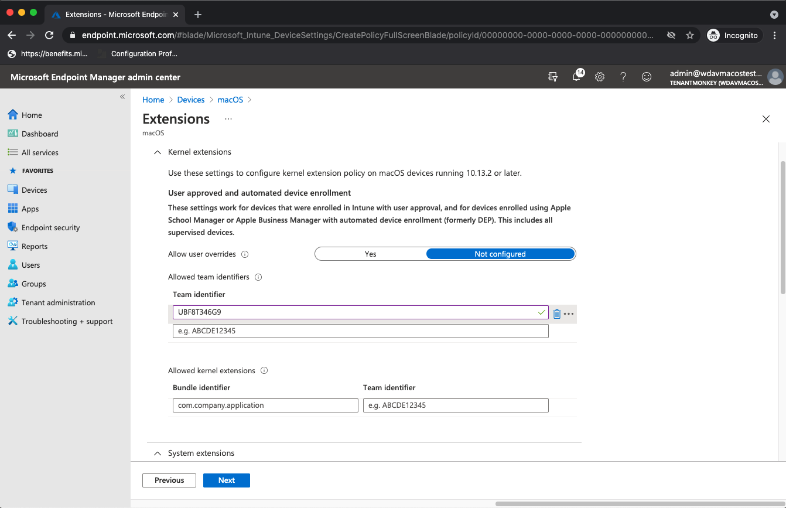

1. In the **Assignments** tab, assign this profile to **All Users & All devices**.
1. Review and create this configuration profile.

### Full Disk Access

   > [!CAUTION]
   > macOS 10.15 (Catalina) contains new security and privacy enhancements. Beginning with this version, by default, applications are not able to access certain locations on disk (such as Documents, Downloads, Desktop, etc.) without explicit consent. In the absence of this consent, Microsoft Defender for Endpoint is not able to fully protect your device.
   >
   > This configuration profile grants Full Disk Access to Microsoft Defender for Endpoint. If you previously configured Microsoft Defender for Endpoint through Intune, we recommend you update the deployment with this configuration profile.

Download [**fulldisk.mobileconfig**](https://raw.githubusercontent.com/microsoft/mdatp-xplat/master/macos/mobileconfig/profiles/kext.mobileconfig) from [our GitHub repository](https://github.com/microsoft/mdatp-xplat/tree/master/macos/mobileconfig/profiles).

Follow the instructions for [Onboarding blob](#onboarding-blob) from above, using "MDATP Full Disk Access" as profile name, and downloaded **fulldisk.mobileconfig** as Configuration profile name.

### Network Filter

As part of the Endpoint Detection and Response capabilities, Microsoft Defender for Endpoint on macOS inspects socket traffic and reports this information to the Microsoft Defender Security Center portal. The following policy allows the network extension to perform this functionality.

Download [**netfilter.mobileconfig**](https://raw.githubusercontent.com/microsoft/mdatp-xplat/master/macos/mobileconfig/profiles/kext.mobileconfig) from [our GitHub repository](https://github.com/microsoft/mdatp-xplat/tree/master/macos/mobileconfig/profiles).

Follow the instructions for [Onboarding blob](#onboarding-blob) from above, using "MDATP Network Filter" as profile name, and downloaded **netfilter.mobileconfig** as Configuration profile name.

### Notifications

This profile is used to allow Microsoft Defender for Endpoint on macOS and Microsoft Auto Update to display notifications in UI on macOS 10.15 (Catalina) or newer.

Download [**notif.mobileconfig**](https://raw.githubusercontent.com/microsoft/mdatp-xplat/master/macos/mobileconfig/profiles/kext.mobileconfig) from [our GitHub repository](https://github.com/microsoft/mdatp-xplat/tree/master/macos/mobileconfig/profiles).

Follow the instructions for [Onboarding blob](#onboarding-blob) from above, using "MDATP Network Filter" as profile name, and downloaded **notif.mobileconfig** as Configuration profile name.

### View Status

Once the Intune changes are propagated to the enrolled devices, you can see them listed under **Monitor** > **Device status**:

> [!div class="mx-imgBorder"]
> 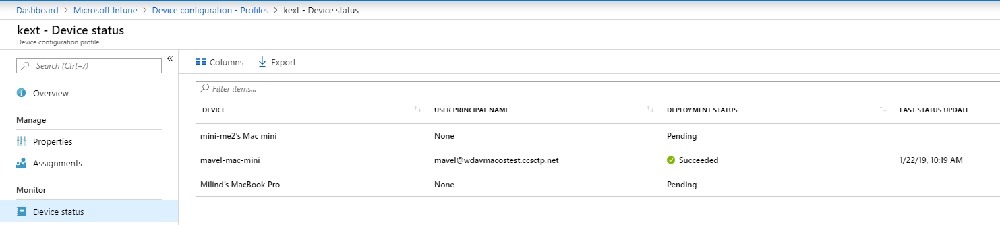

## Publish application

This step enables deploying Microsoft Defender for Endpoint to enrolled machines.

1. In the [Microsoft Endpoint Manager admin center](https://endpoint.microsoft.com/), open **Apps**.

    > 

1. Select By platform => macOS => Add.
1. Choose **App type**=**macOS**, click **Select**

    > 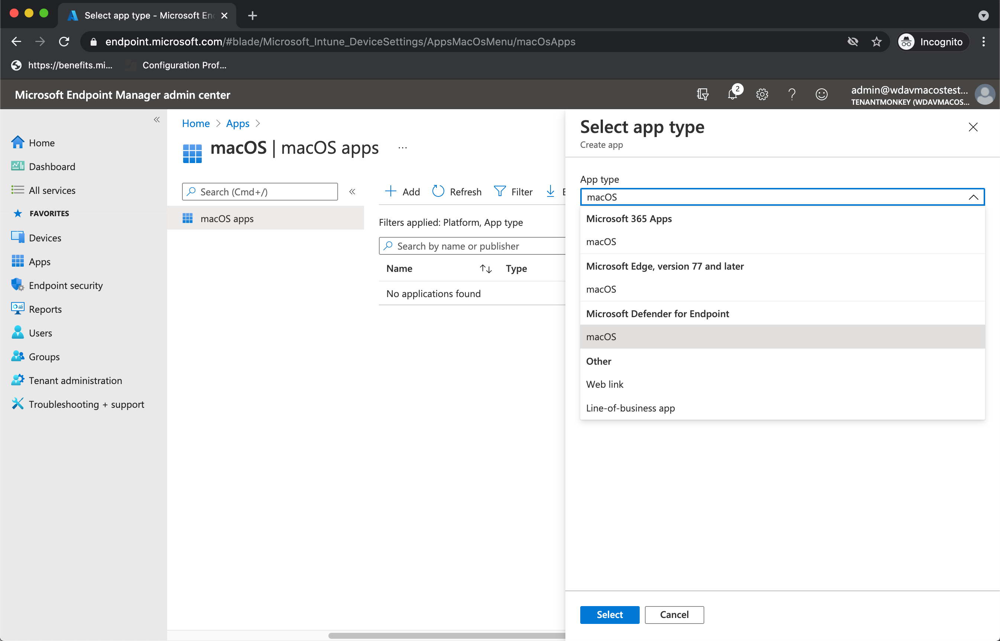

1. Keep default values, click **Next**.

    > 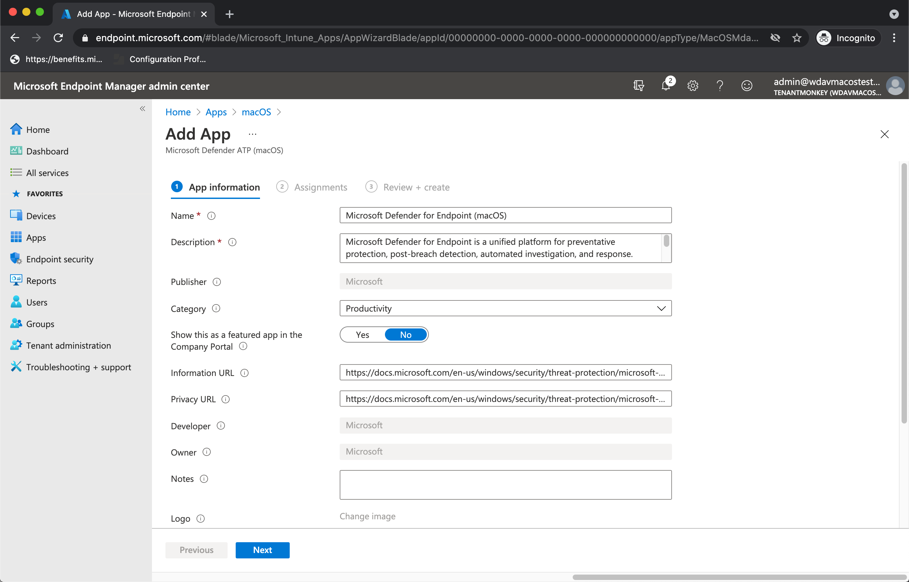

1. Add assignments, click **Next***.

    > 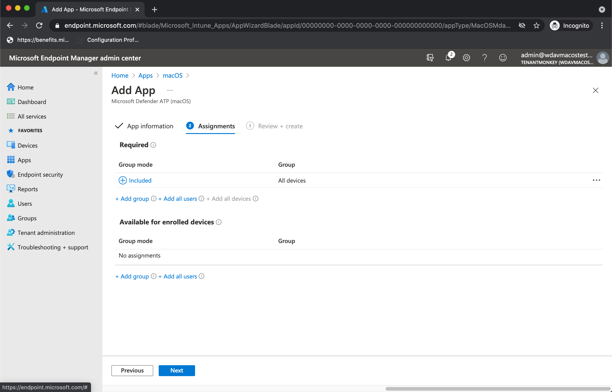

1. Review and **Create**.
1. You can visit **Apps** => **By platform** => **macOS** to see it on the list of all applications.

    > 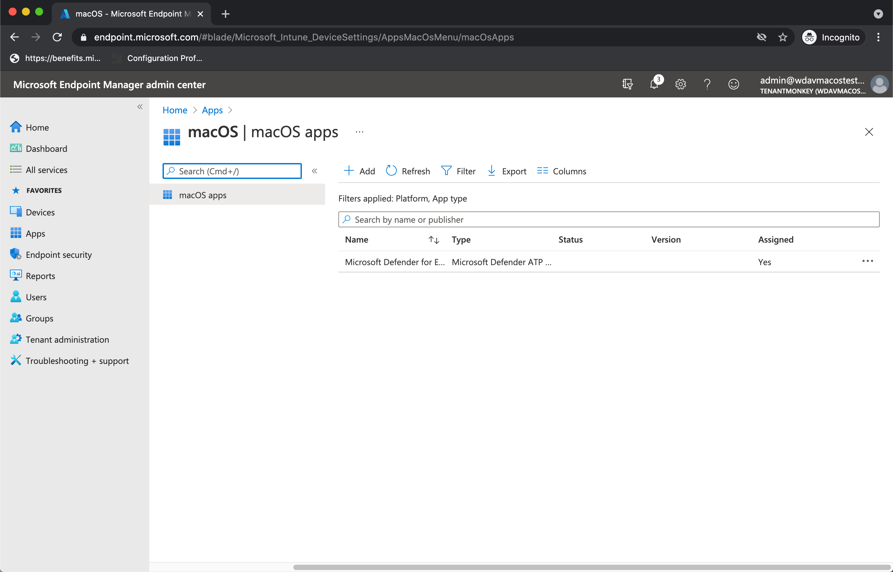

(You can find detailed information on the [Intune's page for Defender deployment](https://docs.microsoft.com/en-us/mem/intune/apps/apps-advanced-threat-protection-macos))

   > [!CAUTION]
   > You have to create all required configuration profiles and push them to all machines, as explained above.

## Client device setup

You don't need any special provisioning for a Mac device beyond a standard [Company Portal installation](https://docs.microsoft.com/intune-user-help/enroll-your-device-in-intune-macos-cp).

1. Confirm device management.

    

    Select **Open System Preferences**, locate **Management Profile** on the list, and select **Approve...**. Your Management Profile would be displayed as **Verified**:

    

2. Select **Continue** and complete the enrollment.

   You may now enroll more devices. You can also enroll them later, after you have finished provisioning system configuration and application packages.

3. In Intune, open **Manage** > **Devices** > **All devices**. Here you can see your device among those listed:

   > [!div class="mx-imgBorder"]
   > 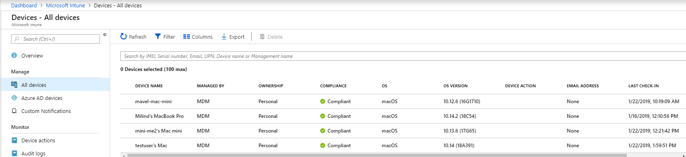

## Verify client device state

1. After the configuration profiles are deployed to your devices, open **System Preferences** > **Profiles** on your Mac device.

    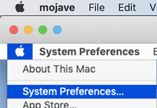<br/>
    

2. Verify that the following configuration profiles are present and installed. The **Management Profile** should be the Intune system profile. _Wdav-config_ and _wdav-kext_ are system configuration profiles that were added in Intune:
    

3. You should also see the Microsoft Defender for Endpoint icon in the top-right corner:

    > [!div class="mx-imgBorder"]
    > 

## Troubleshooting

Issue: No license found

Solution: Follow the steps above to create a device profile using WindowsDefenderATPOnboarding.xml

## Logging installation issues

For more information on how to find the automatically generated log that is created by the installer when an error occurs, see [Logging installation issues](mac-resources.md#logging-installation-issues).

## Uninstallation

See [Uninstalling](mac-resources.md#uninstalling) for details on how to remove Microsoft Defender for Endpoint on macOS from client devices.
