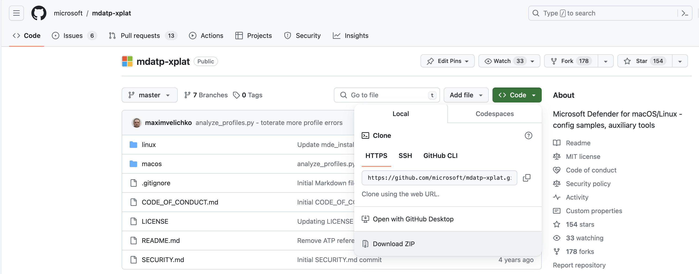

# Deploy Microsoft Defender for Endpoint on macOS with Microsoft Intune

[!INCLUDE [Microsoft Defender XDR rebranding](../../includes/microsoft-defender.md)]

**Applies to:**

- [Microsoft Defender for Endpoint on macOS](microsoft-defender-endpoint-mac.md)
- [Microsoft Defender for Endpoint Plan 1](https://go.microsoft.com/fwlink/p/?linkid=2154037)
- [Microsoft Defender for Endpoint Plan 2](https://go.microsoft.com/fwlink/p/?linkid=2154037)
- [Microsoft Defender for business](https://www.microsoft.com/security/business/endpoint-security/microsoft-defender-business)

This topic describes how to deploy Microsoft Defender for Endpoint on macOS through Microsoft Intune. A successful deployment requires the completion of all of the following steps:

1. [Approve system extension](#step-1-approve-system-extensions)
1. [Network Filter](#step-2-network-filter)
1. [Full Disk Access](#step-3-full-disk-access)
1. [Background services](#step-4-background-services)
1. [Notifications](#step-5-notifications)
1. [ Accessibility settings](#step-6-accessibility-settings)
1. [Microsoft AutoUpdate](#step-7-microsoft-autoupdate)
1. [Microsoft Defender for Endpoint configuration settings](#step-8-microsoft-defender-for-endpoint-configuration-settings)
1. [Network protection for Microsoft Defender for Endpoint on macOS](#step-9-network-protection-for-microsoft-defender-for-endpoint-on-macos)
1. [Device control for Microsoft Defender for Endpoint on macOS](#step-10-device-control-for-microsoft-defender-for-endpoint-on-macos)
1. [Data Loss Prevention for Endpoint](#step-11-data-loss-prevention-dlp-for-endpoint)
1. [Check status of the PList(.mobileconfig)](#step-12-check-status-of-plistmobileconfig)
1. [Publish application](#step-13-publish-application)
1. [Download the onboarding package](#step-14-download-the-onboarding-package)
1. [Deploy the onboarding package](#step-15-deploy-the-onboarding-package)

## Prerequisites and system requirements

Before you get started, see [the main Microsoft Defender for Endpoint on macOS page](microsoft-defender-endpoint-mac.md) for a description of prerequisites and system requirements for the current software version.

## Overview

The following table summarizes the steps you would need to take to deploy and manage Microsoft Defender for Endpoint on Macs, via Microsoft Intune. See the following table for more detailed steps.

|Step |Sample file name  |Bundle identifier  |
|---------|---------|---------|
|Approve system extension|sysext.mobileconfig|N/A|
|Network extension policy|netfilter.mobileconfig|N/A|
|Full Disk Access|fulldisk.mobileconfig|com.microsoft.wdav.epsext|
|Microsoft Defender for Endpoint configuration settings <p> **Note:** If you're planning to run a third-party AV for macOS, set passiveMode to true.|MDE_MDAV_and_exclusion_settings_Preferences.xml|com.microsoft.wdav|
|Background services|background_services.mobileconfig|N/A|
|Configure Microsoft Defender for Endpoint notifications|notif.mobileconfig|com.microsoft.wdav.tray|
|Accessibility settings|accessibility.mobileconfig|com.microsoft.dlp.daemon|
|Configure Microsoft AutoUpdate (MAU)|com.microsoft.autoupdate2.mobileconfig|com.microsoft.autoupdate2|
|Device Control|DeviceControl.mobileconfig|N/A|
|Data Loss Prevention|DataLossPrevention.mobileconfig|N/A|
|Download the onboarding package|WindowsDefenderATPOnboarding__MDATP_wdav.atp.xml|com.microsoft.wdav.atp|
|Deploy the Microsoft Defender for Endpoint on macOS application|Wdav.pkg|N/A|

## Create system configuration profiles

The next step is to create system configuration profiles that Microsoft Defender for Endpoint needs.
In the [Microsoft Intune admin center](https://go.microsoft.com/fwlink/?linkid=2109431), open **Devices** \> **Configuration profiles**.

### Step 1: Approve system extensions

1. In Microsoft Defender portal, go to **Settings** \> **Endpoints** \> **Device management** \> **Onboarding**.

   This profile is needed for Big Sur (11) or later. It is ignored on older macOS since they use the kernel extension.

1. Under **Configuration profiles**, select **Create Profile**.
1. Under **Platform**, select **macOS**.
1. Under **Profile type**, select **Templates**.
1. Under **Template name**, select **Extensions**.
1. Click **Create**.
1. On the **Basics** tab, **Name** the profile. For example, 'SysExt-prod-macOS-Default-MDE'.
1. Click **Next**.
1. On the **Configuration settings** tab, expand **System Extensions** and add the following entries in the **Allowed system extensions** section:

    |Bundle identifier|Team identifier|
    |---|---|
    |com.microsoft.wdav.epsext|UBF8T346G9|
    |com.microsoft.wdav.netext|UBF8T346G9|

    :::image type="content" source="images/mac-system-extension-intune2.png" alt-text="The settings of the system's extension" lightbox="images/mac-system-extension-intune2.png":::

1. On the **Assignments** tab, assign the profile to a group where the macOS devices and/or users are located, or All Users and All devices.
1. Review the configuration profile. Click **Create**.

### Step 2: Network filter

As part of the Endpoint Detection and Response capabilities, Microsoft Defender for Endpoint on macOS inspects socket traffic and reports this information to the Microsoft 365 Defender portal. The following policy allows the network extension to perform this functionality.

Download [netfilter.mobileconfig](https://raw.githubusercontent.com/microsoft/mdatp-xplat/master/macos/mobileconfig/profiles/netfilter.mobileconfig) from [GitHub repository](https://github.com/microsoft/mdatp-xplat/tree/master/macos/mobileconfig/profiles).

To configure network filter:

1. Under **Configuration profiles**, select **Create Profile**.
1. Under **Platform**, select **macOS**.
1. Under **Profile type**, select **Templates**.
1. Under **Template name**, select **Custom**.
1. Click **Create**.
1. On the **Basics** tab, **Name** the profile. For example, 'NetFilter-prod-macOS-Default-MDE'.
1. Click **Next**.
1. On the **Configuration settings** tab, enter a Cus**tom configuration profile** name. For example, 'NetFilter-prod-macOS-Default-MDE'.
1. Choose a Deployment channel.
1. Click **Next**.
1. On the **Assignments** tab, assign the profile to a group where the macOS devices and/or users are located, or All Users and All devices.
1. Review the configuration profile. Click **Create**.

### Step 3: Full Disk Access

> [!NOTE]
> Starting with macOS Catalina (10.15) or newer, in order to provide privacy for the end-users, it created the **FDA** (Full Disk Access). Enabling **TCC** (Transparency, Consent & Control) through a Mobile Device Management solution such as [Intune](mac-install-with-intune.md), will eliminate the risk of Defender for Endpoint losing **Full Disk Access** Authorization to function properly.
>
> This configuration profile grants Full Disk Access to Microsoft Defender for Endpoint. If you previously configured Microsoft Defender for Endpoint through Intune, we recommend you update the deployment with this configuration profile.

Download [**fulldisk.mobileconfig**](https://raw.githubusercontent.com/microsoft/mdatp-xplat/master/macos/mobileconfig/profiles/fulldisk.mobileconfig) from [GitHub repository](https://github.com/microsoft/mdatp-xplat/tree/master/macos/mobileconfig/profiles).

To configure Full Disk Access:
1. Under **Configuration profiles**, select **Create Profile**.
1. Under **Platform**, select **macOS**.
1. Under **Profile type**, select **Templates**.
1. Under **Template name**, select **Custom**.
1. Click **Create**.
1. On the **Basics** tab, **Name** the profile. For example, 'FullDiskAccess-prod-macOS-Default-MDE'.
1. Click **Next**.
1. On the **Configuration settings** tab, enter a **Custom configuration profile** name. For example, 'Fulldisk.mobileconfig'.
1. Choose a **Deployment channel**.
1. Click **Next**.
1. Select a **Configuration profile file**.
1. On the **Assignments** tab, assign the profile to a group where the macOS devices and/or users are located, or All Users and All devices.
1. Review the configuration profile. Click **Create**.

### Step 4: Background services

   > [!CAUTION]
   > macOS 13 (Ventura) contains new privacy enhancements. Beginning with this version, by default, applications cannot run in background without explicit consent. Microsoft Defender for Endpoint must run its daemon process in background.
   >
   > This configuration profile grants Background Service permissions to Microsoft Defender for Endpoint. If you previously configured Microsoft Defender for Endpoint through Microsoft Intune, we recommend you update the deployment with this configuration profile.

Download [background_services.mobileconfig](https://raw.githubusercontent.com/microsoft/mdatp-xplat/master/macos/mobileconfig/profiles/background_services.mobileconfig) from [GitHub repository](https://github.com/microsoft/mdatp-xplat/tree/master/macos/mobileconfig/profiles).

To configure background services:

1. Under **Configuration profiles**, select **Create Profile**.
1. Under **Platform**, select **macOS**.
1. Under **Profile type**, select **Templates**.
1. Under **Template name**, select **Custom**.
1. Click **Create**.
1. On the **Basics** tab, **Name** the profile. For example, 'FullDiskAccess-prod-macOS-Default-MDE'.
1. Click **Next**.
1. On the **Configuration settings** tab, enter a **Custom configuration profile** name. For example, 'Fulldisk.mobileconfig'.
1. Choose a **Deployment channel**.
1. Click **Next**.
1. Select a **Configuration profile file**.
1. On the **Assignments** tab, assign the profile to a group where the macOS devices and/or users are located, or All Users and All devices.
1. Review the configuration profile. Click **Create**.

### Step 5: Notifications

This profile is used to allow Microsoft Defender for Endpoint on macOS and Microsoft AutoUpdate to display notifications in UI.

Download [notif.mobileconfig](https://raw.githubusercontent.com/microsoft/mdatp-xplat/master/macos/mobileconfig/profiles/notif.mobileconfig) from [GitHub repository](https://github.com/microsoft/mdatp-xplat/tree/master/macos/mobileconfig/profiles).

To turn off notifications for the end users, you can change '**Show NotificationCenter**' from 'true' to 'false' in 
[notif.mobileconfig](https://raw.githubusercontent.com/microsoft/mdatp-xplat/master/macos/mobileconfig/profiles/notif.mobileconfig).



To configure notifications:

1. Under **Configuration profiles**, select **Create Profile**.
1. Under **Platform**, select **macOS**.
1. Under **Profile type**, select **Templates**.
1. Under **Template name**, select **Custom**.
1. Click **Create**.
1. On the **Basics** tab, **Name** the profile. For example, 'FullDiskAccess-prod-macOS-Default-MDE'.
1. Click **Next**.
1. On the **Configuration settings** tab, enter a **Custom configuration profile** name. For example, 'Notification.mobileconfig'.
1. Choose a **Deployment channel**.
1. Click **Next**.
1. Select a **Configuration profile file**.
1. On the **Assignments** tab, assign the profile to a group where the macOS devices and/or users are located, or All Users and All devices.
1. Review the configuration profile. Click **Create**.


### Step 6: Accessibility settings

This profile is used to allow Microsoft Defender for Endpoint on macOS to access the accessibility settings on Apple macOS High Sierra (10.13.6) and newer.

Download [accessibility.mobileconfig](https://github.com/microsoft/mdatp-xplat/blob/master/macos/mobileconfig/profiles/accessibility.mobileconfig) from [GitHub repository](https://github.com/microsoft/mdatp-xplat/tree/master/macos/mobileconfig/profiles).

1. Under **Configuration profiles**, select **Create Profile**.
1. Under **Platform**, select **macOS**.
1. Under **Profile type**, select **Templates**.
1. Under **Template name**, select **Custom**.
1. Click **Create**.
1. On the **Basics** tab, **Name** the profile. For example, 'Accessibility-prod-macOS-Default-MDE'.
1. Click **Next**.
1. On the **Configuration settings** tab, enter a **Custom configuration profile** name. For example, 'Accessibility.mobileconfig'.
1. Choose a **Deployment channel**.
1. Click **Next**.
1. Select a **Configuration profile file**.
1. On the **Assignments** tab, assign the profile to a group where the macOS devices and/or users are located, or All Users and All devices.
1. Review the configuration profile. Click **Create**.

### Step 7: Microsoft AutoUpdate

This profile is used to update the Microsoft Defender for Endpoint on macOS via Microsoft AutoUpdate (MAU). If you're deploying Microsoft Defender for Endpoint on macOS, you have the options to get an updated version of the application (Platform Update) that are in the different channels mentioned here:

- Beta (Insiders-Fast)
- Current channel (Preview, Insiders-Slow)
- Current channel (Production)

For more information, see [Deploy updates for Microsoft Defender for Endpoint on macOS](mac-updates.md).

Download [AutoUpdate2.mobileconfig](https://github.com/microsoft/mdatp-xplat/blob/master/macos/settings/microsoft_auto_update/com.microsoft.autoupdate2.mobileconfig) from [GitHub repository](https://github.com/microsoft/mdatp-xplat/tree/master/macos/mobileconfig/profiles).

> [!NOTE]
> The sample AutoUpdate2.mobileconfig from the GitHub repository has it set to Current Channel (Production).

1. Under **Configuration profiles**, select **Create Profile**.
1. Under **Platform**, select **macOS**.
1. Under **Profile type**, select **Templates**.
1. Under **Template name**, select **Custom**.
1. Click **Create**.
1. On the **Basics** tab, **Name** the profile. For example, 'Autoupdate-prod-macOS-Default-MDE'.
1. Click **Next**.
1. On the **Configuration settings** tab, enter a **Custom configuration profile** name. For example, 'Autoupdate.mobileconfig'.
1. Choose a **Deployment channel**.
1. Click **Next**.
1. Select a **Configuration profile file**.
1. On the **Assignments** tab, assign the profile to a group where the macOS devices and/or users are located, or All Users and All devices.
1. Review the configuration profile. Click **Create**.

### Step 8: Microsoft Defender for Endpoint configuration settings

In this step, we'll go over the "Preferences," which enables you to configure anti-malware and edr policies using Microsoft Defender portal and Microsoft Intune.

#### Set policies using Microsoft Defender portal

Go through [Configure Microsoft Defender for Endpoint in Intune](/mem/intune/protect/advanced-threat-protection-configure) before setting the security policies using Microsoft Defender.

In the [Microsoft Defender portal](https://sip.security.microsoft.com/homepage?tid=72f988bf-86f1-41af-91ab-2d7cd011db47):

1. Go to **Configuration management** > **Endpoint security policies** > **Mac policies** > **Create new policy**.
1. Under **Select Platform**, select **macOS**.
1. Under **Select Template**, choose a template and click **Create Policy**.
1. Enter the Name and Description of the policy.
1. Click **Next**.
1. On the **Assignments** tab,assign the profile to a group where the macOS devices and/or users are located, or All Users and All devices.

For more information about managing security settings, see:

- [Manage Microsoft Defender for Endpoint on devices with Microsoft Intune](/mem/intune/protect/mde-security-integration?pivots=mdssc-ga)
- [Manage security settings for Windows, macOS, and Linux natively in Defender for Endpoint](https://techcommunity.microsoft.com/t5/microsoft-defender-for-endpoint/manage-security-settings-for-windows-macos-and-linux-natively-in/ba-p/3870617)


#### Set policies using Microsoft Intune

You can manage the security settings for Microsoft Defender for Endpoint on macOS under **Setting Preferences** in Microsoft Intune.

For more information, see [Set preferences for Microsoft Defender for Endpoint on Mac](mac-preferences.md).

### Step 9: Network protection for Microsoft Defender for Endpoint on macOS

In the [Microsoft Defender portal](https://sip.security.microsoft.com/homepage?tid=72f988bf-86f1-41af-91ab-2d7cd011db47):

1. Go to **Configuration management** > **Endpoint security policies** > **Mac policies** > **Create new policy**.
1. Under **Select Platform**, select **macOS**.
1. Under **Select Template**, select **Microsoft Defender Antivirus** and click **Create Policy**.

   :::image type="content" alt-text="networkprotection" source="images/network-protection1.jpg" lightbox="images/network-protection1.jpg":::

1. On the **Basics** tab, enter the **Name** and **Description** of the policy. Click **Next**.

   :::image type="content" source="images/networkprotection2.png" alt-text="Basicstab":::

1. On the **Configuration Settings** tab, under Network Protection, select an **Enforcement level**. Click **Next**.

   :::image type="content" source="images/networkprotection3.png" alt-text="configurationsettings":::

1. On the **Assignments** tab,assign the profile to a group where the macOS devices and/or users are located, or All Users and All devices.

   :::image type="content" source="images/networkprotection4.png" alt-text="np4":::

1. Review the policy in **Review+Create** and click **Save**. 


> [!TIP]
> You can also configure network protection by appending the information from [**Network protection to help prevent macOS connections to bad sites**](network-protection-macos.md) to the .mobileconig from step 8.

### Step 10: Device Control for Microsoft Defender for Endpoint on macOS

To set Device Control for Microsoft Defender for Endpoint on macOS, follow the steps in:

- [Device Control for macOS](mac-device-control-overview.md)
- [Deploy and manage Device Control using Intune](mac-device-control-intune.md)

### Step 11: Data Loss Prevention (DLP) for Endpoint

To set Purview's Data Loss Prevention (DLP) for endpoint on macOS, follow the steps in [Onboard and offboard macOS devices into Compliance solutions using Microsoft Intune](/purview/device-onboarding-offboarding-macos-intune-mde).

### Step 12: Check status of PList(.mobileconfig)

After completing the profile configuration, you'll be able to review the status of the policies.

#### View Status

Once the Intune changes are propagated to the enrolled devices, you can see them listed under **Monitor** \> **Device status**:

:::image type="content" source="images/mdatp-7-devicestatusblade.png" alt-text="The view of the device status" lightbox="images/mdatp-7-devicestatusblade.png":::

#### Client device setup

A standard [Company Portal installation](/intune-user-help/enroll-your-device-in-intune-macos-cp) is sufficient for a mac device.

1. Confirm device management.

   :::image type="content" source="images/mdatp-3-confirmdevicemgmt.png" alt-text="The Confirm device management page" lightbox="images/mdatp-3-confirmdevicemgmt.png":::

   Select **Open System Preferences**, locate **Management Profile** on the list, and select **Approve...**. Your Management Profile would be displayed as **Verified**:

   :::image type="content" source="images/mdatp-4-managementprofile.png" alt-text="The Management profile page" lightbox="images/mdatp-4-managementprofile.png":::

2. Select **Continue** and complete the enrollment.

   You may now enroll more devices. You can also enroll them later, after finishing the provisioning system configuration and application packages.

3. In Intune, open **Manage** \> **Devices** \> **All devices**. Here you can see your device among the listed:

   :::image type="content" source="images/mdatp-5-alldevices.png" alt-text="The All Devices page" lightbox="images/mdatp-5-alldevices.png":::

#### Verify client device state

1. After the configuration profiles are deployed to your devices, open **System Preferences** > **Profiles** on your Mac device.

   :::image type="content" source="images/mdatp-13-systempreferences.png" alt-text="The System preferences page":::
    
   :::image type="content" source="images/mdatp-14-systempreferencesprofiles.png" alt-text="The System Preferences Profiles page" lightbox="images/mdatp-14-systempreferencesprofiles.png":::

2. Verify that the following configuration profiles are present and installed. The **Management Profile** should be the Intune system profile. _Wdav-config_ and _wdav-kext_ are system configuration profiles that were added in Intune:

   :::image type="content" source="images/mdatp-15-managementprofileconfig.png" alt-text="The Profiles page" lightbox="images/mdatp-15-managementprofileconfig.png":::

3. You should also see the Microsoft Defender for Endpoint icon in the top-right corner.

   :::image type="content" source="images/mdatp-icon-bar.png" alt-text="The icon for Microsoft Defender for Endpoint in the status bar":::

### Step 13: Publish application

This step enables deploying Microsoft Defender for Endpoint to enrolled machines.

1. In the [Microsoft Intune admin center](https://go.microsoft.com/fwlink/?linkid=2109431), open **Apps**.

   :::image type="content" source="images/mdatp-8-app-before.png" alt-text="The application's overview page" lightbox="images/mdatp-8-app-before.png":::

1. Select **By platform** > **macOS** > **Add**.
1. Under **App type**, select **macOS**. Click **Select**.

   :::image type="content" source="images/mdatp-9-app-type.png" alt-text="The specific application type" lightbox="images/mdatp-9-app-type.png":::

1. On the **App information**, keep the default values and click **Next**.

   :::image type="content" source="images/mdatp-10-properties.png" alt-text="The application properties page" lightbox="images/mdatp-10-properties.png":::

1. On the **Assignments** tab, click **Next**.

   :::image type="content" source="images/mdatp-11-assignments.png" alt-text="The Intune assignments information page" lightbox="images/mdatp-11-assignments.png":::

1. Review and **Create**.
You can visit **Apps** > **By platform** > **macOS** to see it on the list of all applications.

   :::image type="content" source="images/mdatp-12-applications.png" alt-text="The application lists page" lightbox="images/mdatp-12-applications.png":::

For more information, see [Add Microsoft Defender for Endpoint to macOS devices using Microsoft Intune](/mem/intune/apps/apps-advanced-threat-protection-macos).

> [!IMPORTANT]
> You should create and deploy the configuration profiles in the above order (step 1-13) for a successful system configuration.

#### Step 14: Download the onboarding package

To download the onboarding packages from Microsoft 365 Defender portal:

1. In the Microsoft 365 Defender portal, go to **Settings** > **Endpoints** > **Device management** > **Onboarding**.

2. Set the operating system to **macOS** and the deployment method to **Mobile Device Management / Microsoft Intune**.

   :::image type="content" source="images/macos-install-with-intune.png" alt-text="The Onboarding settings page" lightbox="images/macos-install-with-intune.png":::

3. Select **Download onboarding package**. Save it as _WindowsDefenderATPOnboardingPackage.zip_ to the same directory.

4. Extract the contents of the .zip file:

    ```bash
    unzip WindowsDefenderATPOnboardingPackage.zip
    ```

    ```console
    Archive:  WindowsDefenderATPOnboardingPackage.zip
    warning:  WindowsDefenderATPOnboardingPackage.zip appears to use backslashes as path separators
      inflating: intune/kext.xml
      inflating: intune/WindowsDefenderATPOnboarding.xml
      inflating: jamf/WindowsDefenderATPOnboarding.plist
    ```

    :::image type="content" alt-text="Sample description" source="media/deploy-onboarding-package.png" lightbox="media/deploy-onboarding-package.png":::

### Step 15: Deploy the onboarding package

This profile contains license information for Microsoft Defender for Endpoint, without which it is reported as not licensed.

To deploy the onboarding package:

1. Under **Configuration profiles**, select **Create Profile**.
1. Under **Platform**, select **macOS**.
1. Under **Profile type**, select **Templates**.
1. Under **Template name**, select **Custom**.
1. Click **Create**.

   :::image type="content" alt-text="Deploy onboarding package" source="images/mdatp-6-systemconfigurationprofiles-1.png" lightbox="images/mdatp-6-systemconfigurationprofiles-1.png":::

1. On the **Basics** tab, **Name** the profile. For example, 'Autoupdate-prod-macOS-Default-MDE'. Click **Next**.

   :::image type="content" alt-text="click next" source="images/mdatp-6-systemconfigurationprofiles-2.png" lightbox="images/mdatp-6-systemconfigurationprofiles-2.png":::

1. On the **Configuration settings** tab, enter a **Custom configuration profile** name. For example, 'Autoupdate.mobileconfig'.
1. Choose a **Deployment channel**.
1. Click **Next**.
1. Select a **Configuration profile file**.

   :::image type="content" alt-text="configuration profile" source="images/mdatp-6-systemconfigurationprofiles.png" lightbox="images/mdatp-6-systemconfigurationprofiles.png":::

1. On the **Assignments** tab, assign the profile to a group where the macOS devices and/or users are located, or All Users and All devices.

   :::image type="content" alt-text="assign users" source="images/mdatp-6-systemconfigurationprofiles-3.png" lightbox="images/mdatp-6-systemconfigurationprofiles-3.png":::

1. Review the configuration profile. Click **Create**.
1. Open **Devices** > **Configuration profiles** to see the created profile.

## Step 16: Verify anti-malware detection

See the following article to test for an anti-malware detection review: [AV detection test for verifying device's onboarding and reporting services](validate-antimalware.md)

## Step 17: Verifying EDR detection

See the following article to test for an EDR detection review: [EDR detection test for verifying device onboarding and reporting services](edr-detection.md)

## Troubleshooting

Issue: No license found.

Solution: Follow the steps in this article to create a device profile using WindowsDefenderATPOnboarding.xml.

## Logging installation issues

See [Logging installation issues](mac-resources.md#logging-installation-issues) for information on how to find the automatically generated log created by the installer, when an error occurs.

For information on troubleshooting procedures, see:

- [Troubleshoot system extension issues in Microsoft Defender for Endpoint on macOS](mac-support-sys-ext.md)
- [Troubleshoot installation issues for Microsoft Defender for Endpoint on macOS](mac-support-install.md)
- [Troubleshoot license issues for Microsoft Defender for Endpoint on macOS](mac-support-license.md)
- [Troubleshoot cloud connectivity issues for Microsoft Defender for Endpoint on macOS](troubleshoot-cloud-connect-mdemac.md)
- [Troubleshoot performance issues for Microsoft Defender for Endpoint on macOS](mac-support-perf.md)

## Uninstallation

See [Uninstalling](mac-resources.md#uninstalling) for details on how to remove Microsoft Defender for Endpoint on macOS from client devices.


## Recommended content

[Add Microsoft Defender for Endpoint to macOS devices using Microsoft Intune](/mem/intune/apps/apps-advanced-threat-protection-macos?source=recommendations)
<br>Learn about adding Microsoft Defender for Endpoint to macOS devices using Microsoft Intune.

[Examples of device control policies for Intune](mac-device-control-intune.md)
<br>Learn how to use device control policies using examples that can be used with Intune.

[Configure Microsoft Defender for Endpoint on iOS features](ios-configure-features.md)
<br>Describes how to deploy Microsoft Defender for Endpoint on iOS features.

[Deploy Microsoft Defender for Endpoint on iOS with Microsoft Intune](ios-install.md)
<br>Describes how to deploy Microsoft Defender for Endpoint on iOS using an app.

[Configure Microsoft Defender for Endpoint in Microsoft Intune](/mem/intune/protect/advanced-threat-protection-configure?source=recommendations)
<br>Describes connecting to Defender for Endpoint, onboarding devices, assigning compliance for risk levels, and conditional access policies.

[Troubleshoot issues and find answers on FAQs related to Microsoft Defender for Endpoint on iOS](ios-troubleshoot.md)
<br>Troubleshooting and FAQ - Microsoft Defender for Endpoint on iOS.

[Configure Microsoft Defender for Endpoint on Android features](android-configure.md)
<br>Describes how to configure Microsoft Defender for Endpoint on Android.

[Manage Defender for Endpoint on Android devices in Intune - Azure](/mem/intune/protect/advanced-threat-protection-manage-android?source=recommendations)
<br>Configure Microsoft Defender for Endpoint web protection on Android devices managed by Microsoft Intune.


[!INCLUDE [Microsoft Defender for Endpoint Tech Community](../../includes/defender-mde-techcommunity.md)]

