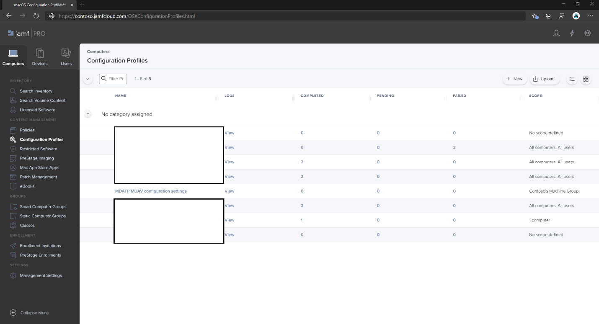

# Set up the Microsoft Defender for Endpoint on macOS policies in Jamf Pro

[!INCLUDE [Microsoft 365 Defender rebranding](../../includes/microsoft-defender.md)]


**Applies to:**
- [Defender for Endpoint on Mac](microsoft-defender-endpoint-mac.md)
- [Microsoft Defender for Endpoint Plan 1](https://go.microsoft.com/fwlink/p/?linkid=2154037)
- [Microsoft Defender for Endpoint Plan 2](https://go.microsoft.com/fwlink/p/?linkid=2154037)

This page will guide you through the steps you need to take to set up macOS policies in Jamf Pro.

You'll need to take the following steps:

1. [Get the Microsoft Defender for Endpoint onboarding package](#step-1-get-the-microsoft-defender-for-endpoint-onboarding-package)
2. [Create a configuration profile in Jamf Pro using the onboarding package](#step-2-create-a-configuration-profile-in-jamf-pro-using-the-onboarding-package)
3. [Configure Microsoft Defender for Endpoint settings](#step-3-configure-microsoft-defender-for-endpoint-settings)
4. [Configure Microsoft Defender for Endpoint notification settings](#step-4-configure-notifications-settings)
5. [Configure Microsoft AutoUpdate (MAU)](#step-5-configure-microsoft-autoupdate-mau)
6. [Grant full disk access to Microsoft Defender for Endpoint](#step-6-grant-full-disk-access-to-microsoft-defender-for-endpoint)
7. [Approve System extensions for Microsoft Defender for Endpoint](#step-7-approve-system-extensions-for-microsoft-defender-for-endpoint)
8. [Configure Network Extension](#step-8-configure-network-extension)
9. [Configure Background Services](#step-9-configure-background-services)
10. [Schedule scans with Microsoft Defender for Endpoint on macOS](/windows/security/threat-protection/microsoft-defender-atp/mac-schedule-scan-atp)
11. [Deploy Microsoft Defender for Endpoint on macOS](#step-11-deploy-microsoft-defender-for-endpoint-on-macos)

## Step 1: Get the Microsoft Defender for Endpoint onboarding package

1. In [Microsoft 365 Defender](https://security.microsoft.com), navigate to **Settings > Endpoints > Onboarding**.

2. Select macOS as the operating system and Mobile Device Management / Microsoft Intune as the deployment method.

   :::image type="content" source="images/onboarding-macos.png" alt-text="The Settings page." lightbox="images/onboarding-macos.png":::

3. Select **Download onboarding package** (WindowsDefenderATPOnboardingPackage.zip).

4. Extract `WindowsDefenderATPOnboardingPackage.zip`.

5. Copy the file to your preferred location. For example, `C:\Users\JaneDoe_or_JohnDoe.contoso\Downloads\WindowsDefenderATPOnboardingPackage_macOS_MDM_contoso\jamf\WindowsDefenderATPOnboarding.plist`.

## Step 2: Create a configuration profile in Jamf Pro using the onboarding package

1. Locate the file `WindowsDefenderATPOnboarding.plist` from the previous section.

   :::image type="content" source="images/plist-onboarding-file.png" alt-text="The  Windows Defender ATP Onboarding file." lightbox="images/plist-onboarding-file.png":::

2. Sign in to Jamf Pro, navigate to **Computers** > **Configuration Profiles**, and select **New**.

   :::image type="content" source="images/jamf-pro-configure-profile.png" alt-text="The page on which you create a new Jamf Pro dashboard." lightbox="images/jamf-pro-configure-profile.png":::

3. Enter the following details in the **General** tab:
   
   - Name: MDE onboarding for macOS
   - Description: MDE EDR onboarding for macOS
   - Category: None
   - Distribution Method: Install Automatically
   - Level: Computer Level

4.  Navigate to the **Application & Custom Settings** page and select **Upload** > **Add**.

    :::image type="content" source="images/jamfpro-mac-profile.png" alt-text="The configurate app and custom settings." lightbox="images/jamfpro-mac-profile.png":::

5. Select **Upload File (PLIST file)** then in **Preference Domain** enter: `com.microsoft.wdav.atp`.

   :::image type="content" source="images/jamfpro-plist-upload.png" alt-text="The jamfpro plist upload file." lightbox="images/jamfpro-plist-upload.png":::

   :::image type="content" source="images/jamfpro-plist-file.png" alt-text="The upload file property List file." lightbox="images/jamfpro-plist-file.png":::

6. Select **Open** and select the onboarding file.

   :::image type="content" source="images/jamfpro-plist-file-onboard.png" alt-text="The onboarding file." lightbox="images/jamfpro-plist-file-onboard.png":::

7. Select **Upload**.

   :::image type="content" source="images/jamfpro-upload-plist.png" alt-text="The uploading plist file." lightbox="images/jamfpro-upload-plist.png":::

8. Select the **Scope** tab.

   :::image type="content" source="images/jamfpro-scope-tab.png" alt-text="The Scope tab." lightbox="images/jamfpro-scope-tab.png":::

9. Select the target computers.

   :::image type="content" source="images/jamfpro-target-computer.png" alt-text="The target computers." lightbox="images/jamfpro-target-computer.png":::

   :::image type="content" source="images/jamfpro-targets.png" alt-text="The targets." lightbox="images/jamfpro-targets.png":::

10. Select **Save**.

    :::image type="content" source="images/jamfpro-deployment-target.png" alt-text="The deployment of target computers." lightbox="images/jamfpro-deployment-target.png":::

    :::image type="content" source="images/jamfpro-target-selected.png" alt-text="The selection of target computers." lightbox="images/jamfpro-target-selected.png":::

11. Select **Done**.

    :::image type="content" source="images/jamfpro-target-group.png" alt-text="The computers of a target group." lightbox="images/jamfpro-target-group.png":::

    :::image type="content" source="images/jamfpro-configuration-policies.png" alt-text="The list of configuration profiles." lightbox="images/jamfpro-configuration-policies.png":::

## Step 3: Configure Microsoft Defender for Endpoint settings

You can either use JAMF Pro GUI to edit individual settings of the Microsoft Defender for Endpoint configuration, or use the legacy method by creating a configuration Plist in a text editor, and uploading it to JAMF Pro.

Note that you must use exact `com.microsoft.wdav` as the **Preference Domain**, Microsoft Defender for Endpoint uses only this name and `com.microsoft.wdav.ext` to load its managed settings!

(The `com.microsoft.wdav.ext` version may be used in rare cases when you prefer to use GUI method, but also need to configure a setting that has not been added to the schema yet.)

### GUI method

1. Download schema.json file from [Defender's GitHub repository](https://github.com/microsoft/mdatp-xplat/tree/master/macos/schema) and save it to a local file:

    ```bash
    curl -o ~/Documents/schema.json https://raw.githubusercontent.com/microsoft/mdatp-xplat/master/macos/schema/schema.json
    ```

2. Create a new Configuration Profile under Computers -> Configuration Profiles, enter the following details on the **General** tab:

   :::image type="content" source="images/644e0f3af40c29e80ca1443535b2fe32.png" alt-text="A new profile." lightbox="images/644e0f3af40c29e80ca1443535b2fe32.png":::

    - Name: MDATP MDAV configuration settings
    - Description:\<blank\>
    - Category: None (default)
    - Level: Computer Level (default)
    - Distribution Method: Install Automatically (default)

3. Scroll down to the **Application & Custom Settings** tab, select **External Applications**, click **Add** and use **Custom Schema** as Source to use for the preference domain.

   :::image type="content" source="images/4137189bc3204bb09eed3aabc41afd78.png" alt-text="Add custom schema." lightbox="images/4137189bc3204bb09eed3aabc41afd78.png":::

4. Enter `com.microsoft.wdav` as the Preference Domain, select **Add Schema** and **Upload** the schema.json file downloaded on Step 1. Click **Save**.

   :::image type="content" source="images/a6f9f556037c42fabcfdcb1b697244cf.png" alt-text="Upload schema." lightbox="images/a6f9f556037c42fabcfdcb1b697244cf.png":::

5. You can see all supported Microsoft Defender for Endpoint configuration settings below, under **Preference Domain Properties**. Click **Add/Remove properties** to select the settings that you want to be managed, and click **Ok** to save your changes. (Settings left unselected will not be included into the managed configuration, an end user will be able to configure those settings on their machines.)

   :::image type="content" source="images/817b3b760d11467abe9bdd519513f54f.png" alt-text="The chosen managed settings." lightbox="images/817b3b760d11467abe9bdd519513f54f.png":::

6. Change values of the settings to desired values. You can click **More information** to get documentation for a particular setting. (You may click **Plist preview** to inspect what the configuration plist will look like. Click **Form editor** to return to the visual editor.)

   :::image type="content" source="images/a14a79efd5c041bb8974cb5b12b3a9b6.png" alt-text="The page on which you change the settings values." lightbox="images/a14a79efd5c041bb8974cb5b12b3a9b6.png":::

7. Select the **Scope** tab.

   :::image type="content" source="images/9fc17529e5577eefd773c658ec576a7d.png" alt-text="The Configuration profile scope." lightbox="images/9fc17529e5577eefd773c658ec576a7d.png":::

8. Select **Contoso's Machine Group**.

9. Select **Add**, then select **Save**.

   :::image type="content" source="images/cf30438b5512ac89af1d11cbf35219a6.png" alt-text="The page on which you can add the Configuration settings." lightbox="images/cf30438b5512ac89af1d11cbf35219a6.png":::

   :::image type="content" source="images/6f093e42856753a3955cab7ee14f12d9.png" alt-text="The page on which you can save the Configuration settings." lightbox="images/6f093e42856753a3955cab7ee14f12d9.png":::

10. Select **Done**. You'll see the new **Configuration profile**.

    :::image type="content" source="images/dd55405106da0dfc2f50f8d4525b01c8.png" alt-text="The page on which you complete the Configuration settings." lightbox="images/dd55405106da0dfc2f50f8d4525b01c8.png":::

Microsoft Defender for Endpoint adds new settings over time. These new settings will be added to the schema, and a new version will be published to GitHub.
All you need to do to have updates is to download an updated schema, edit existing configuration profile, and **Edit schema** at the **Application & Custom Settings** tab.

### Legacy method

1. Use the following Microsoft Defender for Endpoint configuration settings:

    - enableRealTimeProtection
    - passiveMode

    > [!NOTE]
    > Not turned on by default, if you are planning to run a third-party AV for macOS, set it to `true`.

    - exclusions
    - excludedPath
    - excludedFileExtension
    - excludedFileName
    - exclusionsMergePolicy
    - allowedThreats

    > [!NOTE]
    > EICAR is on the sample, if you are going through a proof-of-concept, remove it especially if you are testing EICAR.

    - disallowedThreatActions
    - potentially_unwanted_application
    - archive_bomb
    - cloudService
    - automaticSampleSubmission
    - tags
    - hideStatusMenuIcon

     For information, see [Property list for JAMF full configuration profile](mac-preferences.md#property-list-for-jamf-full-configuration-profile).

     ```XML
     <?xml version="1.0" encoding="UTF-8"?>
     <!DOCTYPE plist PUBLIC "-//Apple//DTD PLIST 1.0//EN" "http://www.apple.com/DTDs/PropertyList-1.0.dtd">
     <plist version="1.0">
     <dict>
         <key>antivirusEngine</key>
         <dict>
             <key>enableRealTimeProtection</key>
             <true/>
             <key>passiveMode</key>
             <false/>
             <key>exclusions</key>
             <array>
                 <dict>
                     <key>$type</key>
                     <string>excludedPath</string>
                     <key>isDirectory</key>
                     <false/>
                     <key>path</key>
                     <string>/var/log/system.log</string>
                 </dict>
                 <dict>
                     <key>$type</key>
                     <string>excludedPath</string>
                     <key>isDirectory</key>
                     <true/>
                     <key>path</key>
                     <string>/home</string>
                 </dict>
                 <dict>
                     <key>$type</key>
                     <string>excludedFileExtension</string>
                     <key>extension</key>
                     <string>pdf</string>
                 </dict>
                 <dict>
                     <key>$type</key>
                     <string>excludedFileName</string>
                     <key>name</key>
                     <string>cat</string>
                 </dict>
             </array>
             <key>exclusionsMergePolicy</key>
             <string>merge</string>
             <key>allowedThreats</key>
             <array>
                 <string>EICAR-Test-File (not a virus)</string>
             </array>
             <key>disallowedThreatActions</key>
             <array>
                 <string>allow</string>
                 <string>restore</string>
             </array>
             <key>threatTypeSettings</key>
             <array>
                 <dict>
                     <key>key</key>
                     <string>potentially_unwanted_application</string>
                     <key>value</key>
                     <string>block</string>
                 </dict>
                 <dict>
                     <key>key</key>
                     <string>archive_bomb</string>
                     <key>value</key>
                     <string>audit</string>
                 </dict>
             </array>
             <key>threatTypeSettingsMergePolicy</key>
             <string>merge</string>
         </dict>
         <key>cloudService</key>
         <dict>
             <key>enabled</key>
             <true/>
             <key>diagnosticLevel</key>
             <string>optional</string>
             <key>automaticSampleSubmission</key>
             <true/>
         </dict>
         <key>edr</key>
         <dict>
             <key>tags</key>
             <array>
                 <dict>
                     <key>key</key>
                     <string>GROUP</string>
                     <key>value</key>
                     <string>ExampleTag</string>
                 </dict>
             </array>
         </dict>
         <key>userInterface</key>
         <dict>
             <key>hideStatusMenuIcon</key>
             <false/>
         </dict>
     </dict>
     </plist>
     ```

2. Save the file as `MDATP_MDAV_configuration_settings.plist`.

3. In the Jamf Pro dashboard, open **Computers**, and their **Configuration Profiles**. Click **New** and switch to the **General** tab.

   :::image type="content" source="images/644e0f3af40c29e80ca1443535b2fe32.png" alt-text="The page displaying a new profile." lightbox="images/644e0f3af40c29e80ca1443535b2fe32.png":::

4. Enter the following details on the **General** tab:

    - Name: MDATP MDAV configuration settings
    - Description:\<blank\>
    - Category: None (default)
    - Distribution Method: Install Automatically (default)
    - Level: Computer Level (default)

5. In **Application & Custom Settings**, select **Configure**.

   :::image type="content" source="images/3160906404bc5a2edf84d1d015894e3b.png" alt-text="The MDATP MDAV configuration settings." lightbox="images/3160906404bc5a2edf84d1d015894e3b.png":::
   
   :::image type="content" source="images/e1cc1e48ec9d5d688087b4d771e668d2.png" alt-text="The application and custom settings." lightbox="images/e1cc1e48ec9d5d688087b4d771e668d2.png":::

6. Select **Upload File (PLIST file)**.

   :::image type="content" source="images/6f85269276b2278eca4bce84f935f87b.png" alt-text="The configuration settings plist file." lightbox="images/6f85269276b2278eca4bce84f935f87b.png":::

7. In **Preferences Domain**, enter `com.microsoft.wdav`, then select  **Upload PLIST File**.

   :::image type="content" source="images/db15f147dd959e872a044184711d7d46.png" alt-text="The configuration settings preferences domain." lightbox="images/db15f147dd959e872a044184711d7d46.png":::

8. Select **Choose File**.

   :::image type="content" source="images/526e978761fc571cca06907da7b01fd6.png" alt-text="The prompt to choose the plist file." lightbox="images/526e978761fc571cca06907da7b01fd6.png":::

9. Select the **MDATP_MDAV_configuration_settings.plist**, then select **Open**.

   :::image type="content" source="images/98acea3750113b8dbab334296e833003.png" alt-text="The mdatpmdav configuration settings." lightbox="images/98acea3750113b8dbab334296e833003.png":::

10. Select **Upload**.

    :::image type="content" source="images/0adb21c13206861ba9b30a879ade93d3.png" alt-text="The configuration setting upload." lightbox="images/0adb21c13206861ba9b30a879ade93d3.png":::

    :::image type="content" source="images/f624de59b3cc86e3e2d32ae5de093e02.png" alt-text="The prompt to upload the image related to the configuration settings." lightbox="images/f624de59b3cc86e3e2d32ae5de093e02.png":::

    > [!NOTE]
    > If you happen to upload the Intune file, you'll get the following error:
    >
    > :::image type="content" source="images/8e69f867664668796a3b2904896f0436.png" alt-text="The prompt to upload the intune file related to the configuration settings." lightbox="images/8e69f867664668796a3b2904896f0436.png":::

11. Select **Save**.

    :::image type="content" source="images/1b6b5a4edcb42d97f1e70a6a0fa48e3a.png" alt-text="The option to save the image related to the configuration settings." lightbox="images/1b6b5a4edcb42d97f1e70a6a0fa48e3a.png":::

12. The file is uploaded.

    :::image type="content" source="images/33e2b2a1611fdddf6b5b79e54496e3bb.png" alt-text="The uploaded file related to the configuration settings." lightbox="images/33e2b2a1611fdddf6b5b79e54496e3bb.png":::

    :::image type="content" source="images/a422e57fe8d45689227e784443e51bd1.png" alt-text="The configuration settings page." lightbox="images/a422e57fe8d45689227e784443e51bd1.png":::

13. Select the **Scope** tab.

    :::image type="content" source="images/9fc17529e5577eefd773c658ec576a7d.png" alt-text="The scope for the configuration settings." lightbox="images/9fc17529e5577eefd773c658ec576a7d.png":::

14. Select **Contoso's Machine Group**.

15. Select **Add**, then select **Save**.

    :::image type="content" source="images/cf30438b5512ac89af1d11cbf35219a6.png" alt-text="The configuration settings addsav." lightbox="images/cf30438b5512ac89af1d11cbf35219a6.png":::

    :::image type="content" source="images/6f093e42856753a3955cab7ee14f12d9.png" alt-text="The notification of configuration settings." lightbox="images/6f093e42856753a3955cab7ee14f12d9.png":::

16. Select **Done**. You'll see the new **Configuration profile**.

    
    :::image type="content" source="images/dd55405106da0dfc2f50f8d4525b01c8.png" alt-text="The config profile's settings." lightbox="images/dd55405106da0dfc2f50f8d4525b01c8.png":::

## Step 4: Configure notifications settings

These steps are applicable on macOS 11 (Big Sur) or later.

1. In the Jamf Pro dashboard, select **Computers**, then **Configuration Profiles**.

2. Click **New**, and enter the following details in the **General** tab for **Options**:

   - **Name**: MDATP MDAV Notification settings
   - **Description**: macOS 11 (Big Sur) or later
   - **Category**: None *(default)*
   - **Distribution Method**: Install Automatically *(default)*
   - **Level**: Computer Level *(default)*

   :::image type="content" source="images/c9820a5ff84aaf21635c04a23a97ca93.png" alt-text="The new macOS configuration profile page." lightbox="images/c9820a5ff84aaf21635c04a23a97ca93.png":::

    - Tab **Notifications**, click **Add**, and enter the following values:
        - **Bundle ID**: `com.microsoft.wdav.tray`
        - **Critical Alerts**: Click **Disable**
        - **Notifications**: Click **Enable**
        - **Banner alert type**: Select **Include** and **Temporary** *(default)*
        - **Notifications on lock screen**: Click **Hide**
        - **Notifications in Notification Center**: Click **Display**
        - **Badge app icon**: Click **Display**

        :::image type="content" source="images/7f9138053dbcbf928e5182ee7b295ebe.png" alt-text="The configuration settings mdatpmdav notifications tray." lightbox="images/7f9138053dbcbf928e5182ee7b295ebe.png":::

    - Tab **Notifications**, click **Add** one more time, scroll down to **New Notifications Settings**
        - **Bundle ID**: `com.microsoft.autoupdate.fba`
        - Configure the rest of the settings to the same values as above

        :::image type="content" source="images/4bac6ce277aedfb4a674f2d9fcb2599a.png" alt-text="The configuration settings mdatpmdav notifications mau." lightbox="images/4bac6ce277aedfb4a674f2d9fcb2599a.png":::

        Note that now you have two 'tables' with notification configurations, one for **Bundle ID: com.microsoft.wdav.tray**, and another for **Bundle ID: com.microsoft.autoupdate.fba**. While you can configure alert settings per your requirements, Bundle IDs must be exactly the same as described before, and **Include** switch must be **On** for **Notifications**.

3. Select the **Scope** tab, then select **Add**.

   :::image type="content" source="images/441aa2ecd36abadcdd8aed03556080b5.png" alt-text="The page on which you can add values for the configuration settings." lightbox="images/441aa2ecd36abadcdd8aed03556080b5.png":::

4. Select **Contoso's Machine Group**.

5. Select **Add**, then select **Save**.

   :::image type="content" source="images/09a275e321268e5e3ac0c0865d3e2db5.png" alt-text="The page on which you can save values for the configuration settings contoso machine group." lightbox="images/09a275e321268e5e3ac0c0865d3e2db5.png":::

   :::image type="content" source="images/4d2d1d4ee13d3f840f425924c3df0d51.png" alt-text="The page that displays the completion notification of the configuration settings." lightbox="images/4d2d1d4ee13d3f840f425924c3df0d51.png":::

6. Select **Done**. You'll see the new **Configuration profile**.

   :::image type="content" source="images/633ad26b8bf24ec683c98b2feb884bdf.png" alt-text="The completed configuration settings." lightbox="images/633ad26b8bf24ec683c98b2feb884bdf.png":::

## Step 5: Configure Microsoft AutoUpdate (MAU)

1. Use the following Microsoft Defender for Endpoint configuration settings:

      ```XML
   <?xml version="1.0" encoding="UTF-8"?>
   <!DOCTYPE plist PUBLIC "-//Apple//DTD PLIST 1.0//EN" "http://www.apple.com/DTDs/PropertyList-1.0.dtd">
   <plist version="1.0">
   <dict>
    <key>ChannelName</key>
    <string>Current</string>
    <key>HowToCheck</key>
    <string>AutomaticDownload</string>
    <key>EnableCheckForUpdatesButton</key>
    <true/>
    <key>DisableInsiderCheckbox</key>
    <false/>
    <key>SendAllTelemetryEnabled</key>
    <true/>
   </dict>
   </plist>
   ```

2. Save it as `MDATP_MDAV_MAU_settings.plist`.

3. In the Jamf Pro dashboard, select **General**.

   :::image type="content" source="images/eaba2a23dd34f73bf59e826217ba6f15.png" alt-text="The configuration settings." lightbox="images/eaba2a23dd34f73bf59e826217ba6f15.png":::

4. Enter the following details on the **General** tab:

    - Name: MDATP MDAV MAU settings
    - Description: Microsoft AutoUpdate settings for MDATP for macOS
    - Category: None (default)
    - Distribution Method: Install Automatically(default)
    - Level: Computer Level(default)

5. In **Application & Custom Settings** select **Configure**.

   :::image type="content" source="images/1f72e9c15eaafcabf1504397e99be311.png" alt-text="The configuration setting application and custom settings." lightbox="images/1f72e9c15eaafcabf1504397e99be311.png":::

6. Select **Upload File (PLIST file)**.

7. In **Preference Domain** enter: `com.microsoft.autoupdate2`, then select **Upload PLIST File**.

   :::image type="content" source="images/1213872db5833aa8be535da57653219f.png" alt-text="The configuration setting preference domain." lightbox="images/1213872db5833aa8be535da57653219f.png":::
    

8. Select **Choose File**.

   :::image type="content" source="images/335aff58950ce62d1dabc289ecdce9ed.png" alt-text="The prompt to choose the file regarding configuration setting." lightbox="images/335aff58950ce62d1dabc289ecdce9ed.png":::

9. Select **MDATP_MDAV_MAU_settings.plist**.

   :::image type="content" source="images/a26bd4967cd54bb113a2c8d32894c3de.png" alt-text="The mdatpmdavmau settings." lightbox="images/a26bd4967cd54bb113a2c8d32894c3de.png":::

10. Select **Upload**.
    :::image type="content" source="images/4239ca0528efb0734e4ca0b490bfb22d.png" alt-text="The upload of the file regarding configuration setting." lightbox="images/4239ca0528efb0734e4ca0b490bfb22d.png":::

    :::image type="content" source="images/4ec20e72c8aed9a4c16912e01692436a.png" alt-text="The page displaying the upload option for the file regarding configuration setting." lightbox="images/4ec20e72c8aed9a4c16912e01692436a.png":::

11. Select **Save**.

    :::image type="content" source="images/253274b33e74f3f5b8d475cf8692ce4e.png" alt-text="The page displaying the save option for the file regarding configuration setting." lightbox="images/253274b33e74f3f5b8d475cf8692ce4e.png":::

12. Select the **Scope** tab.

    :::image type="content" source="images/10ab98358b2d602f3f67618735fa82fb.png" alt-text="The Scope tab for the configuration settings." lightbox="images/10ab98358b2d602f3f67618735fa82fb.png":::

13. Select **Add**.

    :::image type="content" source="images/56e6f6259b9ce3c1706ed8d666ae4947.png" alt-text="The option to add deployment targets." lightbox="images/56e6f6259b9ce3c1706ed8d666ae4947.png":::

    :::image type="content" source="images/38c67ee1905c4747c3b26c8eba57726b.png" alt-text="The page on which you add more values to the configuration settings." lightbox="images/38c67ee1905c4747c3b26c8eba57726b.png":::

    :::image type="content" source="images/321ba245f14743c1d5d51c15e99deecc.png" alt-text="The page on which you can add more values to the configuration settings." lightbox="images/321ba245f14743c1d5d51c15e99deecc.png":::

14. Select **Done**.

    :::image type="content" source="images/ba44cdb77e4781aa8b940fb83e3c21f7.png" alt-text="The completion notification regarding the configuration settings." lightbox="images/ba44cdb77e4781aa8b940fb83e3c21f7.png":::

## Step 6: Grant full disk access to Microsoft Defender for Endpoint

1. In the Jamf Pro dashboard, select **Configuration Profiles**.

   :::image type="content" source="images/264493cd01e62c7085659d6fdc26dc91.png" alt-text="The profile for which settings are to be configured." lightbox="images/264493cd01e62c7085659d6fdc26dc91.png":::

2. Select **+ New**.

3. Enter the following details on the **General** tab:

    - Name: MDATP MDAV - grant Full Disk Access to EDR and AV
    - Description: On macOS 11 (Big Sur) or later, the new Privacy Preferences Policy Control 
    - Category: None
    - Distribution method: Install Automatically
    - Level: Computer level

    :::image type="content" source="images/ba3d40399e1a6d09214ecbb2b341923f.png" alt-text="The configuration setting in general." lightbox="images/ba3d40399e1a6d09214ecbb2b341923f.png":::
    

4. In **Configure Privacy Preferences Policy Control** select **Configure**.

   :::image type="content" source="images/715ae7ec8d6a262c489f94d14e1e51bb.png" alt-text="The configuration privacy policy control." lightbox="images/715ae7ec8d6a262c489f94d14e1e51bb.png":::

5. In **Privacy Preferences Policy Control**, enter the following details:

    - Identifier: `com.microsoft.wdav`
    - Identifier Type: Bundle ID
    - Code Requirement: `identifier "com.microsoft.wdav" and anchor apple generic and certificate 1[field.1.2.840.113635.100.6.2.6] /* exists */ and certificate leaf[field.1.2.840.113635.100.6.1.13] /* exists */ and certificate leaf[subject.OU] = UBF8T346G9`

    :::image type="content" source="images/22cb439de958101c0a12f3038f905b27.png" alt-text="The configuration setting privacy preference policy control details." lightbox="images/22cb439de958101c0a12f3038f905b27.png":::

6. Select **+ Add**.

   :::image type="content" source="images/bd93e78b74c2660a0541af4690dd9485.png" alt-text="The configuration setting add system policy all files option." lightbox="images/bd93e78b74c2660a0541af4690dd9485.png":::

    - Under App or service: Set to **SystemPolicyAllFiles**

    - Under "access": Set to **Allow**

7. Select **Save** (not the one at the bottom right).

   :::image type="content" source="images/6de50b4a897408ddc6ded56a09c09fe2.png" alt-text="The save operation for the configuration setting." lightbox="images/6de50b4a897408ddc6ded56a09c09fe2.png":::

8. Click the `+` sign next to **App Access** to add a new entry.

   :::image type="content" source="images/tcc-add-entry.png" alt-text="The save operation relating to the configuration setting." lightbox="images/tcc-add-entry.png":::

9. Enter the following details:

    - Identifier: `com.microsoft.wdav.epsext`
    - Identifier Type: Bundle ID
    - Code Requirement: `identifier "com.microsoft.wdav.epsext" and anchor apple generic and certificate 1[field.1.2.840.113635.100.6.2.6] /* exists */ and certificate leaf[field.1.2.840.113635.100.6.1.13] /* exists */ and certificate leaf[subject.OU] = UBF8T346G9`

10. Select **+ Add**.

    :::image type="content" source="images/tcc-epsext-entry.png" alt-text="The configuration setting tcc epsext entry." lightbox="images/tcc-epsext-entry.png":::

    - Under App or service: Set to **SystemPolicyAllFiles**

    - Under "access": Set to **Allow**

11. Select **Save** (not the one at the bottom right).

    :::image type="content" source="images/tcc-epsext-entry2.png" alt-text="The other instance of configuration setting tcc epsext." lightbox="images/tcc-epsext-entry2.png":::

12. Select the **Scope** tab.

    :::image type="content" source="images/2c49b16cd112729b3719724f581e6882.png" alt-text="The page depicting the scope for the configuration setting." lightbox="images/2c49b16cd112729b3719724f581e6882.png":::

13. Select **+ Add**.

    :::image type="content" source="images/57cef926d1b9260fb74a5f460cee887a.png" alt-text="The page depicting the configuration setting." lightbox="images/57cef926d1b9260fb74a5f460cee887a.png":::

14. Select **Computer Groups** > under **Group Name** > select **Contoso's MachineGroup**.

    :::image type="content" source="images/368d35b3d6179af92ffdbfd93b226b69.png" alt-text="The configuration setting contoso machine group." lightbox="images/368d35b3d6179af92ffdbfd93b226b69.png":::

15. Select **Add**.

16. Select **Save**.

17. Select **Done**.

    :::image type="content" source="images/809cef630281b64b8f07f20913b0039b.png" alt-text="The configuration setting contoso machine-group." lightbox="images/809cef630281b64b8f07f20913b0039b.png":::

    :::image type="content" source="images/6c8b406ee224335a8c65d06953dc756e.png" alt-text="The configuration setting illustration." lightbox="images/6c8b406ee224335a8c65d06953dc756e.png":::

Alternatively, you can download [fulldisk.mobileconfig](https://github.com/microsoft/mdatp-xplat/blob/master/macos/mobileconfig/profiles/fulldisk.mobileconfig) and upload it to JAMF Configuration Profiles as described in [Deploying Custom Configuration Profiles using Jamf Pro|Method 2: Upload a Configuration Profile to Jamf Pro](https://www.jamf.com/jamf-nation/articles/648/deploying-custom-configuration-profiles-using-jamf-pro).

## Step 7: Approve System extensions for Microsoft Defender for Endpoint

1. In the **Configuration Profiles**, select **+ New**.

   :::image type="content" source="images/6c8b406ee224335a8c65d06953dc756e.png" alt-text="The automatically generated social media post's description." lightbox="images/6c8b406ee224335a8c65d06953dc756e.png":::

2. Enter the following details on the **General** tab:

    - Name: MDATP MDAV System Extensions
    - Description: MDATP system extensions
    - Category: None
    - Distribution Method: Install Automatically
    - Level: Computer Level

    :::image type="content" source="images/sysext-new-profile.png" alt-text="The configuration settings sysext new profile." lightbox="images/sysext-new-profile.png":::

3. In **System Extensions** select **Configure**.

   :::image type="content" source="images/sysext-configure.png" alt-text="The pane with the Configure option for the system extensions." lightbox="images/sysext-configure.png":::

4. In **System Extensions**, enter the following details:

   - Display Name: Microsoft Corp. System Extensions
   - System Extension Types: Allowed System Extensions
   - Team Identifier: UBF8T346G9
   - Allowed System Extensions:
     - **com.microsoft.wdav.epsext**
     - **com.microsoft.wdav.netext**

    :::image type="content" source="images/sysext-configure2.png" alt-text="The MDATP MDAV system extensions pane." lightbox="images/sysext-configure2.png":::

5. Select the **Scope** tab.

   :::image type="content" source="images/0df36fc308ba569db204ee32db3fb40a.png" alt-text="The Target Computers selection pane." lightbox="images/0df36fc308ba569db204ee32db3fb40a.png":::

6. Select **+ Add**.

7. Select **Computer Groups** > under **Group Name** > select **Contoso's Machine Group**.

8. Select **+ Add**.

   :::image type="content" source="images/0dde8a4c41110dbc398c485433a81359.png" alt-text="The New macOS Configuration Profile pane." lightbox="images/0dde8a4c41110dbc398c485433a81359.png":::

9. Select **Save**.

   :::image type="content" source="images/sysext-scope.png" alt-text="The display of options regarding MDATP MDAV System Extensions." lightbox="images/sysext-scope.png":::

10. Select **Done**.

    :::image type="content" source="images/sysext-final.png" alt-text="The configuration settings sysext - final." lightbox="images/sysext-final.png":::

## Step 8: Configure Network Extension

As part of the Endpoint Detection and Response capabilities, Microsoft Defender for Endpoint on macOS inspects socket traffic and reports this information to the Microsoft 365 Defender portal. The following policy allows the network extension to perform this functionality.

These steps are applicable on macOS 11 (Big Sur) or later.

1. In the Jamf Pro dashboard, select **Computers**, then **Configuration Profiles**.

2. Click **New**, and enter the following details for **Options**:

    - Tab **General**:
        - **Name**: Microsoft Defender Network Extension
        - **Description**: macOS 11 (Big Sur) or later
        - **Category**: None *(default)*
        - **Distribution Method**: Install Automatically *(default)*
        - **Level**: Computer Level *(default)*

    - Tab **Content Filter**:
        - **Filter Name**: Microsoft Defender Content Filter
        - **Identifier**: `com.microsoft.wdav`
        - Leave **Service Address**, **Organization**, **User Name**, **Password**, **Certificate** blank (**Include** is *not* selected)
        - **Filter Order**: Inspector
        - **Socket Filter**: `com.microsoft.wdav.netext`
        - **Socket Filter Designated Requirement**: `identifier "com.microsoft.wdav.netext" and anchor apple generic and certificate 1[field.1.2.840.113635.100.6.2.6] /* exists */ and certificate leaf[field.1.2.840.113635.100.6.1.13] /* exists */ and certificate leaf[subject.OU] = UBF8T346G9`
        - Leave **Network Filter** fields blank (**Include** is *not* selected)

        Note that **Identifier**, **Socket Filter** and **Socket Filter Designated Requirement** exact values as specified above.

        :::image type="content" source="images/netext-create-profile.png" alt-text="The mdatpmdav configuration setting." lightbox="images/netext-create-profile.png":::

3. Select the **Scope** tab.

   :::image type="content" source="images/0df36fc308ba569db204ee32db3fb40a.png" alt-text="The configuration settings sco tab." lightbox="images/0df36fc308ba569db204ee32db3fb40a.png":::

4. Select **+ Add**.

5. Select **Computer Groups** > under **Group Name** > select **Contoso's Machine Group**.

6. Select **+ Add**.

   :::image type="content" source="images/0dde8a4c41110dbc398c485433a81359.png" alt-text="The configuration settings adim." lightbox="images/0dde8a4c41110dbc398c485433a81359.png":::

7. Select **Save**.

   :::image type="content" source="images/netext-scope.png" alt-text="The Content Filter pane." lightbox="images/netext-scope.png":::

8. Select **Done**.

   :::image type="content" source="images/netext-final.png" alt-text="The configuration settings netext - final." lightbox="images/netext-final.png":::

Alternatively, you can download [netfilter.mobileconfig](https://github.com/microsoft/mdatp-xplat/blob/master/macos/mobileconfig/profiles/netfilter.mobileconfig) and upload it to JAMF Configuration Profiles as described in [Deploying Custom Configuration Profiles using Jamf Pro|Method 2: Upload a Configuration Profile to Jamf Pro](https://www.jamf.com/jamf-nation/articles/648/deploying-custom-configuration-profiles-using-jamf-pro).

## Step 9: Configure Background Services

   > [!CAUTION]
   > macOS 13 (Ventura) contains new privacy enhancements. Beginning with this version, by default, applications cannot run in background without explicit consent. Microsoft Defender for Endpoint must run its daemon process in background.
   >
   > This configuration profile grants Background Service permissions to Microsoft Defender for Endpoint. If you previously configured Microsoft Defender for Endpoint through JAMF, we recommend you update the deployment with this configuration profile.

Download [**background_services.mobileconfig**](https://raw.githubusercontent.com/microsoft/mdatp-xplat/master/macos/mobileconfig/profiles/background_services.mobileconfig) from [our GitHub repository](https://github.com/microsoft/mdatp-xplat/tree/master/macos/mobileconfig/profiles).

Upload downloaded mobileconfig to JAMF Configuration Profiles as described in [Deploying Custom Configuration Profiles using Jamf Pro|Method 2: Upload a Configuration Profile to Jamf Pro](https://www.jamf.com/jamf-nation/articles/648/deploying-custom-configuration-profiles-using-jamf-pro).

## Step 10: Schedule scans with Microsoft Defender for Endpoint on macOS

Follow the instructions on [Schedule scans with Microsoft Defender for Endpoint on macOS](/windows/security/threat-protection/microsoft-defender-atp/mac-schedule-scan-atp).

## Step 11: Deploy Microsoft Defender for Endpoint on macOS

> [!NOTE]
> In the steps that follow, the name of the `.pkg` file and the **Display Name** values are examples. In these examples, `200329` represents the date on which the
> package and policy were created (in `yymmdd` format), and `v100.86.92` represents the version of the Microsoft Defender application that is being deployed.
> These values should be updated to conform with the naming convention you use in your environment for Packages and Policies.

1. Navigate to where you saved `wdav.pkg`.

   :::image type="content" source="images/8dde76b5463047423f8637c86b05c29d.png" alt-text="The file explorer wdav package." lightbox="images/8dde76b5463047423f8637c86b05c29d.png":::

2. Rename it to `wdav_MDM_Contoso_200329.pkg`.

   :::image type="content" source="images/fb2220fed3a530f4b3ef36f600da0c27.png" alt-text="The file explorer1 wdavmdm package." lightbox="images/fb2220fed3a530f4b3ef36f600da0c27.png":::

3. Open the Jamf Pro dashboard.

   :::image type="content" source="images/990742cd9a15ca9fdd37c9f695d1b9f4.png" alt-text="The configuration settings for jamfpro." lightbox="images/990742cd9a15ca9fdd37c9f695d1b9f4.png":::

4. Select your computer and click the gear icon at the top, then select **Computer Management**.

   :::image type="content" source="images/b6d671b2f18b89d96c1c8e2ea1991242.png" alt-text="The configuration settings - computer management." lightbox="images/b6d671b2f18b89d96c1c8e2ea1991242.png":::

5. In **Packages**, select **+ New**.
   :::image type="content" source="images/57aa4d21e2ccc65466bf284701d4e961.png" alt-text="The bird Description for an automatically generated package." lightbox="images/57aa4d21e2ccc65466bf284701d4e961.png":::

6. In the **General tab**, enter the following details in **New Package**:

    - Display Name: Leave it blank for now. Because it will be reset when you choose your pkg.
    - Category: None (default)
    - Filename: Choose File

    :::image type="content" source="images/21de3658bf58b1b767a17358a3f06341.png" alt-text="The General tab for configuration settings." lightbox="images/21de3658bf58b1b767a17358a3f06341.png":::

    Open the file and point it to `wdav.pkg` or `wdav_MDM_Contoso_200329.pkg`.

    :::image type="content" source="images/1aa5aaa0a387f4e16ce55b66facc77d1.png" alt-text="The computer screen displaying the description for an automatically generated package." lightbox="images/1aa5aaa0a387f4e16ce55b66facc77d1.png":::

7. Select **Open**. Set the **Display Name** to **Microsoft Defender Advanced Threat Protection and Microsoft Defender Antivirus**.

    **Manifest File** is not required. Microsoft Defender for Endpoint works without Manifest File.

    **Options tab**: Keep default values.

    **Limitations tab**: Keep default values.

    :::image type="content" source="images/56dac54634d13b2d3948ab50e8d3ef21.png" alt-text="The limitation tab for the configuration settings." lightbox="images/56dac54634d13b2d3948ab50e8d3ef21.png":::

8. Select **Save**. The package is uploaded to Jamf Pro.

   :::image type="content" source="images/33f1ecdc7d4872555418bbc3efe4b7a3.png" alt-text="The configuration settings pack uploading process for the package related to the configuration settings." lightbox="images/33f1ecdc7d4872555418bbc3efe4b7a3.png":::

   It can take a few minutes for the package to be available for deployment.

   :::image type="content" source="images/1626d138e6309c6e87bfaab64f5ccf7b.png" alt-text="An instance of uploading the package for configuration settings." lightbox="images/1626d138e6309c6e87bfaab64f5ccf7b.png":::

9. Navigate to the **Policies** page.

   :::image type="content" source="images/f878f8efa5ebc92d069f4b8f79f62c7f.png" alt-text="The configuration settings policies." lightbox="images/f878f8efa5ebc92d069f4b8f79f62c7f.png":::

10. Select **+ New** to create a new policy.

    :::image type="content" source="images/847b70e54ed04787e415f5180414b310.png" alt-text="The configuration settings new policy." lightbox="images/847b70e54ed04787e415f5180414b310.png":::

11. In **General**, enter the Display name **MDATP Onboarding Contoso 200329 v100.86.92 or later**.

      :::image type="content" source="images/625ba6d19e8597f05e4907298a454d28.png" alt-text="The configuration settings - MDATP onboard." lightbox="images/625ba6d19e8597f05e4907298a454d28.png":::

12. Select **Recurring Check-in**.

    :::image type="content" source="images/68bdbc5754dfc80aa1a024dde0fce7b0.png" alt-text="The recurring check-in for the configuration settings." lightbox="images/68bdbc5754dfc80aa1a024dde0fce7b0.png":::

13. Select **Save**.

14. Select **Packages > Configure**.

    :::image type="content" source="images/8fb4cc03721e1efb4a15867d5241ebfb.png" alt-text="The option to configure packages." lightbox="images/8fb4cc03721e1efb4a15867d5241ebfb.png":::

15. Select the **Add** button next to **Microsoft Defender Advanced Threat Protection and Microsoft Defender Antivirus**.

    :::image type="content" source="images/526b83fbdbb31265b3d0c1e5fbbdc33a.png" alt-text="The option to add more settings to MDATP MDA." lightbox="images/526b83fbdbb31265b3d0c1e5fbbdc33a.png":::

16. Select **Save**.

    :::image type="content" source="images/9d6e5386e652e00715ff348af72671c6.png" alt-text="The save option for the configuration settings." lightbox="images/9d6e5386e652e00715ff348af72671c6.png":::

17. Create a smart group for machines with Microsoft Defender profiles.

    For better user experience, configuration profiles to enrolled machines must be installed before Microsoft Defender's package.
    In most cases JAMF Prof pushes configuration profiles immediately, which policies are executed after some time (i.e. during check-in).

    However, in some cases, configuration profiles deployment can be deployed with a significant delay (i.e. if a user's machine is locked).

    JAMF Pro provides a way to ensure the correct order.
    You can create a smart group for machines that already received Microsoft Defender's configuration profile, and install Microsoft Defender's package only to those machines (and as soon as they receive this profile!)

    To do it, create a smart group first. In the new browser window open **Smart Computers Groups** from the left menu, click **New**.
    Assign some name, switch to the **Criteria** tab, click **Add** and **Show Advanced Criteria**.

    Select **Profile Name** as a criterion, and use the name of a previously created configuration profile as Value:

    :::image type="content" source="images/ffae2332be230870f865585c84733225.png" alt-text="Creating a smart group." lightbox="images/ffae2332be230870f865585c84733225.png":::

    Click **Save**. Return back to the window where you configure a package policy.

18. Select the **Scope** tab.

    :::image type="content" source="images/8d80fe378a31143db9be0bacf7ddc5a3.png" alt-text="The Scope tab related to the configuration settings." lightbox="images/8d80fe378a31143db9be0bacf7ddc5a3.png":::

19. Select the target computers.

    :::image type="content" source="images/6eda18a64a660fa149575454e54e7156.png" alt-text="The option to add computer groups." lightbox="images/6eda18a64a660fa149575454e54e7156.png":::

    Under **Scope**, select **Add**. 

    :::image type="content" source="images/1c08d097829863778d562c10c5f92b67.png" alt-text="The configuration settings - ad1." lightbox="images/1c08d097829863778d562c10c5f92b67.png":::

    Switch to the **Computer Groups** tab. Find the smart group you created, and **Add** it.

    :::image type="content" source="images/216253cbfb6ae738b9f13496b9c799fd.png" alt-text="The configuration settings - ad2." lightbox="images/216253cbfb6ae738b9f13496b9c799fd.png":::

    Select **Self-Service**, if you want users to install Microsoft Defender voluntarily, on demand.

    :::image type="content" source="images/c9f85bba3e96d627fe00fc5a8363b83a.png" alt-text="The Self Service tab for configuration settings." lightbox="images/c9f85bba3e96d627fe00fc5a8363b83a.png":::

20. Select **Done**.

    :::image type="content" source="images/99679a7835b0d27d0a222bc3fdaf7f3b.png" alt-text="The Contoso onboarding status with an option to complete it." lightbox="images/99679a7835b0d27d0a222bc3fdaf7f3b.png":::

    :::image type="content" source="images/632aaab79ae18d0d2b8e0c16b6ba39e2.png" alt-text="The policies page." lightbox="images/632aaab79ae18d0d2b8e0c16b6ba39e2.png":::

## Configuration profile scope

JAMF requires you to define a set of machines for a configuration profile.
You need to make sure that all machines receiving Defender's package, also receive *all* configuration profiles listed above.

> [!WARNING]
> JAMF supports Smart Computer Groups that allow deploying, such as configuration profiles or policies to all machines matching certain criteria evaluated dynamically.
> It is a powerful concept that is widely used for configuration profiles distribution.
>
> However, keep in mind that these criteria should not include presence of Defender on a machine.
> While using this criterion may sound logical, it creates problems that are difficult to diagnose.
>
> Defender relies on all these profiles at the moment of its installation.
> Making configuration profiles depending on Defender's presence effectively delays deployment of configuration profiles, and results in an initially unhealthy product and/or prompts for manual approval of certian application permissions, that are otherwise auto approved by profiles.

Deploying a policy with Microsoft Defender's package *after* deploying configuration profiles ensures the end user's best experience, because all required configurations will be applied before the package installs.
[!INCLUDE [Microsoft Defender for Endpoint Tech Community](../../includes/defender-mde-techcommunity.md)]
