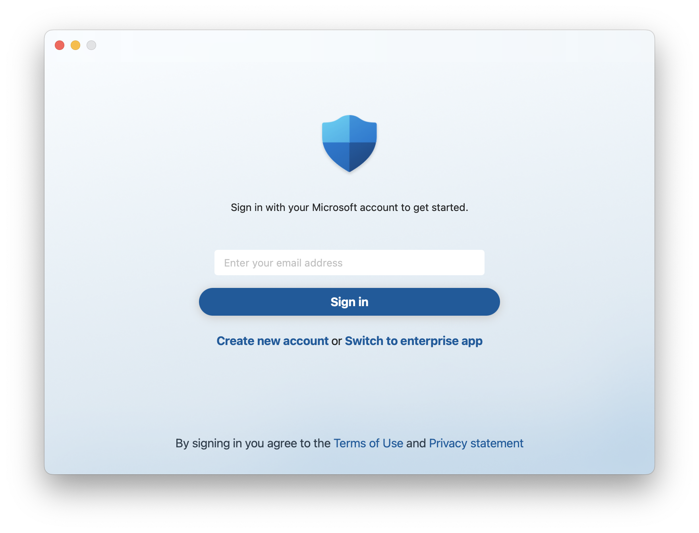

# Troubleshoot license issues for Microsoft Defender for Endpoint on macOS

[!INCLUDE [Microsoft 365 Defender rebranding](../../includes/microsoft-defender.md)]


**Applies to:**

- [Microsoft Defender for Endpoint on macOS](microsoft-defender-endpoint-mac.md)
- [Microsoft Defender for Endpoint Plan 1](https://go.microsoft.com/fwlink/p/?linkid=2154037)
- [Microsoft Defender for Endpoint Plan 2](https://go.microsoft.com/fwlink/p/?linkid=2154037)
- [Microsoft 365 Defender](https://go.microsoft.com/fwlink/?linkid=2118804)

> Want to experience Microsoft Defender for Endpoint? [Sign up for a free trial.](https://signup.microsoft.com/create-account/signup?products=7f379fee-c4f9-4278-b0a1-e4c8c2fcdf7e&ru=https://aka.ms/MDEp2OpenTrial?ocid=docs-wdatp-exposedapis-abovefoldlink)

## No license found

While deploying [Microsoft Defender for Endpoint on macOS](microsoft-defender-endpoint-mac.md), an error message with an **X** on top of the Microsoft Defender for Endpoint on macOS shield may appear. 

Click the **X** symbol and an **Action Needed** prompt should pop up. Clicking the **Action Needed** prompt will bring up the following licensing error message: 

:::image type="content" source="images/no-license-found.png" alt-text="Screenshot that shows a licensing error for Microsoft Defender for Endpoint on macOS shield." lightbox="images/no-license-found.png":::

### Message:

When you click the **x** symbol, you might options as shown in the following screenshot:

:::image type="content" source="images/x-symbol-menu-items.png" alt-text="The option listed when you click on the x symbol." lightbox="images/x-symbol-menu-items.png":::

When you click **Action needed**, you get the following error message:

**No license found**

**Looks like your organization does not have a license for Microsoft 365 Enterprise** **subscription.**

**Contact your administrator for help.**

The following screenshot shows how this error message is shown on the screen:

:::image type="content" source="images/license-not-found-message.png" alt-text="The message stating that there is no license for Microsoft 365 Enterprise subscription." lightbox="images/license-not-found-message.png":::

You'll encounter this message in a different way: In terminal, if you enter **mdatp health** without the double quotes, you might see the warning as shown in the following screenshot:

:::image type="content" source="images/no-license-found-warning.png" alt-text="The license-not-found message when using the terminal." lightbox="images/no-license-found-warning.png":::

Or if you type "mdatp health" in the terminal without the double quotes, you might see the following warning:

### Message

ATTENTION: No license found. Contact your administrator for help.\
healthy                                   : false\
health_issues                             : [“missing license”]\
licensed                                  : false

### Cause

You deployed and/or installed the Microsoft Defender for Endpoint on macOS package ("Download installation package"), but might not have run the configuration script ("Download onboarding package") that contains the license settings.


You can also encounter this error when the Microsoft Defender for Endpoint on macOS agent isn't up to date or if you haven't assigned a license to the user.

### Solution

Depending on the deployment management tool used, follow the instructions to onboard the package (register the license) as documented here:

1. Depending on the deployment management tool used, follow the tool-specific instructions to onboard the package (register the license) as described in the following table:

    |Management  |License deployment instructions (Onboarding instructions)  |
    |---------|---------|
    |Intune     |   [Download the onboarding package](mac-install-with-intune.md#download-the-onboarding-package)     |
    |JamF     |    [Step 1: Get the Microsoft Defender for Endpoint onboarding package](mac-jamfpro-policies.md#step-1-get-the-microsoft-defender-for-endpoint-onboarding-package)     |
    |Other MDM     |     [License settings](mac-install-with-other-mdm.md#license-settings)   |
    |Manual installation      |    [Download installation and onboarding packages](mac-install-manually.md#download-installation-and-onboarding-packages); and [Client configuration](mac-install-manually.md#client-configuration)     |

    > [!NOTE]
    > If the onboarding package runs correctly, the licensing information will be located in `/Library/Application Support/Microsoft/Defender/com.microsoft.wdav.atp.plist`.

2. For scenarios where Microsoft Defender for Endpoint on macOS isn't up to date, you'll need to [update](mac-updates.md) the agent.

3. In the Microsoft 365 Defender portal (security.microsoft.com):
    1. Select **Settings**. The **Settings** screen appears.
    1. Select **Endpoints**.
       
       :::image type="content" source="images/endpoints-option-on-settings-screen.png" alt-text="The Settings screen on which the Endpoints option is listed." lightbox="images/endpoints-option-on-settings-screen.png":::
 
       The **Endpoints** screen appears.
     
       :::image type="content" source="images/endpoints-screen.png" alt-text="The Endpoints screen." lightbox="images/endpoints-screen.png":::

    1. Select **Licenses**.
     
       :::image type="content" source="images/selecting-licenses-option-from-endpoints-screen.png" alt-text="Selecting Licenses option from the Endpoints screen." lightbox="images/selecting-licenses-option-from-endpoints-screen.png":::
       
    1. Click **View and purchase licenses in the Microsoft 365 admin center**. The screen in the Microsoft 365 admin center portal appears, as shown in the following screenshot:

       :::image type="content" source="images/m365-admin-center-purchase-assign-licenses.png" alt-text="The Microsoft 365 admin center portal screen from which licenses can be purchased and assigned." lightbox="images/m365-admin-center-purchase-assign-licenses.png":::

    1. Check the checkbox of the license you want to purchase from Microsoft, and click on it. The screen displaying details of the chosen license appears:

       :::image type="content" source="images/resultant-screen-of-clicking-preferred-license.png" alt-text="The screen on which you can click the option of assigning the purchased license." lightbox="images/resultant-screen-of-clicking-preferred-license.png":::

    1. Click the **Assign licenses** link.
    
       :::image type="content" source="images/assign-licenses-link.png" alt-text="The Assign licenses link." lightbox="images/assign-licenses-link.png":::

       The screen as shown in the following screenshot appears:

       :::image type="content" source="images/screen-containing-option-to-assign-licenses.png" alt-text="The screen containing the option + Assign licenses." lightbox="images/screen-containing-option-to-assign-licenses.png":::

    1. Select **+ Assign licenses**.
    1. Enter the name or email address of the person to whom you want to assign this license. 
    
       The resultant screen displays the details of the chosen license assignee, and a list of options.

       :::image type="content" source="images/assignee-details-and-options.png" alt-text="The screen displaying the assignee's details and a list of options." lightbox="images/assignee-details-and-options.png":::
 
    1. Check the checkboxes for **Microsoft 365 Advanced Auditing**, **Microsoft 365 Defender**, and **Microsoft Defender for Endpoint**.
    1. Select **Save**.

On implementing these solution options (either of them), if the licensing issues have been resolved, and then you run **mdatp health**, you should see results that are shown in the following screenshot:

:::image type="content" source="images/results-after-license-issues-resolved.png" alt-text="The results that are displayed after running mdatp health, once the licensing issues have been resolved." lightbox="images/results-after-license-issues-resolved.png":::

## Sign in with your Microsoft account

:::image type="content" source="images/mac-consumer-login.png" alt-text="Sign in with your Microsoft account to get started." lightbox="images/mac-consumer-login.png":::



### Message

Sign in with your Microsoft account to get started.

Create new account or Switch to enterprise app.

### Cause

You downloaded and installed [Microsoft Defender for individuals on macOS](https://www.microsoft.com/en-us/microsoft-365/microsoft-defender-for-individuals) on top of previously installed Microsoft Defender for Endpoint.

### Solution

Click **Switch to enterprise app** to switch to Enterprise experience.

You can also suppress switching to experience for Individuals on MDM-enrolled machines by including **userInterface**/**consumerExperience** in the Defender's settings:

```json
<key>userInterface</key>
<dict>
    <key>consumerExperience</key>
    <string>disabled</string>
</dict>
```

## Recommended content

- [Manual deployment for Microsoft Defender for Endpoint on macOS](mac-install-manually.md): Install Microsoft Defender for Endpoint on macOS manually, from the command line.
- [Set up the Microsoft Defender for Endpoint on macOS policies in Jamf Pro](mac-jamfpro-policies.md): Learn how to set up the Microsoft Defender for Endpoint on macOS policies in Jamf Pro.
- [Microsoft Defender for Endpoint on Mac](microsoft-defender-endpoint-mac.md): Learn how to install, configure, update, and use Microsoft Defender for Endpoint on Mac.
- [Deploying Microsoft Defender for Endpoint on macOS with Jamf Pro](mac-install-with-jamf.md): Learn how to deploy Microsoft Defender for Endpoint on macOS with Jamf Pro.
