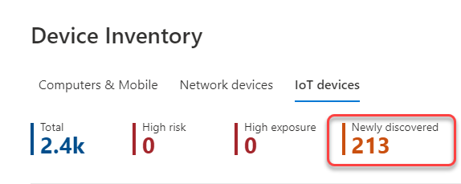

# Device inventory

[!INCLUDE [Microsoft 365 Defender rebranding](../../includes/microsoft-defender.md)]

**Applies to:**

- [Microsoft Defender for Endpoint Plan 1](https://go.microsoft.com/fwlink/p/?linkid=2154037)
- [Microsoft Defender for Endpoint Plan 2](https://go.microsoft.com/fwlink/p/?linkid=2154037)
- [Microsoft Defender Vulnerability Management](https://go.microsoft.com/fwlink/?linkid=2229011)
- [Microsoft 365 Defender](https://go.microsoft.com/fwlink/?linkid=2118804)

> Want to experience Defender for Endpoint? [Sign up for a free trial.](https://signup.microsoft.com/create-account/signup?products=7f379fee-c4f9-4278-b0a1-e4c8c2fcdf7e&ru=https://aka.ms/MDEp2OpenTrial?ocid=docs-wdatp-machinesview-abovefoldlink)

The **Device inventory** shows a list of the devices in your network where alerts were generated. By default, the queue displays devices seen in the last 30 days.

At a glance you'll see information such as domain, risk level, OS platform, and other details for easy identification of devices most at risk.

> [!NOTE]
> The device inventory is available in different Microsoft 365 Defender services. The information available to you will differ depending on your license. You'll get the most complete set of capabilities when using [Microsoft Defender for Endpoint Plan 2](https://go.microsoft.com/fwlink/p/?linkid=2154037).

> [!NOTE]
> Risk Level which can influence enforcement of conditional access and other security policies on Microsoft Intune, is available in Windows today.  

There are several options you can choose from to customize the devices list view. On the top navigation you can:

- Add or remove columns
- Export the entire list in CSV format
- Select the number of items to show per page
- Apply filters

During the onboarding process, the **Devices list** is gradually populated with devices as they begin to report sensor data. Use this view to track your onboarded endpoints as they come online, or download the complete endpoint list as a CSV file for offline analysis.

> [!NOTE]
> If you export the device list, it will contain every device in your organization. It might take a significant amount of time to download, depending on how large your organization is. Exporting the list in CSV format displays the data in an unfiltered manner. The CSV file will include all devices in the organization, regardless of any filtering applied in the view itself.

:::image type="content" source="images/device-inventory.png" alt-text="The list of devices" lightbox="images/device-inventory.png":::

## Sort and filter the device list

You can apply the following filters to limit the list of alerts and get a more focused view.

### Device name

During the Microsoft Defender for Endpoint onboarding process, devices onboarded to MDE are gradually populated into the device inventory as they begin to report sensor data. Following this, the device inventory is populated by devices that are discovered in your network through the device discovery process. The device inventory has three tabs that list devices by:

- **Computers and Mobile**: Enterprise endpoints (workstations, servers and mobile devices)
- **Network devices**: Devices like routers and switches
- **IoT devices**: Devices like printers and cameras

## Navigate to the Device inventory page

Access the device inventory page by selecting **Device inventory** from the **Endpoints** navigation menu in the [Microsoft 365 Defender portal](/microsoft-365/security/defender-business/mdb-get-started).

## Device inventory overview

The device inventory opens on the **Computers and Mobile** tab. At a glance you'll see information such as device name, domain, risk level, exposure level, OS platform, onboarding status, sensor health state, and other details for easy identification of devices most at risk.

Use the **Onboarding Status** column to sort and filter by discovered devices, and those already onboarded to Microsoft Defender for Endpoint.

From the **Network devices** and **IoT devices** tabs, you'll also see information such as vendor, model and device type:

> [!NOTE]
> Device discovery Integrations with [Microsoft Defender for IoT](/azure/defender-for-iot/organizations/) and [Corelight](https://corelight.com/integrations/iot-security) are available to help locate, identify, and secure your complete OT/IOT asset inventory. Devices discovered with these integrations will appear on the **IoT devices** tab. For more information, see [Device discovery integrations](device-discovery.md#device-discovery-integrations).
>
> When Defender for IoT is configured, you also can view the devices there. See [Manage your IoT devices with the device inventory for organizations](/azure/defender-for-iot/organizations/how-to-manage-device-inventory-for-organizations).

At the top of each device inventory tab, you can see the total number of devices, the number of devices that are not yet onboarded, and the number of devices that have been identified as a higher risk to your organization. You can use this information to help you prioritize devices for security posture improvements.

The **Newly discovered** device count for network devices and IoT devices tabs, shows the number of new devices discovered, in the last 7 days, listed in the current view.

## Explore the device inventory

There are several options you can choose from to customize the device inventory view. On the top navigation for each tab you can:

- Search for a device by name
- Search for a device by the most recently used IP address or IP address prefix
- Add or remove columns
- Export the entire list in CSV format for offline analysis
- Select the date range to display
- Apply filters

> [!NOTE]
> If you export the device list, it will contain every device in your organization. It might take a significant amount of time to download, depending on how large your organization is. Exporting the list in CSV format displays the data in an unfiltered manner. The CSV file will include all devices in the organization, regardless of any filtering applied in the view itself.

You can use the sort and filter functionality available on each device inventory tab to get a more focused view, and to help you assess and manage the devices in your organization.

The counts on the top of each tab will be updated based on the current view.

## Use filters to customize the device inventory views

Filter | Description
:---|:---
**Risk level** | The risk level reflects the overall risk assessment of the device based on a combination of factors, including the types and severity of active alerts on the device. Resolving active alerts, approving remediation activities, and suppressing subsequent alerts can lower the risk level.
**Exposure level** | The exposure level reflects the current exposure of the device based on the cumulative impact of its pending security recommendations. The possible levels are low, medium, and high. Low exposure means your devices are less vulnerable from exploitation.     If the exposure level says "No data available," there are a few reasons why this may be the case: - Device stopped reporting for more than 30 days. In that case it's considered inactive, and the exposure isn't computed. - Device OS not supported - see [minimum requirements for Microsoft Defender for Endpoint](/microsoft-365/security/defender-endpoint/minimum-requirements). - Device with stale agent (unlikely).
**Tags** | Filter the list based on the grouping and tagging that you've added to individual devices. See [Create and manage device tags](machine-tags.md).
**Device value** | Filter the list based on whether the device has been marked as high value or low value.
**Exclusion state** | Filter the list based on whether the device has been excluded or not. For more information, see [Exclude devices](exclude-devices.md).
**OS Platform** | Filter by the OS platforms you're interested in investigating   (_Computers and mobile and IoT devices only_)
**First seen** | Filter your view based on when the device was first seen in the network or when it was first reported by the Microsoft Defender for Endpoint sensor.  (_Computers and mobile and IoT devices only_)
**Windows version** | Filter by the Windows versions you're interested in investigating. If 'future version' appears in the Windows version field, it can mean:   - This is a pre-release build for a future Windows release  - The build has no version name  - The build version name is not yet supported    In all these scenarios, where available, the full OS version can be seen in the device details page.   (_Computers and mobile only_)
**Sensor health state** | Filter by the following sensor health states, for devices onboard to Microsoft Defender for Endpoint:  - **Active**: Devices that are actively reporting sensor data to the service.  - **Inactive**: Devices that have stopped sending signals for more than 7 days.   - **Misconfigured**: Devices that have impaired communications with service or are unable to send sensor data.   Misconfigured devices can further be classified to:    - No sensor data    - Impaired communications    For more information on how to address issues on misconfigured devices see, [Fix unhealthy sensors](/microsoft-365/security/defender-endpoint/fix-unhealthy-sensors).   (_Computers and mobile only_)
**Onboarding status** | Onboarding status indicates whether the device is currently onboarded to Microsoft Defender for Endpoint or not. Note that device discovery must be enabled for this filter to appear. You can filter by the following states:   - **Onboarded**: The endpoint is onboarded to Microsoft Defender for Endpoint.    - **Can be onboarded**: The endpoint was discovered in the network as a supported device, but it's not currently onboarded. Microsoft highly recommends onboarding these devices.   - **Unsupported**: The endpoint was discovered in the network, but is not supported by Microsoft Defender for Endpoint.   - **Insufficient info**: The system couldn't determine the supportability of the device.   (_Computers and mobile only_)
**Antivirus status** | Filter the view based on whether the antivirus status is disabled, not updated or unknown.   (_Computers and mobile only_)
**Group** | Filter the list based on the group you're interested in investigating.    (_Computers and mobile only_)
**Managed by** | Managed by indicates how the device is being managed. You can filter by:  - Microsoft Defender for Endpoint  - Microsoft Intune, including co-management with Microsoft Configuration Manager via tenant attach - Microsoft Configuration manager (ConfigMgr)  - Unknown: This could be due the running an outdated Windows version, GPO management, or another third party MDM.   (_Computers and mobile only_)
**Device Type** | Filter by the device type you're interested in investigating.   (_IoT devices only_)
**Mitigation status** | Filter by isolation or containment status of a device.

## Use columns to customize the device inventory views

You can add or remove columns from the view and sort the entries by clicking on an available column header.

On the **Computer and Mobiles** tab, select **Customize columns** to see the columns available. The default values are checked in the image below:

On the **Network devices** tab, select **Customize columns** to see the columns available. The default values are checked in the image below:

On the **IoT devices** tab, select **Customize columns** to see the columns available. The default values are checked in the image below:

## Related articles

[Investigate devices in the Microsoft Defender for Endpoint Devices list](investigate-machines.md)

[!INCLUDE [Microsoft Defender for Endpoint Tech Community](../../includes/defender-mde-techcommunity.md)]
