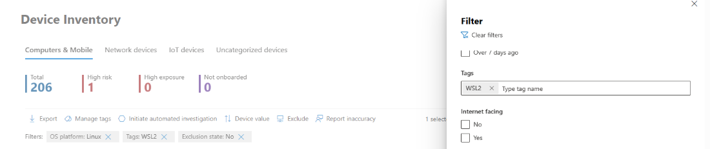

# Microsoft Defender for Endpoint plug-in for Windows Subsystem for Linux (WSL)

## Overview

Microsoft Defender for Endpoint (MDE) is an enterprise endpoint security platform designed to help enterprise networks prevent, detect, investigate, and respond to advanced threats. MDE for Windows Subsystem for Linux 2 (WSL) enables MDE to provide more visibility into all running WSL containers, by plugging into the isolated subsystem.

## Purpose of this document

This guide covers the installation of the Microsoft Defender for Endpoint Plug-in for WSL for x64 architecture workstations.

- [Software Prerequisites](#) – Please ensure that you are adhering to the software prerequisites. 
- [Software components and installer file names](#)
- [Installation steps](#) – Check these for a smooth installation process
- [Installation validation checklist](#) – Check these to ensure that the MDE plug-in has been installed successfully.
- [Troubleshooting](#) – If you get stuck, refer to this section.

## Software Prerequisites

- WSL version >= 1.3.15.0
- Microsoft Defender for Endpoint must be [onboarded and running](https://learn.microsoft.com/microsoft-365/security/defender-endpoint/onboard-configure) on the Windows host OS.
- The “Windows Subsystem for Linux feature” must be enabled in “Turn Windows features on or off”, and WSL must be installed with a distro.

## Software components and Installer file names

Installer: DefenderPlugin-x64-0.23.906.5.msi ([download](https://aka.ms/defenderplugin))

Installation Directories: C:\Program Files\                    C:\ProgramData\

Components installed:

- DefenderforEndpointPlug-in.dll – This is the library to load MDE to work within WSL. 

You can find it in - C:\Program Files\Microsoft Defender for Endpoint plug-in for WSL\plug-in 

- healthcheck.exe - It is a program to check the health status of Microsoft Defender for Endpoint and to see the installed versions of WSL, plug-in, and Defender.

You can find it in - C:\Program Files\Microsoft Defender for Endpoint plug-in for WSL\tools

## Installation steps

- Install the DefenderPlugin-x64-0.23.906.5.msi file.
- Open a command prompt/terminal and run “wsl”

> [!NOTE]
> If WslService is running, it will be stopped during the installation process.

## Installation validation checklist

- After update or installation, wait for at least 5 minutes for the plug-in to fully initialize and write log output.
- Open a terminal/command prompt instance (Start, run “cmd” or on Windows 11, right-click the start button and select Terminal)
- Run the command: cd “C:\Program Files\Microsoft Defender for Endpoint plug-in for WSL\tools”
- Run .\health_check.exe
- You will be able to see the details of Defender and WSL and ensure that they match the same.
  - Defender Plug-in Version- 0.23.906.5
  - WSL Version >= 1.3.15
  - WSL Defender Version – 701.00000.1411
  - WSL Defender Health – Healthy

## Setting a proxy for Defender running in WSL

This set of instructions will help you configure proxy connectivity for MDE plug-in. If your enterprise uses a proxy to provide connectivity to MDE running on the Windows host, read on to find out if you need to configure it for the plug-in.

Reuse Microsoft Defender for Endpoint static proxy setting (TelemetryProxyServer) 

If you wish to use the host “[static proxy](https://learn.microsoft.com/en-us/microsoft-365/security/defender-endpoint/configure-proxy-internet?view=o365-worldwide)” configuration for MDE for the WSL plug-in, nothing additional is required. This configuration will be adopted by the plug-in automatically.

### Set up a different/specific proxy configuration for MDE WSL

If you would like to set up a different proxy for Defender running in WSL (other than the Windows proxy specified with TelemetryProxyServer), or you have currently configured a system-wide proxy, the proxy configuration will not automatically be available for the plug-in. Please follow the steps below.

1. Open registry editor (requires administrator access) or use a tool that can configure registry keys across devices.

2. Create a registry key with the following details:

   **Name:** DefenderProxyServer
   **Type:** REG_SZ
   **Value:** <IP address>: <port number> (Example: 192.126.30.222:8888)
   **Path:** Computer\HKEY_LOCAL_MACHINE\SOFTWARE\Microsoft\Windows\CurrentVersion\Lxss\Plugins\DefenderPlug-in

3. Once the registry is set, if WSL is already running or plug-in is already installed, restart wsl using the following steps:

   1. Open command prompt and run “wsl --shutdown”.
   2. Then, run the command: wsl

## Connectivity test for Defender running in WSL

These instructions will help you verify if MDE in WSL has connectivity to the internet. 

To run the connectivity test, please follow the below instructions:

1. Open registry editor

2. Create a registry key with the following details:

   **Name:** ConnectivityTest
   **Type:** REG_DWORD
   **Value:** Number of seconds plug-in must wait before running test. (Recommended: 60 seconds)
   **Path:** Computer\HKEY_LOCAL_MACHINE\SOFTWARE\Microsoft\Windows\CurrentVersion\Lxss\Plugins\DefenderPlug-in

3. Once the registry is set, restart wsl using the following steps:

   1. Open command prompt and run “wsl --shutdown”.
   2. Run the command: wsl

4. Wait for 5 minutes and then run health_check.exe found in C:\Program Files\Microsoft Defender for Endpoint plug-in for WSL\tools for the results of the connectivity test.

5. If successful, the connectivity test should show success. 

> [!NOTE]
> To set a proxy for use in WSL containers (the distributions running on the subsystem), please follow the instructions at [Advanced settings configuration in WSL | Microsoft Learn](/windows/wsl/wsl-config).

## Verifying functionality and SOC analyst experience

After installing the plug-in, the subsystem and all its running containers will be onboarded to the Microsoft 365 Defender portal at <https://security.microsoft.com>.

- Log into the portal and open the “Devices” view
- Filter using the tag “WSL2”:

  

This will show you all WSL instances in your environment with an active MDE plug-in for WSL. The instances represent all distributions running inside WSL on a given host – the hostname of the “device” matches that of the Windows host. However, it is represented as a Linux device.

Open the device page. In the Overview pane, you will see that the “device” is “Hosted On” – this is a link that will allow you to understand this machine is running on a Windows host and pivot to the host for further investigation and/or response.

:::image type="content" source="media/mdeplugin-wsl/device-overview.png" alt-text="Screenshot showing device overview.":::  

The timeline will be populated, similar to MDE for Linux, with events from inside the subsystem (file, process, network). You can observe activity and detections in the timeline view. Alerts and incidents will be generated as appropriate as well. To test this, after the installation of the plug-in, please follow the steps given below:

1. Open a terminal/command prompt instance (Start, run “cmd” or on Windows 11, right-click the start button and select Terminal) 

2. Run the command:  wsl

3. Download and extract the script file from https://aka.ms/LinuxDIY and run the following command at the Linux prompt.

4. Run the command: ./mde_linux_edr_diy.sh

5. An alert should appear in the portal after a few minutes for a detection on the WSL2 instance.

> [!NOTE]
> It takes about 5 minutes for the events to appear on the Microsoft 365 Defender portal

Please treat the machine as if it were a “regular” Linux host in your environment, to perform testing against; in particular, we would like to get your feedback on the ability to surface potentially malicious behaviour using the new plug-in.

# Troubleshooting

1. health_check.exe shows the output: WSLService is not running. Launch with ‘wsl’ command in PowerShell and rerun health check

   :::image type="content" source="media/mdeplugin-wsl/powershell-output.png" alt-text="Screenshot showing PowerShell output.":::

2. If the above error occurs,

- Open a terminal instance and run the command “wsl”
- Wait for at least 5 minutes before rerunning the health check.

3. health_check.exe shows the output: No Defender Health telemetry found in the log file. Please retry in 5 minutes....

   :::image type="content" source="media/mdeplugin-wsl/powershell-2.png" alt-text="Screenshot showing health telemetry status.":::

4. If the above error occurs, wait for 5 minutes and rerun .\health_check.exe.

5. If you're seeing no devices in Microsoft 365 Defender portal, or no events in the timeline, take these steps:

   - If you are not seeing a machine object, please ensure that you allow for sufficient time for the onboarding to complete (typically this should be <10 minutes). 
   - Ensure you are leveraging the right filters and you are allowed to view all device objects (your account/group is not restricted to a specific group).
   - Use the health check tool to provide an overview of overall plug-in health. Open Terminal and run the health_check.exe tool from “C:\Program Files\Microsoft Defender for Endpoint plug-in for WSL\tools”

   :::image type="content" source="media/mdeplugin-wsl/powershell-4.png" alt-text="Screenshot showing status in PowerShell.":::

  - Do enable the connectivity test and check the connectivity of MDE in WSL. If the connectivity test fails, provide the output of the healthcheck tool to [mdeforwsl-preview@microsoft.com](mailto:mdeforwsl-preview@microsoft.com).

6. In case you face any other challenges / issues, open the terminal and run the commands: 

   - cd “C:\Program Files\Microsoft Defender for Endpoint plug-in for WSL\tools” .  
   - “.\health_check.exe --supportBundle” to generate the support bundle. 
   
   The support bundle can be found in the path provided by the previous command. Send the generated zip file to  [mdeforwsl-preview@microsoft.com](mailto:mdeforwsl-preview@microsoft.com)

   :::image type="content" source="media/mdeplugin-wsl/powershell-4.png" alt-text="Screenshot showing status in PowerShell output.":::

