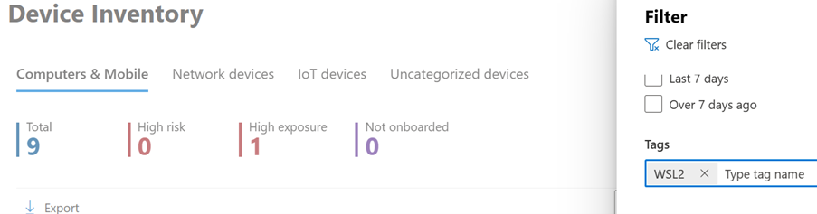

# Microsoft Defender for Endpoint plug-in for Windows Subsystem for Linux (WSL)

## Overview

Microsoft Defender for Endpoint is an enterprise endpoint security platform designed to help enterprise networks prevent, detect, investigate, and respond to advanced threats. Defender for Endpoint for Windows Subsystem for Linux 2 (WSL) enables Defender for Endpoint to provide more visibility into all running WSL containers, by plugging into the isolated subsystem.

## Known issues and limitations

Be aware of the following before you start:
1.	The plug-in doesn't yet automatically update. When we release a new plug-in version, the new MSI package needs to be applied to perform the update. This can be performed through any tool that deploys software. Updates are coming soon through Microsoft Update. You can continue to use the MSI package method if so desired.

2.	As it takes a few minutes for the plug-in to fully instantiate and up to 30 minutes for a WSL2 instance to onboard itself, short-lived WSL container instances might result in the WSL2 instance not showing up in the portal. Once a (any) distribution has been running long enough (at least 30 minutes), it will.

3.	If you're using a proxy in your (test) environment, ensure that the plug-in is set up to use it correctly. WSL is typically not automatically configured to use a proxy. See the section “Setting a proxy for the plug-in“ for more information.

## Software Prerequisites

- WSL version 2.0.7 or later must be running with at least one active distro

   Run `wsl --update` to make sure you are on the latest version. If you observe `wsl –version` shows a version older than 2.0.7, run `wsl –update –pre-release` to get the latest update.

- Microsoft Defender for Endpoint must be onboarded and running on the Windows host OS.

- The host OS must be running Windows 10, version 2004 and higher (Build 19041 and higher) or Windows 11 to support the Windows Subsystem for Linux versions that can work with the plug-in.

## Software components and Installer file names

Installer: DefenderPlugin-x64-0.23.1102.4.msi (download from the onboarding page at [https://security.microsoft.com])

Installation Directories: 

- `C:\Program Files\`

- `C:\ProgramData\`

Components installed:

- `DefenderforEndpointPlug-in.dll`. This DLL is the library to load Defender for Endpoint to work within WSL. You can find it at **C:\Program Files\Microsoft Defender for Endpoint plug-in for WSL\plug-in**. 

- `healthcheck.exe`. This program checks the health status of Defender for Endpoint and enables you to see the installed versions of WSL, plug-in, and Defender for Endpoint. You can find it at **C:\Program Files\Microsoft Defender for Endpoint plug-in for WSL\tools**.

## Installation steps

If you have not yet installed Windows Subsystem for Linux, use the following steps first:

- To install WSL for the first time, open a command prompt/terminal and run `wsl –install`

- If you already have WSL installed, run `wsl –update` to make sure you are on the latest version

- Run the `wsl` command to ensure WSL is running before testing.

After ensuring WSL is running and fully up to date, use the following steps to install the plug-in:

1. Install the MSI file downloaded from the onboarding section in the Microsoft Defender portal (**Settings** > **Endpoints** > **Onboarding** > **Windows Subsystem for Linux 2 (plug-in)**.)

2. Open a command prompt/terminal and run `wsl`.

Tip: you can (deploy the package using Microsoft Intune)[/mem/intune/apps/lob-apps-windows]

> [!NOTE]
> If WslService is running, it stops during the installation process. You do not need to onboard the subsystem separately; instead, the plug-in automatically onboards to the tenant the Windows host is onboarded to.

## Installation validation checklist

1. After update or installation, wait for at least five minutes for the plug-in to fully initialize and write log output.

2. Open a terminal/command prompt instance. (On Windows 11, go to **Start** > **Command Prompt**. Or, right-click the start button and then select **Terminal**.)

3. Run the command: `cd C:\Program Files\Microsoft Defender for Endpoint plug-in for WSL\tools`.

4. Run the command `.\health_check.exe`.

5. Review the details of Defender and WSL and make sure they match or exceed the below:

   - Defender Plug-in Version: `0.23.1102.4`
   - WSL Version `2.0.7.0` or later
   - WSL Defender Version: `101.23092.011`
   - WSL Defender Health: `Healthy`

## Setting a proxy for Defender running in WSL

Use these instructions to configure proxy connectivity for the Defender for Endpoint plug-in. If your enterprise uses a proxy to provide connectivity to Defender for Endpoint running on the Windows host, continue reading to determine whether you need to configure it for the plug-in.

Reuse Microsoft Defender for Endpoint static proxy setting (TelemetryProxyServer) 

If you want to use the host [static proxy](configure-proxy-internet.md) configuration for MDE for the WSL plug-in, nothing more is required. This configuration is adopted by the plug-in automatically.

### Set up a different/specific proxy configuration for MDE WSL

If you want to set up a different proxy for Defender running in WSL (other than the Windows proxy specified with `TelemetryProxyServer`), or you have currently configured a system-wide proxy, the proxy configuration isn't automatically available for the plug-in. In thise case, take these steps:

1. Open registry editor (requires administrator access) or use a tool that can configure registry keys across devices.

2. Create a registry key with the following details:

   **Name:** DefenderProxyServer
   **Type:** REG_SZ
   **Value:** *IP address*: *port number* (Example: 192.126.30.222:8888)
   **Path:** Computer\HKEY_LOCAL_MACHINE\SOFTWARE\Microsoft\Windows\CurrentVersion\Lxss\Plugins\DefenderPlug-in

3. Once the registry is set, if WSL is already running or plug-in is already installed, restart wsl using the following steps:

   1. Open Command Prompt and run `wsl --shutdown`.
   2. Then, run the command `wsl`.

## Connectivity test for Defender running in WSL

These instructions help you verify if MDE in WSL has connectivity to the internet. 

To run the connectivity test, please follow the below instructions:

1. Open Registry Editor.

2. Create a registry key with the following details:

   **Name:** `ConnectivityTest`
   **Type:** `REG_DWORD`
   **Value:** `Number of seconds plug-in must wait before running test. (Recommended: 60 seconds)`
   **Path:** `Computer\HKEY_LOCAL_MACHINE\SOFTWARE\Microsoft\Windows\CurrentVersion\Lxss\Plugins\DefenderPlug-in`

3. Once the registry is set, restart wsl using the following steps:

   1. Open Command Prompt and run `wsl --shutdown`.

   2. Run the command `wsl`.

4. Wait for 5 minutes and then run `health_check.exe` (located at `C:\Program Files\Microsoft Defender for Endpoint plug-in for WSL\tools` for the results of the connectivity test).

   If successful, the connectivity test shows success. 

> [!NOTE]
> To set a proxy for use in WSL containers (the distributions running on the subsystem), see [Advanced settings configuration in WSL](/windows/wsl/wsl-config).

## Verifying functionality and SOC analyst experience

After installing the plug-in, the subsystem and all its running containers are onboarded to the [Microsoft Defender portal](https://security.microsoft.com).

1. Sign into the portal and open the **Devices** view.

2. Filter using the tag **WSL2**. 

  

   You can see all WSL instances in your environment with an active Defender for Endpoint plug-in for WSL. The instances represent all distributions running inside WSL on a given host. The hostname of a *device* matches that of the Windows host. However, it's represented as a Linux device.

3. Open the device page. In the **Overview** pane, you'll see a link for where the device is hosted. The link enables you to understand that the device is running on a Windows host. You can then pivot to the host for further investigation and/or response.

   :::image type="content" source="media/mdeplugin-wsl/device-overview.png" alt-text="Screenshot showing device overview.":::  

The timeline is populated, similar to Defender for Endpoint on Linux, with events from inside the subsystem (file, process, network). You can observe activity and detections in the timeline view. Alerts and incidents are generated as appropriate as well. 

To test this, after the installation of the plug-in, please follow the steps given below:

1. Open a terminal/command prompt instance (Start, run “cmd” or on Windows 11, right-click the start button and select Terminal) 

2. Run the command:  wsl

3. Download and extract the script file from https://aka.ms/LinuxDIY and run the following command at the Linux prompt.

4. Run the command: ./mde_linux_edr_diy.sh

5. An alert should appear in the portal after a few minutes for a detection on the WSL2 instance.

> [!NOTE]
> It takes about 5 minutes for the events to appear on the Microsoft Defender portal

Please treat the machine as if it were a “regular” Linux host in your environment, to perform testing against; in particular, we would like to get your feedback on the ability to surface potentially malicious behaviour using the new plug-in.

### Advanced hunting

In the Advanced Hunting schema, under the DeviceInfo table, we have added a new attribute called HostDeviceId which can be used to map a WSL instance to its Windows host device. 

Here are a few sample hunting queries: 

```kusto

Get all WSL device ids for the current organization/tenant 
let wsl_endpoints = DeviceInfo  
| where OSPlatform == "Linux" and isempty(HostDeviceId) != true
| distinct DeviceId; 
wsl_endpoints

```

```kusto

Get WSL device ids and their corresponding host device ids 
DeviceInfo  
| where OSPlatform == "Linux" and isempty(HostDeviceId) != true
| distinct WSLDeviceId=DeviceId, HostDeviceId;

```

```kusto

Get a list of WSL device ids where curl or wget was run
let wsl_endpoints = DeviceInfo  
| where OSPlatform == "Linux" and isempty(HostDeviceId) != true
| distinct DeviceId; 
DeviceProcessEvents   
| where FileName == "curl" or FileName == "wget" 
| where DeviceId in (wsl_endpoints) 
| sort by Timestamp desc

```

## Troubleshooting

1. healthcheck.exe shows the output: WSLService is not running. Launch with ‘wsl’ command in PowerShell and rerun health check

   :::image type="content" source="media/mdeplugin-wsl/powershell-output.png" alt-text="Screenshot showing PowerShell output.":::

2. If the above error occurs, take the following steps:

   1. Open a terminal instance and run the command `wsl`.

   2. Wait for at least 5 minutes before rerunning the health check.

3. The `health_check.exe` command might show the output, "No Defender Health telemetry found in the log file. Please retry in 5 minutes."

   :::image type="content" source="media/mdeplugin-wsl/wsl-health-check.png" alt-text="Screenshot showing health telemetry status.":::

   If that error occurs, wait for 5 minutes and rerun `healthcheck.exe`.

4. If you don't see any devices in the Microsoft Defender portal, or you don't see any events in the timeline, check these things:

   - If you are not seeing a machine object, make sure sufficient time has passed for onboarding to complete (typically up to 10 minutes). 
 
   - Make sure to use the right filters, and that you have the right permissions to view all device objects. (For example, is your account/group is restricted to a specific group?)
 
   - Use the health check tool to provide an overview of overall plug-in health. Open Terminal, and run the `health_check.exe` tool from `C:\Program Files\Microsoft Defender for Endpoint plug-in for WSL\tools`.

   :::image type="content" source="media/mdeplugin-wsl/powershell-4.png" alt-text="Screenshot showing status in PowerShell.":::

  - Enable the connectivity test and check for Defender for Endpoint connectivity in WSL. If the connectivity test fails, provide the output of the healthcheck tool to [mdeforwsl-preview@microsoft.com](mailto:mdeforwsl-preview@microsoft.com).

5. In case you face any other challenges or issues, open the terminal and run the following commands to generate the support bundle: 

   ```powershell
   cd C:\Program Files\Microsoft Defender for Endpoint plug-in for WSL\tools

   .\healthcheck.exe --supportBundle 
   ```
   
   The support bundle can be found in the path provided by the previous command. Send the generated zip file to  [mdeforwsl-preview@microsoft.com](mailto:mdeforwsl-preview@microsoft.com)

   :::image type="content" source="media/mdeplugin-wsl/powershell-4.png" alt-text="Screenshot showing status in PowerShell output.":::

