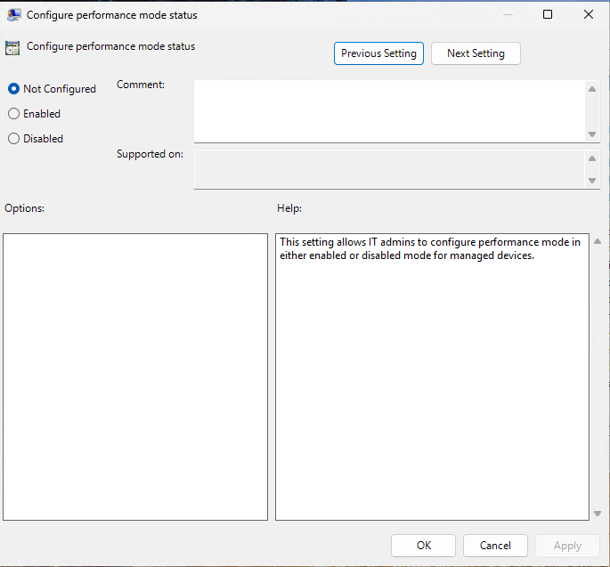
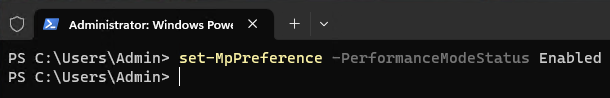

# Protect Dev Drive using performance mode

> [!NOTE]
> Want to experience Microsoft Defender XDR? Learn more about how you can [evaluate and pilot Microsoft Defender XDR](/microsoft-365/security/defender/eval-overview?ocid=cx-docs-MTPtriallab).

**Applies to:**

- Microsoft Defender for Endpoint Plans 1 and 2
- Microsoft Defender for Business
- Microsoft Defender Antivirus

**Platforms**

- Windows 11

## What is performance mode

Performance mode is now available on Windows 11 as a new Microsoft Defender Antivirus capability. Performance mode reduces the performance impact of Microsoft Defender Antivirus scans for files stored on designated _Dev Drive_. The goal of performance mode is to improve functional performance for developers who use Windows 11 devices. 

It's important to note that performance mode can run only on Dev Drive. Additionally, real-time protection must be turned on for performance mode to function. Enabling this feature on a Dev Drive doesn't change standard real-time protection running on volumes with operating systems or other volumes formatted FAT32 or NTFS.

### Dev Drive

Dev Drive is a new form of storage volume available to improve performance for key developer workloads. It builds on ReFS technology to employ targeted file system optimizations and provide more control over storage volume settings and security, including trust designation, antivirus configuration, and administrative control over which filters are attached.

For more information about Dev Drive, see: [Set up a Dev Drive on Windows 11](/windows/dev-drive).

### Performance mode compared to real-time protection

By default, to give the best possible performance, creating a Dev Drive automatically grants trust in the new volume. A _trusted_ Dev Drive volume causes real-time protection to run in a special _asynchronous_ performance mode for that volume. Running performance mode provides a balance between threat protection and performance. The balance is achieved by deferring security scans until after the _open file_ operation has completed, instead of performing the security scan synchronously while the file operation is being processed. This mode of performing security scans inherently provides faster performance, but with less protection. However, enabling performance mode provides significantly better protection than other _performance tuning_ methods such as using folder exclusions, which block security scans altogether.

> [!NOTE]
> To enable performance mode, real-time protection must be turned on.

The following table summarizes performance mode synchronous and asynchronous scan behavior.

| Performance mode state | Scan type | Description | Summary |
|:---|:---|:---|:---|
|Not enabled (Off) | **Synchronous**   (Real-time protection) | Opening a file initiates a real-time protection scan. | Open now, scan now. |
|Enabled (On) | **Asynchronous** | File open operations are scanned asynchronously. | Open now, scan later. |

An _untrusted_ Dev Drive doesn't have the same benefits as a _trusted_ Dev Drive. Security runs in synchronous, real-time protection mode when a Dev Drive is _untrusted_. Real-time protection scans can affect performance.

## Microsoft Defender Antivirus requirements for performance mode

1. Review the requirements that are specific to Dev Drive. See [Set up a Dev Drive on Windows 11](/windows/dev-drive).

2. Make sure Microsoft Defender Antivirus is up to date. 

   - Antimalware platform version: `4.18.2303.8` (or later)
   - Antimalware security intelligence version: `1.385.1455.0` (or later)
   - Real-time protection is turned on

## Manage performance mode

1. Performance mode can only run on a *trusted* Dev Drive and is enabled by default when a new Dev Drive is created. For more information, see [Understanding security risks and trust in relation to Dev Drive](/windows/dev-drive#understanding-security-risks-and-trust-in-relation-to-dev-drive).

2. Enforce the Microsoft Defender Antivirus Performance Mode by using Intune, Group Policy, or PowerShell.

### Intune 

Enable performance mode status via the OMA-URI settings shown in the following table.

| Setting | Value |
| -------- | -------- |
|OMA-URI:| ./Device/Vendor/MSFT/Defender/Configuration/PerformanceModeStatus |
|Data type|Integer|
|Value|1|

### Group Policy
  
1. In GPMC.msc or GPedit.msc, go to **Computer Configuration** > **Administrative Templates** > **Windows Components** > **Microsoft Defender Antivirus** > **Real-time Protection**.

2. Double-click **Configure performance mode status**.

   :::image type="content" alt-text="Screenshot of Defender_Performance_Mode_10." source="media/microsoft-defender-endpoint-antivirus-performance-mode/defender-performance-mode-10.png" lightbox="media/microsoft-defender-endpoint-antivirus-performance-mode/defender-performance-mode-10.png":::

3. Select **Enabled**.

   

4. Select **Apply**, and then select **OK**. 

### PowerShell

1. Open PowerShell as an administrator on the device.

2. Type `set-MpPreference -PerformanceModeStatus Enabled`, and then press Enter.

   

## Verify performance mode is enabled

To verify that Dev Drive and Defender Performance Mode is enabled, follow these steps:

1. In the Windows Security App, go to **Virus & threat Protection settings** > **Manage settings**, and verify that Dev Drive protection is enabled.

   :::image type="content" alt-text="Screenshot of Defender_Performance_Mode_02." source="media/microsoft-defender-endpoint-antivirus-performance-mode/defender-performance-mode-02.png":::

2. Select **See volumes**.

   :::image type="content" alt-text="Screenshot of Defender_Performance_Mode_03." source="media/microsoft-defender-endpoint-antivirus-performance-mode/defender-performance-mode-03.png" lightbox="media/microsoft-defender-endpoint-antivirus-performance-mode/defender-performance-mode-03.png":::

   |Drive| Status|
   | -------- | -------- |
   | C: |Since the system drive (for example, C: or D:) drive is formatted with NTFS, it's not eligible for Defender Performance mode.|
   |D:|Dev Drive is enabled but Defender Performance mode isn't enabled.|
   |F:|Dev Drive is enabled, and Defender Performance mode is enabled.|

## See also

[Set up a Dev Drive on Windows 11](/windows/dev-drive)

[!INCLUDE [Microsoft Defender for Endpoint Tech Community](../../includes/defender-mde-techcommunity.md)]
