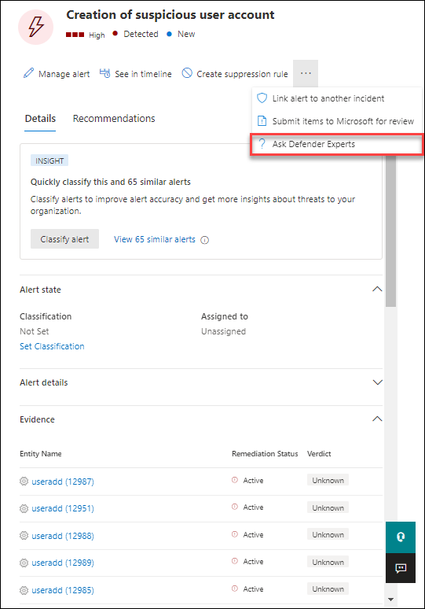
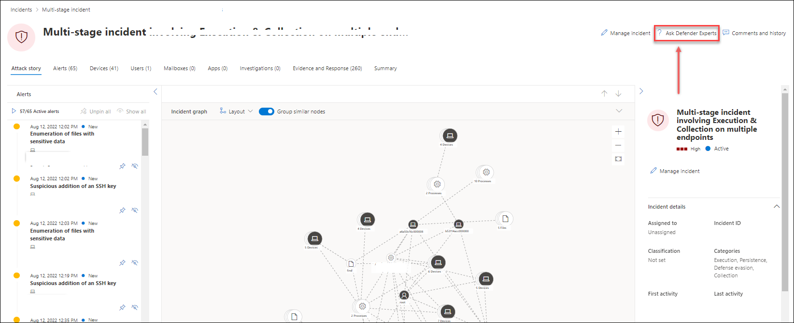

# Microsoft Threat Experts

[!INCLUDE [Microsoft 365 Defender rebranding](../../includes/microsoft-defender.md)]

**Applies to:**
- [Microsoft Defender for Endpoint Plan 2](https://go.microsoft.com/fwlink/p/?linkid=2154037)
- [Microsoft 365 Defender](https://go.microsoft.com/fwlink/?linkid=2118804)

> Want to experience Microsoft Defender for Endpoint? [Sign up for a free trial.](https://signup.microsoft.com/create-account/signup?products=7f379fee-c4f9-4278-b0a1-e4c8c2fcdf7e&ru=https://aka.ms/MDEp2OpenTrial?ocid=docs-wdatp-exposedapis-abovefoldlink)

> [!NOTE]
> As of August 2022, the Experts on Demand option to **Consult a threat expert** has been rebranded to **Ask Defender Experts**.

Microsoft Threat Experts is a managed threat hunting service that provides your Security Operation Centers (SOCs) with expert level monitoring and analysis to help them ensure that critical threats in your unique environments don't get missed.

This managed threat hunting service provides expert-driven insights and data through these two capabilities: endpoint attack notification and access to experts on demand.

Watch this video to learn how Microsoft Threat Experts provides Security Operation Centers (SOCs) with expert-level monitoring and analysis and ensures that no critical threat is missed. 
> [!VIDEO https://www.microsoft.com/en-us/videoplayer/embed/RE4qZ0B]

## Before you begin

> [!NOTE]
> Discuss the eligibility requirements with your Microsoft Technical Service provider and account team before you apply to the managed threat hunting service.
> Threat Experts is not currently available in the Microsoft 365 for U.S. Government clouds.

If you're a Microsoft Defender for Endpoint customer, you need to apply for **Endpoint Attack Notifications** to get special insights and analysis that help identify the most critical threats in your environment so you can respond to them quickly.

To enroll to Endpoint Attack Notifications benefits, go to **Settings** \> **Endpoints** \> **General** \> **Advanced features** \> **Endpoint Attack Notifications** to apply. Once accepted, you'll get the benefits of Endpoint Attack Notifications.

Contact your account team or Microsoft representative to subscribe to **Microsoft Threat Experts - Experts on Demand** to consult with our threat experts on relevant detections and adversaries that your organization is facing.

See [Configure Microsoft Threat Experts capabilities](/microsoft-365/security/defender-endpoint/configure-microsoft-threat-experts#before-you-begin) for details.

## Endpoint attack notification

Endpoint Attack Notifications (previously referred to as Microsoft Threat Experts - Targeted Attack Notification) provides proactive hunting for the most important threats to your network, including human adversary intrusions, hands-on-keyboard attacks, or advanced attacks like cyber-espionage. These notifications show up as a new alert. The managed hunting service includes:

- Threat monitoring and analysis, reducing dwell time and risk to the business
- Hunter-trained artificial intelligence to discover and prioritize both known and unknown attacks
- Identifying the most important risks, helping SOCs maximize time and energy
- Scope of compromise and as much context as can be quickly delivered to enable fast SOC response.

## Microsoft Threat Experts - Experts on Demand
> [!NOTE]
> Experts on Demand is not a security incident response service. It’s intended to provide a better understanding of complex threats affecting your organization. Engage with your own security incident response team to address urgent security incident response issues. If you don't have your own security incident response team and would like Microsoft's help, create a support request in the [Premier Services Hub](/services-hub/).

Customers can engage our security experts directly from within Microsoft 365 Defender portal to get their response. Experts provide insights needed to better understand the complex threats affecting your organization, from alert inquiries, potentially compromised devices, root cause of a suspicious network connection, to more threat intelligence regarding ongoing advanced persistent threat campaigns. With this capability, you can:

- Get more clarification on alerts including root cause or scope of the incident
- Gain clarity into suspicious device behavior and next steps if faced with an advanced attacker
- Determine risk and protection regarding threat actors, campaigns, or emerging attacker techniques

> [!NOTE]
> As of August 2022, the Experts on Demand option to **Consult a threat expert** has been rebranded to **Ask Defender Experts**.

The option to **Ask Defender Experts** is available in several places in the portal so you can engage with experts in the context of your investigation:

- ***Device page actions menu***

- ***Alerts page actions menu***

- ***File page actions menu***

> [!NOTE]
> If you would like to track the status of your Experts on Demand cases through Microsoft Services Hub, reach out to your Customer Success Account Manager.

Watch this video for a quick overview of the Microsoft Services Hub.

> [!VIDEO https://www.microsoft.com/videoplayer/embed/RE4pk9f]

## See also

- [Configure Microsoft Threat Experts capabilities](configure-microsoft-threat-experts.md)
