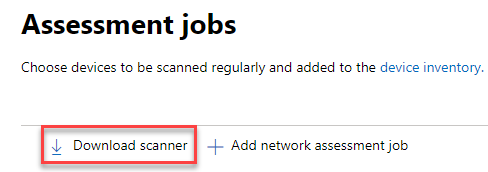
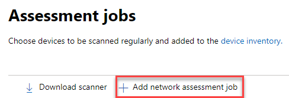
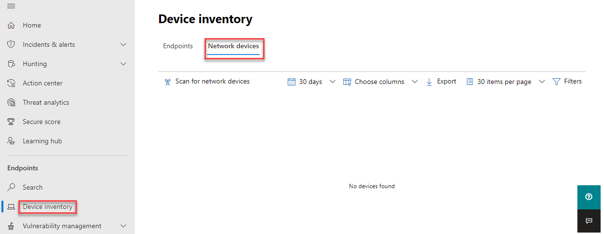

# Network device discovery and vulnerability management

[!INCLUDE [Microsoft 365 Defender rebranding](../../includes/microsoft-defender.md)]

**Applies to:**

- [Microsoft Defender for Endpoint](https://go.microsoft.com/fwlink/?linkid=2154037)
- [Threat and vulnerability management](next-gen-threat-and-vuln-mgt.md)
- [Microsoft 365 Defender](https://go.microsoft.com/fwlink/?linkid=2118804)

> [!IMPORTANT]
> **Scanning and managing network devices is currently in public preview** 
> This preview version is provided without a service level agreement, and it's not recommended for production workloads. Certain features might not be supported or might have constrained capabilities.
> For more information, see [Microsoft Defender for Endpoint preview features](preview.md).

>Want to experience Microsoft Defender for Endpoint? [Sign up for a free trial.](https://www.microsoft.com/microsoft-365/windows/microsoft-defender-atp?ocid=docs-wdatp-portaloverview-abovefoldlink)

> [!NOTE]  
> The [Network device discovery and vulnerability assessments](https://nam06.safelinks.protection.outlook.com/?url=https%3A%2F%2Ftechcommunity.microsoft.com%2Ft5%2Fmicrosoft-defender-for-endpoint%2Fnetwork-device-discovery-and-vulnerability-assessments%2Fba-p%2F2267548&data=04%7C01%7Cv-jweston%40microsoft.com%7Cfa0c4358544d4948137f08d8ff8e7cff%7C72f988bf86f141af91ab2d7cd011db47%7C1%7C0%7C637540334823930077%7CUnknown%7CTWFpbGZsb3d8eyJWIjoiMC4wLjAwMDAiLCJQIjoiV2luMzIiLCJBTiI6Ik1haWwiLCJXVCI6Mn0%3D%7C1000&sdata=2p7ZzV8%2BKjMCgehJrY4wnKiwYWTWBr730kkyWYLleWQ%3D&reserved=0) Blog \(published 04-13-2021\) provides insights into the new **Network device discovery** capabilities in Defender for Endpoint. This article provides an overview of the challenge that **Network device discovery** is designed to address, and detailed information about how get started using these new capabilities.

Network discovery capabilities are available in the **Device inventory** section of the Microsoft 365 security center and Microsoft Defender Security Center consoles.  

A designated Microsoft Defender for Endpoint device will be used on each network segment to perform periodic authenticated scans of preconfigured network devices. Once discovered, Defender for Endpoint’s threat and vulnerability management capabilities provide integrated workflows to secure discovered switches, routers, WLAN controllers, firewalls, and VPN gateways.  

Once the network devices are discovered and classified, security administrators will be able to receive the latest security recommendations and review recently discovered vulnerabilities on network devices deployed across their organizations.

## Approach

Network devices are not managed as standard endpoints since Defender for Endpoint doesn’t have a sensor built into the network devices themselves. These types of devices require an agentless approach where a remote scan will obtain the necessary information from the devices. Depending on the network topology and characteristics, a single device or a few devices onboarded to Microsoft Defender for Endpoint will perform authenticated scans of network devices using SNMP (read-only).

There will be two types of devices to keep in mind:

- **Assessment device**: A device that's already onboarded that you'll use to scan the network devices.
- **Network devices**: The network devices you plan to scan and onboard.

### Vulnerability management for network devices 

Once the network devices are discovered and classified, security administrators will be able to receive the latest security recommendations and review recently discovered vulnerabilities on network devices deployed across their organizations.  

## Operating systems that are supported

The following operating systems are currently supported:

- Cisco IOS, IOS-XE, NX-OS
- Juniper JUNOS
- HPE ArubaOS, Procurve Switch Software
- Palo Alto Networks PAN-OS

More networking vendors and OS will be added over time, based on data gathered from customer usage. Therefore, you are encouraged to configure all your network devices, even if they’re not specified in this list.

## How to get started

Your first step is to select a device that will perform the authenticated network scans.

1. Decide on a Defender for Endpoint onboarded device (client or server) that has a network connection to the management port for the network devices you plan on scanning. 

2. SNMP traffic between the Defender for Endpoint assessment device and the targeted network devices must be allowed (for example, by the Firewall).

3. Decide which network devices will be assessed for vulnerabilities (for example: a Cisco switch or a Palo Alto Networks firewall).  

4. Make sure SNMP read-only is enabled on all configured network devices to allow the Defender for Endpoint assessment device to query the configured network devices. ‘SNMP write’ isn't needed for the proper functionality of this feature.

5. Obtain the IP addresses of the network devices to be scanned (or the subnets where these devices are deployed).

6. Obtain the SNMP credentials of the network devices (for example: Community String, noAuthNoPriv, authNoPriv, authPriv). You’ll be required to provide the credentials when configuring a new assessment job.  

7. Proxy client configuration: No extra configuration is required other than the Defender for Endpoint device proxy requirements.

8. To allow the network scanner to be authenticated and work properly, it's essential that you add the following domains/URLs:

    - login.windows.net  
    - *.securitycenter.windows.com
    - login.microsoftonline.com
    - *.blob.core.windows.net/networkscannerstable/ *

    > [!NOTE]
    > Not all URLs are specified in the Defender for Endpoint documented list of allowed data collection.

## Permissions

To configure assessment jobs, the following user permission option is required: **Manage security settings in Security Center**. You can find the permission by going to **Settings** > **Roles**. For more information, see [Create and manage roles for role-based access control](user-roles.md)

## Install the network scanner

1. Go to **Microsoft 365 security** > **Settings** > **Endpoints** > **Assessment jobs** (under 'Network assessments').
    1. In the Microsoft Defender Security Center, go to Settings > Assessment jobs page.

2. Download the network scanner and install it on the designated Defender for Endpoint assessment device.

    > [!div class="mx-imgBorder"]
    > 

## Network scanner installation & registration

The signing-in process can be completed on the designated assessment device itself or any other device (for example, your personal client device).

To complete the network scanner registration process:

1. Copy and follow the URL that appears on the command line and use the provided installation code to complete the registration process.

    > [!NOTE]
    > You may need to change Command Prompt settings to be able to copy the URL.

2. Enter the code and sign in using a Microsoft account that has the Defender for Endpoint permission called "Manage security settings in Security Center."

3. When finished, you should see a message confirming you have signed in.

## Configure a new assessment job  

In the Assessment jobs page in **Settings**, select **Add network assessment job**. Follow the set-up process to choose network devices to be scanned regularly and added to the device inventory.

To prevent device duplication in the network device inventory, make sure each IP address is configured only once across multiple assessment devices.

> [!div class="mx-imgBorder"]
> 

Adding a network assessment job steps:

1. Choose an ‘Assessment job’ name and the ‘Assessment device’ on which the network scanner was installed. This device will perform the periodic authenticated scans.

2. Add IP addresses of target network devices to be scanned (or the subnets where these devices are deployed). 

3. Add required SNMP credentials of the target network devices. 

4. Save the newly configured network assessment job to start the periodic network scan. 

### Scan and add network devices

During the set-up process, you can perform a one time test scan to verify that:

- There is connectivity between the Defender for Endpoint assessment device and the configured target network devices.
- The configured SNMP credentials are correct.

Each assessment device can support up to 1,500 successful IP addresses scan. For example, if you scan 10 different subnets where only 100 IP addresses return successful results, you will be able to scan 1,400 IP additional addresses from other subnets on the same assessment device.  

If there are multiple IP address ranges/subnets to scan, the test scan results will take several minutes to show up. A test scan will be available for up to 1,024 addresses.

Once the results show up, you can choose which devices will be included in the periodic scan. If you skip viewing the scan results, all configured IP addresses will be added to the network assessment job (regardless of the device’s response). The scan results can also be exported.

## Device inventory

Newly discovered devices will be shown under the new **Network devices** tab in the **Device inventory** page. It may take up to two hours after adding an assessment job until the devices are updated.

> [!div class="mx-imgBorder"]
> 

## Troubleshooting

### Network scanner installation has failed

Verify that the required URLs are added to the allowed domains in your firewall settings. Also, make sure proxy settings are configured as described in [Configure device proxy and Internet connectivity settings](configure-proxy-internet.md).

### The Microsoft.com/devicelogin web page did not show up

Verify that the required URLs are added to the allowed domains in your firewall. Also, make sure proxy settings are configured as described in [Configure device proxy and Internet connectivity settings](configure-proxy-internet.md).

### Network devices are not shown in the device inventory after several hours

The scan results should be updated a few hours after the initial scan that took place after completing the assessment job configuration.

If devices are still not shown, verify that the service ‘MdatpNetworkScanService’ is running on your assessment devices, on which you installed the network scanner, and perform a “Run scan” in the relevant assessment job configuration.  

If you still don’t get results after 5 minutes, restart the service.  

### Devices last seen time is longer than 24 hours

Validate that the scanner is running properly. Then go to the scan definition and select “Run test.” Check what error messages are returning from the relevant IP addresses.

### Required threat and vulnerability management user permission

Registration finished with an error: "It looks like you don't have sufficient permissions for adding a new agent. The required permission is 'Manage security settings in Security Center'."

Press any key to exit.

Ask your system administrator to assign you the required permissions. Alternately, ask another relevant member to help you with the sign-in process by providing them with the sign-in code and link.

### Registration process fails using provided link in the command line in registration process

Try a different browser or copy the sign-in link and code to a different device.

### Text too small or can’t copy text from command line

Change command-line settings on your device to allow copying and change text size.

## Related articles

- [Device inventory](machines-view-overview.md)
- [Configure advanced features](advanced-features.md)
