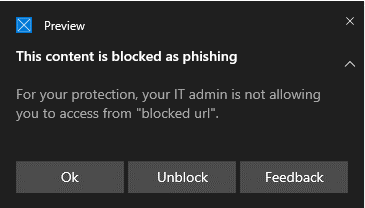
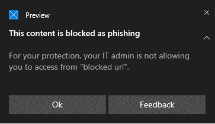
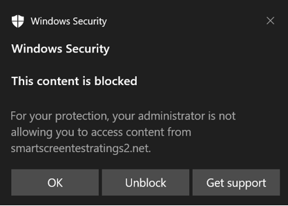
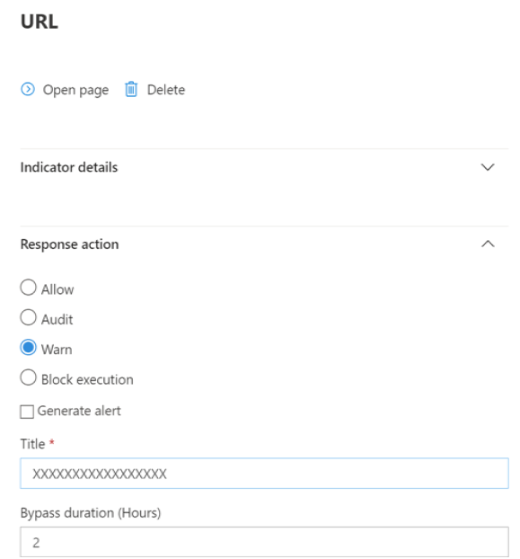
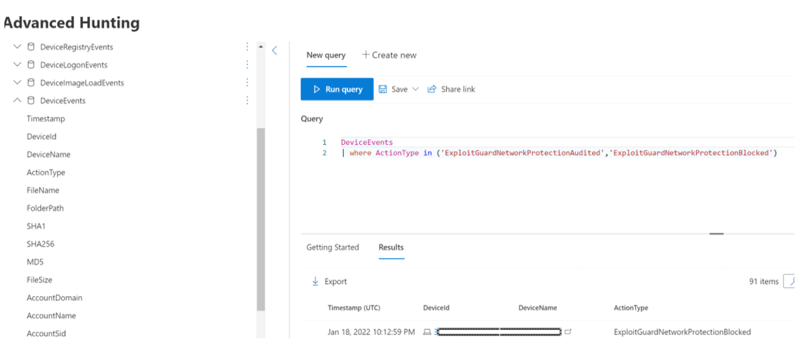

# Protect your network

[!INCLUDE [Microsoft 365 Defender rebranding](../../includes/microsoft-defender.md)]

**Applies to:**

- [Microsoft Defender for Endpoint Plan 2](https://go.microsoft.com/fwlink/p/?linkid=2154037)
- [Microsoft 365 Defender](https://go.microsoft.com/fwlink/?linkid=2118804)

> Want to experience Microsoft Defender for Endpoint? [Sign up for a free trial.](https://signup.microsoft.com/create-account/signup?products=7f379fee-c4f9-4278-b0a1-e4c8c2fcdf7e&ru=https://aka.ms/MDEp2OpenTrial?ocid=docs-wdatp-exposedapis-abovefoldlink)

## Overview of network protection

Network protection helps protect devices from Internet-based events. Network protection is an attack surface reduction capability. It helps prevent employees from accessing dangerous domains through applications. Domains that host phishing scams, exploits, and other malicious content on the Internet are considered dangerous. Network protection expands the scope of [Microsoft Defender SmartScreen](/windows/security/threat-protection/microsoft-defender-smartscreen/microsoft-defender-smartscreen-overview) to block all outbound HTTP(s) traffic that attempts to connect to low-reputation sources (based on the domain or hostname).

Network protection extends the protection in [Web protection](web-protection-overview.md) to the operating system level. It provides the web protection functionality found in Edge to other supported browsers and non-browser applications. In addition, network protection provides visibility and blocking of indicators of compromise (IOCs) when used with [Endpoint detection and response](overview-endpoint-detection-response.md). For example, network protection works with your [custom indicators](manage-indicators.md) that you can use to block specific domains or hostnames.

> [!TIP]
> See the Microsoft Defender for Endpoint testground site at [demo.wd.microsoft.com](https://demo.wd.microsoft.com?ocid=cx-wddocs-testground) to see how network protection works.

> [!NOTE]
> The Defender for Endpoint demo site at demo.wd.microsoft.com is deprecated and will be removed in the future.

## Requirements for network protection

Network protection requires Windows 10 Pro or Enterprise, and Microsoft Defender Antivirus real-time protection.

****

| Windows version | Microsoft Defender Antivirus |
|:---|:---|
| Windows 10 version 1709 or later <br> Windows 11 <br> Windows Server 1803 or later | [Microsoft Defender Antivirus real-time protection](configure-real-time-protection-microsoft-defender-antivirus.md) <br> and [cloud-delivered protection](enable-cloud-protection-microsoft-defender-antivirus.md) must be enabled (active)| |

## Why network protection is important

> [!IMPORTANT]
> Some information relates to prereleased product which may be substantially modified before it's commercially released. Microsoft makes no warranties, express or implied, with respect to the information provided here.
>
> Information about the features that are commercially available follows the Public Preview information.

Network protection is a part of the attack surface reduction group of solutions in Microsoft Defender for Endpoint. Network protection enables layer 3 (network layer) blocking of URLs and IPs. This means network protection can block URLs being accessed from 3rd-party browsers, as well as standard network connections.

By default, network protection guards your computers from known malicious URLs using the Smart Screen feed, which blocks malicious URLs in a manner similar to SmartScreen in Edge browser. The network protection functionality can be extended to:

- Block IP / URL from your own Threat Intel (Indicators)
- Block unsanctioned services from Microsoft Cloud App Security (MCAS)
- Block sites based on category (Web Content filtering)

Network Protections is a critical part of the Microsoft protection and response stack.

For details about Network Protection for Windows Server, Linux, MacOS and MTD, see: [Proactively hunt for threats with advanced hunting](advanced-hunting-overview.md)

### Block Command and Control (C2) attacks

C2 server computers are used by malicious users to send commands to systems compromised by malware, and subsequently exert some type of control over compromised systems. C2 attacks typically hide in cloud-based services such as file-sharing and webmail services, enabling the C2 servers to avoid detection by blending in with typical traffic.

C2 servers can be used to initiate commands that can:

- steal data (for example, by way of phishing)
- control compromised computers in a botnet
- disrupt legitimate applications
- spread malware, such as ransomware

The Network Protection component of Microsoft Defender for Endpoint identifies and blocks connections to C2 infrastructures used in human-operated ransomware attacks, using techniques like machine learning and intelligent indicator-of-compromise (IoC) identification.

#### Network protection: New toast notifications

| New mapping  | Response category  | Sources |
| :--- | :--- | :--- |
| phishing | Phishing | SmartScreen |
| malicious | Malicious | SmartScreen |
| command and control | C2 | SmartScreen |
| command and control | COCO | SmartScreen |
| malicious | Untrusted | SmartScreen |
| by your IT admin | CustomBlockList |   |
| by your IT admin | CustomPolicy |   |

> [!NOTE]
> **customeAllowList** does not generate notifications on endpoints.

### New notifications for network protection determination

A new, publicly-available capability in network protection utilizes functions in SmartScreen to block phishing activities from malicious command and control sites.

When an end user attempts to visit a website in an environment in which network protection is enabled, three scenarios are possible:

- The URL has a known good reputation. In this case the user is permitted access without obstruction, and there is no toast notification presented on the endpoint. {The domain or URL is set to _Allowed_}
- The URL has an unknown or uncertain reputation. The user's access is blocked, but with the ability to circumvent (unblock) the block. {The domain or url is set to _Audit_}
- The URL has a known bad (malicious) reputation. The user is prevented from access. {the domain or url is set to _Block_}

#### Warn experience

A user visits a website:

- If the url has a unknown or uncertain reputation, a toast notification will present the user with the following options:
  - **Ok** The toast notification is released (removed), and the attempt to access the site is ended.
  - **Unblock** The user will not need to access the Windows Defender Security Intelligence (WDSI) portal to gain site access. The user will have access to the site for 24 hours; at which point the block is reenabled for an additional 24 hours. The user can continue to use **Unblock** to access the site until such time that the administrator prohibits (blocks) the site, thus removing the option to **Unblock**.
  - **Feedback** The toast notification presents the user with a link to submit a ticket, which the user can use to submit feedback to the administrator in an attempt to justify access to the site.

  > [!div class="mx-imgBorder"]
  > 

  > [NOTE!]
  > The images shown here for warn experience and block experience (below) both list **"blocked url"** as example placeholder text; in a functioning environment the actual url or domain will be listed.  

#### Block experience

A user visits a website:

- If the url has a bad reputation, a toast notification will present the user with the following options:
  - **Ok** The toast notification is released (removed), and the attempt to access the site is ended.
  - **Feedback** The toast notification presents the user with a link to submit a ticket, which the user can use to submit feedback to the administrator in an attempt to justify access to the site.
  
  > [!div class="mx-imgBorder"]
  > 

### Network protection: C2 detection and remediation (private preview)

In its initial form, ransomware is a commodity threat, pre-programmed and focused on limited, specific outcomes (for example, encrypting a computer). However, ransomware has evolved into a sophisticated threat that is human driven, adaptive, and focused on larger scale and more widespread outcomes; like holding an entire organization’s assets or data for ransom.

Support for Command and Control (C2) is a key part of this ransomware evolution and is what enables these attacks to adapt to the environment they target. Breaking the link to the command-and-control infrastructure means stopping the progression of an attack to its next stage.

#### Detecting and remediating CobaltStrike (public preview)

One of the most common post-exploitation frameworks used in human-operated ransomware attacks is CobaltStrike. Threat Intelligence teams across Microsoft track Tactics, Techniques, and Procedures (TTPs) on multiple activity groups that deploy ransomware to identify patterns of behavior which can be used to defend against specific strategies and threat vectors used by malicious actors.  These ransomware activity groups all, at some point in the attack life cycle, involve deploying a CobaltStrike Beacon to a victim’s computer to enable hands-on keyboard activity.

CobaltStrike enables customization of multiple aspects of the attack, from the ability to host multiple listeners responding to different protocols, to how the main client-side component (Beacon) should perform code injection and run post-exploitation jobs. When Microsoft Defender detects CobaltStrike, it can intelligently find and collect key indicators-of-compromise. Once captured, these indicators are -shared throughout Microsoft’s product stack for detection and protection purposes.

Microsoft Defender’s command and control detection is not limited to CobaltStrike. Microsoft Defender can capture key IoCs of multiple malware families. The indicators are shared across the Microsoft protection stack to protect customers and alert them in the event of a compromise.

Blocking command-and-control communication can severely impede a targeted attack, giving defenders time to find the initial entry vectors and close them down before another attempted attack.

<!-- Hide {this intro with no subsequent list items}
[For additional details about Microsoft Defender's command and control detection, see: **ADD LINK TO BLOG**]
-->

## Smart Screen Unblock

A new feature in Microsoft Defender for Endpoint Indicators enables administrators to allow end users to bypass “Warnings” generated for some URLs and IPs. Depending on why the URL was blocked, when a Smart Screen block is encountered it may offer administrators the ability to unblock the site for up to 24 hours. In such cases, a Windows Security toast notification will appear, permitting the end-user to **Unblock** the URL or IP for the defined period of time.  

 > [!div class="mx-imgBorder"]
 > 

Microsoft Defender for Endpoint Administrators can configure Smart Screen Unblock functionality at [Microsoft 365 Defender](https://security.microsoft.com/), using the following configuration tool. From the Microsoft 365 Defender portal, navigate to: > path to > ConfigToolName.

 > [!div class="mx-imgBorder"]
 > 

#### Using network protection

Network protection is enabled per device, this is typically done using your management infrastructure. For supported methods please see: [Turn on network protection](enable-network-protection.md).

> [!NOTE]
> Microsoft Defender Antivirus must be active to enable Network protection.

You can enable Network Protection in **Audit** mode or **Block** mode.  If you want to evaluate the impact of enabling Network Protection before blocking IP’s or URLs, you can enable it in Audit mode - for a period of time - to gather data on what would be blocked. Audit mode logs when end users have connected to an address or site that would otherwise have been blocked by network protection.

#### Advanced Hunting

If you are using Advanced Hunting to identify audit events you will have up to 30 days history available from the console. See [Advanced Hunting](advanced-hunting-overview.md)

You can find the audit data in **Advanced hunting** in the Microsoft Defender for Endpoint portal.  

The events are in: DeviceEvents with an ActionType of ExploitGuardNetworkProtectionAudited (Blocks are shown by ExploitGuardNetworkProtectionBlocked).  

The following example  includes the blocked actions.

DeviceEvents
| where ActionType in ('ExploitGuardNetworkProtectionAudited','ExploitGuardNetworkProtectionBlocked')

 > [!div class="mx-imgBorder"]
 > 

> [!TIP]
> These entries have data in the AdditionalFields column which gives you great info around the action, if you expand AdditionalFields you can also get the fields: **IsAudit**, **ResponseCategory**, and **DisplayName**.

DeviceEvents:

| where ActionType contains "ExploitGuardNetworkProtection"
| extend ParsedFields=parse_json(AdditionalFields)
| project DeviceName, ActionType, Timestamp, RemoteUrl, InitiatingProcessFileName, IsAudit=tostring(ParsedFields.IsAudit), ResponseCategory=tostring(ParsedFields.ResponseCategory), DisplayName=tostring(ParsedFields.DisplayName)
| sort by Timestamp desc

Response category tells you what caused the event, for example:

| ResponseCategory | Feature responsible for the event |
|:---|:---|
| CustomPolicy |  WCF  |
| CustomBlockList  |   Custom indicators   |
| CasbPolicy   |   Defender for Cloud Apps   |
| Malicious   |   Web threats  |
| Phishing  |   Web threats  |

For additional information, see [Troubleshoot endpoint blocks](web-protection-overview.md#troubleshoot-endpoint-blocks)

You can use the resulting list of URLs and IPs to determine what would have been blocked if the device was in block mode, as well as which feature blocked them. Review each item on the list to identify URLS or IPs whether any are necessary to your environment. If you find any entries that have been audited which are critical to your environment, create an Indicator to allow them in your network. Allow URL / IP indicators take precedence over any block.

Once you have created an Indicator you can look at resolving the underlying issue:

- Smart screen – request review
- Indicator – modify existing indicator
- MCA – review unsanctioned APP
- WCF – request recategorization

Using this data you can make an informed decision on enabling Network protection in Block mode. See: [Order of precedence for Network protection blocks](web-protection-overview.md#order-of-precedence).

> [!NOTE]
> As this is a per device setting if there are devices that cannot move to Block mode you can simply leave them on audit until you can rectify the challenge and you will still receive the auditing events.

For information about how to report false positives see: [Report false positives](web-protection-overview.md#report-false-positives)

For details on how to create your own PowerBi reports, see: [Create custom reports using Power BI](api-power-bi.md)

For additional details, see **ADD LINK TO BLOG

## Configuring network protection

For more information about how to enable network protection, see **[Enable network protection](enable-network-protection.md)**. Use Group Policy, PowerShell, or MDM CSPs to enable and manage network protection in your network.

After you have enabled the services, you might need to configure your network or firewall to allow the connections between the services and your devices (also referred to as endpoints).

- `.smartscreen.microsoft.com`
- `.smartscreen-prod.microsoft.com`

## Viewing network protection events

Network protection works best with [Microsoft Defender for Endpoint](microsoft-defender-endpoint.md), which gives you detailed reporting into exploit protection events and blocks as part of [alert investigation scenarios](investigate-alerts.md).

When network protection blocks a connection, a notification is displayed from the Action Center. Your security operations team can [customize the notification](attack-surface-reduction-rules-deployment-implement.md#customize-attack-surface-reduction-rules) with your organization's details and contact information. In addition, individual attack surface reduction rules can be enabled and customized to suit certain techniques to monitor.

You can also use [audit mode](audit-windows-defender.md) to evaluate how network protection would impact your organization if it were enabled.

## Review network protection events in the Microsoft 365 Defender portal

Microsoft Defender for Endpoint provides detailed reporting into events and blocks as part of its [alert investigation scenarios](investigate-alerts.md). You can view these details in the Microsoft 365 Defender portal ([https://security.microsoft.com](https://security.microsoft.com)) in the [alerts queue](review-alerts.md) or by using [advanced hunting](advanced-hunting-overview.md). If you're using [audit mode](audit-windows-defender.md), you can use advanced hunting to see how network protection settings would affect your environment if they were enabled.

Here is an example query for advanced hunting:

```kusto
DeviceNetworkEvents
|where ActionType in ('ExploitGuardNetworkProtectionAudited','ExploitGuardNetworkProtectionBlocked', 'ConnectionSuccess')
```

## Review network protection events in Windows Event Viewer

You can review the Windows event log to see events that are created when network protection blocks (or audits) access to a malicious IP or domain:

1. [Copy the XML directly](event-views.md).

2. Select **OK**.

This procedure creates a custom view that filters to only show the following events related to network protection:

****

|Event ID|Description|
|---|---|
|5007|Event when settings are changed|
|1125|Event when network protection fires in audit mode|
|1126|Event when network protection fires in block mode|
|

## Network protection and the TCP three-way handshake

With network protection, the determination of whether to allow or block access to a site is made after the completion of the [three-way handshake via TCP/IP](/troubleshoot/windows-server/networking/three-way-handshake-via-tcpip). Thus, when a site is blocked by network protection, you might see an action type of `ConnectionSuccess` under `NetworkConnectionEvents` in the Microsoft 365 Defender portal, even though the site was actually blocked. `NetworkConnectionEvents` are reported from the TCP layer, and not from network protection. After the three-way handshake has completed, access to the site is allowed or blocked by network protection.

Here's an example of how that works:

1. Suppose that a user attempts to access a website on their device. The site happens to be hosted on a dangerous domain, and it should be blocked by network protection.  

2. The three-way handshake via TCP/IP commences. Before it completes, a `NetworkConnectionEvents` action is logged, and its `ActionType` is listed as `ConnectionSuccess`. However, as soon as the three-way handshake process completes, network protection blocks access to the site. All of this happens very quickly. A similar process occurs with [Microsoft Defender SmartScreen](/windows/security/threat-protection/microsoft-defender-smartscreen/microsoft-defender-smartscreen-overview); it's when the three-way handshake completes that a determination is made, and access to a site is either blocked or allowed.

3. In the Microsoft 365 Defender portal, an alert is listed in the [alerts queue](alerts-queue.md). Details of that alert include both `NetworkConnectionEvents` and `AlertEvents`. You can see that the site was blocked, even though you also have a `NetworkConnectionEvents` item with the ActionType of `ConnectionSuccess`.

## Considerations for Windows virtual desktop running Windows 10 Enterprise Multi-Session

Due to the multi-user nature of Windows 10 Enterprise, keep the following points in mind:

1. Network protection is a device-wide feature and cannot be targeted to specific user sessions.

2. Web content filtering policies are also device wide.

3. If you need to differentiate between user groups, consider creating separate Windows Virtual Desktop host pools and assignments.

4. Test network protection in audit mode to assess its behavior before rolling out.

5. Consider resizing your deployment if you have a large number of users or a large number of multi-user sessions.

### Alternative option for network protection

For Windows 10 Enterprise Multi-Session 1909 and up, used in Windows Virtual Desktop on Azure, network protection for Microsoft Edge can be enabled using the following method:

1. Use [Turn on network protection](enable-network-protection.md) and follow the instructions to apply your policy.

2. Execute the following PowerShell command: `Set-MpPreference -AllowNetworkProtectionOnWinServer 1`

## Network protection troubleshooting

Due to the environment where network protection runs, Microsoft might not be able to detect operating system proxy settings. In some cases, network protection clients are unable to reach Cloud Service. To resolve the connectivity problem, customers with E5 licenses should configure one of the following registry keys:

```console
reg add "HKLM\Software\Microsoft\Windows Defender" /v ProxyServer /d "<proxy IP address: Port>" /f
reg add "HKLM\Software\Microsoft\Windows Defender" /v ProxyPacUrl /d "<Proxy PAC url>" /f

```

## See also

- [Evaluate network protection](evaluate-network-protection.md) | Undertake a quick scenario that demonstrates how the feature works, and what events would typically be created.
- [Enable network protection](enable-network-protection.md) | Use Group Policy, PowerShell, or MDM CSPs to enable and manage network protection in your network.
- [Configuring attack surface reduction capabilities in Microsoft Intune](/mem/intune/protect/endpoint-security-asr-policy)
