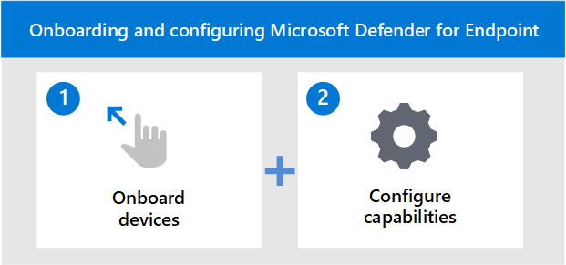

# Onboard devices and configure Microsoft Defender for Endpoint capabilities

[!INCLUDE [Microsoft 365 Defender rebranding](../../includes/microsoft-defender.md)]

**Applies to:**
- [Microsoft Defender for Endpoint](https://go.microsoft.com/fwlink/p/?linkid=2154037)
- [Microsoft 365 Defender](https://go.microsoft.com/fwlink/?linkid=2118804)

[!include[Prerelease information](../../includes/prerelease.md)]

>Want to experience Defender for Endpoint? [Sign up for a free trial.](https://www.microsoft.com/microsoft-365/windows/microsoft-defender-atp?ocid=docs-wdatp-onboardconfigure-abovefoldlink)

Deploying Microsoft Defender for Endpoint is a two-step process.

- Onboard devices to the service
- Configure capabilities of the service

## Onboard devices to the service
You'll need to go the onboarding section of the Defender for Endpoint portal to onboard any of the supported devices. Depending on the device, you'll be guided with appropriate steps and provided management and deployment tool options suitable for the device. 

In general, to onboard devices to the service:

- Verify that the device fulfills the [minimum requirements](minimum-requirements.md)
- Depending on the device, follow the configuration steps provided in the onboarding section of the Defender for Endpoint portal
- Use the appropriate management tool and deployment method for your devices
- Run a detection test to verify that the devices are properly onboarded and reporting to the service

>[!VIDEO https://www.microsoft.com/en-us/videoplayer/embed/RE4bGqr]

## Onboarding tool options
The following table lists the available tools based on the endpoint that you need to onboard.

| Endpoint     | Tool options                       |
|--------------|------------------------------------------|
| **Windows**  |  [Local script (up to 10 devices)](configure-endpoints-script.md)    [Group Policy](configure-endpoints-gp.md)    [Microsoft Endpoint Manager/ Mobile Device Manager](configure-endpoints-mdm.md)     [Microsoft Endpoint Configuration Manager](configure-endpoints-sccm.md)   [VDI scripts](configure-endpoints-vdi.md)   |
| **macOS**    | [Local scripts](mac-install-manually.md)   [Microsoft Endpoint Manager](mac-install-with-intune.md)   [JAMF Pro](mac-install-with-jamf.md)   [Mobile Device Management](mac-install-with-other-mdm.md) |
| **Linux Server** | [Local script](linux-install-manually.md)   [Puppet](linux-install-with-puppet.md)   [Ansible](linux-install-with-ansible.md)|
| **iOS**      | [App-based](ios-install.md)                                |
| **Android**  | [Microsoft Endpoint Manager](android-intune.md)               | 

## Configure capabilities of the service
After onboarding the devices, you'll then need to configure the capabilities of the service. The following table lists the capabilities you can configure to get the best protection for your environment.

| Capability | Description |
|-|-|
| [Endpoint Detection & Response (EDR)](overview-endpoint-detection-response.md) | Defender for Endpoint endpoint detection and response capabilities provide advanced attack detections that are near real-time and actionable. Security analysts can prioritize alerts effectively, gain visibility into the full scope of a breach, and take response actions to remediate threats. |
| [Threat & Vulnerability Management (TVM)](next-gen-threat-and-vuln-mgt.md) | Threat & Vulnerability Management is a component of Microsoft Defender for Endpoint, and provides both security administrators and security operations teams with unique value, including: - Real-time endpoint detection and response (EDR) insights correlated with endpoint vulnerabilities - Invaluable device vulnerability context during incident investigations - Built-in remediation processes through Microsoft Intune and Microsoft System Center Configuration Manager.  |
| [Next-generation protection (NGP)](microsoft-defender-antivirus-in-windows-10.md) | Microsoft Defender Antivirus is a built-in antimalware solution that provides next-generation protection for desktops, portable computers, and servers. Microsoft Defender Antivirus includes:   -Cloud-delivered protection for near-instant detection and blocking of new and emerging threats. Along with machine learning and the Intelligent Security Graph, cloud-delivered protection is part of the next-gen technologies that power Microsoft Defender Antivirus.    - Always-on scanning using advanced file and process behavior monitoring and other heuristics (also known as "real-time protection").   - Dedicated protection updates based on machine-learning, human and automated big-data analysis, and in-depth threat resistance research. |
| [Attack Surface Reduction (ASR)](overview-attack-surface-reduction.md) | Attack surface reduction capabilities in Microsoft Defender for Endpoint help protect the devices and applications in the organization from new and emerging threats. |
| [Auto Investigation & Remediation (AIR)](automated-investigations.md) | Microsoft Defender for Endpoint uses Automated investigations to significantly reduce the volume of alerts that need to be investigated individually. The Automated investigation feature leverages various inspection algorithms, and processes used by analysts (such as playbooks) to examine alerts and take immediate remediation action to resolve breaches. This significantly reduces alert volume, allowing security operations experts to focus on more sophisticated threats and other high value initiatives. |
| [Microsoft Threat Experts (MTE)](microsoft-threat-experts.md) | Microsoft Threat Experts is a managed hunting service that provides Security Operation Centers (SOCs) with expert level monitoring and analysis to help them ensure that critical threats in their unique environments don't get missed.      |

