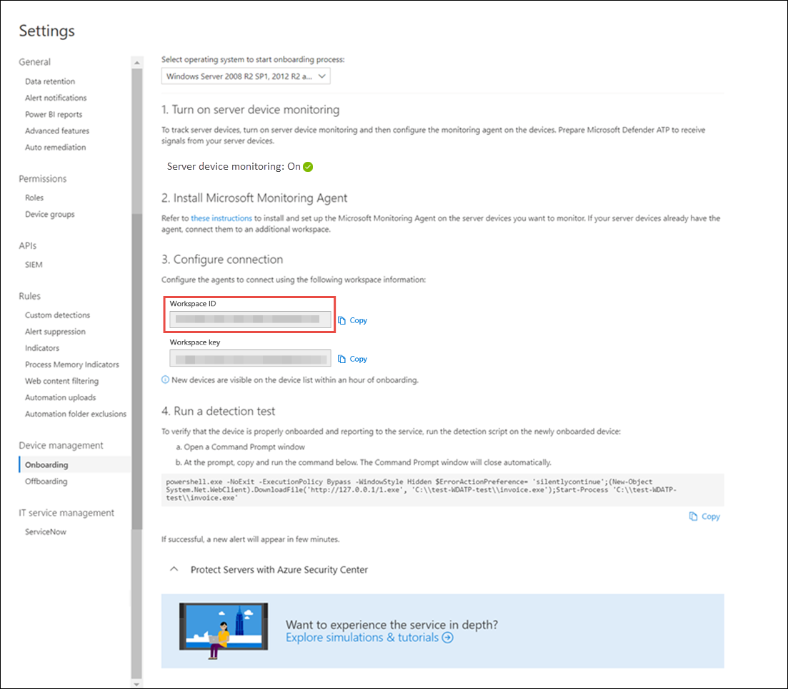

# Onboard Windows Server 2008 R2 SP1 to Microsoft Defender for Endpoint 

[!INCLUDE [Microsoft 365 Defender rebranding](../../includes/microsoft-defender.md)]

**Applies to:**

- Windows Server 2008 R2 SP1

> Want to experience Defender for Endpoint? [Sign up for a free trial.](https://www.microsoft.com/microsoft-365/windows/microsoft-defender-atp?ocid=docs-wdatp-configserver-abovefoldlink)

You can onboard Windows Server 2008 R2 SP1 by using any of the following options:

- **Option 1**: [Onboard by installing and configuring Microsoft Monitoring Agent (MMA)](#option-1-onboard-by-installing-and-configuring-microsoft-monitoring-agent-mma)
- **Option 2**: [Onboard through Azure Security Center](#option-2-onboard-windows-servers-through-azure-security-center)
- **Option 3**: [Onboard through Microsoft Endpoint Manager version 2002 and later](#option-3-onboard-windows-servers-through-microsoft-endpoint-manager-version-2002-and-later)

After completing the onboarding steps using any of the provided options, you'll need to [Configure and update System Center Endpoint Protection clients](#configure-and-update-system-center-endpoint-protection-clients).

> [!NOTE]
> Defender for Endpoint standalone server license is required, per node, in order to onboard a Windows server through Microsoft Monitoring Agent (Option 1), or through Microsoft Endpoint Manager (Option 3). Alternatively, an Azure Defender for Servers license is required, per node, in order to onboard a Windows server through Azure Security Center (Option 2), see [Supported features available in Azure Defender](https://docs.microsoft.com/azure/security-center/security-center-services).

### Option 1: Onboard by installing and configuring Microsoft Monitoring Agent (MMA)

You'll need to install and configure MMA for Windows servers to report sensor data to Defender for Endpoint. For more information, see [Collect log data with Azure Log Analytics agent](https://docs.microsoft.com/azure/azure-monitor/platform/log-analytics-agent).

If you're already using System Center Operations Manager (SCOM) or Azure Monitor (formerly known as Operations Management Suite (OMS)), attach the Microsoft Monitoring Agent (MMA) to report to your Defender for Endpoint workspace through Multihoming support.

In general, you'll need to take the following steps:

1. Fulfill the onboarding requirements outlined in **Before you begin** section.
2. Turn on server monitoring from Microsoft Defender Security center.
3. Install and configure MMA for the server to report sensor data to Defender for Endpoint.
4. Configure and update System Center Endpoint Protection clients.

> [!TIP]
> After onboarding the device, you can choose to run a detection test to verify that it is properly onboarded to the service. For more information, see [Run a detection test on a newly onboarded Defender for Endpoint endpoint](run-detection-test.md).

#### Before you begin

Perform the following steps to fulfill the onboarding requirements:

Ensure that you install the following hotfix:

- [Update for customer experience and diagnostic telemetry](https://support.microsoft.com/help/3080149/update-for-customer-experience-and-diagnostic-telemetry)

Ensure that you fulfill the following requirements:

- Install the [February monthly update rollup](https://support.microsoft.com/help/4074598/windows-7-update-kb4074598)
- Install either [.NET framework 4.5](https://www.microsoft.com/download/details.aspx?id=30653) (or later) or [KB3154518](https://support.microsoft.com/help/3154518/support-for-tls-system-default-versions-included-in-the-net-framework)

    > [!NOTE]
    > If you are managing your Windows Server 2008 R2 SP1 with SCCM, the SCCM client agent installs .Net Framework 4.5.2. So you don't need to install the .NET framework 4.5 (or later).

- [Configure and update System Center Endpoint Protection clients](#configure-and-update-system-center-endpoint-protection-clients).

> [!NOTE]
> This step is required only if your organization uses System Center Endpoint Protection (SCEP) and you're onboarding Windows Server 2008 R2 SP1.

### Install and configure Microsoft Monitoring Agent (MMA) to report sensor data to Microsoft Defender for Endpoint

1. Download the agent setup file: [Windows 64-bit agent](https://go.microsoft.com/fwlink/?LinkId=828603).

2. Using the Workspace ID and Workspace key obtained in the previous procedure, choose any of the following installation methods to install the agent on the Windows server:
    - [Manually install the agent using setup](https://docs.microsoft.com/azure/log-analytics/log-analytics-windows-agents#install-agent-using-setup-wizard). 
    On the **Agent Setup Options** page, choose **Connect the agent to Azure Log Analytics (OMS)**.
    - [Install the agent using the command line](https://docs.microsoft.com/azure/log-analytics/log-analytics-windows-agents#install-agent-using-command-line).
    - [Configure the agent using a script](https://docs.microsoft.com/azure/log-analytics/log-analytics-windows-agents#install-agent-using-dsc-in-azure-automation).

> [!NOTE]
> If you are a [US Government customer](gov.md), under "Azure Cloud" you'll need to choose "Azure US Government" if using the setup wizard, or if using a command line or a script - set the "OPINSIGHTS_WORKSPACE_AZURE_CLOUD_TYPE" parameter to 1.

### Configure Windows server proxy and Internet connectivity settings if needed

If your servers need to use a proxy to communicate with Defender for Endpoint, use one of the following methods to configure the MMA to use the proxy server:

- [Configure the MMA to use a proxy server](https://docs.microsoft.com/azure/azure-monitor/platform/agent-windows#install-agent-using-setup-wizard)

- [Configure Windows to use a proxy server for all connections](configure-proxy-internet.md)

If a proxy or firewall is in use, please ensure that servers can access all of the Microsoft Defender for Endpoint service URLs directly and without SSL interception. For more information, see [enable access to Defender for Endpoint service URLs](configure-proxy-internet.md#enable-access-to-microsoft-defender-for-endpoint-service-urls-in-the-proxy-server). Use of SSL interception will prevent the system from communicating with the Defender for Endpoint service.

Once completed, you should see onboarded Windows servers in the portal within an hour.

### Option 2: Onboard Windows servers through Azure Security Center 

!!! TBD - CHECK WITH ASC TEAM !!!

1. In the Microsoft Defender Security Center navigation pane, select **Settings** > **Device management** > **Onboarding**.

2. Select **Windows Server 2008 R2 SP1, 2012 R2 and 2016** as the operating system.

3. Click **Onboard Servers in Azure Security Center**.

4. Follow the onboarding instructions in [Microsoft Defender for Endpoint with Azure Defender](https://docs.microsoft.com/azure/security-center/security-center-wdatp) and If you are using Azure ARC, Follow the onboarding instructions in [Enabling the Microsoft Defender for Endpoint integration](https://docs.microsoft.com/azure/security-center/security-center-wdatp#enabling-the-microsoft-defender-for-endpoint-integration).

After completing the onboarding steps, you'll need to [Configure and update System Center Endpoint Protection clients](#configure-and-update-system-center-endpoint-protection-clients).

> [!NOTE]
>
> - For onboarding via Azure Defender for Servers to work as expected, the server must have an appropriate workspace and key configured within the Microsoft Monitoring Agent (MMA) settings.
> - Once configured, the appropriate cloud management pack is deployed on the machine and the sensor process (MsSenseS.exe) will be deployed and started.
> - This is also required if the server is configured to use an OMS Gateway server as proxy.

### Option 3: Onboard Windows servers through Microsoft Endpoint Manager version 2002 and later

You can onboard Windows Server 2012 R2 and Windows Server 2016 by using Microsoft Endpoint Manager version 2002 and later. For more information, see [Microsoft Defender for Endpoint in Microsoft Endpoint Manager current branch](https://docs.microsoft.com/mem/configmgr/protect/deploy-use/defender-advanced-threat-protection).

After completing the onboarding steps, you'll need to [Configure and update System Center Endpoint Protection clients](#configure-and-update-system-center-endpoint-protection-clients).

## Offboard Windows servers

You have two options to offboard Windows servers from the service:

- Uninstall the MMA agent
- Remove the Defender for Endpoint workspace configuration

> [!NOTE]
> Offboarding causes the Windows server to stop sending sensor data to the portal but data from the Windows server, including reference to any alerts it has had will be retained for up to 6 months.

### Uninstall Windows servers by uninstalling the MMA agent

To offboard the Windows server, you can uninstall the MMA agent from the Windows server or detach it from reporting to your Defender for Endpoint workspace. After offboarding the agent, the Windows server will no longer send sensor data to Defender for Endpoint.
For more information, see [To disable an agent](https://docs.microsoft.com/azure/log-analytics/log-analytics-windows-agents#to-disable-an-agent).

### Remove the Defender for Endpoint workspace configuration

To offboard the Windows server, you can use either of the following methods:

- Remove the Defender for Endpoint workspace configuration from the MMA agent
- Run a PowerShell command to remove the configuration

#### Remove the Defender for Endpoint workspace configuration from the MMA agent

1. In the **Microsoft Monitoring Agent Properties**, select the **Azure Log Analytics (OMS)** tab.

2. Select the Defender for Endpoint workspace, and click **Remove**.

    

#### Run a PowerShell command to remove the configuration

1. Get your Workspace ID:

   1. In the navigation pane, select **Settings** > **Onboarding**.

   1. Select **Windows Server 2008 R2 SP1, 2012 R2 and 2016** as the operating system and get your Workspace ID:

      

2. Open an elevated PowerShell and run the following command. Use the Workspace ID you obtained and replacing `WorkspaceID`:

    ```powershell
    $ErrorActionPreference = "SilentlyContinue"
    # Load agent scripting object
    $AgentCfg = New-Object -ComObject AgentConfigManager.MgmtSvcCfg
    # Remove OMS Workspace
    $AgentCfg.RemoveCloudWorkspace("WorkspaceID")
    # Reload the configuration and apply changes
    $AgentCfg.ReloadConfiguration()

    ```

## Onboarding Servers with no management solution -- KEEP HERE?

### Using Group Policy

**Step-1: Create the necessary files to copy down to the servers.**

1. Navigate to c:\windows\sysvol\domain\scripts (Change control could be needed on one of the domain controllers.)
1. Create a folder named MMA.
1. Download the following and place in the MMA folder:

    **Update for customer experience and diagnostic telemetry (Windows Server 2008 R2 and Windows Server 2012 R2)**

    [For Windows 2008 R2 x64](https://www.microsoft.com/download/details.aspx?familyid=1bd1d18d-4631-4d8e-a897-327925765f71)

    > [!NOTE]
    > This article assumes you are using x64-based servers
    (MMA Agent .exe x64 [New SHA-2 compliant version](https://go.microsoft.com/fwlink/?LinkId=828603))

**Step-2: Create a file name DeployMMA.cmd (using notepad)**
Add the following lines to the cmd file. Note that you'll need your WORKSPACE ID and KEY.

```dos
@echo off 
cd "C:"
IF EXIST "C:\Program Files\Microsoft Monitoring Agent\Agent\MonitoringHost.exe" ( 
exit
) ELSE (
wusa.exe c:\Windows\MMA\Windows6.1-KB123456-x86.msu /quiet /norestart
wusa.exe c:\Windows\MMA\Windows8.1-KB123456-x86.msu /quiet /norestart
"c:\windows\MMA\MMASetup-AMD64.exe" /C:"setup.exe /qn ADD_OPINSIGHTS_WORKSPACE=1
OPINSIGHTS_WORKSPACE_ID=<your workspace ID>
OPINSIGHTS_WORKSPACE_KEY=<your workspace key>== AcceptEndUserLicenseAgreement=1"
)
```

## Configure and update System Center Endpoint Protection clients 

Defender for Endpoint integrates with System Center Endpoint Protection. The integration provides visibility to malware detections and to stop propagation of an attack in your organization by banning potentially malicious files or suspected malware.

The following steps are required to enable this integration:

- Install the [January 2017 anti-malware platform update for Endpoint Protection clients](https://support.microsoft.com/help/3209361/january-2017-anti-malware-platform-update-for-endpoint-protection-clie).

- [Configure the SCEP client Cloud Protection Service membership](https://docs.microsoft.com/windows/security/threat-protection/microsoft-defender-antivirus/enable-cloud-protection-microsoft-defender-antivirus) to the **Advanced** setting.


## Group Policy Configuration

Create a new group policy specifically for onboarding devices such as "Microsoft Defender for Endpoint Onboarding".

- Create a Group Policy Folder named "c:\windows\MMA"

     :::image type="content" source="images/grppolicyconfig1.png" alt-text="folders":::

    **This will add a new folder on every server that gets the GPO applied, called MMA, and will be stored in c:\windows. This will contain the installation files for the MMA, prerequisites, and install script.**

- Create a Group Policy Files preference for each of the files stored in Net logon.

     :::image type="content" source="images/grppolicyconfig2.png" alt-text="group policy image1":::

It copies the files from DOMAIN\NETLOGON\MMA\filename to
C:\windows\MMA\filename - **so the installation files are local to the server**:

:::image type="content" source="images/deploymma.png" alt-text="deploy mma cmd":::

Repeat the process but create item level targeting on the COMMON tab, so the file only gets copied to the appropriate platform/Operating system version in scope:

:::image type="content" source="images/targeteditor.png" alt-text="target editor":::

- For Windows Server 2008 R2 you need (and it will only copy down) Windows6.1-BJ3080149-x64.msu

Once this is done, you'll need to create a start-up script policy:

:::image type="content" source="images/startupprops.png" alt-text="start up properties":::

The name of the file to run here is c:\windows\MMA\DeployMMA.cmd.
Once the server is restarted as part of the start-up process it will install the Update for customer experience and diagnostic telemetry KB, and then install the MMA Agent, while setting the Workspace ID and Key, and the server will be onboarded.

You could also use an **immediate task** to run the deployMMA.cmd if you don't want to reboot all the servers.

This could be done in two phases. First create **the files and the folder in** GPO - Give the system time to ensure the GPO has been applied, and all the servers have the install files. Then, add the immediate task. This will achieve the same result without requiring a reboot.

As the Script has an exit method and wont re-run if the MMA is installed, you could also use a daily scheduled task to achieve the same result. Similar to a Configuration Manager compliance policy it will check daily to ensure the MMA is present.

:::image type="content" source="images/schtask.png" alt-text="schedule task":::

:::image type="content" source="images/newtaskprops.png" alt-text="new task properties":::

:::image type="content" source="images/deploymmadowmload.png" alt-text="deploy mma download props":::

:::image type="content" source="images/tasksch.png" alt-text="task scheduler":::

As mentioned in the onboarding documentation for Server specifically around Server 2008 R2 please see below:

For Windows Server 2008 R2 PS1, ensure that you fulfill the following requirements:

- Install the [February 2018 monthly update rollup](https://support.microsoft.com/help/4074598/windows-7-update-kb4074598)
  
- Install either [.NET framework 4.5](https://www.microsoft.com/download/details.aspx?id=30653) (or later) or [KB3154518](https://support.microsoft.com/help/3154518/support-for-tls-system-default-versions-included-in-the-net-framework)

Please check the KBs are present before onboarding Windows Server 2008 R2
This process allows you to onboard all the servers if you don't have Configuration Manager managing Servers.

## Related topics
- [Onboard Windows Server 2012 R2, 2016, SAC version 1803, and 2019](configure-server-endpoints.md)
- [Onboard Windows 10 devices](configure-endpoints.md)
- [Onboard non-Windows devices](configure-endpoints-non-windows.md)
- [Configure proxy and Internet connectivity settings](configure-proxy-internet.md)
- [Run a detection test on a newly onboarded Defender for Endpoint device](run-detection-test.md)
- [Troubleshooting Microsoft Defender for Endpoint onboarding issues](troubleshoot-onboarding.md)
