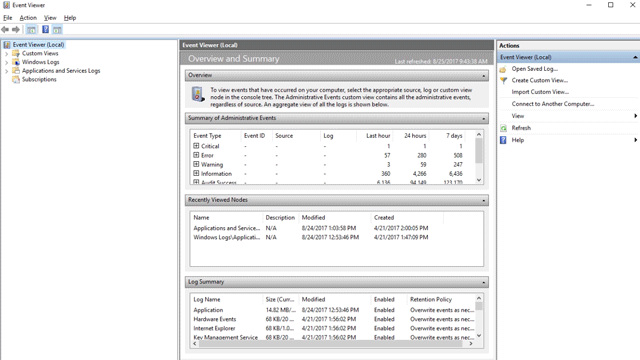

# Understand and use attack surface reduction capabilities

[!INCLUDE [Microsoft 365 Defender rebranding](../../includes/microsoft-defender.md)]

**Applies to:**

- [Microsoft 365 Defender](https://go.microsoft.com/fwlink/?linkid=2118804)
- [Microsoft Defender for Endpoint Plan 1](https://go.microsoft.com/fwlink/p/?linkid=2154037)
- [Microsoft Defender for Endpoint Plan 2](https://go.microsoft.com/fwlink/p/?linkid=2154037)
- Microsoft Defender Antivirus

**Platforms**
- Windows

> [!TIP]
> Want to experience Microsoft Defender for Endpoint? [Sign up for a free trial.](https://signup.microsoft.com/create-account/signup?products=7f379fee-c4f9-4278-b0a1-e4c8c2fcdf7e&ru=https://aka.ms/MDEp2OpenTrial?ocid=docs-wdatp-exposedapis-abovefoldlink)

Attack surfaces are all the places where your organization is vulnerable to cyberthreats and attacks. Defender for Endpoint includes several capabilities to help reduce your attack surfaces. Watch the following video to learn more about attack surface reduction.

> [!VIDEO https://www.microsoft.com/videoplayer/embed/RE4woug]

## Configure attack surface reduction capabilities

To configure attack surface reduction in your environment, follow these steps:

1. [Enable hardware-based isolation for Microsoft Edge](/windows/security/threat-protection/microsoft-defender-application-guard/install-md-app-guard).

2. [Enable attack surface reduction rules](attack-surface-reduction-rules-deployment.md)

3. Enable application control.

   1. Review base policies in Windows. See [Example Base Policies](/windows/security/threat-protection/windows-defender-application-control/example-wdac-base-policies).
   2. See the [Windows Defender Application Control design guide](/windows/security/threat-protection/windows-defender-application-control/windows-defender-application-control-design-guide).
   3. Refer to [Deploying Windows Defender Application Control (WDAC) policies](/windows/security/threat-protection/windows-defender-application-control/windows-defender-application-control-deployment-guide).

4. [Enable controlled folder access](enable-controlled-folders.md).

5. Enable [removable storage protection](device-control-removable-storage-protection.md)

6. [Turn on network protection](enable-network-protection.md).

7. Enable [Web protection](web-protection-overview.md)

8. [Enable exploit protection](enable-exploit-protection.md).

9. Set up your network firewall.

   1. Get an overview of [Windows Defender Firewall with advanced security](/windows/security/threat-protection/windows-firewall/windows-firewall-with-advanced-security).
   2. Use the [Windows Defender Firewall design guide](/windows/security/threat-protection/windows-firewall/windows-firewall-with-advanced-security-design-guide) to decide how you want to design your firewall policies.
   3. Use the [Windows Defender Firewall deployment guide](/windows/security/threat-protection/windows-firewall/windows-firewall-with-advanced-security-deployment-guide) to set up your organization's firewall with advanced security.

> [!TIP]
> In most cases, when you configure attack surface reduction capabilities, you can choose from among several methods:
>
> - Microsoft Intune
> - Microsoft Configuration Manager
> - Group Policy
> - PowerShell cmdlets

## Test attack surface reduction in Microsoft Defender for Endpoint

As part of your organization's security team, you can configure attack surface reduction capabilities to run in audit mode to see how they'll work. You can enable the following ASR security features in audit mode:

- Attack surface reduction rules
- Exploit protection
- Network protection
- Controlled folder access
- Device control

Audit mode lets you see a record of what *would* have happened if you had enabled the feature.

You can enable audit mode when testing how the features will work. Enabling audit mode only for testing helps to prevent audit mode from affecting your line-of-business apps. You can also get an idea of how many suspicious file modification attempts occur over a certain period of time.

The features won't block or prevent apps, scripts, or files from being modified. However, the Windows Event Log will record events as if the features were fully enabled. With audit mode, you can review the event log to see what affect the feature would have had if it was enabled.

To find the audited entries, go to **Applications and Services** \> **Microsoft** \> **Windows** \> **Windows Defender** \> **Operational**.

Use Defender for Endpoint to get greater details for each event. These details are especially helpful for investigating attack surface reduction rules. Using the Defender for Endpoint console lets you [investigate issues as part of the alert timeline and investigation scenarios](investigate-alerts.md).

You can enable audit mode using Group Policy, PowerShell, and configuration service providers (CSPs).

| Audit options | How to enable audit mode | How to view events |
|---|---|---|
| Audit applies to all events | [Enable controlled folder access](enable-controlled-folders.md) | [Controlled folder access events](evaluate-controlled-folder-access.md#review-controlled-folder-access-events-in-windows-event-viewer) |
| Audit applies to individual rules | [Step 1: Test ASR rules using Audit mode](attack-surface-reduction-rules-deployment-test.md#step-1-test-asr-rules-using-audit) | [Step 2: Understand the Attack surface reduction rules reporting page](attack-surface-reduction-rules-deployment-test.md#step-2-understand-the-asr-rules-reporting-page-in-the-microsoft-365-defender-portal) |
| Audit applies to all events | [Enable network protection](enable-network-protection.md) | [Network protection events](evaluate-network-protection.md#review-network-protection-events-in-windows-event-viewer) |
| Audit applies to individual mitigations | [Enable exploit protection](enable-exploit-protection.md) | [Exploit protection events](exploit-protection.md#review-exploit-protection-events-in-windows-event-viewer) |

For example, you can test attack surface reduction rules in audit mode prior to enabling (block mode) them. Attack surface reduction (ASR) rules are pre-defined to harden common, known attack surfaces. There are several methods you can use to implement attack surface reduction rules. The preferred method is documented in the following attack surface reduction (ASR) rules deployment topics:

- [Attack surface reduction (ASR) rules deployment overview](attack-surface-reduction-rules-deployment.md)
- [Plan attack surface reduction (ASR) rules deployment](attack-surface-reduction-rules-deployment-plan.md)
- [Test attack surface reduction (ASR) rules](attack-surface-reduction-rules-deployment-test.md)
- [Enable attack surface reduction (ASR) rules](attack-surface-reduction-rules-deployment-implement.md)
- [Operationalize attack surface reduction (ASR) rules](attack-surface-reduction-rules-deployment-operationalize.md)

## View attack surface reduction events

Review attack surface reduction events in Event Viewer to monitor what rules or settings are working. You can also determine if any settings are too "noisy" or impacting your day to day workflow.

Reviewing events is handy when you're evaluating the features. You can enable audit mode for features or settings, and then review what would have happened if they were fully enabled.

This section lists all the events, their associated feature or setting, and describes how to create custom views to filter to specific events.

Get detailed reporting into events, blocks, and warnings as part of Windows Security if you have an E5 subscription and use [Microsoft Defender for Endpoint](microsoft-defender-endpoint.md).

### Use custom views to review attack surface reduction capabilities

Create custom views in the Windows Event Viewer to only see events for specific capabilities and settings. The easiest way is to import a custom view as an XML file. You can copy the XML directly from this page.

You can also manually navigate to the event area that corresponds to the feature.

#### Import an existing XML custom view

1. Create an empty .txt file and copy the XML for the custom view you want to use into the .txt file. Do this for each of the custom views you want to use. Rename the files as follows (ensure you change the type from .txt to .xml):
    - Controlled folder access events custom view: *cfa-events.xml*
    - Exploit protection events custom view: *ep-events.xml*
    - Attack surface reduction events custom view: *asr-events.xml*
    - Network/ protection events custom view: *np-events.xml*

2. Type **event viewer** in the Start menu and open **Event Viewer**.

3. Select **Action** \> **Import Custom View...**

   > [!div class="mx-imgBorder"]
   > 

4. Navigate to where you extracted the XML file for the custom view you want and select it.

5. Select **Open**.

6. It will create a custom view that filters to only show the events related to that feature.

#### Copy the XML directly

1. Type **event viewer** in the Start menu and open the Windows **Event Viewer**.

2. On the left panel, under **Actions**, select **Create Custom View...**

   > [!div class="mx-imgBorder"]
   > 

3. Go to the XML tab and select **Edit query manually**. You'll see a warning that you can't edit the query using the **Filter** tab if you use the XML option. Select **Yes**.

4. Paste the XML code for the feature you want to filter events from into the XML section.

5. Select **OK**. Specify a name for your filter. This creates a custom view that filters to only show the events related to that feature.

#### XML for attack surface reduction rule events

```xml
<QueryList>
  <Query Id="0" Path="Microsoft-Windows-Windows Defender/Operational">
   <Select Path="Microsoft-Windows-Windows Defender/Operational">*[System[(EventID=1121 or EventID=1122 or EventID=5007)]]</Select>
   <Select Path="Microsoft-Windows-Windows Defender/WHC">*[System[(EventID=1121 or EventID=1122 or EventID=5007)]]</Select>
  </Query>
</QueryList>
```

#### XML for controlled folder access events

```xml
<QueryList>
  <Query Id="0" Path="Microsoft-Windows-Windows Defender/Operational">
   <Select Path="Microsoft-Windows-Windows Defender/Operational">*[System[(EventID=1123 or EventID=1124 or EventID=5007)]]</Select>
   <Select Path="Microsoft-Windows-Windows Defender/WHC">*[System[(EventID=1123 or EventID=1124 or EventID=5007)]]</Select>
  </Query>
</QueryList>
```

#### XML for exploit protection events

```xml
<QueryList>
  <Query Id="0" Path="Microsoft-Windows-Security-Mitigations/KernelMode">
   <Select Path="Microsoft-Windows-Security-Mitigations/KernelMode">*[System[Provider[@Name='Microsoft-Windows-Security-Mitigations' or @Name='Microsoft-Windows-WER-Diag' or @Name='Microsoft-Windows-Win32k' or @Name='Win32k'] and ( (EventID &gt;= 1 and EventID &lt;= 24)  or EventID=5 or EventID=260)]]</Select>
   <Select Path="Microsoft-Windows-Win32k/Concurrency">*[System[Provider[@Name='Microsoft-Windows-Security-Mitigations' or @Name='Microsoft-Windows-WER-Diag' or @Name='Microsoft-Windows-Win32k' or @Name='Win32k'] and ( (EventID &gt;= 1 and EventID &lt;= 24)  or EventID=5 or EventID=260)]]</Select>
   <Select Path="Microsoft-Windows-Win32k/Contention">*[System[Provider[@Name='Microsoft-Windows-Security-Mitigations' or @Name='Microsoft-Windows-WER-Diag' or @Name='Microsoft-Windows-Win32k' or @Name='Win32k'] and ( (EventID &gt;= 1 and EventID &lt;= 24)  or EventID=5 or EventID=260)]]</Select>
   <Select Path="Microsoft-Windows-Win32k/Messages">*[System[Provider[@Name='Microsoft-Windows-Security-Mitigations' or @Name='Microsoft-Windows-WER-Diag' or @Name='Microsoft-Windows-Win32k' or @Name='Win32k'] and ( (EventID &gt;= 1 and EventID &lt;= 24)  or EventID=5 or EventID=260)]]</Select>
   <Select Path="Microsoft-Windows-Win32k/Operational">*[System[Provider[@Name='Microsoft-Windows-Security-Mitigations' or @Name='Microsoft-Windows-WER-Diag' or @Name='Microsoft-Windows-Win32k' or @Name='Win32k'] and ( (EventID &gt;= 1 and EventID &lt;= 24)  or EventID=5 or EventID=260)]]</Select>
   <Select Path="Microsoft-Windows-Win32k/Power">*[System[Provider[@Name='Microsoft-Windows-Security-Mitigations' or @Name='Microsoft-Windows-WER-Diag' or @Name='Microsoft-Windows-Win32k' or @Name='Win32k'] and ( (EventID &gt;= 1 and EventID &lt;= 24)  or EventID=5 or EventID=260)]]</Select>
   <Select Path="Microsoft-Windows-Win32k/Render">*[System[Provider[@Name='Microsoft-Windows-Security-Mitigations' or @Name='Microsoft-Windows-WER-Diag' or @Name='Microsoft-Windows-Win32k' or @Name='Win32k'] and ( (EventID &gt;= 1 and EventID &lt;= 24)  or EventID=5 or EventID=260)]]</Select>
   <Select Path="Microsoft-Windows-Win32k/Tracing">*[System[Provider[@Name='Microsoft-Windows-Security-Mitigations' or @Name='Microsoft-Windows-WER-Diag' or @Name='Microsoft-Windows-Win32k' or @Name='Win32k'] and ( (EventID &gt;= 1 and EventID &lt;= 24)  or EventID=5 or EventID=260)]]</Select>
   <Select Path="Microsoft-Windows-Win32k/UIPI">*[System[Provider[@Name='Microsoft-Windows-Security-Mitigations' or @Name='Microsoft-Windows-WER-Diag' or @Name='Microsoft-Windows-Win32k' or @Name='Win32k'] and ( (EventID &gt;= 1 and EventID &lt;= 24)  or EventID=5 or EventID=260)]]</Select>
   <Select Path="System">*[System[Provider[@Name='Microsoft-Windows-Security-Mitigations' or @Name='Microsoft-Windows-WER-Diag' or @Name='Microsoft-Windows-Win32k' or @Name='Win32k'] and ( (EventID &gt;= 1 and EventID &lt;= 24)  or EventID=5 or EventID=260)]]</Select>
   <Select Path="Microsoft-Windows-Security-Mitigations/UserMode">*[System[Provider[@Name='Microsoft-Windows-Security-Mitigations' or @Name='Microsoft-Windows-WER-Diag' or @Name='Microsoft-Windows-Win32k' or @Name='Win32k'] and ( (EventID &gt;= 1 and EventID &lt;= 24)  or EventID=5 or EventID=260)]]</Select>
  </Query>
</QueryList>
```

#### XML for network protection events

```xml
<QueryList>
 <Query Id="0" Path="Microsoft-Windows-Windows Defender/Operational">
  <Select Path="Microsoft-Windows-Windows Defender/Operational">*[System[(EventID=1125 or EventID=1126 or EventID=5007)]]</Select>
  <Select Path="Microsoft-Windows-Windows Defender/WHC">*[System[(EventID=1125 or EventID=1126 or EventID=5007)]]</Select>
 </Query>
</QueryList>
```

### List of attack surface reduction events

All attack surface reduction events are located under **Applications and Services Logs > Microsoft > Windows** and then the folder or provider as listed in the following table.

You can access these events in Windows Event viewer:

1. Open the **Start** menu and type **event viewer**, and then select the **Event Viewer** result.
2. Expand **Applications and Services Logs > Microsoft > Windows** and then go to the folder listed under **Provider/source** in the table below.
3. Double-click on the sub item to see events. Scroll through the events to find the one you're looking.

   

<br>

****

|Feature|Provider/source|Event ID|Description|
|---|---|:---:|---|
|Exploit protection|Security-Mitigations (Kernel Mode/User Mode)|1|ACG audit|
|Exploit protection|Security-Mitigations (Kernel Mode/User Mode)|2|ACG enforce|
|Exploit protection|Security-Mitigations (Kernel Mode/User Mode)|3|Do not allow child processes audit|
|Exploit protection|Security-Mitigations (Kernel Mode/User Mode)|4|Do not allow child processes block|
|Exploit protection|Security-Mitigations (Kernel Mode/User Mode)|5|Block low integrity images audit|
|Exploit protection|Security-Mitigations (Kernel Mode/User Mode)|6|Block low integrity images block|
|Exploit protection|Security-Mitigations (Kernel Mode/User Mode)|7|Block remote images audit|
|Exploit protection|Security-Mitigations (Kernel Mode/User Mode)|8|Block remote images block|
|Exploit protection|Security-Mitigations (Kernel Mode/User Mode)|9|Disable win32k system calls audit|
|Exploit protection|Security-Mitigations (Kernel Mode/User Mode)|10|Disable win32k system calls block|
|Exploit protection|Security-Mitigations (Kernel Mode/User Mode)|11|Code integrity guard audit|
|Exploit protection|Security-Mitigations (Kernel Mode/User Mode)|12|Code integrity guard block|
|Exploit protection|Security-Mitigations (Kernel Mode/User Mode)|13|EAF audit|
|Exploit protection|Security-Mitigations (Kernel Mode/User Mode)|14|EAF enforce|
|Exploit protection|Security-Mitigations (Kernel Mode/User Mode)|15|EAF+ audit|
|Exploit protection|Security-Mitigations (Kernel Mode/User Mode)|16|EAF+ enforce|
|Exploit protection|Security-Mitigations (Kernel Mode/User Mode)|17|IAF audit|
|Exploit protection|Security-Mitigations (Kernel Mode/User Mode)|18|IAF enforce|
|Exploit protection|Security-Mitigations (Kernel Mode/User Mode)|19|ROP StackPivot audit|
|Exploit protection|Security-Mitigations (Kernel Mode/User Mode)|20|ROP StackPivot enforce|
|Exploit protection|Security-Mitigations (Kernel Mode/User Mode)|21|ROP CallerCheck audit|
|Exploit protection|Security-Mitigations (Kernel Mode/User Mode)|22|ROP CallerCheck enforce|
|Exploit protection|Security-Mitigations (Kernel Mode/User Mode)|23|ROP SimExec audit|
|Exploit protection|Security-Mitigations (Kernel Mode/User Mode)|24|ROP SimExec enforce|
|Exploit protection|WER-Diagnostics|5|CFG Block|
|Exploit protection|Win32K (Operational)|260|Untrusted Font|
|Network protection|Windows Defender (Operational)|5007|Event when settings are changed|
|Network protection|Windows Defender (Operational)|1125|Event when Network protection fires in Audit-mode|
|Network protection|Windows Defender (Operational)|1126|Event when Network protection fires in Block-mode|
|Controlled folder access|Windows Defender (Operational)|5007|Event when settings are changed|
|Controlled folder access|Windows Defender (Operational)|1124|Audited Controlled folder access event|
|Controlled folder access|Windows Defender (Operational)|1123|Blocked Controlled folder access event|
|Controlled folder access|Windows Defender (Operational)|1127|Blocked Controlled folder access sector write block event|
|Controlled folder access|Windows Defender (Operational)|1128|Audited Controlled folder access sector write block event|
|Attack surface reduction|Windows Defender (Operational)|5007|Event when settings are changed|
|Attack surface reduction|Windows Defender (Operational)|1122|Event when rule fires in Audit-mode|
|Attack surface reduction|Windows Defender (Operational)|1121|Event when rule fires in Block-mode|

> [!NOTE]
> From the user's perspective, ASR Warn mode notifications are made as a Windows Toast Notification for attack surface reduction rules.
>
> In ASR, Network Protection provides only Audit and Block modes.

## Resources to learn more about attack surface reduction

As mentioned in the video, Defender for Endpoint includes several attack surface reduction capabilities. Use the following resources to learn more:

| Article | Description |
|:---|:---|
| [Application control](/windows/security/threat-protection/windows-defender-application-control/windows-defender-application-control) | Use application control so that your applications must earn trust in order to run. |
| [Attack surface reduction (ASR) rules reference](attack-surface-reduction-rules-reference.md) | Provides details about each attack surface reduction rule. |
| [Attack surface reduction (ASR) rules deployment guide](attack-surface-reduction-rules-deployment.md) | Presents overview information and prerequisites for deploying attack surface reduction rules, followed by step-by-step guidance for testing (audit mode), enabling (block mode) and monitoring. |
| [Controlled folder access](controlled-folders.md) | Help prevent malicious or suspicious apps (including file-encrypting ransomware malware) from making changes to files in your key system folders (Requires Microsoft Defender Antivirus). |
| [Device control](device-control-report.md) | Protects against data loss by monitoring and controlling media used on devices, such as removable storage and USB drives, in your organization. |
| [Exploit protection](exploit-protection.md) | Help protect the operating systems and apps your organization uses from being exploited. Exploit protection also works with third-party antivirus solutions. |
| [Hardware-based isolation](/windows/security/threat-protection/microsoft-defender-application-guard/md-app-guard-overview) | Protect and maintain the integrity of a system as it starts and while it's running. Validate system integrity through local and remote attestation. Use container isolation for Microsoft Edge to help guard against malicious websites. |
| [Network protection](network-protection.md) | Extend protection to your network traffic and connectivity on your organization's devices. (Requires Microsoft Defender Antivirus). |
| [Test attack surface reduction (ASR) rules](attack-surface-reduction-rules-deployment-test.md) | Provides steps to use audit mode to test attack surface reduction rules. |
| [Web protection](web-protection-overview.md) | Web protection lets you secure your devices against web threats and helps you regulate unwanted content. |
[!INCLUDE [Microsoft Defender for Endpoint Tech Community](../../includes/defender-mde-techcommunity.md)]
