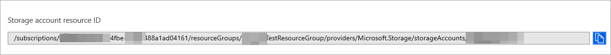

# Configure  Microsoft 365 Defender to stream Advanced Hunting events to your Storage account

[!INCLUDE [Microsoft 365 Defender rebranding](../../includes/microsoft-defender.md)]


**Applies to:**
- [Microsoft 365 Defender](https://go.microsoft.com/fwlink/?linkid=2118804)


## Before you begin:

1. Create a [Storage account](/azure/storage/common/storage-account-overview) in your tenant.

2. Log in to your [Azure tenant](https://ms.portal.azure.com/), go to **Subscriptions > Your subscription > Resource Providers > Register to Microsoft.Insights**.

## Enable raw data streaming:

1. Log in to [Microsoft 365 Defender security center](https://security.microsoft.com) as a ***Global Administrator*** or ***Security Administrator***.

2. Go to [Data export settings page](https://security.microsoft.com/settings/mtp_settings/raw_data_export) in Microsoft Defender Security Center.

3. Click on **Add data export settings**.

4. Choose a name for your new settings.

5. Choose **Forward events to Azure Storage**.

6. Type your **Storage Account Resource ID**. In order to get your **Storage Account Resource ID**, go to your Storage account page on [Azure portal](https://ms.portal.azure.com/) > properties tab > copy the text under **Storage Account Resource ID**:

   

7. Choose the events you want to stream and click **Save**.

## The schema of the events in the Storage account:

- A blob container will be created for each event type: 

  

- The schema of each row in a blob is the following JSON: 

  ```
  {
          "time": "<The time Microsoft 365 Defender received the event>"
          "tenantId": "<Your tenant ID>"
          "category": "<The Advanced Hunting table name with 'AdvancedHunting-' prefix>"
          "properties": { <Microsoft 365 Defender Advanced Hunting event as Json> }
  }               
  ```

- Each blob contains multiple rows.

- Each row contains the event name, the time Defender for Endpoint received the event, the tenant it belongs (you will only get events from your tenant), and the event in JSON format in a property called "properties".

- For more information about the schema of Microsoft 365 Defender events, see [Advanced Hunting overview](../defender/advanced-hunting-overview.md).


## Data types mapping:

In order to get the data types for our events properties do the following:

1. Log in to [Microsoft 365 security center](https://security.microsoft.com) and go to [Advanced Hunting page](https://security.microsoft.com/hunting-package).

2. Run the following query to get the data types mapping for each event: 

   ```
   {EventType}
   | getschema
   | project ColumnName, ColumnType 
   ```

- Here is an example for Device Info event: 

  

## Related topics
- [Overview of Advanced Hunting](../defender/advanced-hunting-overview.md)
- [Microsoft 365 Defender Streaming API](raw-data-export.md)
- [Stream Microsoft 365 Defender events to your Azure storage account](raw-data-export-storage.md)
- [Azure Storage Account documentation](/azure/storage/common/storage-account-overview)
