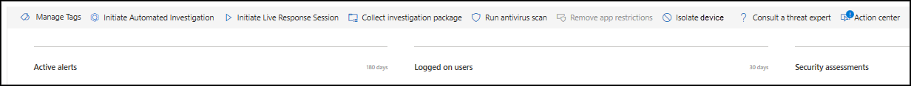
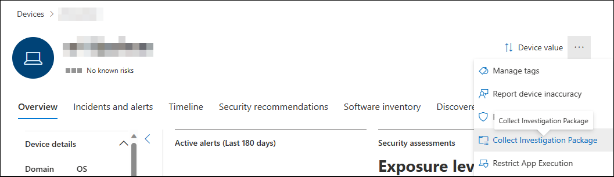
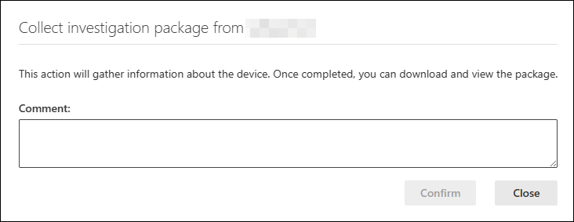
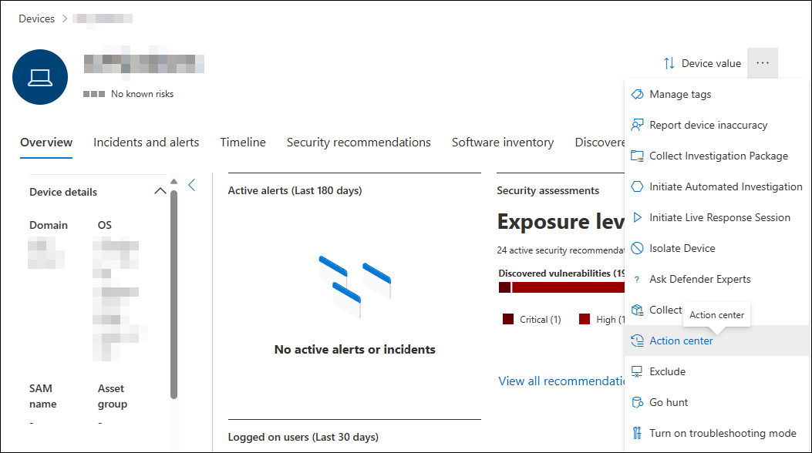
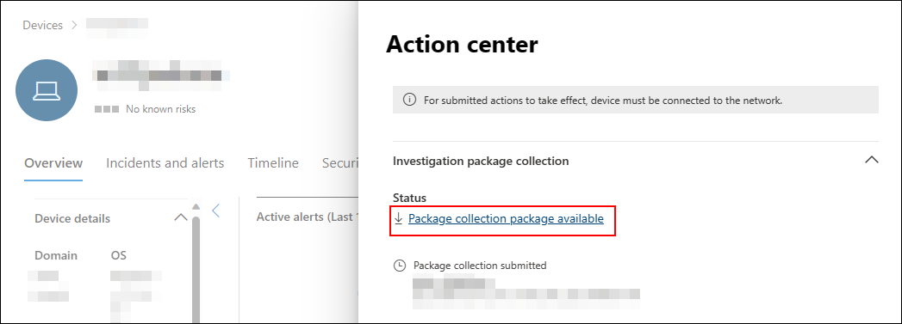

# Take response actions on a device

[!INCLUDE [Microsoft 365 Defender rebranding](../../includes/microsoft-defender.md)]

**Applies to:**

- [Microsoft Defender for Endpoint Plans 1 and 2](defender-endpoint-plan-1-2.md)
- [Microsoft Defender for Business](/microsoft-365/security/defender-business/mdb-overview)

[!INCLUDE [Prerelease information](../../includes/prerelease.md)]

Quickly respond to detected attacks by isolating devices or collecting an investigation package. After taking action on devices, you can check activity details on the Action center.

Response actions run along the top of a specific device page and include:

- Manage tags
- Initiate Automated Investigation
- Initiate Live Response Session
- Collect investigation package
- Run antivirus scan
- Restrict app execution
- Isolate device
- Contain device
- Consult a threat expert
- Action center

> [!IMPORTANT]
> [Defender for Endpoint Plan 1](defender-endpoint-plan-1.md) includes only the following manual response actions:
>
> - Run antivirus scan
> - Isolate device
> - Stop and quarantine a file
> - Add an indicator to block or allow a file.
>
> [Microsoft Defender for Business](../defender-business/mdb-overview.md) does not include the "Stop and quarantine a file" action at this time.
>
> Your subscription must include Defender for Endpoint Plan 2 to have all of the response actions described in this article.

 You can find device pages from any of the following views:

- **Alerts queue** - Select the device name beside the device icon from the alerts queue.
- **Devices list** - Select the heading of the device name from the devices list.
- **Search box** - Select Device from the drop-down menu and enter the device name.

> [!IMPORTANT]
>
> - These response actions are only available for devices on Windows 10, version  1703 or later, Windows 11, Windows Server 2012 R2, Windows Server 2016, Windows Server 2019, and Windows Server 2022.
> - For non-Windows platforms, response capabilities (such as isolate device) are dependent on the third-party capabilities.
> - For Microsoft first party agents, please refer to the "more information" link under each feature for minimum OS requirements.

## Manage tags

Add or manage tags to create a logical group affiliation. Device tags support proper mapping of the network, enabling you to attach different tags to capture context and to enable dynamic list creation as part of an incident.

For more information on device tagging, see [Create and manage device tags](machine-tags.md).

## Initiate Automated Investigation

You can start a new general purpose automated investigation on the device if needed. While an investigation is running, any other alert generated from the device will be added to an ongoing Automated investigation until that investigation is completed. In addition, if the same threat is seen on other devices, those devices are added to the investigation.

For more information on automated investigations, see [Overview of Automated investigations](automated-investigations.md).

## Initiate live response session

Live response is a capability that gives you instantaneous access to a device by using a remote shell connection. This gives you the power to do in-depth investigative work and take immediate response actions to promptly contain identified threats in real time.

Live response is designed to enhance investigations by enabling you to collect forensic data, run scripts, send suspicious entities for analysis, remediate threats, and proactively hunt for emerging threats.

For more information on live response, see [Investigate entities on devices using live response](live-response.md).

## Collect investigation package from devices

As part of the investigation or response process, you can collect an investigation package from a device. By collecting the investigation package, you can identify the current state of the device and further understand the tools and techniques used by the attacker.

> [!IMPORTANT]
> These actions are not currently supported for devices running macOS or Linux. Use live response to run the action. For more information on live response, see [Investigate entities on devices using live response](live-response.md)

To download the package (Zip file) and investigate the events that occurred on a device:

1. Select **Collect investigation package** from the row of response actions at the top of the device page.

2. Specify in the text box why you want to perform this action. Select **Confirm**.

3. The zip file downloads.

Alternate steps:

1. Select **Collect Investigation Package** from the response actions section of the device page.

    
   
2. Add comments and select **Confirm**.

    

3. Select **Action center** from the response actions section of the device page.

    

4. Click the **Package collection package available** to download the collection package.

    

For Windows devices, the package contains the following folders:

|Folder|Description|
|---|---|
|Autoruns|Contains a set of files that each represent the content of the registry of a known auto start entry point (ASEP) to help identify attacker's persistency on the device. 
 
<b>NOTE:</b> If the registry key is not found, the file will contain the following message: "ERROR: The system was unable to find the specified registry key or value."
|
|Installed programs|This .CSV file contains the list of installed programs that can help identify what is currently installed on the device. For more information, see [Win32_Product class](https://go.microsoft.com/fwlink/?linkid=841509).|
|Network connections|This folder contains a set of data points related to the connectivity information that can help in identifying connectivity to suspicious URLs, attacker's command and control (C&C) infrastructure, any lateral movement, or remote connections. <ul><li>ActiveNetConnections.txt: Displays protocol statistics and current TCP/IP network connections. Provides the ability to look for suspicious connectivity made by a process.</li><li>Arp.txt: Displays the current address resolution protocol (ARP) cache tables for all interfaces. ARP cache can reveal other hosts on a network that have been compromised or suspicious systems on the network that might have been used to run an internal attack.</il><li>DnsCache.txt: Displays the contents of the DNS client resolver cache, which includes both entries preloaded from the local Hosts file and any recently obtained resource records for name queries resolved by the computer. This can help in identifying suspicious connections.</li><li>IpConfig.txt: Displays the full TCP/IP configuration for all adapters. Adapters can represent physical interfaces, such as installed network adapters, or logical interfaces, such as dial-up connections.</li><li>FirewallExecutionLog.txt and pfirewall.log</li></ul>

<b>NOTE:</b> The pfirewall.log file must exist in %windir%\system32\logfiles\firewall\pfirewall.log, so it will be included in the investigation package. For more information on creating the firewall log file, see [Configure the Windows Defender Firewall with Advanced Security Log](/windows/security/threat-protection/windows-firewall/configure-the-windows-firewall-log)
|
|Prefetch files|Windows Prefetch files are designed to speed up the application startup process. It can be used to track all the files recently used in the system and find traces for applications that might have been deleted but can still be found in the prefetch file list. <ul><li>Prefetch folder: Contains a copy of the prefetch files from `%SystemRoot%\Prefetch`. NOTE: It is suggested to download a prefetch file viewer to view the prefetch files.</li><li>PrefetchFilesList.txt: Contains the list of all the copied files that can be used to track if there were any copy failures to the prefetch folder.</li></ul>|
|Processes|Contains a .CSV file listing the running processes and provides the ability to identify current processes running on the device. This can be useful when identifying a suspicious process and its state.|
|Scheduled tasks|Contains a .CSV file listing the scheduled tasks, which can be used to identify routines performed automatically on a chosen device to look for suspicious code that was set to run automatically.|
|Security event log|Contains the security event log, which contains records of login or logout activity, or other security-related events specified by the system's audit policy. 

<b>NOTE:</b> Open the event log file using Event viewer.
|
|Services|Contains a .CSV file that lists services and their states.|
|Windows Server Message Block (SMB) sessions|Lists shared access to files, printers, and serial ports and miscellaneous communications between nodes on a network. This can help identify data exfiltration or lateral movement. 
 Contains files for SMBInboundSessions and SMBOutboundSession. 
 
<b>NOTE:</b> If there are no sessions (inbound or outbound), you'll get a text file that tells you that there are no SMB sessions found.
|
|System Information|Contains a SystemInformation.txt file that lists system information such as OS version and network cards.|
|Temp Directories|Contains a set of text files that lists the files located in %Temp% for every user in the system. 
 This can help to track suspicious files that an attacker may have dropped on the system. 
 
<b>NOTE:</b> If the file contains the following message: "The system cannot find the path specified", it means that there is no temp directory for this user, and might be because the user didn't log in to the system.
|
|Users and Groups|Provides a list of files that each represent a group and its members.|
|WdSupportLogs|Provides the MpCmdRunLog.txt and MPSupportFiles.cab  
 
<b>NOTE:</b> This folder will only be created on Windows 10, version 1709 or later with February 2020 update rollup or more recent installed: <ul><li>Win10 1709 (RS3) Build 16299.1717: [KB4537816](https://support.microsoft.com/help/4537816/windows-10-update-kb4537816)</li><li>Win10 1803 (RS4) Build 17134.1345: [KB4537795](https://support.microsoft.com/help/4537795/windows-10-update-kb4537795)</li><li>Win10 1809 (RS5) Build 17763.1075: [KB4537818](https://support.microsoft.com/help/4537818/windows-10-update-kb4537818)</li><li>Win10 1903/1909 (19h1/19h2) Builds 18362.693 and 18363.693: [KB4535996](https://support.microsoft.com/help/4535996/windows-10-update-kb4535996)</li></ul> 
|
|CollectionSummaryReport.xls|This file is a summary of the investigation package collection, it contains the list of data points, the command used to extract the data, the execution status, and the error code if there is failure. You can use this report to track if the package includes all the expected data and identify if there were any errors.|

The collection packages for macOS and Linux devices contain the following:

|Object|macOS|Linux|
|---|---|---|
|Applications|A list of all installed applications|Not applicable|
|Disk volume|<ul><li>Amount of free space</li><li>List of all mounted disk volumes</li><li>List of all partitions</li>|<ul><li>Amount of free space</li><li>List of all mounted disk volumes</li><li>List of all partitions</li>|
|File|A list of all open files with the corresponding processes using these files|A list of all open files with the corresponding processes using these files|
|History|Shell history|Not applicable|
|Kernel modules|All loaded modules|Not applicable|
|Network connections|<ul><li>Active connections</li><li>Active listening connections</li><li>ARP table</li><li>Firewall rules</li><li>Interface configuration</li><li>Proxy settings</li><li>VPN settings</li></ul>|<ul><li>Active connections</li><li>Active listening connections</li><li>ARP table</li><li>Firewall rules</li><li>IP list</li><li>Proxy settings</li></ul>|
|Processes|A list of all running processes|A list of all running processes|
|Services and scheduled tasks|<ul><li>Certificates</li><li>Configuration profiles</li><li>Hardware information|<ul><li>CPU details</li><li>Hardware information</li><li>Operating system information</li>|
|System security information|<ul><li>Extensible Firmware Interface (EFI) integrity information</li><li>Firewall status</li><li>Malware Removal Tool (MRT) information</li><li>System Integrity Protection (SIP) status</li>|Not applicable|
|Users and groups|<ul><li>Login history</li><li>Sudoers</li></ul>|<ul><li>Login history</li><li>Sudoers</li></ul>|

## Run Microsoft Defender Antivirus scan on devices

As part of the investigation or response process, you can remotely initiate an antivirus scan to help identify and remediate malware that might be present on a compromised device.

> [!IMPORTANT]
>
> - This action is supported for macOS and Linux for client version 101.98.84 and above. It is in preview. You can also use live response to run the action. For more information on live response, see [Investigate entities on devices using live response](live-response.md)
> - A Microsoft Defender Antivirus scan can run alongside other antivirus solutions, whether Microsoft Defender Antivirus is the active antivirus solution or not. Microsoft Defender Antivirus can be in Passive mode. For more information, see [Microsoft Defender Antivirus compatibility](/microsoft-365/security/defender-endpoint/microsoft-defender-antivirus-compatibility).

One you have selected **Run antivirus scan**, select the scan type that you'd like to run (quick or full) and add a comment before confirming the scan.

:::image type="content" source="images/run-antivirus.png" alt-text="The notification to select quick scan or full scan and add comment" lightbox="images/run-antivirus.png":::

The Action center will show the scan information and the device timeline will include a new event, reflecting that a scan action was submitted on the device. Microsoft Defender Antivirus alerts will reflect any detections that surfaced during the scan.

> [!NOTE]
> When triggering a scan using Defender for Endpoint response action, Microsoft Defender antivirus 'ScanAvgCPULoadFactor' value still applies and limits the CPU impact of the scan.
> If ScanAvgCPULoadFactor is not configured, the default value is a limit of 50% maximum CPU load during a scan.
> For more information, see [configure-advanced-scan-types-microsoft-defender-antivirus](/windows/security/threat-protection/microsoft-defender-antivirus/configure-advanced-scan-types-microsoft-defender-antivirus).

## Restrict app execution

In addition to containing an attack by stopping malicious processes, you can also lock down a device and prevent subsequent attempts of potentially malicious programs from running.

> [!IMPORTANT]
>
> - This action is available for devices on Windows 10, version 1709 or later, Windows 11, and Windows Server 2019 or later.
> - This feature is available if your organization uses Microsoft Defender Antivirus.
> - This action needs to meet the Windows Defender Application Control code integrity policy formats and signing requirements. For more information, see [Code integrity policy formats and signing](/windows/security/threat-protection/windows-defender-application-control/use-code-signing-to-simplify-application-control-for-classic-windows-applications)).

To restrict an application from running, a code integrity policy is applied that only allows files to run if they are signed by a Microsoft issued certificate. This method of restriction can help prevent an attacker from controlling compromised devices and performing further malicious activities.

> [!NOTE]
> You'll be able to reverse the restriction of applications from running at any time. The button on the device page will change to say **Remove app restrictions**, and then you take the same steps as restricting app execution.

Once you have selected **Restrict app execution** on the device page, type a comment and select **Confirm**. The Action center will show the scan information and the device timeline will include a new event.

:::image type="content" source="images/restrict-app-execution.png" alt-text="The application restriction notification" lightbox="images/restrict-app-execution.png":::

### Notification on device user

When an app is restricted, the following notification is displayed to inform the user that an app is being restricted from running:

:::image type="content" source="images/atp-app-restriction.png" alt-text="The application restriction message" lightbox="images/atp-app-restriction.png":::

> [!NOTE]
> The notification is not available on Windows Server 2016 and Windows Server 2012 R2.

## Isolate devices from the network

Depending on the severity of the attack and the sensitivity of the device, you might want to isolate the device from the network. This action can help prevent the attacker from controlling the compromised device and performing further activities such as data exfiltration and lateral movement.

> [!IMPORTANT]
>
> - Isolating devices from the network is supported for macOS for client version 101.98.84 and above. It is in preview. You can also use live response to run the action. For more information on live response, see [Investigate entities on devices using live response](live-response.md) 
> - Full isolation is available for devices running Windows 11, Windows 10, version 1703 or later, Windows Server 2022, Windows Server 2019, Windows Server 2016 and Windows Server 2012 R2.
> - You can use the device isolation capability **in public preview** on all supported Microsoft Defender for Endpoint on Linux listed in [System requirements](microsoft-defender-endpoint-linux.md#system-requirements).
> - Selective isolation is available for devices running Windows 10, version 1709 or later, and Windows 11.
> - When isolating a device, only certain processes and destinations are allowed. Therefore, devices that are behind a full VPN tunnel won't be able to reach the Microsoft Defender for Endpoint cloud service after the device is isolated. We recommend using a split-tunneling VPN for Microsoft Defender for Endpoint and Microsoft Defender Antivirus cloud-based protection-related traffic.
> - The feature supports VPN connection.
> - You must have at least one the following role permissions: 'Active remediation actions'. For more information, see [Create and manage roles](user-roles.md).
> - You must have access to the device based on the device group settings. For more information, see [Create and manage device groups](machine-groups.md).
> - Exclusion for both macOS and Linux isolation is not supported.
> - An isolated device is removed from isolation when an administrator modifies or adds a new iptable rule to the isolated device.
> - Isolating a server running on Microsoft Hyper-V blocks network traffic to all child virtual machines of the server.

This device isolation feature disconnects the compromised device from the network while retaining connectivity to the Defender for Endpoint service, which continues to monitor the device.

On Windows 10, version 1709 or later, you'll have more control over the network isolation level. You can also choose to enable Outlook, Microsoft Teams, and Skype for Business connectivity (a.k.a 'Selective Isolation').

> [!NOTE]
> You'll be able to reconnect the device back to the network at any time. The button on the device page will change to say **Release from isolation**, and then you take the same steps as isolating the device.

Once you have selected **Isolate device** on the device page, type a comment and select **Confirm**. The Action center will show the scan information and the device timeline will include a new event.

:::image type="content" source="images/isolate-device.png" alt-text="An isolated device details page" lightbox="images/isolate-device.png":::

> [!NOTE]
> The device will remain connected to the Defender for Endpoint service even if it is isolated from the network. If you've chosen to enable Outlook and Skype for Business communication, then you'll be able to communicate to the user while the device is isolated.

### Forcibly release device from isolation

The device isolation feature is an invaluable tool for safeguarding devices against external threats. However, there are instances when isolated devices become unresponsive.  
There's a downloadable script for these instances that you can run to forcibly release devices from isolation. The script is available through a link in the UI.

> [!NOTE]
> - Admins and manage security settings in Security Center permissions can forcibly release devices from isolation. 
> - The script is valid for the specific device only.
> - The script will expire in three days.

To forcibly release device from isolation:

1. On the device page, select **Download script to force-release a device from isolation** from the action menu.
1. On the right-hand side wizard, select **Download script**.

#### Minimum requirements
The minimum requirements for 'forcibly release device from isolation' feature are:

- Supports only Windows
- The following Windows versions are supported:
    - Windows 10 21H2 and 22H2 with KB KB5023773
    - Windows 11 version 21H2, all editions with KB5023774 
    - Windows 11 version 22H2, all editions with KB5023778 
    

### Notification on device user

When a device is being isolated, the following notification is displayed to inform the user that the device is being isolated from the network:

:::image type="content" source="images/atp-notification-isolate.png" alt-text="A no network connection message" lightbox="images/atp-notification-isolate.png":::

> [!NOTE]
> The notification is not available on non-Windows platforms.

## Contain devices from the network

> [!NOTE]
> Contain capabilities are currently in public preview. To learn about new features in the Microsoft 365 Defender preview release and be among the first to try upcoming features by turning on the preview experience, see [Preview features in Micrsoft 365 Defender](../defender/preview.md).

When you have identified an unmanaged device that is compromised or potentially compromised, you might want to contain that device from the network. When you contain a device any Microsoft Defender for Endpoint onboarded device will block incoming and outgoing communication with that device. This action can help prevent neighboring devices from becoming compromised while the security operations analyst locates, identifies, and remediates the threat on the compromised device.

> [!NOTE]
> Blocking incoming and outgoing communication with a 'contained' device is supported on onboarded Microsoft Defender for Endpoint Windows 10 and Windows Server 2019+ devices.

### How to contain a device

1. Go to the **Device inventory** page and select the device to contain.

2. Select **Contain device** from the actions menu in the device flyout.

   :::image type="content" alt-text="Screenshot of the contain device popup message." source="../../media/defender-endpoint/contain_device.png" lightbox="../../media/defender-endpoint/contain_device.png":::

3. On the contain device popup, type a comment, and select **Confirm**.

:::image type="content" alt-text="Screenshot of the contain device menu item." source="../../media/defender-endpoint/contain_device_popup.png" lightbox="../../media/defender-endpoint/contain_device_popup.png":::

### Contain a device from the device page

A device can also be contained from the device page by selecting **Contain device** from the action bar:

:::image type="content" alt-text="Screenshot of the contain device menu item on the device page." source="../../media/defender-endpoint/contain_device_page.png" lightbox="../../media/defender-endpoint/contain_device_page.png":::

> [!NOTE]
> It can take up to 5 minutes for the details about a newly contained device to reach Microsoft Defender for Endpoint onboarded devices.

> [!IMPORTANT]
>
> - If a contained device changes its IP address, then all Microsoft Defender for Endpoint onboarded devices will recognize this and start blocking communications with the new IP address. The original IP address will no longer be blocked (It may take up to 5 mins to see these changes).
> - In cases where the contained device's IP is used by another device on the network, there will be a warning while containing the device, with a link to advanced hunting (with a pre-populated query). This will provide visibility to the other devices using the same IP to help you make a conscious decision if you'd like to continue with containing the device.
> - In cases where the contained device is a network device, a warning will appear with a message that this may cause network connectivity issues (for example, containing a router that is acting as a default gateway). At this point, you'll be able to choose whether to contain the device or not.

After you contain a device, if the behavior isn't as expected, verify the Base Filtering Engine (BFE) service is enabled on the Defender for Endpoint onboarded devices.

### Stop containing a device

You'll be able to stop containing a device at any time.

1. Select the device from the **Device inventory** or open the device page.

2. Select **Release from containment** from the action menu. This action will restore this device's connection to the network.

## Consult a threat expert

You can consult a Microsoft threat expert for more insights regarding a potentially compromised device or already compromised ones. Microsoft Threat Experts can be engaged directly from within the Microsoft 365 Defender for timely and accurate response. Experts provide insights not just regarding a potentially compromised device, but also to better understand complex threats, targeted attack notifications that you get, or if you need more information about the alerts, or a threat intelligence context that you see on your portal dashboard.

See [Consult a Microsoft Threat Expert](/microsoft-365/security/defender-endpoint/configure-microsoft-threat-experts#consult-a-microsoft-threat-expert-about-suspicious-cybersecurity-activities-in-your-organization) for details.

## Check activity details in Action center

The **Action center** provides information on actions that were taken on a device or file. You'll be able to view the following details:

- Investigation package collection
- Antivirus scan
- App restriction
- Device isolation

All other related details are also shown, for example, submission date/time, submitting user, and if the action succeeded or failed.

:::image type="content" source="images/action-center-details.png" alt-text="The action center with information" lightbox="images/action-center-details.png":::

## See also

- [Take response actions on a file](respond-file-alerts.md)
- [Manual response actions in Microsoft Defender for Endpoint Plan 1](defender-endpoint-plan-1.md#manual-response-actions)
- [Report inaccuracy](/microsoft-365/security/defender-endpoint/tvm-security-recommendation#report-inaccuracy)
[!INCLUDE [Microsoft Defender for Endpoint Tech Community](../../includes/defender-mde-techcommunity.md)]
