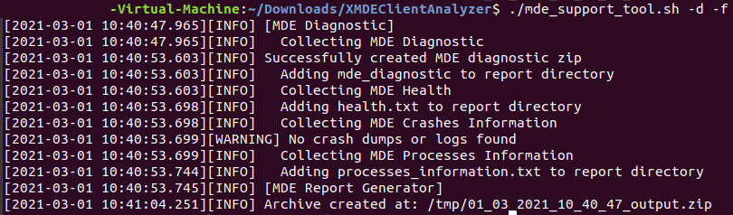

#  Run the client analyzer on Windows

**Applies to:**
- [Microsoft Defender for Endpoint](https://go.microsoft.com/fwlink/p/?linkid=2146631)

## Running the analyzer through GUI scenario

1.  Download the [XMDE Client Analyzer](https://aka.ms/XMDEClientAnalyzer)
    tool to the MacOS machine you need to investigate.

2.  Extract the contents of XMDEClientAnalyzer.zip on the machine.

3.  Open a terminal session, change directory to the extracted location and run:

>   **./mde_support_tool.sh -d**

!Note  
If the script does not have permissions to execute, then you’ll need to first
run:  
*chmod a+x mde_support_tool.sh*

## Running the analyzer using a terminal or SSH scenario

1.  Open a terminal or SSH into the relevant machine.

2.  Run `wget --quiet -O XMDEClientAnalyzer.zip*
    <http://aka.ms/XMDEClientAnalyzer> *&& unzip -q XMDEClientAnalyzer.zip && cd
    XMDEClientAnalyzer && chmod +x mde_support_tool.sh"`

3.  Run `“./mde_support_tool.sh -d”` to generate the result archive file.

> [!NOTE]  
> For Linux, the analyzer requires 'lxml' to produce the result output. If not
installed, the analyzer will try to fetch it from the official repository for
python packages below:  
https://files.pythonhosted.org/packages/\*/lxml\*.whl

Example:  

  
  
Additional syntax help:

**-h** \# Help  
\# Show help message

**-p** \# Performance  
\# Planned parameter that is not yet implemented.  
\# Collects extensive tracing for analysis of a performance issue that can be
reproduced on demand.

**-o** \# Output  
\# Specify the destination path for the result file

**-nz** \# No-Zip  
\# If set, a directory will be created instead of a resulting archive file

**-f** \# Force  
\# Overwrite if output already exists in destination path

## Result package contents on macOS and Linux

-   report.html   Description: The main HTML output file which will contain the findings and
    guidance that the analyzer script run on the machine can produce.

-   mde_diagnostic.zip   Description: Same diagnostic output that gets generated when
    running *mdatp diagnostic create* on either
    [MacOS](https://docs.microsoft.com/windows/security/threat-protection/microsoft-defender-atp/mac-resources#collecting-diagnostic-information)
    or
    [Linux](https://docs.microsoft.com/windows/security/threat-protection/microsoft-defender-atp/linux-resources#collect-diagnostic-information)

-   mde.xml   Description: XML output that is generated while running and is used to build
    the html report file.

-   Processes_information.txt   Description: contains the details of the running MDE related
    processes on the system.

-   Log.txt   Description: contains the same log messages written on screen during the data
    collection.

-   Health.txt   Description: The same basic health output that is shown when running *mdatp
    health* command.

-   Events.xml   Description: Additional XML file used by the analyzer when building the
    HTML report.

-   Auditd_info.txt   Description: details on auditd service and related components for
    [Linux](https://docs.microsoft.com/windows/security/threat-protection/microsoft-defender-atp/linux-support-events)
    OS