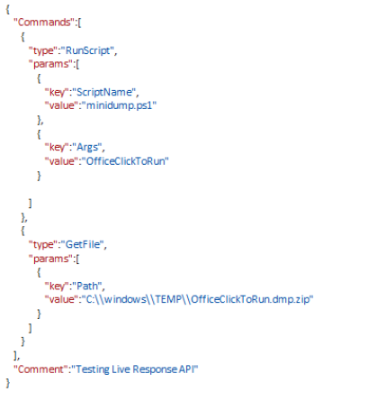
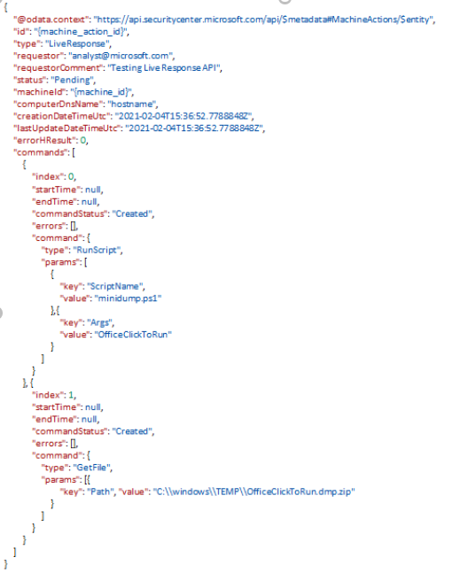

#  Run live response commands on a device

[!INCLUDE [Microsoft 365 Defender rebranding](../../includes/microsoft-defender.md)]

**Applies to:**
- [Microsoft Defender for Endpoint](https://go.microsoft.com/fwlink/p/?linkid=2146631)


[!include[Prerelease information](../../includes/prerelease.md)]

>Want to experience Microsoft Defender for Endpoint? [Sign up for a free trial.](https://www.microsoft.com/microsoft-365/windows/microsoft-defender-atp?ocid=docs-wdatp-exposedapis-abovefoldlink) 

[!include[Microsoft Defender for Endpoint API URIs for US Government](../../includes/microsoft-defender-api-usgov.md)]

[!include[Improve request performance](../../includes/improve-request-performance.md)]

## API description

Runs a sequence of live response commands on a device

## Limitations

1.  Rate limitations for this API are 10 calls per minute (additional requests
    are responded with HTTP 429).

2.  25 concurrently running sessions (requests exceeding the throttling limit will receive a "429 - Too many requests" response).

3.  If the machine is not available, the session will be queued for up to 3 days.

4.  RunScript command timeouts after 10 minutes.

5.  When a live response command fails all followed actions will not be
    executed.

## Permissions

One of the following permissions is required to call this API. To learn more,
including how to choose permissions, see [Get started](apis-intro.md).

| Permission type                    | Permission           | Permission display name                   |
|------------------------------------|----------------------|-------------------------------------------|
| Application                        | Machine.LiveResponse | Run live response on a specific machine |
| Delegated (work or school account) | Machine.LiveResponse | Run live response on a specific machine |

## HTTP request

POST
[https://api.securitycenter.microsoft.com/API/machines/{machine_id}/runliveresponse](https://api.securitycenter.microsoft.com/API/machines/%7bmachine_id%7d/runliveresponse)

## Request headers

| Name      | Type | Description                 |
|---------------|----------|---------------------------------|
| Authorization | String   | Bearer\<token>\. Required.   |
| Content-Type  | string   | application/json. Required. |

## Request body

| Parameter | Type | Description                                                        |
|---------------|----------|------------------------------------------------------------------------|
| Comment       | String   | Comment to associate with the action.                                 |
| Commands      | Array    | Commands to run. Allowed values are PutFile, RunScript, GetFile. |

Commands:

| Command Type | Parameters                                                                          | Description                                                                                                                      |
|------------------|-----------------------------------------------------------------------------------------|--------------------------------------------------------------------------------------------------------------------------------------|
| PutFile      | Key: FileName  <br><br>  Value: \<file name\>                                                                          | Puts a file from the library to the device. Files are saved in a working folder and are deleted when the device restarts by default.
| RunScript    | Key: ScriptName Value: \<Script from library\> <br><br> Key: Args  <br> Value: \<Script arguments\>                          | Runs a script from the library on a device.    <br><br>  The Args parameter is passed to your script. <br><br Timeouts after 10 minutes.     
| GetFile      | Key: Path <br><br> Value: \<File path\>                                                        | Collect file from a device. NOTE: Backslashes in path must be escaped.                                                                      |

## Response

-   If successful, this method returns 200, Ok.
    Action entity. If machine action entity with the specified ID was not found - 404 Not Found.

## Example

**Request**

Here is an example of the request.

```HTTP

POST
https://api.securitycenter.microsoft.com/api/machines/1e5bc9d7e413ddd7902c2932e418702b84d0cc07/runliveresponse

```
**JSON**



**Response**

Here is an example of the response.

```HTTP
HTTP/1.1 200 Ok
```

Content-type: application/json



## Related topics
- [Get machine action API](get-machineaction-object.md)
- [Get live response result](get-live-response-result.md)
- [Cancel machine action](cancel-machine-action.md)
- [Upload to library](upload-library.md)