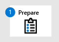
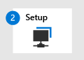

# Migrate from Symantec - Phase 2: Set up Microsoft Defender for Endpoint

**Applies to:**
- [Microsoft Defender for Endpoint](https://go.microsoft.com/fwlink/p/?linkid=2154037)
- [Microsoft 365 Defender](https://go.microsoft.com/fwlink/?linkid=2118804)

| [Phase 1: Prepare](symantec-to-microsoft-defender-atp-prepare.md) | Phase 2: Set up | [Phase 3: Onboard](symantec-to-microsoft-defender-atp-onboard.md) |
|--|--|--|
||*You are here!* | |

**Welcome to the Setup phase of [migrating from Symantec to Defender for Endpoint](symantec-to-microsoft-defender-endpoint-migration.md#the-migration-process)**. This phase includes the following steps:

## Reinstall/enable Microsoft Defender Antivirus on your endpoints

On certain versions of Windows, Microsoft Defender Antivirus is likely uninstalled or disabled when your non-Microsoft antivirus/antimalware solution was installed. For more information, see [Microsoft Defender Antivirus compatibility](/windows/security/threat-protection/microsoft-defender-antivirus/microsoft-defender-antivirus-compatibility). 

On Windows clients, when a non-Microsoft antivirus/antimalware solution is installed, Microsoft Defender Antivirus is disabled automatically until those devices are onboarded to Defender for Endpoint. When the client endpoints are onboarded to Defender for Endpoint, Microsoft Defender Antivirus goes into passive mode until the non-Microsoft antivirus solution is uninstalled. Microsoft Defender Antivirus should still be installed, but is likely disabled at this point of the migration process. Unless Microsoft Defender Antivirus has been uninstalled, you do not need to take any action for your Windows clients.

On Windows servers, when a non-Microsoft antivirus/antimalware in installed, Microsoft Defender Antivirus is disabled manually (if not uninstalled). The following tasks help ensure that Microsoft Defender Antivirus is installed and set to passive mode on Windows Server.

- Set DisableAntiSpyware to false on Windows Server (only if necessary)

- Reinstall Microsoft Defender Antivirus on Windows Server

- Set Microsoft Defender Antivirus to passive mode on Windows Server

### Set DisableAntiSpyware to false on Windows Server

The DisableAntiSpyware registry key was used in the past to disable Microsoft Defender Antivirus, and deploy another antivirus product, Symantec. In general, you should not have this registry key on your Windows devices and endpoints; however, if you do have `DisableAntiSpyware` configured, here's how to set its value to false:

1. On your Windows Server device, open Registry Editor.

2. Navigate to `HKEY_LOCAL_MACHINE\SOFTWARE\Policies\Microsoft\Windows Defender`.

3. In that folder, look for a DWORD entry called **DisableAntiSpyware**.

   - If you do not see that entry, you're all set.
   - If you do see DisableAntiSpyware, proceed to step 4.

4. Right-click the DisableAntiSpyware DWORD, and then choose **Modify**.

5. Set the value to `0`. (This action sets the registry key's value to *false*.)

> [!TIP]
> To learn more about this registry key, see **[DisableAntiSpyware](/windows-hardware/customize/desktop/unattend/security-malware-windows-defender-disableantispyware)**.

### Reinstall Microsoft Defender Antivirus on Windows Server

> [!NOTE]
> The following procedure applies only to endpoints or devices that are running the following versions of Windows:
> - Windows Server 2019
> - Windows Server, version 1803 (core-only mode)
> - Windows Server 2016

1. As a local administrator on the endpoint or device, open Windows PowerShell.

1. Run the following PowerShell cmdlets:

   `Dism /online /Get-FeatureInfo /FeatureName:Windows-Defender-Features` 
   
   `Dism /online /Get-FeatureInfo /FeatureName:Windows-Defender`

    > [!NOTE]
    > When using the DISM command within a task sequence running PS, the following path to cmd.exe is required.
    > Examples:
    >
    > `c:\windows\sysnative\cmd.exe /c Dism /online /Get-FeatureInfo /FeatureName:Windows-Defender-Features` 
    >
    > `c:\windows\sysnative\cmd.exe /c Dism /online /Get-FeatureInfo /FeatureName:Windows-Defender` 

3. To verify Microsoft Defender Antivirus is running, use the following PowerShell cmdlet:  
   `Get-Service -Name windefend`

### Set Microsoft Defender Antivirus to passive mode on Windows Server

1. Open Registry Editor, and then navigate to  
   `Computer\HKEY_LOCAL_MACHINE\SOFTWARE\Policies\Microsoft\Windows Advanced Threat Protection`.

2. Edit (or create) a DWORD entry called **ForcePassiveMode**, and specify the following settings:
   - Set the DWORD's value to **1**.
   - Under **Base**, select **Hexadecimal**.

> [!NOTE]
> You can use other methods to set the registry key, such as the following:
>- [Group Policy Preference](/previous-versions/windows/it-pro/windows-server-2012-R2-and-2012/dn581922(v=ws.11))
>- [Local Group Policy Object tool](/windows/security/threat-protection/security-compliance-toolkit-10#what-is-the-local-group-policy-object-lgpo-tool)
>- [A package in Configuration Manager](/mem/configmgr/apps/deploy-use/packages-and-programs)
>
> After onboarding to Defender for Endpoint, you might have to set Microsoft Defender Antivirus to passive mode on Windows Server.

### Are you using Windows Server 2016?

If you have endpoints running Windows Server 2016, you cannot run Microsoft Defender Antivirus alongside a non-Microsoft antivirus/antimalware solution. Microsoft Defender Antivirus cannot run in passive mode on Windows Server 2016. In this case, you'll need to uninstall the non-Microsoft antivirus/antimalware solution, and install/enable Microsoft Defender Antivirus instead. To learn more, see [Antivirus solution compatibility with Defender for Endpoint](microsoft-defender-antivirus-compatibility.md).

If you're using Windows Server 2016 and are having trouble enabling Microsoft Defender Antivirus, use the following PowerShell cmdlet:

`mpcmdrun -wdenable`

For more information, see [Microsoft Defender Antivirus on Windows Server](microsoft-defender-antivirus-on-windows-server.md).

## Configure Defender for Endpoint

This step of the migration process involves configuring Microsoft Defender Antivirus for your endpoints. We recommend using Intune; however, you can any of the methods that are listed in the following table:

|Method  |What to do  |
|---------|---------|
|[Intune](/mem/intune/fundamentals/tutorial-walkthrough-endpoint-manager)  **NOTE**: Intune is now part of Microsoft Endpoint Manager. |1. Go to the [Microsoft Endpoint Manager admin center](https://go.microsoft.com/fwlink/?linkid=2109431) and sign in.
2. Select **Devices** > **Configuration profiles**, and then select the profile type you want to configure. If you haven't yet created a **Device restrictions** profile type, or if you want to create a new one, see [Configure device restriction settings in Microsoft Intune](/intune/device-restrictions-configure).
3. Select **Properties**, and then select **Configuration settings: Edit**.
4. Expand **Microsoft Defender Antivirus**. 
5. Enable **Cloud-delivered protection**.
6. In the **Prompt users before sample submission** dropdown, select **Send all samples automatically**.
7. In the **Detect potentially unwanted applications** dropdown, select **Enable** or **Audit**.
8. Select **Review + save**, and then choose **Save**. For more information about Intune device profiles, including how to create and configure their settings, see [What are Microsoft Intune device profiles?](/intune/device-profiles).|
|Control Panel in Windows     |Follow the guidance here: [Turn on Microsoft Defender Antivirus](/mem/intune/user-help/turn-on-defender-windows).  **NOTE**: You might see *Windows Defender Antivirus* instead of *Microsoft Defender Antivirus* in some versions of Windows.        |
|[Advanced Group Policy Management](/microsoft-desktop-optimization-pack/agpm/)  or [Group Policy Management Console](/windows/security/threat-protection/microsoft-defender-antivirus/use-group-policy-microsoft-defender-antivirus)  |1. Go to `Computer configuration > Administrative templates > Windows components > Microsoft Defender Antivirus`. 
2. Look for a policy called **Turn off Microsoft Defender Antivirus**.
3. Choose **Edit policy setting**, and make sure that policy is disabled. This enables Microsoft Defender Antivirus. 
**NOTE**: You might see *Windows Defender Antivirus* instead of *Microsoft Defender Antivirus* in some versions of Windows. |

## Add Microsoft Defender for Endpoint to the exclusion list for Symantec

This step of the setup process involves adding Defender for Endpoint to the exclusion list for Symantec and any other security products your organization is using. The specific exclusions to configure depend on which version of Windows your endpoints or devices are running, and are listed in the following table:

|OS |Exclusions |
|--|--|
| Windows 10, [version 1803](/windows/release-health/status-windows-10-1803) or later (See [Windows 10 release information](/windows/release-health/release-information))
 Windows 10, version 1703 or 1709 with [KB4493441](https://support.microsoft.com/help/4493441) installed 
 [Windows Server 2019](/windows/release-health/status-windows-10-1809-and-windows-server-2019)
 [Windows Server, version 1803](/windows-server/get-started/whats-new-in-windows-server-1803) |`C:\Program Files\Windows Defender Advanced Threat Protection\MsSense.exe`
`C:\Program Files\Windows Defender Advanced Threat Protection\SenseCncProxy.exe`
`C:\Program Files\Windows Defender Advanced Threat Protection\SenseSampleUploader.exe`
`C:\Program Files\Windows Defender Advanced Threat Protection\SenseIR.exe`
  |
| [Windows 8.1](/windows/release-health/status-windows-8.1-and-windows-server-2012-r2) 
 [Windows 7](/windows/release-health/status-windows-7-and-windows-server-2008-r2-sp1)
 [Windows Server 2016](/windows/release-health/status-windows-10-1607-and-windows-server-2016)
 [Windows Server 2012 R2](/windows/release-health/status-windows-8.1-and-windows-server-2012-r2)
 [Windows Server 2008 R2 SP1](/windows/release-health/status-windows-7-and-windows-server-2008-r2-sp1) |`C:\Program Files\Microsoft Monitoring Agent\Agent\Health Service State\Monitoring Host Temporary Files 6\45\MsSenseS.exe`
**NOTE**: Where Monitoring Host Temporary Files 6\45 can be different numbered subfolders.
`C:\Program Files\Microsoft Monitoring Agent\Agent\AgentControlPanel.exe`
`C:\Program Files\Microsoft Monitoring Agent\Agent\HealthService.exe`
`C:\Program Files\Microsoft Monitoring Agent\Agent\HSLockdown.exe`
`C:\Program Files\Microsoft Monitoring Agent\Agent\MOMPerfSnapshotHelper.exe`
`C:\Program Files\Microsoft Monitoring Agent\Agent\MonitoringHost.exe`
`C:\Program Files\Microsoft Monitoring Agent\Agent\TestCloudConnection.exe` |

## Add Symantec to the exclusion list for Microsoft Defender Antivirus

During this step of the setup process, you add your existing solution to the Microsoft Defender Antivirus exclusion list. You can choose from several methods to add your exclusions to Microsoft Defender Antivirus, as listed in the following table:

> [!NOTE]
> To get an idea of which processes and services to exclude, see Broadcom's [Processes and services used by Endpoint Protection 14](https://knowledge.broadcom.com/external/article/170706/processes-and-services-used-by-endpoint.html).

|Method | What to do|
|--|--|
|[Intune](/mem/intune/fundamentals/tutorial-walkthrough-endpoint-manager)  **NOTE**: Intune is now part of Microsoft Endpoint Manager. |1. Go to the [Microsoft Endpoint Manager admin center](https://go.microsoft.com/fwlink/?linkid=2109431) and sign in.
2. Select **Devices** > **Configuration profiles**, and then select the profile that you want to configure.
3. Under **Manage**, select **Properties**. 
4. Select **Configuration settings: Edit**.
5. Expand **Microsoft Defender Antivirus**, and then expand **Microsoft Defender Antivirus Exclusions**.
6. Specify the files and folders, extensions, and processes to exclude from Microsoft Defender Antivirus scans. For reference, see [Microsoft Defender Antivirus exclusions](/mem/intune/configuration/device-restrictions-windows-10#microsoft-defender-antivirus-exclusions).
7. Choose **Review + save**, and then choose **Save**.  |
|[Microsoft Endpoint Configuration Manager](/mem/configmgr/) |1. Using the [Configuration Manager console](/mem/configmgr/core/servers/manage/admin-console), go to **Assets and Compliance** > **Endpoint Protection** > **Antimalware Policies**, and then select the policy that you want to modify. 
2. Specify exclusion settings for files and folders, extensions, and processes to exclude from Microsoft Defender Antivirus scans. |
|[Group Policy Object](/previous-versions/windows/desktop/Policy/group-policy-objects) | 1. On your Group Policy management computer, open the [Group Policy Management Console](https://technet.microsoft.com/library/cc731212.aspx), right-click the Group Policy Object you want to configure and then select **Edit**.
2. In the **Group Policy Management Editor**, go to **Computer configuration** and select **Administrative templates**.
3. Expand the tree to **Windows components > Microsoft Defender Antivirus > Exclusions**. **NOTE**: You might see *Windows Defender Antivirus* instead of *Microsoft Defender Antivirus* in some versions of Windows.
4. Double-click the **Path Exclusions** setting and add the exclusions. - Set the option to **Enabled**. - Under the **Options** section, select **Show...**. - Specify each folder on its own line under the **Value name** column. - If you specify a file, make sure to enter a fully qualified path to the file, including the drive letter, folder path, filename, and extension. Enter **0** in the **Value** column.
5. Select **OK**.
6. Double-click the **Extension Exclusions** setting and add the exclusions. - Set the option to **Enabled**. - Under the **Options** section, select **Show...**. - Enter each file extension on its own line under the **Value name** column. - Enter **0** in the **Value** column.
7. Select **OK**. |
|Local group policy object |1. On the endpoint or device, open the Local Group Policy Editor. 
2. Go to **Computer Configuration** > **Administrative Templates** > **Windows Components** > **Microsoft Defender Antivirus** > **Exclusions**.  **NOTE**: You might see *Windows Defender Antivirus* instead of *Microsoft Defender Antivirus* in some versions of Windows.
3. Specify your path and process exclusions. |
|Registry key |1. Export the following registry key: `HKEY_LOCAL_MACHINE\SOFTWARE\Policies\Microsoft\Windows Defender\exclusions`.
2. Import the registry key. Here are two examples: - Local path: `regedit.exe /s c:\temp\ MDAV_Exclusion.reg`  - Network share: `regedit.exe /s \\FileServer\ShareName\MDAV_Exclusion.reg` |

When you add [exclusions to Microsoft Defender Antivirus scans](/windows/security/threat-protection/microsoft-defender-antivirus/configure-exclusions-microsoft-defender-antivirus), you should add path and process exclusions. Keep the following points in mind:
- Path exclusions exclude specific files and whatever those files access.
- Process exclusions exclude whatever a process touches, but does not exclude the process itself.
- If you list each executable (.exe) as both a path exclusion and a process exclusion, the process and whatever it touches are excluded.
- List your process exclusions using their full path and not by their name only. (The name-only method is less secure.)

## Set up your device groups, device collections, and organizational units

Device groups, device collections, and organizational units enable your security team to manage and assign security policies efficiently and effectively. The following table describes each of these groups and how to configure them. Your organization might not use all three collection types.

| Collection type | What to do |
|--|--|
|[Device groups](/microsoft-365/security/defender-endpoint/machine-groups) (formerly called machine groups) enable your security operations team to configure security capabilities, such as automated investigation and remediation.  Device groups are also useful for assigning access to those devices so that your security operations team can take remediation actions if needed.  Device groups are created in the Microsoft Defender Security Center. |1. Go to the Microsoft Defender Security Center ([https://aka.ms/MDATPportal](https://aka.ms/MDATPportal)).
2. In the navigation pane on the left, choose **Settings** > **Permissions** > **Device groups**.  
3. Choose **+ Add device group**.
4. Specify a name and description for the device group.
5. In the **Automation level** list, select an option. (We recommend **Full - remediate threats automatically**.) To learn more about the various automation levels, see [How threats are remediated](/microsoft-365/security/defender-endpoint/automated-investigations#how-threats-are-remediated).
6. Specify conditions for a matching rule to determine which devices belong to the device group. For example, you can choose a domain, OS versions, or even use [device tags](/microsoft-365/security/defender-endpoint/machine-tags).
7. On the **User access** tab, specify roles that should have access to the devices that are included in the device group. 
8. Choose **Done**. |
|[Device collections](/mem/configmgr/core/clients/manage/collections/introduction-to-collections) enable your security operations team to manage applications, deploy compliance settings, or install software updates on the devices in your organization.  Device collections are created by using [Configuration Manager](/mem/configmgr/). |Follow the steps in [Create a collection](/mem/configmgr/core/clients/manage/collections/create-collections#bkmk_create). |
|[Organizational units](/azure/active-directory-domain-services/create-ou) enable you to logically group objects such as user accounts, service accounts, or computer accounts. You can then assign administrators to specific organizational units, and apply group policy to enforce targeted configuration settings.  Organizational units are defined in [Azure Active Directory Domain Services](/azure/active-directory-domain-services). | Follow the steps in [Create an Organizational Unit in an Azure Active Directory Domain Services managed domain](/azure/active-directory-domain-services/create-ou). |

## Configure antimalware policies and real-time protection

Using Configuration Manager and your device collection(s), configure your antimalware policies.

- See [Create and deploy antimalware policies for Endpoint Protection in Configuration Manager](/mem/configmgr/protect/deploy-use/endpoint-antimalware-policies).

- While you create and configure your antimalware policies, make sure to review the [real-time protection settings](/mem/configmgr/protect/deploy-use/endpoint-antimalware-policies#real-time-protection-settings) and [enable block at first sight](/windows/security/threat-protection/microsoft-defender-antivirus/configure-block-at-first-sight-microsoft-defender-antivirus).

> [!TIP]
> You can deploy the policies before your organization's devices on onboarded.

## Next step

**Congratulations**! You have completed the Setup phase of [migrating from Symantec to Defender for Endpoint](symantec-to-microsoft-defender-endpoint-migration.md#the-migration-process)!
- [Proceed to Phase 3: Onboard to Defender for Endpoint](symantec-to-microsoft-defender-atp-onboard.md)
