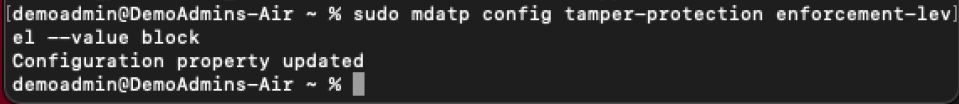
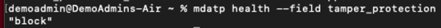
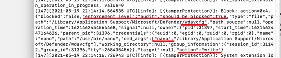

# Protect macOS security settings with tamper protection

[!INCLUDE [Microsoft 365 Defender rebranding](../../includes/microsoft-defender.md)]

**Applies to:**

- [Microsoft 365 Defender](https://go.microsoft.com/fwlink/?linkid=2118804)
- [Microsoft Defender for Endpoint Plan 1](https://go.microsoft.com/fwlink/p/?linkid=2154037)
- [Microsoft Defender for Endpoint Plan 2](https://go.microsoft.com/fwlink/p/?linkid=2154037)

> Want to experience Defender for Endpoint? [Sign up for a free trial.](https://signup.microsoft.com/create-account/signup?products=7f379fee-c4f9-4278-b0a1-e4c8c2fcdf7e&ru=https://aka.ms/MDEp2OpenTrial?ocid=docs-wdatp-rbac-abovefoldlink)

Tamper protection in macOS helps prevent unwanted changes to security settings from being made by unauthorized users. Tamper protection helps prevent unauthorized removal of Microsoft Defender for Endpoint on macOS. This capability also helps important security files, processes, and configuration settings from being tampered.

> [!IMPORTANT]
> Starting March of 2023, Microsoft Defender for Endpoint on macOS will start respecting the selection for tamper protection applied via the global tamper protection switch under advanced settings in the Microsoft 365 Defender portal ([https://security.microsoft.com](https://security.microsoft.com)). You can choose to enforce (block/audit/disable) your own macOS tamper protection settings by using a Mobile Device Management (MDM) solution such as Intune or JAMF (recommended). If the tamper protection setting was not enforced via MDM, a local administrator can continue to manually change the setting with the following command: `sudo mdatp config tamper-protection enforcement-level --value (chosen mode)`.

You can set Tamper Protection in the following modes:

|Topic|Description|
|---|---|
|Disabled|Tamper protection is completely off.|
|Audit|Tampering operations are logged, but not blocked. This mode is the default after installation.|
|Block|Tamper protection is on; tampering operations are blocked.|

When tamper protection is set to audit or block mode, you can expect the following outcomes:

**Audit mode**:

- Actions to uninstall Defender for Endpoint agent is logged (audited)
- Editing/modification of Defender for Endpoint files are logged (audited)
- Creation of new files under Defender for Endpoint location is logged (audited)
- Deletion of Defender for Endpoint files is logged (audited)
- Renaming of Defender for Endpoint files is logged (audited)

**Block mode**:

- Actions to uninstall Defender for Endpoint agent  is blocked
- Editing/modification of Defender for Endpoint files are blocked
- Creation of new files under Defender for Endpoint location is blocked
- Deletion of Defender for Endpoint files is blocked
- Renaming of Defender for Endpoint files is blocked
- Commands to stop the agent fail

Here's an example of a system message in response to a blocked action:


You can configure the tamper protection mode by providing the mode name as enforcement-level.

> [!NOTE]
>
> - The mode change will apply immediately.
> - If you used JAMF during the initial configuration, then you'll need to update the configuration using JAMF as well.

## Before you begin

- Supported macOS versions: Big Sur (11), or later.
- Minimum required version for Defender for Endpoint: 101.70.19.


**Highly recommended settings:**

- System Integrity Protection (SIP) enabled. For more information, see [Disabling and Enabling System Integrity Protection](https://developer.apple.com/documentation/security/disabling_and_enabling_system_integrity_protection).
- Use a Mobile device management (MDM) tool to configure Microsoft Defender for Endpoint.
- Ensure that Defender for Endpoint has **Full Disk Access** authorization.

   > [!NOTE]
   > Both having SIP enabled and all configuration done via MDM is not mandatory, but required for a fully secured machine, as otherwise a local admin still can make tampering changes that macOS manages. For example, enabling **TCC** (Transparency, Consent & Control) through an Mobile Device Management solution such as [Intune](mac-install-with-intune.md), will eliminate the risk of a global admin revoking **Full Disk Access** Authorization by a local admin.

## Configure Tamper Protection on macOS devices

Microsoft Defender evaluates these settings in the following order.
If a higher priority setting is configured, the rest are ignored:

1) Managed configuration profile (tamperProtection/enforcementLevel setting):
    - [JAMF](#jamf)
    - [Intune](#intune)
2) [Manual configuration](#manual-configuration) (with `mdatp config tamper-protection enforcement-level --value { disabled|audit|block }`)
3) If Tamper Protection flag in Security Portal is set, the "block" mode is used (in Preview, not available to all customers)
4) If machine is licensed, then "audit" mode is used by default
5) If machine isn't licensed, then Tamper Protection is in the "block" mode

### Before you begin

Make sure that your machine is licensed and healthy (corresponding values report `true`):

```bash
mdatp health
```

```console
healthy                                     : true
health_issues                               : []
licensed                                    : true
...
tamper_protection                           : "audit"
```

`tamper_protection` reports the effective enforcement level.

### Manual configuration

1. Use the following command to switch to the most restrictive mode:

```console
sudo mdatp config tamper-protection enforcement-level --value block
```



> [!NOTE]
> You must use managed configuration profile (deployed via MDM) on production machines. If a local admin changed tamper protection mode via a manual configuration, they can change it to a less restrictive mode at any time as well. If tamper protection mode was set via a managed profile, only a global admin will be able to undo it.

2. Verify the result.

```console
healthy                                     : true
health_issues                               : []
licensed                                    : true
engine_version                              : "1.1.19300.3"
app_version                                 : "101.70.19"
org_id                                      : "..."
log_level                                   : "info"
machine_guid                                : "..."
release_ring                                : "InsiderFast"
product_expiration                          : Dec 29, 2022 at 09:48:37 PM
cloud_enabled                               : true
cloud_automatic_sample_submission_consent   : "safe"
cloud_diagnostic_enabled                    : false
passive_mode_enabled                        : false
real_time_protection_enabled                : true
real_time_protection_available              : true
real_time_protection_subsystem              : "endpoint_security_extension"
network_events_subsystem                    : "network_filter_extension"
device_control_enforcement_level            : "audit"
tamper_protection                           : "block"
automatic_definition_update_enabled         : true
definitions_updated                         : Jul 06, 2022 at 01:57:03 PM
definitions_updated_minutes_ago             : 5
definitions_version                         : "1.369.896.0"
definitions_status                          : "up_to_date"
edr_early_preview_enabled                   : "disabled"
edr_device_tags                             : []
edr_group_ids                               : ""
edr_configuration_version                   : "20.199999.main.2022.07.05.02-ac10b0623fd381e28133debe14b39bb2dc5b61af"
edr_machine_id                              : "..."
conflicting_applications                    : []
network_protection_status                   : "stopped"
data_loss_prevention_status                 : "disabled"
full_disk_access_enabled                    : true
```

Notice that the "tamper_protection" is now set to "block".

### JAMF

Configure tamper protection mode in Microsoft Defender for Endpoint [configuration profile](mac-jamfpro-policies.md), by adding the following settings:

```xml
<?xml version="1.0" encoding="UTF-8"?>
<!DOCTYPE plist PUBLIC "-//Apple//DTD PLIST 1.0//EN" "http://www.apple.com/DTDs/PropertyList-1.0.dtd">
<plist version="1.0">
  <dict>
    <key>tamperProtection</key>
    <dict>
      <key>enforcementLevel</key>
      <string>block</string>
    </dict>
  </dict>
</plist>
```

> [!NOTE]
> If you already have a configuration profile for Microsoft Defender for Endpoint then you need to *add* settings to it. You should not create a second configuration profile.

### Intune

Follow the documented Intune profile example to configure Tamper Protection through Intune. For more information, see [Set preferences for Microsoft Defender for Endpoint on macOS](mac-preferences.md).

Add the following configuration in your Intune profile:

> [!NOTE]
> For Intune configuration, you can create a new profile configuration file to add the Tamper protection configuration, or you can add these parameters to the existing one.

```xml
<?xml version="1.0" encoding="utf-8"?>
<!DOCTYPE plist PUBLIC "-//Apple//DTD PLIST 1.0//EN" "http://www.apple.com/DTDs/PropertyList-1.0.dtd">
<plist version="1">
    <dict>
        <key>PayloadUUID</key>
        <string>C4E6A782-0C8D-44AB-A025-EB893987A295</string>
        <key>PayloadType</key>
        <string>Configuration</string>
        <key>PayloadOrganization</key>
        <string>Microsoft</string>
        <key>PayloadIdentifier</key>
        <string>com.microsoft.wdav</string>
        <key>PayloadDisplayName</key>
        <string>Microsoft Defender for Endpoint settings</string>
        <key>PayloadDescription</key>
        <string>Microsoft Defender for Endpoint configuration settings</string>
        <key>PayloadVersion</key>
        <integer>1</integer>
        <key>PayloadEnabled</key>
        <true/>
        <key>PayloadRemovalDisallowed</key>
        <true/>
        <key>PayloadScope</key>
        <string>System</string>
        <key>PayloadContent</key>
        <array>
            <dict>
                <key>PayloadUUID</key>
                <string>99DBC2BC-3B3A-46A2-A413-C8F9BB9A7295</string>
                <key>PayloadType</key>
                <string>com.microsoft.wdav</string>
                <key>PayloadOrganization</key>
                <string>Microsoft</string>
                <key>PayloadIdentifier</key>
                <string>com.microsoft.wdav</string>
                <key>PayloadDisplayName</key>
                <string>Microsoft Defender for Endpoint configuration settings</string>
                <key>PayloadDescription</key>
                <string/>
                <key>PayloadVersion</key>
                <integer>1</integer>
                <key>PayloadEnabled</key>
                <true/>
                <key>tamperProtection</key>
                <dict>
                             <key>enforcementLevel</key>
                             <string>block</string>
                </dict>
            </dict>
        </array>
    </dict>
</plist>
```

Check the tamper protection status by running the following command:

`mdatp health --field tamper_protection`

The result shows "block" if tamper protection is on:



You can also run full `mdatp health` and look for the "tamper_protection" in the output.

For extended information on the tamper protection status, run `mdatp health --details tamper_protection`.

## Verify tamper protection preventive capabilities

You can verify that tamper protection is on through various ways.

### Verify block mode

Tampering alert is raised in the Microsoft 365 Defender portal

:::image type="content" source="images/tampering-sensor-portal.png" alt-text="Screenshot of tampering alert raised in the Microsoft 365 Defender portal." lightbox="images/tampering-sensor-portal.png":::

### Verify block mode and audit modes

- Using Advanced hunting, you see tampering alerts appear
- Tampering events can be found in the local device logs: `sudo grep -F '[{tamperProtection}]' /Library/Logs/Microsoft/mdatp/microsoft_defender_core.log`



### DIY scenarios

- With tamper protection set to "block", attempt different methods to uninstall Defender for Endpoint. For example, drag the app tile into trash or uninstall tamper protection using the command line.
- Try to stop the Defender for Endpoint process (kill).
- Try to delete, rename, modify, move Defender for Endpoint files (similar to what a malicious user would do), for example:

  - /Applications/Microsoft Defender ATP.app/
  - /Library/LaunchDaemons/com.microsoft.fresno.plist
  - /Library/LaunchDaemons/com.microsoft.fresno.uninstall.plist
  - /Library/LaunchAgents/com.microsoft.wdav.tray.plist
  - /Library/Managed Preferences/com.microsoft.wdav.ext.plist
  - /Library/Managed Preferences/mdatp_managed.json
  - /Library/Managed Preferences/com.microsoft.wdav.atp.plist
  - /Library/Managed Preferences/com.microsoft.wdav.atp.offboarding.plist
  - /usr/local/bin/mdatp

## Turning off Tamper Protection

You can turn off Tamper Protection using any of the following methods.

### Manual configuration

Use the following command:

```console
sudo mdatp config tamper-protection enforcement-level --value disabled
```

## JAMF
Change the `enforcementLevel` value to "disabled" [in your configuration profile](mac-preferences.md#tamper-protection), and push it to the machine:

```console
<?xml version="1.0" encoding="UTF-8"?>
<!DOCTYPE plist PUBLIC "-//Apple//DTD PLIST 1.0//EN" "http://www.apple.com/DTDs/PropertyList-1.0.dtd">
<plist version="1.0">
  <dict>
    <key>tamperProtection</key>
    <dict>
      <key>enforcementLevel</key>
      <string>disabled</string>
    </dict>
  </dict>
</plist>
```

### Intune
Add the following configuration in your Intune [profile](mac-preferences.md#tamper-protection):

```XML
<?xml version="1.0" encoding="utf-8"?>
<!DOCTYPE plist PUBLIC "-//Apple//DTD PLIST 1.0//EN" "http://www.apple.com/DTDs/PropertyList-1.0.dtd">
<plist version="1">
    <dict>
        <key>PayloadUUID</key>
        <string>C4E6A782-0C8D-44AB-A025-EB893987A295</string>
        <key>PayloadType</key>
        <string>Configuration</string>
        <key>PayloadOrganization</key>
        <string>Microsoft</string>
        <key>PayloadIdentifier</key>
        <string>com.microsoft.wdav</string>
        <key>PayloadDisplayName</key>
        <string>Microsoft Defender for Endpoint settings</string>
        <key>PayloadDescription</key>
        <string>Microsoft Defender for Endpoint configuration settings</string>
        <key>PayloadVersion</key>
        <integer>1</integer>
        <key>PayloadEnabled</key>
        <true/>
        <key>PayloadRemovalDisallowed</key>
        <true/>
        <key>PayloadScope</key>
        <string>System</string>
        <key>PayloadContent</key>
        <array>
            <dict>
                <key>PayloadUUID</key>
                <string>99DBC2BC-3B3A-46A2-A413-C8F9BB9A7295</string>
                <key>PayloadType</key>
                <string>com.microsoft.wdav</string>
                <key>PayloadOrganization</key>
                <string>Microsoft</string>
                <key>PayloadIdentifier</key>
                <string>com.microsoft.wdav</string>
                <key>PayloadDisplayName</key>
                <string>Microsoft Defender for Endpoint configuration settings</string>
                <key>PayloadDescription</key>
                <string/>
                <key>PayloadVersion</key>
                <integer>1</integer>
                <key>PayloadEnabled</key>
                <true/>
                <key>tamperProtection</key>
                <dict>
                  <key>enforcementLevel</key>
                  <string>disabled</string>
                </dict>
            </dict>
        </array>
    </dict>
</plist>
```

## Exclusions

> [!NOTE]
> Available in version 101.98.71 or newer.

Tamper Protection prevents any macOS process from making changes to Microsoft Defender's assets or killing Microsoft Defender's processes.
Protected assets include installation and configuration files.

Internally, Microsoft Defender makes exceptions to certain macOS processes, under certain circumstances.
As an example, macOS can upgrade Defender's package, if Tamper Protection verifies the packages authenticity.
There are other exclusions as well.
For example, macOS MDM process can replace Microsoft's Defender's managed configuration files.

There are situations when a global administrator needs to restart Defender on all or some managed machines.
Typically it's done by creating and running a JAMF's policy that runs a script on remote machines (or similar operations for other MDM vendors.)

In order to avoid marking those policy-initiated operations, Microsoft Defender detects those MDM policy processes for JAMF and Intune,
and permit tampering operations from them.
At the same time, Tamper Protection will block the same script from restarting Microsoft Defender, if it is started from a Terminal locally.

However, those policy running processes are vendor specific.
While Microsoft Defender provides built in exclusions for JAMF and Intune, it can't provide those exclusions for all possible MDM vendors.
Instead, a global administrator can add their own exclusions to Tamper Protection.
Exclusions can be done only through MDM profile, not local configuration.

To do that, you need to first figure out the path to the MDM helper process that runs policies. You can do it either by following the MDM vendor's documentation.
You can also initiate tampering with a test policy, get an alert in the Security Portal, inspect the hierarchy of processes that initiated the "attack", and pick the process that looks like an MDM helper candidate.

Once the process path is identified, you have few choices on how to configure an exclusion:

- By the path itself. It's the simplest (you already have this path) and the least secure way to do it, in other words, not recommended.
- By getting the signing ID from the executable, either TeamIdentifier or signing Identifier, by running `codesign -dv --verbose=4 path_to_helper` (look for Identifier and TeamIdentifier, the latter isn't available for Apple's own tools.)
- Or by using a combination of those attributes.

Example:

```bash
codesign -dv --verbose=4 /usr/bin/ruby
```

```console
Executable=/usr/bin/ruby
Identifier=com.apple.ruby
Format=Mach-O universal (x86_64 arm64e)
CodeDirectory v=20400 size=583 flags=0x0(none) hashes=13+2 location=embedded
Platform identifier=14
VersionPlatform=1
VersionMin=852992
VersionSDK=852992
Hash type=sha256 size=32
CandidateCDHash sha256=335c10d40db9417d80db87f658f6565018a4c3d6
CandidateCDHashFull sha256=335c10d40db9417d80db87f658f6565018a4c3d65ea3b850fc76c59e0e137e20
Hash choices=sha256
CMSDigest=335c10d40db9417d80db87f658f6565018a4c3d65ea3b850fc76c59e0e137e20
CMSDigestType=2
Executable Segment base=0
Executable Segment limit=16384
Executable Segment flags=0x1
Page size=4096
Launch Constraints:
  None
CDHash=335c10d40db9417d80db87f658f6565018a4c3d6
Signature size=4442
Authority=Software Signing
Authority=Apple Code Signing Certification Authority
Authority=Apple Root CA
Signed Time=Apr 15, 2023 at 4:45:52 AM
Info.plist=not bound
TeamIdentifier=not set
Sealed Resources=none
Internal requirements count=1 size=64
```

Configure [preferences](mac-preferences.md#exclusions), for example for JAMF:

```xml
<?xml version="1.0" encoding="UTF-8"?>
<!DOCTYPE plist PUBLIC "-//Apple//DTD PLIST 1.0//EN" "http://www.apple.com/DTDs/PropertyList-1.0.dtd">
<plist version="1.0">
  <dict>
    <key>tamperProtection</key>
    <dict>
      <key>enforcementLevel</key>
      <string>block</string>
      <key>exclusions</key>
      <array>
        <dict>
          <key>path</key>
          <string>/usr/bin/ruby</string>
          <key>teamId</key>
          <string/>
          <key>signingId</key>
          <string>com.apple.ruby</string>
          <key>args</key>
          <array>
            <string>/usr/local/bin/global_mdatp_restarted.rb</string>
          </array>
        </dict>
      </array>
    </dict>
  </dict>
</plist>
```

Note, that excluding a scripting interpreter (like Ruby from the example above) instead of a compiled executable isn't secure, as it can run *any script*, not just the one that a global admin uses.

To minimize the risk, we recommend using extra `args` to allow only specific scripts to run with scripting interpreters.
In the example above, only `/usr/bin/ruby /usr/local/bin/global_mdatp_restarted.rb` is permitted to restart Defender.
But, for example, `/usr/bin/ruby /Library/Application Support/Global Manager/global_mdatp_restarted.rb` or even `/usr/bin/ruby /usr/local/bin/global_mdatp_restarted.rb $USER` aren't allowed.

> [!WARNING]
> Always use the most restrictive criteria to prevent unexpected attacks!

## Troubleshooting configuration issues

### Issue: Tamper protection is reported as disabled

If running the command `mdatp health` reports that the tamper protection is disabled, even if you enabled it and more than an hour has passed since the onboarding, then you can check if you have the right configuration by running the following command:

```bash
mdatp health --details tamper_protection
```

```console
tamper_protection                           : "audit"
exclusions                                  : [{"path":"/usr/bin/ruby","team_id":"","signing_id":"com.apple.ruby","args":["/usr/local/bin/global_mdatp_restarted.rb"]}] [managed]
feature_enabled_protection                  : true
feature_enabled_portal                      : true
configuration_source                        : "local"
configuration_local                         : "audit"
configuration_portal                        : "block"
configuration_default                       : "audit"
configuration_is_managed                    : false
```

- `tamper_protection` is the *effective* mode. If this mode is the mode you intended to use, then you're all set.
- `configuration_source` indicates how Tamper Protection enforcement level is set. It must match how you configured tamper protection. (If you set its mode through a managed profile, and `configuration_source` shows something different, then you most probably misconfigured your profile.)
  - `mdm` - it's configured through a managed profile. Only a global admin can change it with an update to the profile!
  - `local` - it's configured with `mdatp config` command
  - `portal` - default enforcement level set in Security Portal
  - `defaults` - not configured, the default mode is used
- If `feature_enabled_protection` is false, then Tamper Protection isn't enabled for your organization (it happens if Defender doesn't report 'licensed')
- If `feature_enabled_portal` is false, then setting default mode via Security Portal isn't enabled for you yet.
- `configuration_local`, `configuration_portal`, `configuration_default` tells the mode that would be used, *if the corresponding configuration channel was used*. (As an example, you can configure Tamper Protection to the "block" mode via an MDM profile, and `configuration_default` tells you `audit`. It only means that *if you remove* your profile, and the mode wasn't set with `mdatp config` or through Security Portal, then it uses the default mode, which is `audit`.)

> [!NOTE]
> You need to inspect Microsoft Defender's logs to get the same information prior to version 101.98.71. See below for an example.

```console
$ sudo grep -F '[{tamperProtection}]: Feature state:' /Library/Logs/Microsoft/mdatp/microsoft_defender_core.log | tail -n 1
```
[!INCLUDE [Microsoft Defender for Endpoint Tech Community](../../includes/defender-mde-techcommunity.md)]
