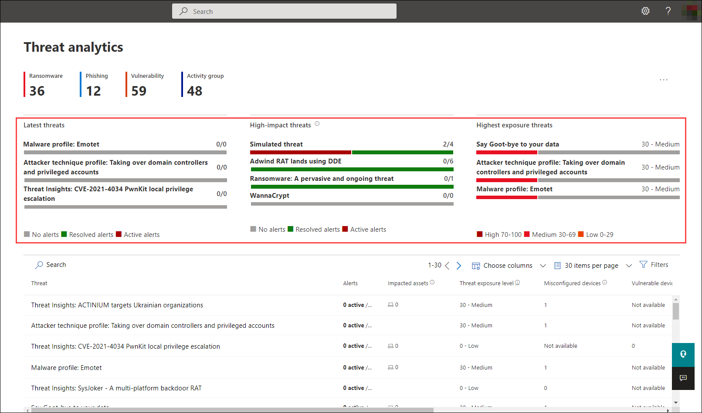
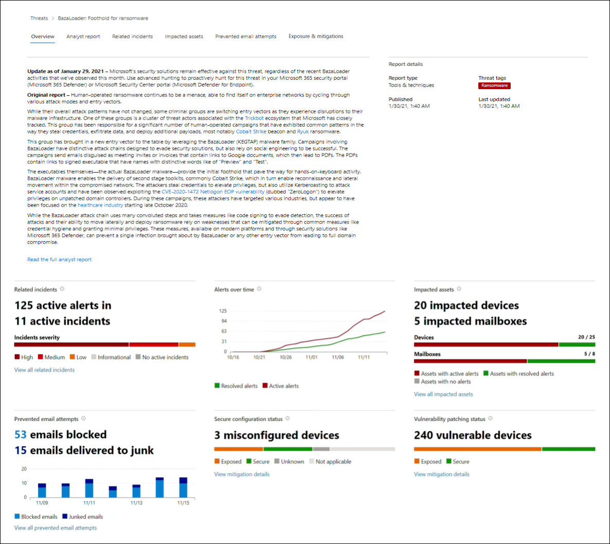
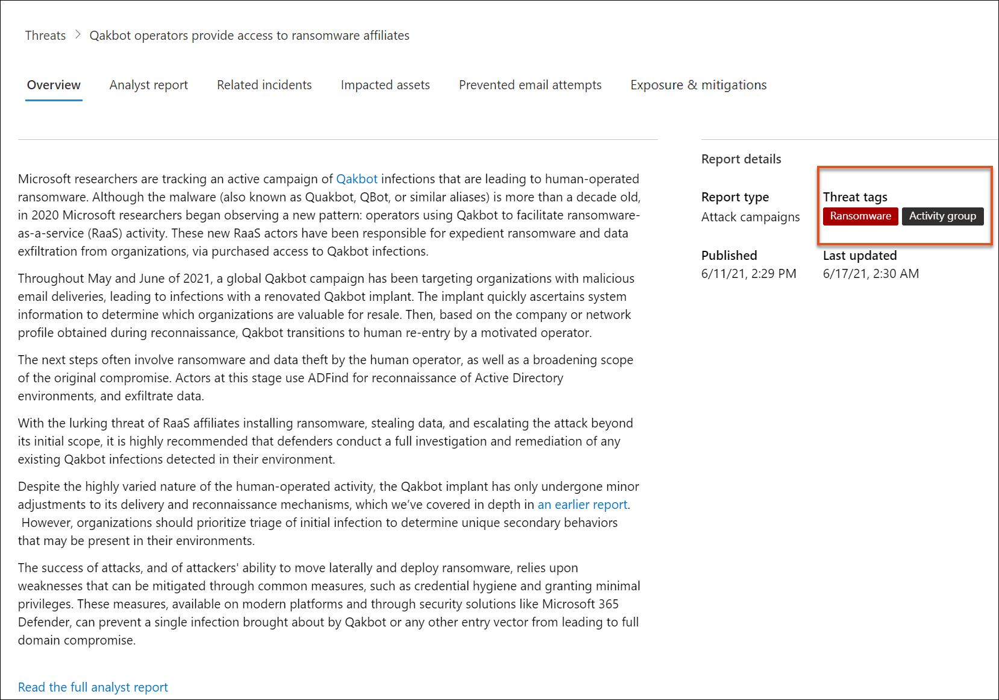
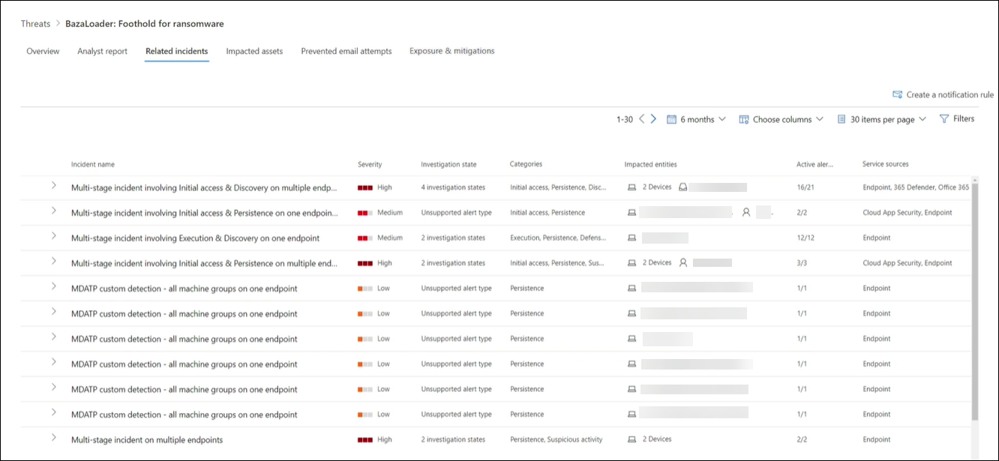
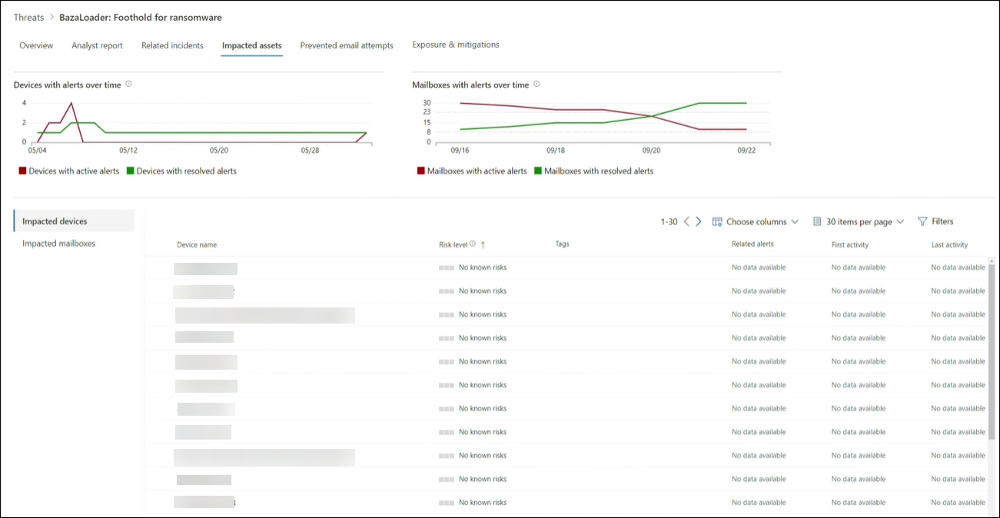
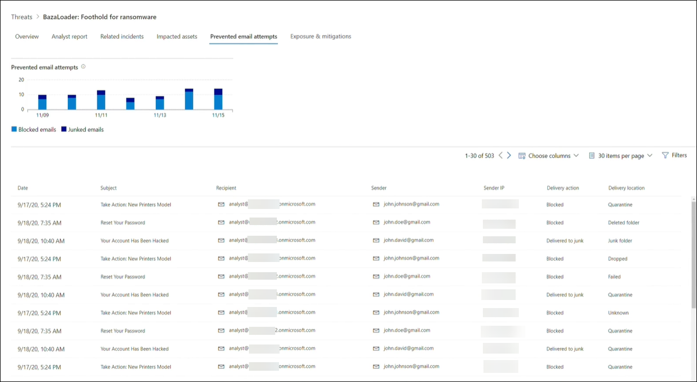
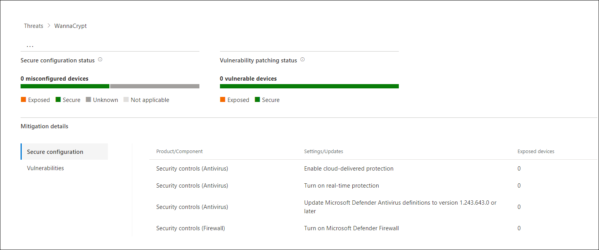
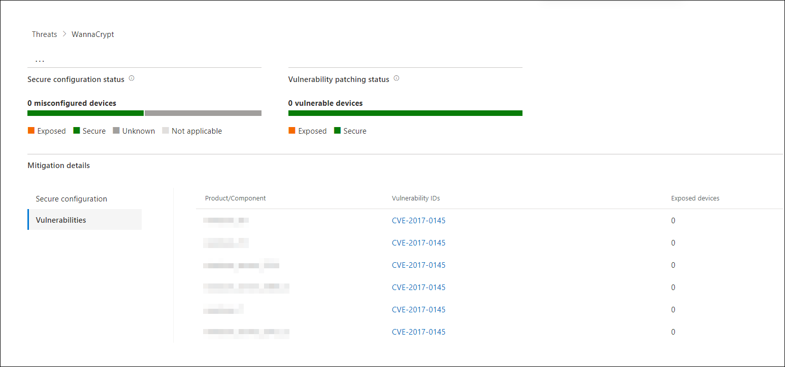

# Track and respond to emerging threats through threat analytics

[!INCLUDE [Microsoft 365 Defender rebranding](../../includes/microsoft-defender.md)]

**Applies to:**
- [Microsoft Defender for Endpoint Plan 2](https://go.microsoft.com/fwlink/?linkid=2154037)
- [Microsoft 365 Defender](https://go.microsoft.com/fwlink/?linkid=2118804)

> Want to experience Microsoft Defender for Endpoint? [Sign up for a free trial.](https://signup.microsoft.com/create-account/signup?products=7f379fee-c4f9-4278-b0a1-e4c8c2fcdf7e&ru=https://aka.ms/MDEp2OpenTrial?ocid=docs-wdatp-exposedapis-abovefoldlink)

With more sophisticated adversaries and new threats emerging frequently and prevalently, it's critical to be able to quickly:

- Assess the impact of new threats
- Review your resilience against or exposure to the threats
- Identify the actions you can take to stop or contain the threats

Threat analytics is a set of reports from expert Microsoft security researchers covering the most relevant threats, including:

- Active threat actors and their campaigns
- Popular and new attack techniques
- Critical vulnerabilities
- Common attack surfaces
- Prevalent malware

Each report provides a detailed analysis of a threat and extensive guidance on how to defend against that threat. It also incorporates data from your network, indicating whether the threat is active and if you have applicable protections in place.

Watch this short video to learn more about how threat analytics can help you track the latest threats and stop them.

> [!VIDEO https://www.microsoft.com/videoplayer/embed/RE4bw1f]

## View the threat analytics dashboard

The threat analytics dashboard is a great jump off point for getting to the reports that are most relevant to your organization. It summarizes the threats in the following sections:

- **Latest threats**: Lists the most recently published threat reports, along with the number of devices with active and resolved alerts.
- **High-impact threats**: Lists the threats that have had the highest impact to the organization. This section ranks threats by the number of devices that have active alerts.
- **Threat summary**: Shows the overall impact of tracked threats by showing the number of threats with active and resolved alerts.

Select a threat from the dashboard to view the report for that threat.

## View the threat analytics dashboard

The threat analytics dashboard ([security.microsoft.com/threatanalytics3](https://security.microsoft.com/threatanalytics3)) highlights the reports that are most relevant to your organization. It summarizes the threats in the following sections:

- **Latest threats**—lists the most recently published or updated threat reports, along with the number of active and resolved alerts.
- **High-impact threats**—lists the threats that have the highest impact to your organization. This section lists threats with the highest number of active and resolved alerts first.
- **Threat summary**—provides the overall impact of all tracked threats by showing the number of threats with active and resolved alerts.

Select a threat from the dashboard to view the report for that threat.

_Threat analytics dashboard. You can also click the Search icon to key in a keyword related to the threat analytics report that you'd like to read._ 

## View a threat analytics report

Each threat analytics report provides information in several sections:

- [**Overview**](#overview-quickly-understand-the-threat-assess-its-impact-and-review-defenses)
- [**Analyst report**](#analyst-report-get-expert-insight-from-microsoft-security-researchers)
- [**Related incidents**](#related-incidents-view-and-manage-related-incidents)
- [**Impacted assets**](#impacted-assets-get-list-of-impacted-devices-and-mailboxes)
- [**Prevented email attempts**](#prevented-email-attempts-view-blocked-or-junked-threat-emails)
- [**Mitigations**](#mitigations-review-list-of-mitigations-and-the-status-of-your-devices)

### Overview: Quickly understand the threat, assess its impact, and review defenses

The **Overview** section provides a preview of the detailed analyst report. It also provides charts that highlight the impact of the threat to your organization and your exposure through misconfigured and unpatched devices.

_Overview section of a threat analytics report_

#### Assess impact on your organization

Each report includes charts designed to provide information about the organizational impact of a threat:

- **Related incidents**—provides an overview of the impact of the tracked threat to your organization with the following data:
  - Number of active alerts and the number of active incidents they are associated with
  - Severity of active incidents
- **Alerts over time**—shows the number of related **Active** and **Resolved** alerts over time. The number of resolved alerts indicates how quickly your organization responds to alerts associated with a threat. Ideally, the chart should be showing alerts resolved within a few days.
- **Impacted assets**—shows the number of distinct devices and email accounts (mailboxes) that currently have at least one active alert associated with the tracked threat. Alerts are triggered for mailboxes that received threat emails. Review both org- and user-level policies for overrides that cause the delivery of threat emails.
- **Prevented email attempts**—shows the number of emails from the past seven days that were either blocked before delivery or delivered to the junk mail folder.

#### Review security resilience and posture

Each report includes charts that provide an overview of how resilient your organization is against a given threat:

- **Secure configuration status**—shows the number of devices with misconfigured security settings. Apply the recommended security settings to help mitigate the threat. Devices are considered **Secure** if they have applied _all_ the tracked settings.
- **Vulnerability patching status**—shows the number of vulnerable devices. Apply security updates or patches to address vulnerabilities exploited by the threat.

#### View reports per threat tags

You can filter the threat report list and view the most relevant reports according to a specific threat tag (category) or a report type.

- **Threat tags**—assist you in viewing the most relevant reports according to a specific threat category. For example, all reports related to ransomware.
- **Report types**—assist you in viewing the most relevant reports according to a specific report type. For example, all reports that cover tools and techniques. 
- **Filters**—assist you in efficiently reviewing the threat report list and filtering the view based on a specific threat tag or report type. For example, review all threat reports related to ransomware category, or threat reports that cover vulnerabilities.

##### How does it work?

The Microsoft Threat Intelligence team has added threat tags to each threat report:

- Four threat tags are now available:
  - Ransomware
  - Phishing
  - Vulnerability
  - Activity group
- Threat tags are presented at the top of the threat analytics page, with counters for the number of available reports under each tag.

  

- The list can also be sorted by threat tags:

  

- Filters are available per threat tag and report type:

  

### Analyst report: Get expert insight from Microsoft security researchers

In the **Analyst report** section, read through the detailed expert write-up. Most reports provide detailed descriptions of attack chains, including tactics and techniques mapped to the MITRE ATT&CK framework, exhaustive lists of recommendations, and powerful [threat hunting](advanced-hunting-overview.md) guidance.

[Learn more about the analyst report](threat-analytics-analyst-reports.md)

### Related incidents: View and manage related incidents

The **Related incidents** tab provides the list of all incidents related to the tracked threat. You can assign incidents or manage alerts linked to each incident. 

_Related incidents section of a threat analytics report_

### Impacted assets: Get list of impacted devices and mailboxes

An asset is considered impacted if it is affected by an active, unresolved alert. The **Impacted assets** tab lists the following types of impacted assets:

- **Impacted devices**—endpoints that have unresolved Microsoft Defender for Endpoint alerts. These alerts typically fire on sightings of known threat indicators and activities.
- **Impacted mailboxes**—mailboxes that have received email messages that have triggered Microsoft Defender for Office 365 alerts. While most messages that trigger alerts are typically blocked, user- or org-level policies can override filters.

_Impacted assets section of a threat analytics report_

### Prevented email attempts: View blocked or junked threat emails

Microsoft Defender for Office 365 typically blocks emails with known threat indicators, including malicious links or attachments. In some cases, proactive filtering mechanisms that check for suspicious content will instead send threat emails to the junk mail folder. In either case, the chances of the threat launching malware code on the device is reduced.

The **Prevented email attempts** tab lists all the emails that have either been blocked before delivery or sent to the junk mail folder by Microsoft Defender for Office 365. 

_Prevented email attempts section of a threat analytics report_

### Mitigations: Review list of mitigations and the status of your devices

In the **Mitigations** section, review the list of specific actionable recommendations that can help you increase your organizational resilience against the threat. The list of tracked mitigations includes:

- **Security updates**—deployment of supported software security updates for vulnerabilities found on onboarded devices.
- **Supported security configurations**
  - Cloud-delivered protection  
  - Potentially unwanted application (PUA) protection
  - Real-time protection

Mitigation information in this section incorporates data from [threat and vulnerability management](/windows/security/threat-protection/microsoft-defender-atp/next-gen-threat-and-vuln-mgt), which also provides detailed drill-down information from various links in the report.

_Mitigations section of a threat analytics report_

## Additional report details and limitations

> [!NOTE]
> As part of the unified security experience, threat analytics is now available not just for Microsoft Defender for Endpoint, but also for Microsoft Defender for Office E5 license holders.
>
> If you are not using the Microsoft 365 security portal (Microsoft 365 Defender), you can also see the report details (without the Microsoft Defender for Office data) in the Microsoft Defender Security Center portal (Microsoft Defender for Endpoint).

To access threat analytics report you need certain roles and permissions. See [Custom roles in role-based access control for Microsoft 365 Defender](custom-roles.md) for details.

- To view alerts, incidents, or impacted assets data, you need to have permissions to Microsoft Defender for Office or Microsoft Defender for Endpoint alerts data, or both.
- To view prevented email attempts, you need to have permissions to Microsoft Defender for Office hunting data. 
- To view mitigations, you need to have permissions to threat and vulnerability management data in Microsoft Defender for Endpoint.

When looking at the threat analytics data, remember the following factors:

- Charts reflect only mitigations that are tracked. Check the report overview for additional mitigations that are not shown in the charts.
- Mitigations don't guarantee complete resilience. The provided mitigations reflect the best possible actions needed to improve resiliency.
- Devices are counted as "unavailable" if they have not transmitted data to the service.
- Antivirus-related statistics are based on Microsoft Defender Antivirus settings. Devices with third-party antivirus solutions can appear as "exposed".

## Related topics

- [Proactively find threats with advanced hunting](advanced-hunting-overview.md)
- [Understand the analyst report section](threat-analytics-analyst-reports.md)
- [Assess and resolve security weaknesses and exposures](next-gen-threat-and-vuln-mgt.md)
