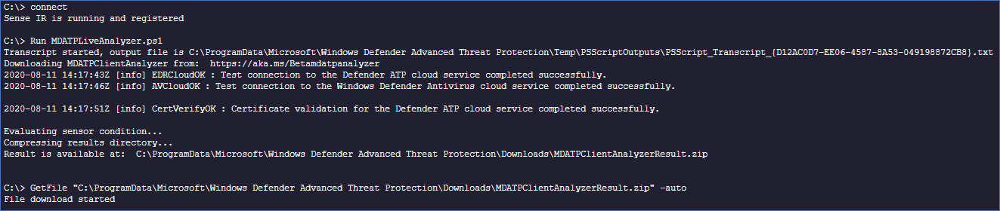

# Collect support logs in Microsoft Defender for Endpoint using live response


**Applies to:**
- [Microsoft Defender for Endpoint Plan 2](https://go.microsoft.com/fwlink/?linkid=2154037)
- [Microsoft 365 Defender](https://go.microsoft.com/fwlink/?linkid=2118804)

> Want to experience Defender for Endpoint? [Sign up for a free trial.](https://signup.microsoft.com/create-account/signup?products=7f379fee-c4f9-4278-b0a1-e4c8c2fcdf7e&ru=https://aka.ms/MDEp2OpenTrial?ocid=docs-wdatp-pullalerts-abovefoldlink)


When contacting support, you may be asked to provide the output package of the Microsoft Defender for Endpoint Client Analyzer tool.

This topic provides instructions on how to run the tool via Live Response.

1. Download and fetch the required scripts available from within the 'Tools' sub-directory of the [Microsoft Defender for Endpoint Client Analyzer](https://aka.ms/BetaMDEAnalyzer). <br>
For example, to get the basic sensor and device health logs, fetch "..\Tools\MDELiveAnalyzer.ps1".<br>
If you also require Defender Antivirus support logs (MpSupportFiles.cab), then fetch "..\Tools\MDELiveAnalyzerAV.ps1" 

2. Initiate a [Live Response session](live-response.md#initiate-a-live-response-session-on-a-device) on the machine you need to investigate.

3. Select **Upload file to library**.

   :::image type="content" source="images/upload-file.png" alt-text="The upload file" lightbox="images/upload-file.png":::

4. Select **Choose file**.

   :::image type="content" source="images/choose-file.png" alt-text="The choose file button-1" lightbox="images/choose-file.png":::

5. Select the downloaded file named MDELiveAnalyzer.ps1 and then click on **Confirm**

   :::image type="content" source="images/analyzer-file.png" alt-text="The choose file button-2" lightbox="images/analyzer-file.png":::

6. While still in the LiveResponse session, use the commands below to run the analyzer and collect the result file:

    ```console
    Run MDELiveAnalyzer.ps1
    GetFile "C:\ProgramData\Microsoft\Windows Defender Advanced Threat Protection\Downloads\MDEClientAnalyzerResult.zip"
    ```

    [](images/analyzer-commands.png#lightbox)

> [!NOTE]
>
> - The latest preview version of MDEClientAnalyzer can be downloaded here: [https://aka.ms/Betamdeanalyzer](https://aka.ms/Betamdeanalyzer).
>
> - The LiveAnalyzer script downloads the troubleshooting package on the destination machine from: https://mdatpclientanalyzer.blob.core.windows.net.
>
>   If you cannot allow the machine to reach the above URL, then upload MDEClientAnalyzerPreview.zip file to the library before running the LiveAnalyzer script:
>
>   ```console
>   PutFile MDEClientAnalyzerPreview.zip -overwrite
>   Run MDELiveAnalyzer.ps1
>   GetFile "C:\ProgramData\Microsoft\Windows Defender Advanced Threat Protection\Downloads\MDEClientAnalyzerResult.zip"
>   ```
>
> - For more information on gathering data locally on a machine in case the machine isn't communicating with Microsoft Defender for Endpoint cloud services, or does not appear in Microsoft Defender for Endpoint portal as expected, see [Verify client connectivity to Microsoft Defender for Endpoint service URLs](configure-proxy-internet.md#verify-client-connectivity-to-microsoft-defender-for-endpoint-service-urls).
> 
> - As described in [Live response command examples](live-response-command-examples.md), you may want to use the '&' symbol at the end of the command to collect logs as a background action:
>   ```console
>   Run MDELiveAnalyzer.ps1&
>   ```


## See also
- [Client analyzer overview](overview-client-analyzer.md)
- [Download and run the client analyzer](download-client-analyzer.md)
- [Run the client analyzer on Windows](run-analyzer-windows.md)
- [Run the client analyzer on macOS or Linux](run-analyzer-macos-linux.md)
- [Data collection for advanced troubleshooting on Windows](data-collection-analyzer.md)
- [Understand the analyzer HTML report](analyzer-report.md)
[!INCLUDE [Microsoft Defender for Endpoint Tech Community](../../includes/defender-mde-techcommunity.md)]
