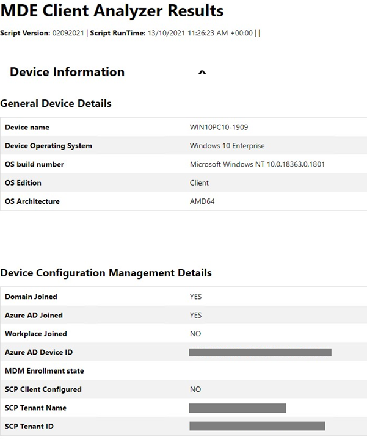

# Troubleshoot onboarding issues related to Security Management for Microsoft Defender for Endpoint 

[!INCLUDE [Microsoft 365 Defender rebranding](../../includes/microsoft-defender.md)]


**Applies to:**

- [Manage Microsoft Defender for Endpoint on devices with Microsoft Endpoint Manager](/mem/intune/protect/mde-security-integration)
- [Microsoft Defender for Endpoint](https://go.microsoft.com/fwlink/?linkid=2154037)
- [Microsoft 365 Defender](https://go.microsoft.com/fwlink/?linkid=2118804)

Security Management for Microsoft Defender for Endpoint is a capability for devices that aren’t managed by a Microsoft Endpoint Manager, either Microsoft Intune or Microsoft Endpoint Configuration Manager, to receive security configurations for Microsoft Defender directly from Endpoint Manager.
For more information on Security Management for Microsoft Defender for Endpoint, see [Manage Microsoft Defender for Endpoint on devices with Microsoft Endpoint Manager](/mem/intune/protect/mde-security-integration).

For Security Management for Microsoft Defender for Endpoint onboarding instructions, see [Microsoft Defender for Endpoint Security Configuration Management](security-config-management.md)

This end-to-end onboarding is designed to be frictionless and doesn't require user input. However, if you encounter issues during onboarding, you can view and troubleshoot errors within the Microsoft Defender for Endpoint platform.


>[!NOTE]
> If you are having issues with the onboarding flow for new devices, review the [Microsoft Defender for Endpoint prerequisites](/mem/intune/protect/mde-security-integration#prerequisites) and make sure the onboarding instructions are followed.


## Registering domain joined computers with Azure Active Directory  
To successfully register devices to Azure Active Directory, you'll need to ensure the following: 

- Computers can authenticate with the domain controller 
- Computers have access to the following Microsoft resources from inside your organization's network:
  - https://enterpriseregistration.windows.net
  - https://login.microsoftonline.com
  - https://device.login.microsoftonline.com
- Azure AD connect is configured to sync the computer objects. By default, computer OUs are in Azure AD connect sync scope. If the computer objects belong to specific organizational units (OUs), configure the OUs to sync in Azure AD Connect. To learn more about how to sync computer objects by using Azure AD Connect, see [Organizational unit–based filtering](/azure/active-directory/hybrid/how-to-connect-sync-configure-filtering#organizational-unitbased-filtering).

>[!IMPORTANT]
>Azure AD connect does not sync Windows Server 2012 R2 computer objects. If you need to register them with Azure AD for Security Management for Microsoft Defender for Endpoint, then you'll need to customize Azure AD connect sync rule to include those computer objects in sync scope. See [Instructions for applying Computer Join rule in Azure Active Directory Connect]().

>[!NOTE]
>To successfully complete the onboarding flow, and independent of a device's Operating System, the Azure Active Directory state of a device can change, based on the devices' initial state:<br>
>
>|      Starting Device    State     |      New Device State     |
>|---|---|
>|     Already AADJ or HAADJ    |     Remains as is    |
>|     Not AADJ or Hybrid Azure Active Directory Join (HAADJ) + Domain joined    |     Device is HAADJ'd    |
>|     Not AADJ or HAADJ + Not domain joined    |     Device is AADJ’d    |
>
>Where AADJ represents Azure Active Directory Joined and HAADJ represents Hybrid Azure Active Directory Joined.


## Troubleshoot errors from the Microsoft Defender for Endpoint portal

Through the Microsoft Defender for Endpoint portal, security administrators can now troubleshoot Security Management for Microsoft Defender for Endpoint onboarding. 

In **Endpoints > Configuration & Baselines > Configuration management**, the Device security management widget includes a snapshot of key onboarding status per management channel. 

The widget's bar chart includes a breakdown per OS, and by scrolling over the "MDE-Error" field you'll see the number of machines that failed onboarding.


To see a list of all devices that have failed the onboarding process, select **MDE-Error**. In the list, select a specific device to see troubleshooting details in the side panel, pointing to the root cause of the error, and corresponding documentation.


## Run Microsoft Defender for Endpoint Client Analyzer on Windows 

Consider running the Client Analyzer on endpoints that are failing to complete the Security Management for Microsoft Defender for Endpoint onboarding flow. For more information about the client analyzer, see [Troubleshoot sensor health using Microsoft Defender for Endpoint Client Analyzer](overview-client-analyzer.md).

The Client Analyzer output file (MDE Client Analyzer Results.htm) can provide key troubleshooting information:

- Verify that the device OS is in scope for Security Management for Microsoft Defender for Endpoint onboarding flow in **General Device Details** section
- Verify that the device has successfully registered to Azure Active Directory in **Device Configuration Management Details**


    


In the **Detailed Results** section of the report, the Client Analyzer also provides actionable guidance.

>[!TIP]
>Make sure the Detailed Results section of the report does not include any "Errors", and make sure to review all "Warning" messages.

For example, as part of the Security Management onboarding flow, it is required for the Azure Active Directory Tenant ID in your Microsoft Defender for Endpoint Tenant to match the SCP Tenant ID that appears in the reports' **Device Configuration Management Details** section. If relevant, the report output will recommend to perform this verification.


## General troubleshooting 

If you weren't able to identify the onboarded device in AAD or MEM, and did not receive an error during the enrollment, checking the registry key `Computer\\HKEY\_LOCAL\_MACHINE\\SOFTWARE\\Microsoft\\SenseCM\\EnrollmentStatus` can provide additional troubleshooting information.  


The following table lists errors and directions on what to try/check in order to address the error. Note that the list of errors is not complete and is based on typical/common errors encountered by customers in the past: 


| **Error Code**  |**Administrator Actions**                                                                                                                                                                                                                                                                                                  |
|-----------------|----------------------------------------------------------------------------------------------------------------------------------------------------------------------------------------------------------------------------------------------------------------------------------------------------------------------------|
| ``10``          |The error indicates that OS failed to perform hybrid join. Use [Troubleshoot hybrid Azure Active Directory-joined devices](/azure/active-directory/devices/troubleshoot-hybrid-join-windows-current) as guide for troubleshooting OS-level hybrid join failures.                                                            |
| ``13-14``       |Review the [Onboard Windows devices in Microsoft Endpoint Manager through Microsoft Defender for Endpoint pre-requisites](/microsoft-365/security/defender-endpoint/security-config-management#onboard-devices) to ensure the endpoints to complete and Hybrid Azure Active Directory Join are available.                   |
| ``15``          |Make sure the AAD Tenant ID from your MDE Tenant matches the tenant ID in the SCP Entry of your domain.                                                                                                                                                                                                                     |
| ``16``          |Review the [Azure Active Directory documentation](/azure/active-directory/devices/hybrid-azuread-join-manual#configure-a-service-connection-point). Engage with the organization’s identity team to deploy the configuration method required for HAADJ.                                                                     |
| ``17``          |Review the Device Registration configuration of your Active Directory environment and determine if it is using Enterprise DRS or Azure DRS.                                                                                                                                                                                 |
| ``18``          |Review the Azure AD Connect Configuration and ensure the devices being configured for management are within the scope of sync.                                                                                                                                                                                              |
| ``25``          |Review network topology and ensure a domain controller is available to complete hybrid join requests.                                                                                                                                                                                                                       |
| ``26-32``       |Review the documentation for required claims to complete federated join. Manually validate the endpoints for your environment are available.                                                                                                                                                                                |
| ``36``          |Review network topology and ensure LDAP API is available to complete hybrid join requests.                                                                                                                                                                                                                                  |
| ``37``          |For domain joined computer verify that the computer is in scope for synchronization in Azure AD Connect.                                                                                                                                                                                                                    |
| ``38``          |Invalid DNS settings on the workstation's side: Active directory requires you to use domain DNS to work properly (and not router's address).                                                                                                                                                                                |
| ``40``          |Make sure clock is correctly set/synced on the device where the errors occurs. 																													       |
| ``41``          |Retry to confirm this error is consistent. If retries do not help, use [Troubleshoot hybrid Azure Active Directory-joined devices](/azure/active-directory/devices/troubleshoot-hybrid-join-windows-current) as guide for troubleshooting OS-level hybrid join failures.                                                    |
| ``42``          |The error indicates that OS failed to perform hybrid join. Use [Troubleshoot hybrid Azure Active Directory-joined devices](/azure/active-directory/devices/troubleshoot-hybrid-join-windows-current) as guide for troubleshooting OS-level hybrid join failures.                                                            |


## Azure Active Directory Runtime troubleshooting 

### Azure Active Directory Runtime  

The main mechanism to troubleshoot Azure Active Directory Runtime (AADRT) is to collect debug traces. Azure Active Directory Runtime on Windows uses **ETW provider with ID bd67e65c-9cc2-51d8-7399-0bb9899e75c1**. ETW traces need to be captured with the reproduction of the failure (for example if join failure occurs, the traces need to be enabled for the duration of time covering calls to AADRT APIs to perform join).  

See below for a typical error in AADRT log and how to read it: 


From the information in the message, it's possible in most cases to understand what error was encountered, what Win32 API returned the error (if applicable), what URL (if applicable) was used and what AAD Runtime API error was encountered. 
  
 

## Instructions for applying Computer Join rule in AAD Connect 

For Security Management for Microsoft Defender for Endpoint on Windows Server 2012 R2 domain joined computers, an update to Azure AD Connect sync rule "In from AD-Computer Join" is needed. This can be achieved by cloning and modifying the rule, which will disable the original "In from AD - Computer Join" rule. Azure AD Connect by default offers this experience for making changes to built-in rules.

>[!NOTE]
>These changes need to be applied on the server where AAD Connect is running. If you have multiple instances of AAD Connect deployed, these changes must be applied to all instances.* 

1. Open the Synchronization Rules Editor application from the start menu. In the rule list, locate the rule named **In from AD – Computer Join**. **Take note of the value in the 'Precedence' column for this rule.** 

    

2. With the **In from AD – Computer Join** rule highlighted, select **Edit**. In the **Edit Reserved Rule Confirmation** dialog box, select **Yes**. 

   

3. The **Edit inbound synchronization rule** window will be shown. Update the rule description to note that Windows Server 2012R2 will be synchronized using this rule. Leave all other options unchanged except for the Precedence value. Enter a value for Precedence that is higher than the value from the original rule (as seen in the rule list).  

   

4.  Select **Next** three times. This will navigate to the 'Transformations' section of the rule. Do not make any changes to the 'Scoping filter' and 'Join rules' sections of the rule. The 'Transformations' section should now be shown. 

    

5. Scroll to the bottom of the list of transformations. Find the transformation for the **cloudFiltered** attribute. In the textbox in the **Source** column, select all of the text (Control-A) and delete it. The textbox should now be empty. 

6. Paste the content for the new rule into the textbox. 


```command
IIF(
  IsNullOrEmpty([userCertificate])
  || 
  (
    (InStr(UCase([operatingSystem]),"WINDOWS") > 0)
    && 
    (Left([operatingSystemVersion],2) = "6.")
    &&
    (Left([operatingSystemVersion],3) <> "6.3")
  )
  ||
  (
    (Left([operatingSystemVersion],3) = "6.3") 
    &&
    (InStr(UCase([operatingSystem]),"WINDOWS") > 0)
    &&
    With(
      $validCerts,
      Where(
        $c, 
        [userCertificate], 
        IsCert($c) && CertNotAfter($c) > Now() && RegexIsMatch(CertSubject($c), "CN=[{]*" & String-FromGuid([objectGUID]) & "[}]*", "IgnoreCase")),
      Count($validCerts) = 0)
  ),
  True,
  NULL
)

```

7.  Select **Save** to save the new rule.

## Related topic
- [Manage Microsoft Defender for Endpoint on devices with Microsoft Endpoint Manager](/mem/intune/protect/mde-security-integration)
