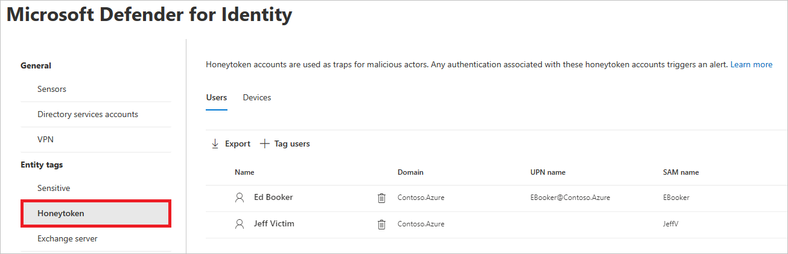

# Defender for Identity entity tags in Microsoft 365 Defender

**Applies to:**

- Microsoft 365 Defender
- Defender for Identity

This article explains how to apply [Microsoft Defender for Identity](/defender-for-identity) entity tags in [Microsoft 365 Defender](/microsoft-365/security/defender/overview-security-center).

> [!IMPORTANT]
> As part of the convergence with Microsoft 365 Defender, some options and details have changed from their location in the Defender for Identity portal. Please read the details below to discover where to find both the familiar and new features.

## Entity tags

In Microsoft 365 Defender, you can set three types of Defender for Identity entity tags: **Sensitive tags**, **Honeytoken tags**, and **Exchange server tags**.

To set these tags, in <a href="https://go.microsoft.com/fwlink/p/?linkid=2077139" target="_blank">Microsoft 365 Defender</a>, go to **Settings** and then **Identities**.

:::image type="content" source="../../media/defender-identity/settings-identities.png" alt-text="The Identities option under the Name column in the Settings page" lightbox="../../media/defender-identity/settings-identities.png":::

The tag settings will appear under **Entity tags**.

:::image type="content" source="../../media/defender-identity/tag-settings.png" alt-text="The Entity tags pane" lightbox="../../media/defender-identity/tag-settings.png":::

To set each type of tag, follow the instructions below.

## Sensitive  tags

The **Sensitive tag** is used to identify high value assets. The lateral movement path also relies on an entity's sensitivity status. Some entities are considered sensitive automatically by Defender for Identity. For a list of those assets, see [Sensitive entities](/defender-for-identity/manage-sensitive-honeytoken-accounts#sensitive-entities).

You can also manually tag users, devices, or groups as sensitive.

1. Select **Sensitive**. You will then see the existing sensitive **Users**, **Devices**, and **Groups**.

   :::image type="content" source="../../media/defender-identity/sensitive-entities.png" alt-text="The Devices tab in the Sensitive entities menu item" lightbox="../../media/defender-identity/sensitive-entities.png":::

1. Under each category, select **Tag...** to tag that type of entity. For example, under **Groups**, select **Tag groups.** A pane will open with the groups you can select to tag. To search for a group, enter its name in the search box.

   :::image type="content" source="../../media/defender-identity/add-groups.png" alt-text="The option to add a group" lightbox="../../media/defender-identity/add-groups.png":::

1. Select your group, and click **Add selection.**

   :::image type="content" source="../../media/defender-identity/add-selection.png" alt-text="The Add selection option" lightbox="../../media/defender-identity/add-selection.png":::

## Honeytoken tags

Honeytoken entities are used as traps for malicious actors. Any authentication associated with these honeytoken entities triggers an alert.

You can tag users or devices with the **Honeytoken** tag in the same way you tag sensitive accounts.

1. Select **Honeytoken**. You'll then see the existing honeytoken **Users** and **Devices**.

    

1. Under each category, select **Tag...** to tag that type of entity. For example, under **Users**, select **Tag users.** A pane will open with the groups you can select to tag. To search for a group, enter its name in the search box.

   :::image type="content" source="../../media/defender-identity/add-users.png" alt-text="The option to add users" lightbox="../../media/defender-identity/add-users.png":::

1. Select your user, and click **Add selection.**

   :::image type="content" source="../../media/defender-identity/add-selected-user.png" alt-text="The option to add a selected user" lightbox="../../media/defender-identity/add-selected-user.png":::

## Exchange server tags

Defender for Identity considers Exchange servers as high-value assets and automatically tags them as **Sensitive**. You can also manually tag devices as Exchange servers.

1. Select **Exchange server**. You'll then see the existing devices labeled with the **Exchange server** tag.

   :::image type="content" source="../../media/defender-identity/exchange-servers.png" alt-text="The Exchange server menu item" lightbox="../../media/defender-identity/exchange-servers.png":::

1. To tag a device as an Exchange server, select **Tag devices**.  A pane will open with the devices that you can select to tag. To search for a device, enter its name in the search box.

   :::image type="content" source="../../media/defender-identity/add-devices.png" alt-text="The option to add a device" lightbox="../../media/defender-identity/add-devices.png":::

1. Select your device, and click **Add selection.**

   :::image type="content" source="../../media/defender-identity/select-device.png" alt-text="The selection of a device" lightbox="../../media/defender-identity/select-device.png":::

## See also

- [Manage Defender for Identity security alerts](manage-security-alerts.md)
