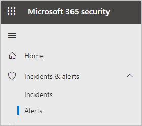
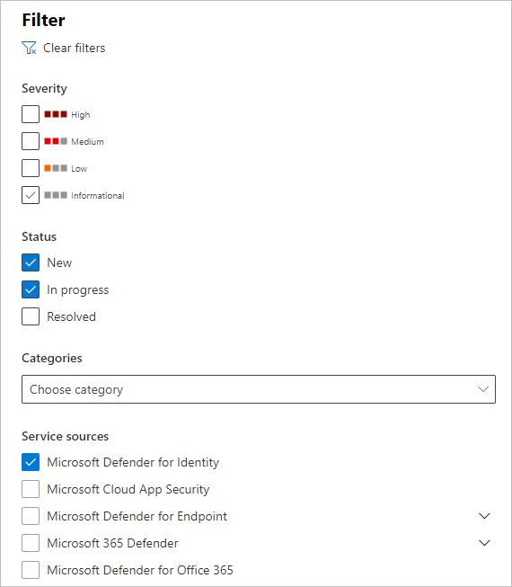
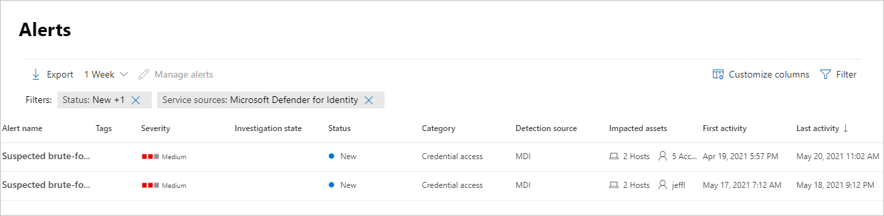
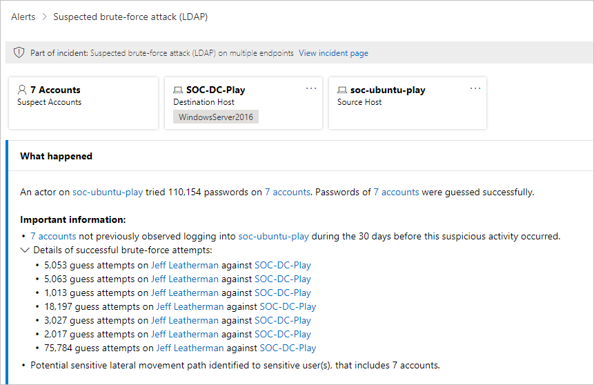

# Defender for Identity security alerts in Microsoft 365 Defender

**Applies to:**

- Microsoft 365 Defender
- Defender for Identity

This article explains the basics of how to work with [Microsoft Defender for Identity](/defender-for-identity) security alerts in the [Microsoft 365 Defender](/microsoft-365/security/defender/microsoft-365-defender) portal.

Defender for Identity alerts are natively integrated into the [Microsoft 365 security center](https://security.microsoft.com) with a dedicated Identity alert page format. This marks the first step in the journey to [introduce the full Microsoft Defender for Identity experience into the unified Microsoft 365 Defender portal](/defender-for-identity/defender-for-identity-in-microsoft-365-defender).

The new Identity alert page gives Microsoft Defender for Identity customers better cross-domain signal enrichment and new automated identity response capabilities. It ensures that you stay secure and helps improve the efficiency of your security operations.

One of the benefits of investigating alerts through the [Microsoft 365 security center](/microsoft-365/security/defender/overview-security-center) is that Microsoft Defender for Identity alerts are further correlated with information obtained from each of the other products in the suite. These enhanced alerts are consistent with the other Microsoft 365 Defender alert formats originating from [Microsoft Defender for Office 365](/microsoft-365/security/office-365-security) and [Microsoft Defender for Endpoint](/microsoft-365/security/defender-endpoint). The new page effectively eliminates the need to navigate to another product portal to investigate alerts associated with identity.

Alerts originating from Defender for Identity can now trigger the [Microsoft 365 Defender automated investigation and response (AIR)](/microsoft-365/security/defender/m365d-autoir) capabilities, including automatically remediating alerts and the mitigation of tools and processes that can contribute to the suspicious activity.

>[!IMPORTANT]
>As part of the convergence with Microsoft 365 Defender, some options and details have changed from their location in the Defender for Identity portal. Please read the details below to discover where to find both the familiar and new features.

## Review security alerts

To access the Defender for Identity alerts in the Microsoft 365 Defender portal, go to **Incidents & alerts** and then to **Alerts**.

To see alerts from Defender for Identity, on the top-right select **Filter**, and then under **Service sources** select **Microsoft Defender for Identity**, and select **Apply**:

The alerts displayed can be sorted by the following columns: **Alert name**, **Tags**, **Severity**, **Investigation state**, **Status**, **Category**, **Detection source**, **Impacted assets**, **First activity**, and **Last activity**.

## Manage alerts

If you select one of the alerts, you'll go to the page with details about the alert. In the left pane, you'll see a summary of **What happened**:

Above the **What happened** box are buttons for the **Accounts**, **Destination Host** and **Source Host** of the alert. Select any of them to get more details about the accounts or hosts involved.

On the right pane, you'll see the **Alert details**. Here you can see more details and perform several tasks:

- **Classify this alert** - Here you can designate this alert as a **True alert** or **False alert**

    

- **Alert state** - In **Set Classification**, you can classify the alert as **True** or **False**. In **Assigned to**, you can assign the alert to yourself or unassign it.

    

- **Alert details** - Under **Alert details**, you can find more information about the specific alert, follow a link to documentation about the type of alert, see which incident the alert is associated with, review any automated investigations linked to this alert type, and see the impacted devices and users.

    

- **Comments & history** - Here you can add your comments to the alert, and see the history of all actions associated with the alert.

    

- **Manage alert** - If you select **Manage alert**, you'll go to a pane that will allow you to edit the:
  - **Status** - You can choose **New**, **Resolved** or **In progress**.
  - **Classification** - You can choose **True alert** or **False alert**.
  - **Comment** - You can add a comment about the alert.

    If you select the three dots next to **Manage alert**, you can **Consult a threat expert**, **Export** the alert to an Excel file, or **Link to another incident**.

    

    >[!NOTE]
    >In the Excel file, you now have two links available: **View in Microsoft Defender for Identity** and **View in Microsoft 365 Defender**. Each link will bring you to the relevant portal, and provide information about the alert there.

## See also

- [Investigate alerts in Microsoft 365 Defender](../defender/investigate-alerts.md)
