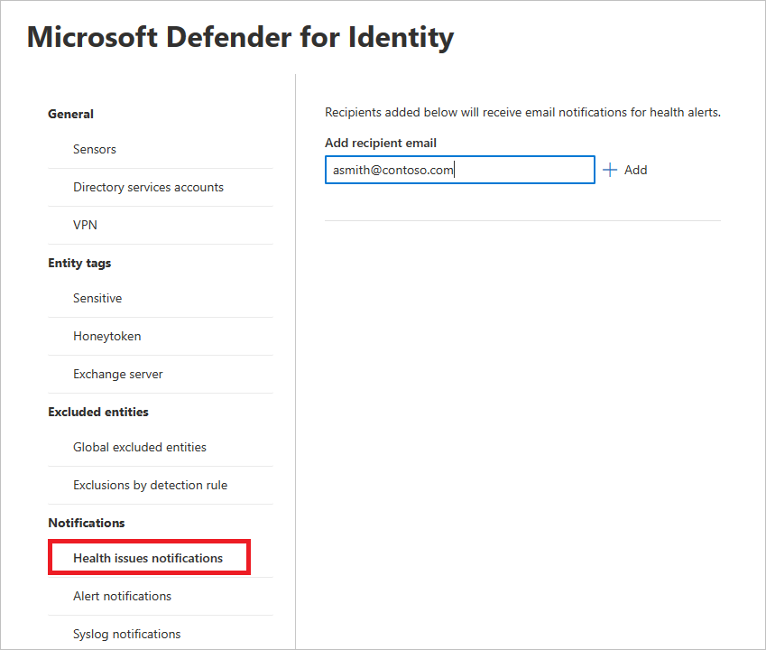
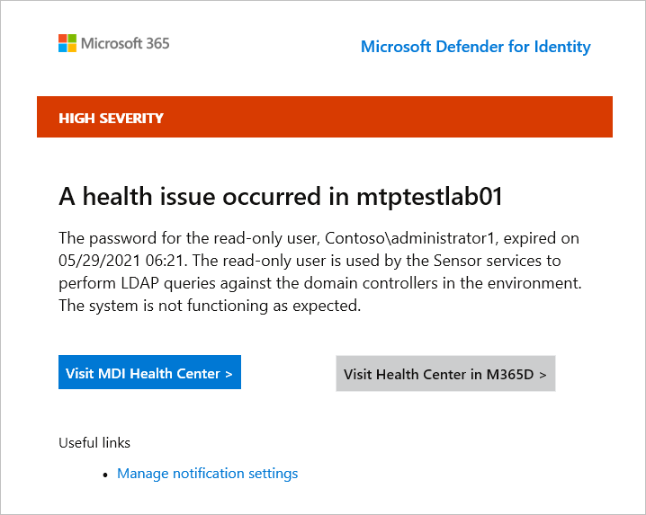
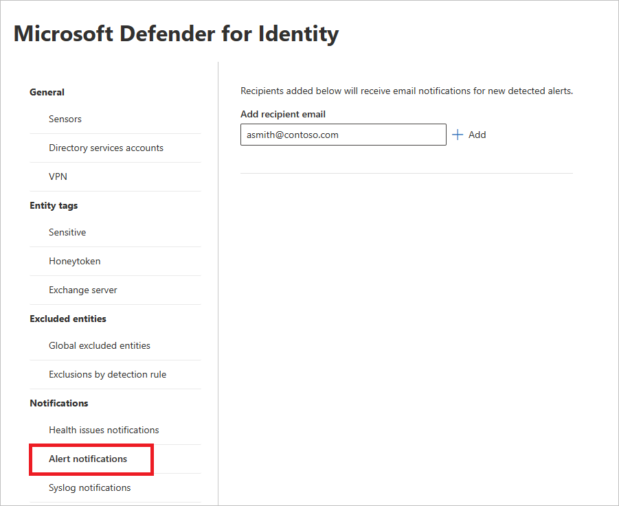
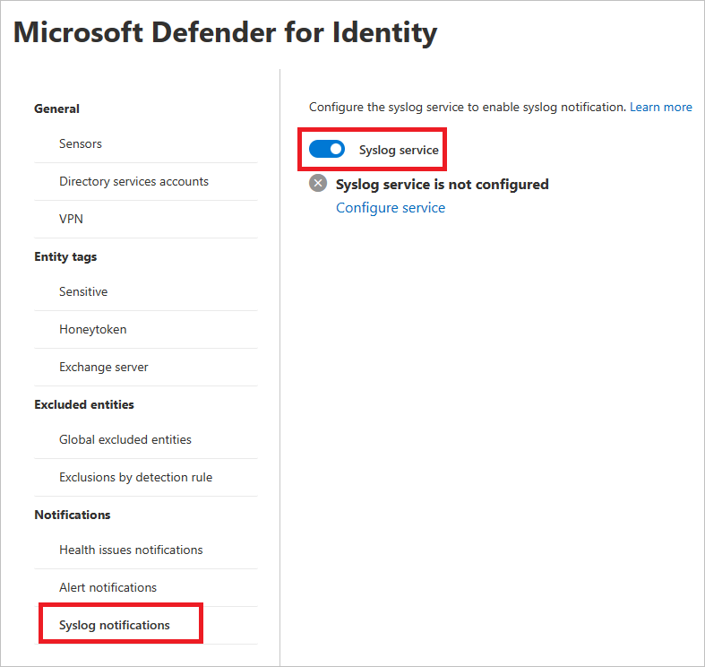
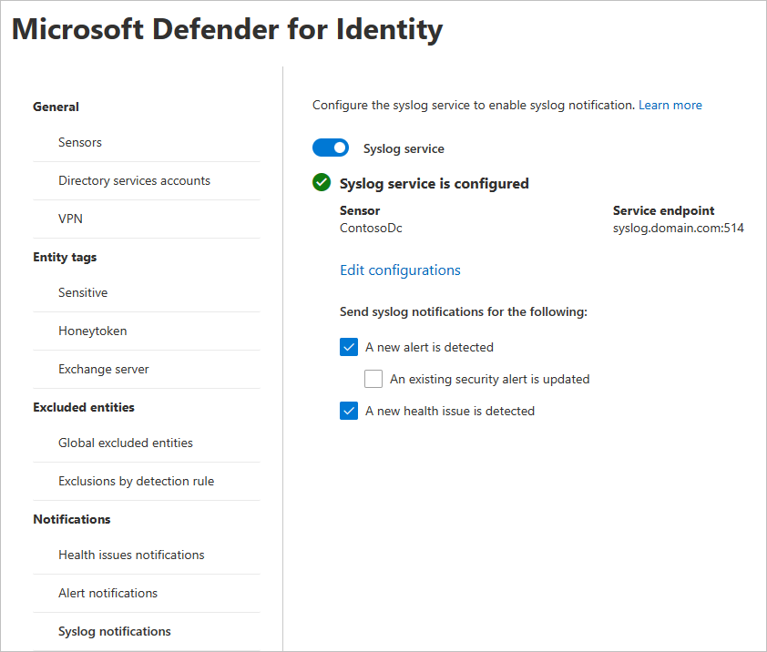

# Defender for Identity notifications in Microsoft 365 Defender

**Applies to:**

- Microsoft 365 Defender
- Defender for Identity

This article explains how to work with [Microsoft Defender for Identity](/defender-for-identity) notifications in the [Microsoft 365 security center](/microsoft-365/security/defender/overview-security-center).

>[!IMPORTANT]
>As part of the convergence with Microsoft 365 Defender, some options and details have changed from their location in the Defender for Identity portal. Please read the details below to discover where to find both the familiar and new features.

## Health issues notifications

In the Microsoft 365 security center, you can add recipients for email notifications of health issues in Defender for Identity.

1. In the [Microsoft 365 security center](https://security.microsoft.com/), go to **Settings** and then **Identities**.

    

1. Select **Health issues notifications**.

1. Enter the recipient's email address. Select **Add**.

    

1. When Defender for Identity detects a health issue, the recipients will receive an email notification with the details.

    

    >[!NOTE]
    >The email provides two links for further details about the issue. You can either go to the **MDI Health Center** or the new **Health Center in M365D**.

## Alert notifications

In the Microsoft 365 security center, you can add recipients for email notifications of detected alerts.

1. In the [Microsoft 365 security center](https://security.microsoft.com/), go to **Settings** and then **Identities**.

    

1. Select **Alert notifications**.

1. Enter the recipient's email address. Select **Add**.

    

## Syslog notifications

Defender for Identity can notify you when it detects suspicious activities by sending security and health alerts to your Syslog server through a nominated sensor.

1. In the [Microsoft 365 security center](https://security.microsoft.com/), go to **Settings** and then **Identities**.

    

1. Select **Syslog notifications**.

1. To enable syslog notification, set the **Syslog service** toggle to the **on** position.

    

1. Select **Configure service**. A pane will open where you can enter the details for the syslog service.

    

1. Enter the following details:

    - **Sensor** - From the drop-down list, choose the sensor that will send the alerts.
    - **Service endpoint** and **Port** - Enter the IP address or fully qualified domain name (​FQDN) for the syslog server and specify the port number.
    - **Transport** - Select the **Transport** protocol (TCP or UDP).
    - **Format** - Select the format (RFC 3164 or RFC 5424).

1. Select **Send test SIEM notification** and then verify the message is received in your Syslog infrastructure solution.

1. Select **Save**.

1. Once you've configured the **Syslog service**, you can choose which types of notifications (alerts or health issues) to send to your Syslog server.

    

## See also

- [Manage Defender for Identity security alerts](manage-security-alerts.md)
