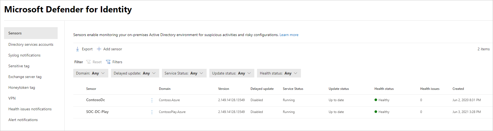
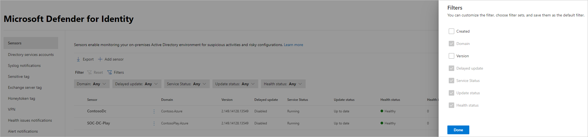
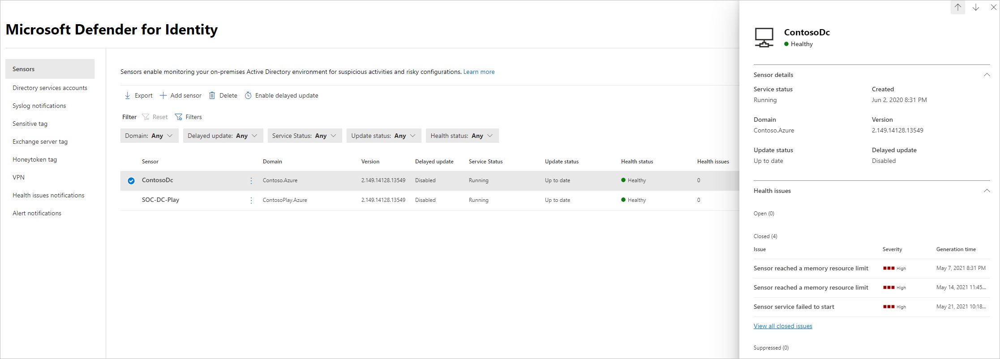

# Microsoft Defender for Identity sensor health and settings in Microsoft 365 Defender

**Applies to:**

- Microsoft 365 Defender
- Defender for Identity

This article explains how to configure and monitor [Microsoft Defender for Identity](/defender-for-identity) sensors in [Microsoft 365 Defender](/microsoft-365/security/defender/overview-security-center).

> [!IMPORTANT]
> As part of the convergence with Microsoft 365 Defender, some options and details have changed from their location in the Defender for Identity portal. Please read the details below to discover where to find both the familiar and new features.

## View Defender for Identity sensor settings and status

1. In <a href="https://go.microsoft.com/fwlink/p/?linkid=2077139" target="_blank">Microsoft 365 Defender</a>, go to **Settings** and then **Identities**.

   :::image type="content" source="../../media/defender-identity/settings-identities.png" alt-text="The option of Identities on the Settings page" lightbox="../../media/defender-identity/settings-identities.png":::

1. Select the **Sensors** page, which displays all of your Defender for Identity sensors. For each sensor, you'll see its name, its domain membership, the version number, if updates should be delayed, the service status, update status, health status, the number of health issues, and when the sensor was created.

    

    > [!NOTE]
    > In the Defender for Identity portal, the sensor settings and health information were in separate locations. Note that in Microsoft 365 Defender they're now on the same page.

1. If you select **Filters**, you can choose which filters will be available. Then with each filter, you can choose which sensors to display.

    

    :::image type="content" source="../../media/defender-identity/filtered-sensor.png" alt-text="The Filtered sensor" lightbox="../../media/defender-identity/filtered-sensor.png":::

1. If you select one of the sensors, a pane will display with information about the sensor and its health status.

    

1. If you select any of the health issues, you'll get a pane with more details about them. If you choose a closed issue, you can reopen it from here.

   :::image type="content" source="../../media/defender-identity/issue-details.png" alt-text="The Issue details" lightbox="../../media/defender-identity/issue-details.png":::

1. If you select **Manage sensor**, a pane will open where you can configure the sensor details.

   :::image type="content" source="../../media/defender-identity/manage-sensor.png" alt-text="The Manage sensor option" lightbox="../../media/defender-identity/manage-sensor.png":::

   :::image type="content" source="../../media/defender-identity/configure-sensor-details.png" alt-text="The page on which you configure settings for the sensor" lightbox="../../media/defender-identity/configure-sensor-details.png":::

1. In the **Sensors** page, you can export your list of sensors to a .csv file by selecting **Export**.

   :::image type="content" source="../../media/defender-identity/export-sensors.png" alt-text="The Export list of sensors" lightbox="../../media/defender-identity/export-sensors.png":::

## Add a sensor

From the **Sensors** page, you can add a new sensor.

1. Select **Add sensor**.

   :::image type="content" source="../../media/defender-identity/add-sensor.png" alt-text="The Add sensor option" lightbox="../../media/defender-identity/add-sensor.png":::

1. A pane will open, providing you with a button to download the sensor installer and a generated access key.

   :::image type="content" source="../../media/defender-identity/installer-access-key.png" alt-text="The options to download the installer and regenerate the key" lightbox="../../media/defender-identity/installer-access-key.png":::

1. Select **Download installer** to save the package locally. The zip file includes the following files:

    - The Defender for Identity sensor installer

    - The configuration setting file with the required information to connect to the Defender for Identity cloud service

1. Copy the **Access key**. The access key is required for the Defender for Identity sensor to connect to your Defender for Identity instance. The access key is a one-time-password for sensor deployment, after which all communication is performed using certificates for authentication and TLS encryption. Use the **Regenerate key** button if you ever need to regenerate the new access key. It won't affect any previously deployed sensors, because it's only used for initial registration of the sensor.

1. Copy the package to the dedicated server or domain controller onto which you're installing the Defender for Identity sensor.

## See also

- [Manage Defender for Identity security alerts](manage-security-alerts.md)
